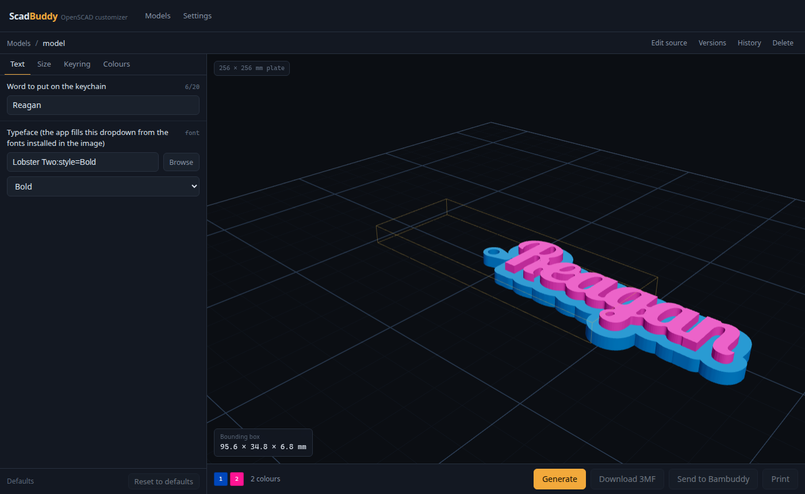
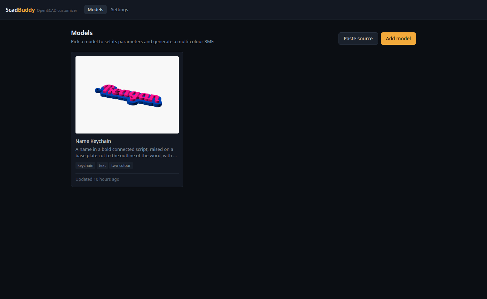
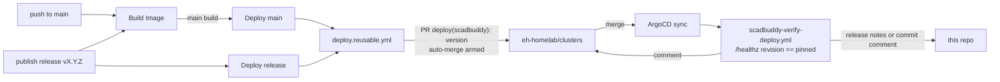

# ScadBuddy

A self-hosted OpenSCAD customizer that sits next to [Bambuddy](https://github.com/maziggy/bambuddy):
pick a parametric model, fill in its parameters, preview the render, and send
the result to Bambuddy's library or print queue. It ships as one container
image built on `openscad/openscad:dev` with a Python backend and a React
frontend layered on. The design and the measured OpenSCAD behaviour it rests
on are in [`docs/superpowers/specs/2026-09-22-scadbuddy-design.md`](docs/superpowers/specs/2026-09-22-scadbuddy-design.md).

It uses the same parameter syntax as MakerWorld's Parametric Model Maker, so a
`.scad` file that works there works here unchanged. Its output is a Bambu-style
3MF with one object per colour, each assigned to its own extruder, so the colours
are mapped to filaments without any painting in the slicer.



**The [user guide](docs/user-guide.md)** covers the parameter syntax, the
multi-colour rules, connecting Bambuddy and each feature.

## Features

- **MakerWorld-parity customizer**: tabs from `/* [Group] */`, sliders, dropdowns,
  toggles, text limits, and `// color` / `// font` pickers.
- **The preview is the real render**: OpenSCAD (Manifold) runs on every parameter
  change and shows per-colour parts and the bounding box.
- **Multi-colour 3MF**: one closed solid per colour, each on its own extruder, with
  plate cover images and a layout sized for the target printer's plate.
- **Send to Bambuddy**: upload to a library folder, or slice and queue it.
- **Print picker**: run one of Bambuddy's slicer pipelines, or create a new one. It
  shows eligibility per pipeline, and lets you set copies, a project, filaments per
  colour from spool inventory, and print options.
- **Fonts**: the image's fonts, plus any Google Fonts family, which is installed on
  demand.
- **Paste source / upload**: add models from a `.scad` file or pasted source,
  parse-checked by OpenSCAD before they are saved; edit the source in the browser.
- **History and versions**: every output keeps its parameters. Every model change is
  a git commit, so revisions can be diffed, customized or restored.
- **Delete**: remove a model and its outputs; the source stays in the git history.
- **Inside Bambuddy**: one click adds ScadBuddy to Bambuddy's sidebar as an External
  Link that opens inside Bambuddy.

| | |
|---|---|
|  |  |

## Running it

```bash
docker run -d --name scadbuddy -p 8080:8080 -v scadbuddy-data:/data \
  ghcr.io/eh-homelab/scadbuddy:main
```

Then open `http://<host>:8080`, go to **Settings** and connect Bambuddy (see
[Connecting Bambuddy](docs/user-guide.md#connecting-bambuddy): the API key needs
**Manage Library**, **Manage Queue** and **Read Status**, plus **Manage Projects**
for the project picker).

- **Image:** `ghcr.io/eh-homelab/scadbuddy` is a **public** GHCR package (no pull
  secret needed), built for `linux/amd64` and `linux/arm64`. It has these tags:
  `main` (latest `main`), `sha-<short>`, and `X.Y.Z` / `X.Y` for releases.
- **LAN only.** ScadBuddy has **no authentication**. Anyone who can reach it can
  add, edit and delete models, and send prints using the stored Bambuddy key.
  Keep it on a trusted network, as you would Bambuddy's slicer sidecar. Do not
  expose it to the internet.
- **State** lives in `/data` (`SCADBUDDY_DATA_DIR`): models (a git repository),
  outputs, settings, downloaded fonts and caches. Back up the volume.
- **Environment** (all optional): `SCADBUDDY_BAMBUDDY_URL`,
  `SCADBUDDY_BAMBUDDY_API_KEY` and `SCADBUDDY_PUBLIC_URL` set the starting values
  for Settings; `SCADBUDDY_GOOGLE_FONTS_API_KEY`; `SCADBUDDY_RENDER_TIMEOUT`
  (default 120 s), `SCADBUDDY_RENDER_CONCURRENCY` (2),
  `SCADBUDDY_CHECK_CONCURRENCY` (1). Each concurrent render or check is its own
  `openscad` process, so size CPU and memory for their sum.
- `GET /healthz` reports the OpenSCAD version, whether the data directory is
  writable, and the build revision.

## Deploying

ScadBuddy runs on the homelab cluster from
[eh-homelab/clusters](https://github.com/eh-homelab/clusters)
(`applications/scadbuddy/scadbuddy.yaml`, deployed by ArgoCD). That manifest
pins the image **by digest**; this repo's workflows are what move the pin.
Nothing here talks to the cluster.



### The two paths

| Path | Trigger | What gets pinned | Reports to |
|---|---|---|---|
| **Continuous** — `deploy-main.yml` | `Build Image` succeeds for a push to `main` | `scadbuddy:sha-<short>@sha256:…` | a comment on the commit |
| **Release** — `deploy-release.yml` | a GitHub release `vX.Y.Z` is published (pre-releases excluded) | `scadbuddy:X.Y.Z@sha256:…` | a `## Deployment` section appended to the release notes |

Both call `deploy.reusable.yml`, which:

1. mints an `eh-homelab-org-runners` App token scoped to `clusters`
   (contents + pull requests) — never `GITHUB_TOKEN`, which cannot write to
   another repo and whose PRs would not run clusters' own CI;
2. rewrites the image line and the three `scadbuddy.eh-homelab.io/*`
   annotations (`version`, `revision`, `source`) in the manifest;
3. opens **one** PR, `deploy(scadbuddy): <version>`, on the fixed branch
   `deploy/scadbuddy`, and arms `gh pr merge --auto --squash`. A newer deploy
   closes an older open one and replaces the branch; this one job carries a
   concurrency group shared by both paths, so only the branch/PR handling
   serialises — a release's image wait never holds up a main deploy. GitHub
   keeps one running and one queued job per group and drops the queued one
   when a third arrives, so the **newest** request always runs; an overtaken
   deploy is reported (⚠️ on the commit or release) rather than lost, and
   re-running it deploys that build anyway.

The clusters ruleset (`CI Summary` + `claude-review`) gates the merge; the
merge is the deploy. ArgoCD then syncs the `scadbuddy` Application, and
clusters' `scadbuddy-verify-deploy.yml` (on a LAN runner, since GitHub-hosted
runners cannot reach the cluster) polls the pod's `/healthz` until it reports
the pinned `revision` — the commit stamped into the image at build time by
`SCADBUDDY_REVISION` — then posts the result on the deploy PR and back here.
That is a stronger proof than "the image field changed": the ReplicaSet rolled
and the new pod is serving that exact build.

### Switching continuous deploy off

Disable the one workflow; nothing else changes:

```bash
gh workflow disable "Deploy main"   # merges to main stop deploying
gh workflow enable  "Deploy main"   # resume; the NEXT main build deploys
```

`Build Image` keeps publishing `:main` and `sha-*` images while it is off, and
releases keep deploying through `deploy-release.yml`. To deploy the current
head after re-enabling, re-run the latest `Build Image` run.

### Cutting a release

Release Drafter maintains a draft from merged PR titles. Publishing it creates
the `vX.Y.Z` tag; the tag push runs `Build Image` (which publishes `X.Y.Z` and
`X.Y`), and `deploy-release.yml` waits for that image, pins it, and writes the
deploy PR link into the release notes. There is no human step after
"Publish release".

### Reading a deploy

- **Which build is live:** `curl https://scadbuddy.internal.nullreference.io/healthz`
  reports `revision` (commit) and `version` — the same label the manifest
  pins (`X.Y.Z` for a release, `sha-<short>` for a main build), so the two
  should match the Deployment's annotations exactly.
- **What is pinned:** the annotations on the Deployment in
  `applications/scadbuddy/scadbuddy.yaml`.
- **No ✅ within ~20 min of a merge/publish:** look at the clusters deploy PR
  first — a red required check there means the merge never happened and
  nothing reports until it does. Failed *verification* (merged, but the pod
  never served the revision) is reported with ❌ and fails
  `scadbuddy-verify-deploy.yml` on clusters `main`.

### Manual fallback

There should be no reason for one; but the mechanism is only a PR. Editing the
image line and annotations in the clusters manifest by hand and merging does
exactly what the pipeline does. Do not `kubectl rollout restart` — the pin is
what makes the running image knowable.

## Development

- `backend/` — FastAPI, `uv run --frozen pytest` (tests marked
  `requires_openscad` need a real `openscad`; the Dockerfile's `test` target
  is where they run in CI).
- `frontend/` — Vite + React, `pnpm test`, `pnpm build`.
- `models/` — bundled example models; `models/<name>/verify.sh` renders one
  against `openscad/openscad:dev` and checks the result.
- `backend/openapi.json` and `frontend/public/mockServiceWorker.js` are
  generated and checked for freshness in CI (`python -m
  scadbuddy.tools.export_openapi`, `pnpm exec msw init public --save`).

The base image is a rolling nightly, so the Dockerfile asserts the OpenSCAD
version it was verified against (`OPENSCAD_VERSION`). When that assertion
fails, re-verify §3 of the design spec against the new build and bump it in
the same commit.
