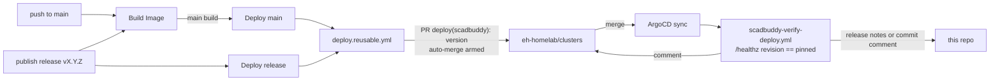

# ScadBuddy

A self-hosted OpenSCAD customizer that sits next to [Bambuddy](https://github.com/maziggy/bambuddy):
pick a parametric model, fill in its parameters, preview the render, and send
the result to Bambuddy's library or print queue. It ships as one container
image built on `openscad/openscad:dev` with a Python backend and a React
frontend layered on. The design and the measured OpenSCAD behaviour it rests
on are in [`docs/superpowers/specs/2026-09-22-scadbuddy-design.md`](docs/superpowers/specs/2026-09-22-scadbuddy-design.md).

It uses the same parameter syntax as MakerWorld's Parametric Model Maker, so a
`.scad` file that works there works here unchanged. Its output is a Bambu-style
3MF with one object per colour, each assigned to its own extruder, so the colours
are mapped to filaments without any painting in the slicer.


**The [user guide](docs/user-guide.md)** covers the parameter syntax, the
multi-colour rules, connecting Bambuddy and each feature.

## Features

- **MakerWorld-parity customizer**: tabs from `/* [Group] */`, sliders, dropdowns,
  toggles, text limits, and `// color` / `// font` pickers.
- **Presets**: save named parameter sets per template — built-ins too — and start
  from one, changing only what differs this time (a name, a colour, a size). A
  preset keeps only the values that differ from the defaults. A template can ship
  its own read-only presets in a `presets.json` beside `model.scad`
  (`{"presets": [{"name": "…", "params": {…}}]}`); **Duplicate** copies one of
  those, or any saved preset, to an editable preset of your own.
- **The preview is the real render**: OpenSCAD (Manifold) runs on every parameter
  change and shows per-colour parts and the bounding box.
- **Multi-colour 3MF**: one closed solid per colour, each on its own extruder, with
  plate cover images and a layout sized for the target printer's plate.
- **Send to Bambuddy**: upload to a library folder, or slice and queue it.
- **Print picker**: spool-first — pick spools, nozzle size, a quality tier and a plate,
  and ScadBuddy derives the printer, process and filament presets and slices and queues
  through Bambuddy. No slicer pipeline to pick or maintain; Advanced mode adds per-side
  nozzle flow, the full process list and a per-slot filament preset override. Also lets
  you set copies, a project, and print options.
- **Fonts**: the image's fonts, plus any Google Fonts family, which is installed on
  demand.
- **Paste source / upload**: add models from a `.scad` file or pasted source,
  parse-checked by OpenSCAD before they are saved; edit the source in the browser.
- **History and versions**: every output keeps its parameters. Every model change is
  a git commit, so revisions can be diffed, customized or restored.
- **Delete**: remove a model and its outputs; the source stays in the git history.
- **Inside Bambuddy**: one click adds ScadBuddy to Bambuddy's sidebar as an External
  Link that opens inside Bambuddy.

| | |
|---|---|
|  |  |

## Running it

```bash
docker run -d --name scadbuddy -p 8080:8080 -v scadbuddy-data:/data \
  ghcr.io/eh-homelab/scadbuddy:main
```

Then open `http://<host>:8080`, go to **Settings** and connect Bambuddy (see
[Connecting Bambuddy](docs/user-guide.md#connecting-bambuddy): the API key needs
**Manage Library**, **Manage Queue** and **Read Status**, plus **Manage Projects**
for the project picker).

- **Image:** `ghcr.io/eh-homelab/scadbuddy` is a **public** GHCR package (no pull
  secret needed), built for `linux/amd64` and `linux/arm64`. It has these tags:
  `main` (latest `main`), `sha-<short>`, and `X.Y.Z` / `X.Y` for releases.
- **LAN only.** ScadBuddy has **no authentication**. Anyone who can reach it can
  add, edit and delete models, and send prints using the stored Bambuddy key.
  Keep it on a trusted network, as you would Bambuddy's slicer sidecar. Do not
  expose it to the internet.
- **State** lives in `/data` (`SCADBUDDY_DATA_DIR`): models (a git repository),
  outputs, saved presets (`presets/`, outside the git repository), settings,
  downloaded fonts and caches. Back up the volume.
- **Environment** (all optional): `SCADBUDDY_BAMBUDDY_URL`,
  `SCADBUDDY_BAMBUDDY_API_KEY` and `SCADBUDDY_PUBLIC_URL` set the starting values
  for Settings; `SCADBUDDY_GOOGLE_FONTS_API_KEY`; `SCADBUDDY_RENDER_TIMEOUT`
  (default 120 s), `SCADBUDDY_RENDER_CONCURRENCY` (2),
  `SCADBUDDY_CHECK_CONCURRENCY` (1), `SCADBUDDY_LSP_SESSIONS` (4);
  `SCADBUDDY_OPENSCAD_LSP` (default `openscad-lsp`, the language server binary);
  `SCADBUDDY_LIBRARY_MAX_BYTES` (default 200000000, the most one added library's
  clone may take on the volume; the clone's size is measured while it runs, so it
  can overshoot by roughly one poll interval's worth of transfer, 0.2 to 2 s,
  before it is stopped).
  Each concurrent render or check is its own `openscad` process, and each open
  source editor holds one `openscad-lsp` process for as long as it stays open,
  so size CPU and memory for the sum of all three. Past the session cap an
  editor still works, without completion and hover.
- **Render queue.** By default every render request is accepted;
  `SCADBUDDY_RENDER_CONCURRENCY` jobs are rendered at once per process, oldest
  first. A preview replaced before it started is dropped, and identical waiting
  requests share one job.
  - `SCADBUDDY_RENDER_QUEUE_MAX` (0 = no limit): set, a request that would be a new
    job while that many already wait gets 503 with `Retry-After`. A request that
    supersedes a waiting preview, or matches one, is never refused.
  - `SCADBUDDY_DATABASE_URL` (libpq URL): keep the queue in Postgres. Accepted
    renders then survive a restart. Unset, it lives in `/data/jobs` and this
    process, and a restart fails what was unfinished. Several replicas can share
    one queue only if they also share `/data` (a ReadWriteMany volume): a job's
    files are written there by whichever replica renders it. On a ReadWriteOnce
    PVC run one replica, as the design does.
    `SCADBUDDY_DATABASE_POOL_SIZE` (10). The schema is created and migrated at
    startup.
  - `SCADBUDDY_RENDER_QUEUE_TIMEOUT` (0 = never): fail a render that waited longer
    than this for a worker, unrendered.
  - `SCADBUDDY_RENDER_POLL_INTERVAL` (1 s): how often an idle worker checks for
    jobs it was not woken for. With Postgres, only while the listener below is
    disconnected.
  - `SCADBUDDY_RENDER_FALLBACK_POLL_INTERVAL` (30 s), Postgres only: each process
    `LISTEN`s on `scadbuddy_render_queue`, and a submit or requeue on any replica
    sends `NOTIFY` in the same transaction, so an idle worker starts the job at
    once. While that connection is up, idle workers still check this often, to
    catch a notification missed around a reconnect. The listener reconnects with
    back-off; `scadbuddy_render_queue_listener_connected` and
    `scadbuddy_render_queue_listener_reconnects_total` show its state.
  - `SCADBUDDY_RENDER_LEASE_TIMEOUT` (60 s) and `SCADBUDDY_RENDER_MAX_ATTEMPTS` (2),
    Postgres only: a running job whose worker stops heartbeating for a lease is
    requeued, and failed after its last attempt.
  - `SCADBUDDY_RENDER_QUEUE_DEPTH_SLO` (16) and `SCADBUDDY_RENDER_LATENCY_SLO`
    (60 s): targets, not limits. They are exported with the metrics for alerts.
- `GET /healthz` reports the OpenSCAD version, whether the data directory is
  writable, and the build revision.
- `GET /metrics` serves Prometheus metrics: render queue depth and oldest wait
  (read from the store, so across replicas with Postgres), wait time and latency
  (`scadbuddy_render_job_latency_seconds`, by outcome), per-stage render time, whether
  the queue's store can be read (`scadbuddy_render_store_up`), the
  SLO targets, and HTTP requests by route. It is unauthenticated, like the rest of
  the app.

## Deploying

ScadBuddy runs on the homelab cluster from
[eh-homelab/clusters](https://github.com/eh-homelab/clusters)
(`applications/scadbuddy/scadbuddy.yaml`, deployed by ArgoCD). That manifest
pins the image **by digest**; this repo's workflows are what move the pin.
Nothing here talks to the cluster.


```mermaid
flowchart LR
    A[push to main] --> B[Build Image]
    T[publish release vX.Y.Z] --> B
    B -->|main build| C[Deploy main]
    T --> D[Deploy release]
    C --> R[deploy.reusable.yml]
    D --> R
    R -->|"PR deploy(scadbuddy): version<br/>auto-merge armed"| K[eh-homelab/clusters]
    K -->|merge| G[ArgoCD sync]
    G --> V[scadbuddy-verify-deploy.yml<br/>/healthz revision == pinned]
    V -->|comment| K
    V -->|release notes or commit comment| S[this repo]
```

### The two paths

| Path | Trigger | What gets pinned | Reports to |
|---|---|---|---|
| **Continuous** — `deploy-main.yml` | `Build Image` succeeds for a push to `main` | `scadbuddy:sha-<short>@sha256:…` | a comment on the commit |
| **Release** — `deploy-release.yml` | a GitHub release `vX.Y.Z` is published (pre-releases excluded) | `scadbuddy:X.Y.Z@sha256:…` | a `## Deployment` section appended to the release notes |

Both call `deploy.reusable.yml`, which:

1. mints an `eh-homelab-org-runners` App token scoped to `clusters`
   (contents + pull requests) — never `GITHUB_TOKEN`, which cannot write to
   another repo and whose PRs would not run clusters' own CI;
2. rewrites the image line and the three `scadbuddy.eh-homelab.io/*`
   annotations (`version`, `revision`, `source`) in the manifest;
3. opens **one** PR, `deploy(scadbuddy): <version>`, on the fixed branch
   `deploy/scadbuddy`, and arms `gh pr merge --auto --squash`. A newer deploy
   closes an older open one and replaces the branch; this one job carries a
   concurrency group shared by both paths, so only the branch/PR handling
   serialises — a release's image wait never holds up a main deploy. GitHub
   keeps one running and one queued job per group and drops the queued one
   when a third arrives, so the **newest** request always runs; an overtaken
   deploy is reported (⚠️ on the commit or release) rather than lost, and
   re-running it deploys that build anyway.

The clusters ruleset (`CI Summary` + `claude-review`) gates the merge; the
merge is the deploy. ArgoCD then syncs the `scadbuddy` Application, and
clusters' `scadbuddy-verify-deploy.yml` (on a LAN runner, since GitHub-hosted
runners cannot reach the cluster) polls the pod's `/healthz` until it reports
the pinned `revision` — the commit stamped into the image at build time by
`SCADBUDDY_REVISION` — then posts the result on the deploy PR and back here.
That is a stronger proof than "the image field changed": the ReplicaSet rolled
and the new pod is serving that exact build.

### The agent sidecar (AI, #261)

The AI agent service in `agent/` ships as a **separate image**,
`ghcr.io/eh-homelab/scadbuddy-agent` (the Dockerfile's `--target agent`,
published by the `agent` job in `build-image.yml` with the same tags as the
backend image). It is meant to run as a **second container in the ScadBuddy
pod**, not inside the backend image: the sidecar layout chosen in §4.1 of the
AI design spec (`docs/superpowers/specs/2026-09-27-ai-integration-design.md`,
issue #250; on branch `claude/scad-buddy-ai-integration-pfn00c` until it
merges). The two containers share the pod network, so the agent reaches
the backend on `http://127.0.0.1:8080` (§4.3).

- It listens on port `8081` and answers `GET /healthz` (`agent/src/app.ts`).
- It reads only `SCADBUDDY_DATABASE_URL`, `SCADBUDDY_BACKEND_URL` (default
  `http://127.0.0.1:8080`) and `SCADBUDDY_SECRET_KEY_FILE`
  (`agent/src/config.ts`; spec §9). With no database URL it still runs and
  `/healthz` reports `"ai": "disabled (no database)"`.
- **`SCADBUDDY_SECRET_KEY_FILE`** is the key-encryption key for the Claude
  credential, which is stored encrypted in the database (envelope encryption,
  spec §9; `agent/src/secrets.ts`). The file holds exactly 32 random bytes,
  base64-encoded; mount it from a Kubernetes Secret:

  ```bash
  openssl rand -base64 32 > scadbuddy-secret.key
  kubectl -n scadbuddy create secret generic scadbuddy-agent-kek \
    --from-file=secret.key=scadbuddy-secret.key
  # container: volumeMount at /etc/scadbuddy/kek, readOnly;
  # env SCADBUDDY_SECRET_KEY_FILE=/etc/scadbuddy/kek/secret.key
  ```

  It is read once at start. Without it (or with a malformed one) the service
  still runs, but saving a credential answers `503` naming the reason and
  `/healthz` reports `"ai": "disabled (no key-encryption key: …)"`. Keep a
  copy: a credential sealed under a lost key cannot be decrypted and must be
  entered again (`/healthz` then says it was sealed with a different key).
- `/healthz` reports `"ai": "enabled"` only when the database answers, its
  `ai_*` migrations have applied (`agent/src/db/migrations.ts`, run at start
  under an advisory lock), the key is loaded and a Claude credential is saved.
  Otherwise `ai` names the first missing piece.
- The Claude credential (an Anthropic API key, or a gateway base URL plus
  token) is managed through `GET/PUT/DELETE /api/v1/ai/credentials` and
  tested with `POST /api/v1/ai/credentials/test`. No route returns the secret.
  Writes are accepted only over the HTTPS ingress (`X-Forwarded-Proto: https`)
  or loopback, from the UI's own origin (`agent/src/routes/guard.ts`); that is
  not authentication, and the human approval spec §8.2 asks for comes with #258.
- It runs as uid 10001 and writes only under `/var/lib/scadbuddy-agent`
  (mount an `emptyDir` there), so the root filesystem can be read-only
  (spec §4.4; the CI smoke test runs it with `--read-only`). At start it
  recreates `claude/` and `work/` in that volume, and it exits 1 with a
  message naming the directory if it cannot (`agent/src/harness/stateDirs.ts`).
- Nothing deploys it yet. The clusters manifest, and the ingress routes for
  `/mcp`, `/api/v1/ai/*` and `/api/v1/ws` (spec §4.2), come with the stories
  that give it routes. Until then the image's publish job is
  `continue-on-error`, so it cannot hold back a backend deploy, and the new
  GHCR package needs the same one-time **public** visibility step as
  `scadbuddy` (see the header of `build-image.yml`).

### Switching continuous deploy off

Disable the one workflow; nothing else changes:

```bash
gh workflow disable "Deploy main"   # merges to main stop deploying
gh workflow enable  "Deploy main"   # resume; the NEXT main build deploys
```

`Build Image` keeps publishing `:main` and `sha-*` images while it is off, and
releases keep deploying through `deploy-release.yml`. To deploy the current
head after re-enabling, re-run the latest `Build Image` run.

### Cutting a release

Release Drafter maintains a draft from merged PR titles. Publishing it creates
the `vX.Y.Z` tag; the tag push runs `Build Image` (which publishes `X.Y.Z` and
`X.Y`), and `deploy-release.yml` waits for that image, pins it, and writes the
deploy PR link into the release notes. There is no human step after
"Publish release".

### Reading a deploy

- **Which build is live:** `curl https://scadbuddy.internal.nullreference.io/healthz`
  reports `revision` (commit) and `version` — the same label the manifest
  pins (`X.Y.Z` for a release, `sha-<short>` for a main build), so the two
  should match the Deployment's annotations exactly.
- **What is pinned:** the annotations on the Deployment in
  `applications/scadbuddy/scadbuddy.yaml`.
- **No ✅ within ~20 min of a merge/publish:** look at the clusters deploy PR
  first — a red required check there means the merge never happened and
  nothing reports until it does. Failed *verification* (merged, but the pod
  never served the revision) is reported with ❌ and fails
  `scadbuddy-verify-deploy.yml` on clusters `main`.

### Manual fallback

There should be no reason for one; but the mechanism is only a PR. Editing the
image line and annotations in the clusters manifest by hand and merging does
exactly what the pipeline does. Do not `kubectl rollout restart` — the pin is
what makes the running image knowable.

## Development

- `backend/` — FastAPI, `uv run --frozen pytest` (tests marked
  `requires_openscad` need a real `openscad`; the Dockerfile's `test` target
  is where they run in CI).
- `frontend/` — Vite + React, `pnpm test`, `pnpm build`.
- `agent/` — the AI agent service (Node 24, Hono, Claude Agent SDK),
  `pnpm test`, `pnpm build`; see "The agent sidecar" above.
- `models/` — bundled example models; `models/<name>/verify.sh` renders one
  against `openscad/openscad:dev` and checks the result.
- `backend/openapi.json` and `frontend/public/mockServiceWorker.js` are
  generated and checked for freshness in CI (`python -m
  scadbuddy.tools.export_openapi`, `pnpm exec msw init public --save`).

The base image is a rolling nightly, so the Dockerfile asserts the OpenSCAD
version it was verified against (`OPENSCAD_VERSION`). When that assertion
fails, re-verify §3 of the design spec against the new build and bump it in
the same commit.
