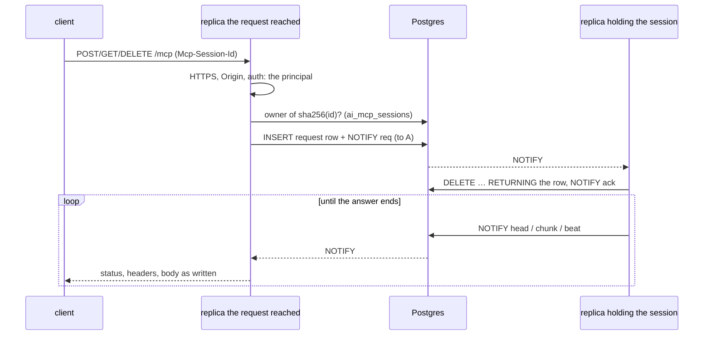

# MCP resources and subscriptions

What `/mcp` offers besides tools: ScadBuddy state as read-only `scadbuddy://`
resources, and subscriptions that notify a client when that state changes, driven by
the Postgres event bus. Issue [#264](https://github.com/eh-homelab/ScadBuddy/issues/264);
spec §5.4, §7 and §9 of
[`docs/superpowers/specs/2026-09-27-ai-integration-design.md`](../superpowers/specs/2026-09-27-ai-integration-design.md).
The code is [`agent/src/resources/`](../../agent/src/resources/) and
[`agent/src/events/`](../../agent/src/events/).

Protocol references are the MCP 2025-11-25 pages, the latest version the pinned
`@modelcontextprotocol/sdk` 1.30.1 implements (`LATEST_PROTOCOL_VERSION` in its
`types.js`): [Resources](https://modelcontextprotocol.io/specification/2025-11-25/server/resources),
[Completion](https://modelcontextprotocol.io/specification/2025-11-25/server/utilities/completion),
[Streamable HTTP transport](https://modelcontextprotocol.io/specification/2025-11-25/basic/transports).

## 1. For MCP clients

### Capabilities

The server declares
`resources: { subscribe: true, listChanged: true }` and `completions: {}`
(`installResources()` in [`server.ts`](../../agent/src/resources/server.ts)).

### Resources

Every resource is read by a `read` tool of the registry (`RESOURCES` in
[`catalog.ts`](../../agent/src/resources/catalog.ts)), so its content is exactly what
that tool returns, in the MIME type below. The one difference is paging: the
`list_*` tools answer one page at a time (#837), and a resource backed by one is
read to its last page (`allPages()` in
[`pagination.ts`](../../agent/src/tools/pagination.ts)), so it still holds the
whole collection, in the shape it had before paging. `list_models` and `list_outputs`
pass `limit` and `after` to the backend, which builds only that page (#843,
`backendPage()`); the others page over the whole backend answer.

| URI | MIME type | Tool |
|---|---|---|
| `scadbuddy://models` | `application/json` | `list_models` |
| `scadbuddy://models/{slug}` | `application/json` | `get_model` |
| `scadbuddy://models/{slug}/source` | `text/x-openscad` | `get_source` |
| `scadbuddy://models/{slug}/schema` | `application/json` | `get_schema` |
| `scadbuddy://models/{slug}/readme` | `text/markdown` | `get_readme` |
| `scadbuddy://models/{slug}/thumbnail` | `image/png` (blob) | `get_model_thumbnail` |
| `scadbuddy://models/{slug}/diagnostics` | `application/json` | `get_render_diagnostics` |
| `scadbuddy://models/{slug}/outputs` | `application/json` | `list_outputs` |
| `scadbuddy://models/{slug}/versions` | `application/json` | `list_versions` |
| `scadbuddy://models/{slug}/versions/{commit}` | `text/x-openscad` | `get_version_source` |
| `scadbuddy://models/{slug}/versions/{commit}/diff` | `application/json` | `diff_version` |
| `scadbuddy://models/{slug}/versions/{commit}/schema` | `application/json` | `get_schema` (`version`) |
| `scadbuddy://models/{slug}/upstream` | `application/json` | `get_upstream` |
| `scadbuddy://jobs/{job_id}` | `application/json` | `get_render_job` |
| `scadbuddy://outputs/{output_id}` | `application/json` | `get_output` |
| `scadbuddy://outputs/{output_id}/plates` | `application/json` | `get_output_plates` |
| `scadbuddy://outputs/{output_id}/thumbnail` | `image/png` (blob) | `get_output_image` |
| `scadbuddy://outputs/{output_id}/plates/{plate}/thumbnail` | `image/png` (blob) | `get_output_image` (`plate`) |
| `scadbuddy://outputs/{output_id}/model.3mf` | `model/3mf` (blob) | `download_3mf` |
| `scadbuddy://print/outputs/{output_id}/progress` | `application/json` | `get_print_progress` |
| `scadbuddy://plates` | `application/json` | `list_plates` |
| `scadbuddy://libraries` | `application/json` | `list_libraries` |
| `scadbuddy://fonts` | `application/json` | `list_fonts` |
| `scadbuddy://settings` | `application/json` | `get_settings` (secrets redacted) |
| `scadbuddy://sessions` | `application/json` | `sessions_list` (#300) |
| `scadbuddy://sessions/{session_id}` | `application/json` | `sessions_get` (#300) |
| `scadbuddy://docs/authoring` | `text/markdown` | `get_authoring_guide` |

`scadbuddy://docs/authoring` (#252) is ScadBuddy's authoring conventions: the plugin's
`authoring` skill ([`plugins/scadbuddy/skills/authoring/SKILL.md`](../../plugins/scadbuddy/skills/authoring/SKILL.md))
without its frontmatter. It has no backend route: `pnpm build` copies the skill to
`agent/dist/docs/authoring.md` (the Dockerfile's `agent-build` stage copies it in for
that), and [`agent/src/tools/guide.ts`](../../agent/src/tools/guide.ts) reads it there,
or from the source tree when run from it.

- `resources/list` returns the six fixed resources and one `scadbuddy://models/{slug}`
  per model; everything else is reached through `resources/templates/list`.
- **Sessions** ([agent-sessions.md](agent-sessions.md)) answer only for sessions the
  caller may see, as the tools do. Subscribing to `scadbuddy://sessions/{session_id}`
  reads it first (`readToSubscribe` in `catalog.ts`), so a session the caller may not
  see answers `-32002`, the same as one that does not exist.
- **URIs.** Templates are RFC 6570 level 1
  ([§3.2.2](https://datatracker.ietf.org/doc/html/rfc6570#section-3.2.2)), one path
  segment per variable, percent-encoded. A bundled template's slug `builtin:x` is
  `scadbuddy://models/builtin%3Ax`; the unencoded spelling is accepted too, and
  notifications always use the encoded one.
- **Binary content** is a base64 `blob`. Above the 8 MiB inline limit
  (`DEFAULT_MAX_INLINE_BYTES`, [`agent/src/tools/binary.ts`](../../agent/src/tools/binary.ts))
  the content is instead an `application/json` note naming the backend route to fetch.
- **Errors** follow the resources page's "Error Handling": `-32002` when the URI names
  no resource or the backend answers 404; `-32602` when a variable fails the tool's
  validation (a malformed slug); `-32603` otherwise.
- **Completion.** `completion/complete` with `ref/resource` offers slugs, and commits
  and output ids for the `slug` given in `context.arguments`.

### Subscriptions

`resources/subscribe { uri }` then, whenever that resource changes,
`notifications/resources/updated { uri }`; re-read it with `resources/read`.
`resources/unsubscribe` stops it. `notifications/resources/list_changed` is sent when a
model is created or deleted. What each backend event updates is `affectedBy()` in
[`events.ts`](../../agent/src/resources/events.ts):

| Event | Resources updated |
|---|---|
| `job.pending`, `job.running`, `job.superseded` | `jobs/{job_id}` |
| `job.done`, `job.failed` | `jobs/{job_id}`, `models/{slug}/diagnostics` |
| `model.created`, `model.deleted` | `models`, `models/{slug}` and its source, schema, readme, thumbnail, versions; **list_changed** |
| `model.updated` | `models`, `models/{slug}`, readme, thumbnail, upstream |
| `source.changed` | `models/{slug}/source`, `…/schema` |
| `version.committed` | `models/{slug}`, `…/versions` |
| `upstream.available` | `models/{slug}`, `…/upstream` |
| `output.created`, `output.updated`, `output.deleted` | `models/{slug}/outputs`, `…/thumbnail`, `outputs/{output_id}`, `…/plates` |
| `print.progress`, `print.settled` | `print/outputs/{output_id}/progress` |
| `library.changed` | `libraries`, `models/{slug}` |
| `library.removed` | `libraries` |
| `font.installed` | `fonts` |
| `settings.changed` | `settings` |
| `session.message` (agent, #300) | `sessions/{session_id}` |
| `session.started`, `session.owner`, `session.waiting`, `session.done` (agent, #300) | `sessions/{session_id}`, `sessions` |

- **Coalescing.** Per session and per URI, at most one notification per 250 ms
  (`DEFAULT_MIN_INTERVAL_MS`, [`hub.ts`](../../agent/src/resources/hub.ts)): the first
  at once, then one at the end of the window for everything inside it.
- **Limit.** 500 subscriptions per session (`DEFAULT_MAX_SUBSCRIPTIONS`).
- **Delivery.** Notifications go on the session's GET SSE stream. Open it (the SDK
  clients do so after `initialize`) before relying on notifications: one sent while no
  GET stream has ever been open is stored but only reaches a client that resumes.
- **Resuming.** Every notification is stored with an SSE event id
  ([`agent/src/mcp/eventStore.ts`](../../agent/src/mcp/eventStore.ts), 1000 per
  session). A client that reconnects with `Last-Event-ID` gets what it missed, as the
  transport's "Resumability and Redelivery" describes.
- **After an agent restart** (of the replica holding the session) the session id answers 404 and, per the transport's
  "Session Management", the client "MUST start a new session", then subscribes again.
  Subscriptions are not persisted (spec §9 records why).

### Tiers

The same `authenticate → principal` check as tools (spec §8.1), re-read on every
request. Every resource needs `read`, except `scadbuddy://settings`, which needs
`write`: even redacted settings reveal the environment (issue #264). A caller never
sees a resource it may not read in either list, and `resources/read` and
`resources/subscribe` refuse it. Resources are read-only: `installResources()` refuses
to start if any resource is backed by a tool that is not `read`.

## 2. For operators

### The event source

The agent LISTENs on `scadbuddy_events`, the channel the backend NOTIFYs on
(`PG_CHANNEL`, [`backend/scadbuddy/core/events.py`](../../backend/scadbuddy/core/events.py)),
on one dedicated connection of its own (`PgEventListener`,
[`agent/src/events/pgListener.ts`](../../agent/src/events/pgListener.ts)). It needs
`SCADBUDDY_DATABASE_URL` and nothing else; without a database `/mcp` is not served at
all (`createApp()`, [`agent/src/app.ts`](../../agent/src/app.ts)).

- **Point the URL at the primary.** On a hot standby `LISTEN` and `NOTIFY` are refused
  ([PostgreSQL: Hot Standby](https://www.postgresql.org/docs/current/hot-standby.html)).
  With CloudNativePG use the `-rw` service, which "Points to the primary instance of the
  cluster" ([CloudNativePG: Service management](https://cloudnative-pg.io/docs/devel/service_management)).
- **Replicas need nothing extra.** Postgres delivers a NOTIFY to every session
  listening on the channel ([NOTIFY](https://www.postgresql.org/docs/current/sql-notify.html)),
  so every agent and backend replica hears every event. An MCP session's transport and
  subscriptions live on the replica that opened it, so each replica notifies only its
  own sessions; a GET stream that reached another replica gets them through the session
  relay below.
- **No transaction-mode pooler in between.** `LISTEN` belongs to a server session; a
  pooler that hands the connection to someone else between transactions would drop it.
  **Unverified** for any particular pooler.
- **Reconnects.** When the listening connection drops, the listener retries with
  backoff (500 ms to 30 s) and logs each failure. On reconnect it replays the backend's
  `events` log after the last `seq` it knows (backend
  [`pg_events.py`](../../backend/scadbuddy/core/pg_events.py); pruned by
  `SCADBUDDY_EVENT_LOG_RETENTION_*`), skipping ids it already delivered. More than 1000
  missed events, or a log it cannot read, makes it log
  `event bus: resyncing followers: …` and send every subscription an update plus one
  `list_changed`, so clients re-read.
- **The replay rests on short event transactions.** The listener's place in the log
  trails the newest `seq` by one 30 s check, because a `seq` is handed out at INSERT
  but becomes visible only at COMMIT. That is safe only while no transaction that
  writes to `events` stays open longer than 30 s. One that did could commit an event
  behind the place, and if the listener were reconnecting at the time, that event would
  be lost for good; the duplicate filter stops repeats, not skips. The backend keeps
  well inside this: each event is one short INSERT + `pg_notify` transaction
  ([`pg_events.py`](../../backend/scadbuddy/core/pg_events.py), "Publishing"). As a
  guard, a replayed event whose `logged_at` (its transaction's start) is more than 30 s
  older than the place shows the bound was broken; the listener then logs
  `event bus: resyncing followers: a replayed event's transaction was open more than …`
  and resyncs every subscriber (the ASSUMPTION and GUARD comments in `pgListener.ts`).
- **Schemas.** The listener reads `events` through the connection's `search_path`, so
  the agent and the backend must share a schema; channels are per database, so two
  deployments sharing a database would hear each other (the same caveat the backend's
  `pg_events.py` states).

### Sessions across replicas (#2086)

A session is held by the replica that opened it: its transport, McpServer, resource
subscriptions and replay log are live objects in that process. A load balancer without
session affinity (the deployed `/mcp` route has none) sends the client's next request to
any replica, so a request for a session another replica holds is relayed there through
Postgres ([`agent/src/mcp/sessionRelay.ts`](../../agent/src/mcp/sessionRelay.ts)), the
way browser calls are ([browser-bridge.md](browser-bridge.md#replicas)):

- **The directory.** `ai_mcp_sessions` names the replica holding each session, keyed by
  the session id's SHA-256 (the id is a credential and is never stored). It is written
  before the `initialize` answer leaves, so the client's next request finds it. The
  session limits (`maxSessions`, `maxSessionsPerCaller`) count its rows, across every
  replica; if it cannot be read, a replica counts its own sessions.
- **Streaming.** The owner sends the answer as it is written: status and headers, then
  each body chunk (in the NOTIFY when small, else as a row in `ai_mcp_relay_messages`).
  So SSE works through any replica: a `tools/call` that reports progress, and the
  standing GET stream that carries resource notifications, wherever it landed. A client
  that goes away cancels the owner's read.
- **The owner went away.** Nobody acks within 3 s (`ACK_TIMEOUT_MS`): the directory row
  is removed and the request answers 404, so the client starts a new session, as the
  transport's "Session Management" requires. An owner that acked beats every 10 s
  (`BEAT_MS`) until it has answered; after 3 missed beats a request still waiting for
  its head answers 503, and a body already streaming ends with an error, so the client
  reconnects and meets the 404.
- **Who may use it.** The replica the request reached runs every gate (HTTPS, Origin,
  auth) and relays the principal as authenticated; the owner ties it to the session
  (an anonymous caller's `anonymous:<session id>` is made there) and still refuses
  another caller's principal with 403, as it does for its own requests. No credential
  is relayed: `Authorization`, `Cookie` and `Mcp-Session-Id` are stripped, and the
  owner puts the session id back from the session it finds, so no relay row holds a
  token or a session id.
- **A late ack.** When the ack timeout passes, the request row is withdrawn only if it
  is still there. An owner that took it is running it (its ack was lost or is slow),
  so the replica keeps waiting on its beats rather than answer 404 and forget a live
  session.
- **Not covered.** A NOTIFY sent while a replica's listening connection is down is lost
  (the same limit as the bridge relay): the request then times out as an owner that went
  away.

### What is not here yet

Issue #264 also lists resources that need a backend route or event source not on
`main`: Bambuddy printers, queue, inventory, print history and stats (print watcher,
#268) and `scadbuddy://browser/{tab}/snapshot` (#254). LSP
diagnostics (#252) are the `get_lsp_diagnostics` tool rather than a resource: they are
worked out from a source the caller passes, not state to read or subscribe to.

### The agent's own `session.*` events (#300)

The agent publishes one `session.*` event on `scadbuddy_events` per batch a session
appends to its event log
([`agent/src/sessions/busEvents.ts`](../../agent/src/sessions/busEvents.ts)): ids only,
`{ id, at, kind, session_id, seq, status?, replica }`, sent after the batch has
committed. Streamed text is throttled to one `session.message` per 100 ms per session;
the lifecycle kinds go at once. Every agent replica's listener wakes its own event-log
followers for them (`followSessionEvents`, which calls `EventLog.wake()` in
[`agent/src/sessions/eventLog.ts`](../../agent/src/sessions/eventLog.ts)), and the
resource hub maps them as in the table above. The backend decodes them
(`SessionBusEvent` in `backend/scadbuddy/core/events.py`) and sends them to no
WebSocket topic.

They are NOTIFY only, never rows in the backend's `events` log, so the replay after a
reconnect cannot bring them back. Instead the listener reports the reconnect
(`onReconnect` in [`agent/src/events/bus.ts`](../../agent/src/events/bus.ts)): every
subscribed `scadbuddy://sessions…` URI gets `resources/updated`, and every event-log
follower re-reads. The event log itself still polls every second as the fallback.
