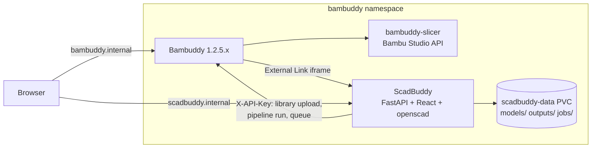

# ScadBuddy — design

**Status:** approved 2026-09-22 (Elan). **Repo:** `eh-homelab/ScadBuddy` (public, MIT).
**Owner of record:** [Hindsight initiative `kp-474d5fa02f3e48fdb7c3833356e385c3`](https://hindsight.internal.nullreference.io).

ScadBuddy is a self-hosted OpenSCAD customizer that reproduces the MakerWorld
Parametric Model Maker experience inside [Bambuddy](https://github.com/maziggy/bambuddy):
pick a model, fill in its parameters, watch the preview update, generate a
multi-colour 3MF, and send it straight to your Bambuddy library and print queue.

## 1. Why

- MakerWorld's PMM is the only good OpenSCAD customizer UI, and it only works
  for models published on MakerWorld and only produces files you then have to
  ferry into Bambuddy by hand.
- Bambuddy has **no plugin system** — upstream proposals #951/#953 were declined
  on security grounds; only the G-code viewer (#963) shipped. Every community
  "plugin" on [wiki.bambuddy.cool/community](https://wiki.bambuddy.cool/community/)
  is an external service on Bambuddy's API. ScadBuddy follows that pattern.
- Bambuddy's **External Links** feature renders a link with
  `open_in_new_tab=false` in a sandboxed `<iframe>` at `/external/{id}` inside
  its own shell (`sandbox="allow-scripts allow-same-origin allow-forms
  allow-popups allow-popups-to-escape-sandbox"`, verified in the 1.2.5.5
  frontend bundle). That is the deepest integration Bambuddy allows: ScadBuddy
  appears as a sidebar entry and its page lives inside Bambuddy's chrome.

## 2. Goals and non-goals

Goals:

1. Parity with the MakerWorld PMM customizer for models written to its
   conventions — a `.scad` that works on MakerWorld works here unchanged.
2. Multi-colour output that Bambuddy's slicer maps to filaments without any
   painting: a Bambu-style 3MF with **one object per colour**, each carrying an
   `extruder` assignment.
3. One click from "generated" to "in the Bambuddy queue".
4. Every generated file is reproducible: parameters are stored with the output.

Non-goals (v1):

- Authentication. ScadBuddy is LAN-only behind the UDM firewall, like the
  `bambuddy-slicer` sidecar. Revisit if it is ever exposed.
- Editing `.scad` source in the browser. Models are uploaded or dropped in a
  folder; editing happens in an editor.
- Running OpenSCAD in the browser (openscad-wasm). Server-side render is
  simpler and uses the Manifold nightly; the door stays open.
- Sandboxing OpenSCAD beyond a timeout and resource limits. `.scad` is a
  scripting language, but it cannot touch the network and its file access is
  limited to `import()`/`include` under the model's directory.

## 3. Verified facts the design rests on

Measured 2026-09-22 against `docker.io/openscad/openscad:dev`
(OpenSCAD 2026.01.19, Debian 13 trixie, amd64/arm64, **no Python in the image**):

> **Re-verified 2026-09-24 against OpenSCAD 2026.09.23** (the `:dev` tag rolled
> and the Dockerfile's `OPENSCAD_VERSION` assertion fired). Everything below
> still holds — `models/name-keychain/verify.sh` passes every check and the
> `requires_openscad` tests pass — with **one change in the `.param` export**:
> every un-ranged `number` now carries `"step": 1` (2026.01.19 omitted it),
> including non-whole initials such as `wall = 1.2`. That is the customizer's
> default, not a declared step, so `build_schema` keeps `step` only for
> sliders; the three `.param` fixtures were regenerated on the new build.

- `openscad -o model.param model.scad` writes the **customizer schema as JSON**:
  `{"parameters":[{name, type, initial, caption, group, min, max, step,
  maxLength, options:[{name,value}]}], "title"}`. Types seen: `string`,
  `number`, `boolean`; `// [a,b,c]` → `options`; `// [1:0.1:5]` → min/max/step;
  `// 20` on a string → `maxLength`; `/* [Group] */` → `group`; the comment line
  above a variable → `caption`.
- **Bambu Studio reads `Metadata/project_settings.config` only from a file that
  claims to be its own project, and then requires five options or it
  segfaults.** Measured 2026-09-24 against
  `ghcr.io/maziggy/bambu-studio-api:bambuddy-1.2.5.5` (BambuStudio 02.08.02.61),
  the image the `bambuddy-slicer` sidecar runs.
  `_load_model_from_file` (`bbs_3mf.cpp`) sets `dont_load_config` unless the
  root model's `Application` metadata starts with `BambuStudio-`, and then skips
  that file entirely — so every key in it, including `filament_colour`, was
  discarded for as long as ScadBuddy wrote `Application: ScadBuddy`. Proved
  independently of the tower: `prime_tower_width: "42"` and
  `sparse_infill_density: "7%"` set in the 3MF came out of the slice as the
  process preset's `60` / `15%`.
  Making the claim is only half of it. On the BBL path `BambuStudio.cpp`
  dereferences `printer_settings_id` and `print_settings_id` (2009-2010),
  `filament_settings_id` and `nozzle_diameter` just after, and
  `printable_height` through `opt_float` (2095) with **no null checks**: a file
  that omits one does not fail validation, it segfaults before slicing starts.
  Removing any single one of the five reproduces the crash.
  The values need not be real — the CLI reads them into `current_*`/`old_*`
  locals used for reporting and compatibility comparisons, while the settings
  actually sliced with come from `--load-settings`/`--load-filaments`.
  Placeholder ids, a deliberately wrong nozzle diameter (0.4 while slicing 0.2)
  and 1 or 3 entries on a two-extruder printer all produce byte-identical
  G-code. `Metadata/model_settings.config` is **not** gated this way, which is
  why per-part extruder assignment always worked.
  The version claimed is `02.07.00.00`: the oldest that trips none of the
  importer's five compatibility paths (translate below 1.5.9, regenerate
  thumbnails below 1.5.9, keep old params below 2.0.0, disable wrapping
  detection below 2.2.0, reset `skirt_per_object` below 2.7.0), and low enough
  that a CLI older than the one measured still accepts the file.
- MakerWorld-only annotations (`// color`, `// font`) are **not** typed by
  OpenSCAD — they come through as plain `string`. ScadBuddy overlays them by
  scanning the source for `<name> = ...; // color` and `// font`.
- `openscad --backend=Manifold -o out.3mf model.scad` emits a **single object
  with `<basematerials>`** and a **per-triangle material index**
  (`<triangle pid="1" p1="N"/>`), one material per distinct `color()` value
  plus a `Default` for uncoloured geometry. (Known nightly quirk: the
  `displaycolor` alpha byte is written as `00`; ignore alpha.)
- **Splitting that mesh by `p1` does *not* give closed meshes.** OpenSCAD
  unions the top-level coloured solids and deletes the faces where they meet,
  so every part that touches another part comes back open — measured
  2026-09-22 on `models/name-keychain/model.scad`: both parts
  `is_watertight == False`, while their union is closed. Only genuinely
  disjoint colour solids split into closed meshes. The split is still exactly
  right for the *preview*, and it is the only way to learn the colour list; the
  printable parts come from the re-renders in §6.3.
- **`--enable=lazy-union` is not the way out.** It does emit one closed object
  per top-level child, but this nightly writes `p1="1"` on every one of them,
  so the colour attribution is lost. Measured 2026-09-22.
- **A user-defined `color` module shadows the builtin.** That is what makes
  §6.3 work: a wrapper that defines `module color(c, alpha = 1)` and keeps only
  the children whose colour matches a target renders one colour on its own, as
  a closed solid. `-D` still overrides the model's parameters through the
  wrapper's `include <model.scad>` (verified), and a target no `color()` call
  matches exits **1** with `Current top level object is empty.` and writes no
  file — which is the signal to fall back.
- `-p params.json -P <set>` supplies parameter values in the customizer's own
  file format; `-D var=val` also works and is what we use (one value per flag,
  strings quoted).
- The Bambu 3MF that printed correctly on 2026-09-21
  (`Reagan-Keychain(2)_Plate 1.gcode.3mf`) is the reference for the output
  format: `3D/3dmodel.model` with one `<object>` per part, `3D/Objects/*.model`
  for geometry, `Metadata/model_settings.config` carrying per-object
  `extruder`, and `Metadata/project_settings.config` for colours. Bambuddy's
  pre-slice check reads **object-level `extruder`** from `model_settings.config`
  and ignores `paint_color`, so per-object assignment is the only reliable
  path.

## 4. Architecture



One container, one pod, one PVC. The backend shells out to `openscad`; the
frontend is a static bundle served by the same FastAPI app. No database:
models and outputs are files, metadata is JSON sidecars. This keeps the whole
thing restorable by copying a directory and needs no CNPG cluster for what is,
at most, a few hundred files.

### 4.1 Stack

| Layer | Choice | Why |
|---|---|---|
| Backend | Python 3.12, FastAPI, Pydantic v2, `trimesh` + `numpy` | Bambuddy is FastAPI, so idioms and API shapes match; trimesh reads OpenSCAD's 3MF and writes GLB for the viewer; the 3MF writer is ours (3MF is zip + XML and we need Bambu's metadata anyway, so lib3mf buys nothing) |
| Frontend | TypeScript, React 19, Vite, react-three-fiber + drei, Tailwind | Richest browser-3D ecosystem; what PMM itself is built on |
| Renderer | `openscad/openscad:dev` (Manifold) | Only build with colour-carrying 3MF export |
| Container | `FROM openscad/openscad:dev`, `apt install python3`, `uv` for deps, frontend built in a Node stage and copied in | Keeps the exact OpenSCAD build we measured |
| Tooling | `uv`, `ruff`, `mypy --strict`, `pytest`; `pnpm`, `eslint`, `tsc`, `vitest`, `playwright` | |

### 4.2 Directory layout

```
backend/scadbuddy/
  api/            routes: models, jobs, outputs, bambuddy, settings, health
  core/           config, paths, logging
  render/         openscad runner, param schema, colour split, 3mf writer, glb writer
  bambuddy/       API client (httpx), library/pipeline/queue helpers
  tests/
frontend/         Vite app
models/           example .scad models shipped with the repo (name keychain first)
deploy/           (none — manifests live in eh-homelab/clusters; see §9)
docs/superpowers/specs/
```

Data on the PVC (`SCADBUDDY_DATA_DIR`, default `/data`):

```
models/                           A GIT REPOSITORY (see below)
models/<slug>/model.scad          the source (plus any included files)
models/<slug>/model.json          name, description, tags, thumbnail (NOT the schema)
models/<slug>/thumbnail.png
outputs/<slug>/<output-id>/       params.json, model.3mf, preview.glb, thumbnail.png, meta.json
jobs/<job-id>.json                render job state (pending/running/done/failed, log tail)
cache/schema/<slug>.json          the DERIVED customizer schema, keyed by source hash
cache/revisions/<slug>/<commit>/  an old model revision exported out of git, derived
```

### 4.3 Model history: git is the version store (#90)

`models/` is a git repository, initialised on first start. Every catalogue action
is exactly one commit — upload, source edit, metadata change, delete, seed,
restore — and there is no parallel index of revisions anywhere: `git log`,
`git show` and `git diff` are the read side. Whatever the server reports, a shell
on the volume sees the same thing.

- **Shelling out to `git`, not dulwich/pygit2.** The product surface here *is*
  git porcelain, so a library would mean reimplementing log/diff/restore — a
  home-grown version store in a different hat. The follow-ups want the real
  client too: #93 vendors libraries as `git clone --depth 1` checkouts, and the
  optional off-box push wants git's own transports. Cost: `git` in the image,
  which is therefore a **runtime** dependency, not tooling.
- **Hermetic invocation.** `GIT_CONFIG_GLOBAL`/`GIT_CONFIG_SYSTEM` are `/dev/null`
  and hooks are disabled, so no operator's `~/.gitconfig` can reach the
  repository; identity comes from the environment rather than a config file
  (the container runs as uid 10001 whose HOME is not the volume); and
  `safe.directory` is passed as command-line — *protected-scope* — config,
  because a PVC's ownership need not match the runtime uid.
- **Writes are serialised** by a thread lock plus an `flock`, so nothing can
  interleave an `add`/`commit` pair.
- **Generated files never enter the tree.** `render_solids` drops its wrapper
  next to the model source (it has to, for `include <>` to resolve); the prefix
  is the named `WRAPPER_PREFIX` constant and `ensure_repo` writes it into
  `.gitignore`. The derived customizer schema used to live in `model.json` and
  now lives under `cache/`: it is written lazily, by a *read*, outside any
  commit, so in the tree it would leave the repository permanently dirty and
  fold a cache blob into the next unrelated metadata commit.
- **A commit message is flattened to one printable line** (`subject_line`).
  `PUT /models/{slug}/source` takes a caller-supplied `message`, and the log
  parser splits records on ASCII RS/US — bytes nothing can put in a hash, an
  author or a date, but which a *subject* would carry straight through,
  desyncing every later record boundary and silently dropping the malformed
  chunks.
- **Outputs stamp `model_version`**: the model's own last commit, not the
  repository HEAD — a commit against another model leaves this one where it was,
  and the id has to name an entry in *this* model's history.
- **"Customize this version"** renders an old revision without restoring it. The
  revision is exported to `cache/revisions/<slug>/<commit>/`, an ordinary model
  directory, so the schema cache and the renderer work on it unchanged and
  nothing generated lands in the repository. Commits are immutable, so a
  populated export is never *stale* — but it is still a cache, and it is swept
  on the same TTL and the same two trigger points as `jobs/`, by **last use**
  rather than by export time so a sweep cannot take a revision out from under
  someone still browsing it.
- **Every git call is blocking**, so an `async def` handler hands it to
  `asyncio.to_thread`. FastAPI offloads plain `def` handlers on its own; an
  `async` one runs on the loop uvicorn shares with the render workers, and a
  commit against the PVC there stalls every render poll and `/healthz` with it.
- **A failed commit never fails the action.** The files are written first, so a
  `GitError` *or* an `OSError` (the lock file is ordinary filesystem I/O, and a
  PVC can go read-only after boot) is logged and swallowed: losing the revision
  is the smaller harm, and reporting a 500 for an edit that already landed is
  the larger one.
- **Not done here:** pushing the repository to a remote. The seam is
  `ModelHistory.commit`, which returns the new commit id.

## 5. The customizer (MakerWorld parity)

### 5.1 Parameter schema

`GET /api/v1/models/{slug}/schema` returns the `openscad -o .param` JSON,
normalised and overlaid:

- `type`: `number` | `integer` (step is whole and initial is whole) | `string`
  | `boolean` | `select` (has `options`) | `color` (`// color`) | `font`
  (`// font`) | `slider` (`number` with min and max).
- `groups`: ordered list preserving first appearance; parameters in
  `/* [Hidden] */` are excluded (OpenSCAD convention), `/* [Global] */` shown
  on every tab.
- Captions and descriptions come from the comment line above the variable.

The schema is cached in `model.json` keyed by the source's SHA-256 and rebuilt
when the source changes.

### 5.2 Widgets

| Schema type | Widget |
|---|---|
| `slider` | slider + number input, honouring min/max/step |
| `number`, `integer` | number input |
| `string` | text input with `maxLength` |
| `boolean` | toggle |
| `select` | dropdown; option `name` is the label, `value` is passed to OpenSCAD |
| `color` | colour picker; the value is passed as a `"#RRGGBB"` string |
| `font` | free-text field with an installed-font datalist, plus a **Browse** button opening the Google Fonts picker (§5.4) |

### 5.3 The page

Left: tabs per group, widgets, "Reset to defaults". Right: 3D preview
(react-three-fiber, orbit controls, per-colour materials, build-plate grid,
bounding-box dimensions in mm). Bottom bar: **Generate**, then **Download 3MF**
and **Send to Bambuddy**.

The preview is not a separate cheap render — it **is** the render. Every
parameter change (debounced 400 ms) submits a render job; the job produces the
GLB the viewer loads and the 3MF that Generate would produce. Generate merely
persists the current job's output under `outputs/` with its parameters. For
models the size of a keychain a Manifold render is well under a second; models
that take longer show a progress state and the previous preview stays up.

### 5.4 Fonts

`text()` resolves a family through fontconfig inside the container, so a model can
only use a face fontconfig can see. The picker makes the whole Google Fonts
catalogue usable without rebuilding the image.

**Catalogue, server-side, two sources.** The browser never talks to the Google Fonts
*API* — only `/api/v1/fonts/*` — so no key is ever shipped to it.

| `SCADBUDDY_GOOGLE_FONTS_API_KEY` | Source | Notes |
|---|---|---|
| set | Developer API, `webfonts/v1/webfonts?sort=popularity` | documented and stable |
| unset (the default) | `https://fonts.google.com/metadata/fonts` | the public metadata fonts.google.com itself reads — no key, no quota, same families, categories and popularity. Undocumented, and it may prefix its body with the XSSI guard `)]}'` (seen both ways), which is stripped when present |

**A key is optional and changes nothing but the catalogue.** Everything works without
one.

Either catalogue is cached on the data volume (`fonts/.catalogue.json`, 24 h by
default, `SCADBUDDY_FONTS_CATALOGUE_TTL`). A fetch failure falls back to a *stale*
cache when one exists, because an old catalogue beats none.

**Downloads come from neither catalogue.** They come from the `google/fonts`
repository: `<licence-dir>/<slug>/METADATA.pb` names the exact TTF for every face,
and the three licence directories (`ofl`, `apache`, `ufl`) are probed in turn because
which one holds a family is not in either catalogue — the one that answers also names
the licence to keep beside the font.

The obvious alternative, the CSS endpoint with an old `User-Agent` (what
google-webfonts-helper does), was **measured on 2026-09-23 and rejected on the
evidence**: an IE6/IE8 agent is served **EOT**, which fontconfig cannot read at all,
and the agents that do yield `.ttf` are served *per-subset* files, so a family would
install missing most of its glyphs. The repository serves the complete font — for a
variable family, one file (`NotoSans[wdth,wght].ttf`) listed against every named
instance, downloaded once, with fontconfig reporting each instance as a style.

**Layout on the data volume.**

```
<SCADBUDDY_DATA_DIR>/fonts/
  fonts.conf            generated each startup; the renderer's FONTCONFIG_FILE
  .cache/               fontconfig's own cache, writable by uid 10001
  .catalogue.json       the cached catalogue
  pacifico/
    Pacifico-Regular.ttf
    OFL.txt             the family's own licence, kept next to it
    family.json         family, category, files, licence, source, installed_at
```

`fonts.conf` includes `/etc/fonts/fonts.conf` and adds the fonts directory; its
`<cachedir>` is declared **before** that include, because fontconfig writes to the
first cache directory it can and the image's system cache is baked at build time
and owned by root. `run_openscad` passes `FONTCONFIG_FILE` in the render's
environment — without it the downloaded families are invisible to `text()` no matter
where they land. The variable is left unset while no config exists: fontconfig treats
an unreadable `FONTCONFIG_FILE` as fatal, so pointing at a missing file would break
every render rather than merely hiding the new fonts.

**Licensing.** Google Fonts are OFL 1.1, Apache 2.0 or UFL 1.0. The licence text is
fetched from the family's directory in the `google/fonts` repository and written
beside its files; when the layout does not match, a `LICENSE.txt` naming the three
licences and linking the specimen page is written instead, so a family is never on
disk without one.

**Air-gapped.** `GET /fonts/catalogue` answering 503 is a supported state: the picker
says so and falls back to the families `fc-list` reports, which is also the fast path
for picking one of the image's own faces — an already-resolvable family is returned
as-is and nothing is fetched.

## 6. Render pipeline

There are **two render paths**, because one render cannot serve both ends: the
material split gives the colour list and an accurate picture of the union, but
its parts are open (§3), and an open part is not something to hand a slicer.

```
params → openscad -D … --backend=Manifold -o work/render.3mf --summary all
       → parse 3MF: vertices, triangles, per-triangle material index, basematerials
       → split by material → [ {colour, mesh} ], drop Default if empty
       → preview.glb (one mesh per colour, PBR material with the colour)  ← open meshes are fine here
       → per colour, one wrapper re-render → one CLOSED solid each (§6.3)
       → model.3mf (Bambu-style, §6.2) built from the solids
       → thumbnail.png (rendered from the GLB server-side with a headless
         three.js/pyrender is NOT required for v1: the frontend captures the
         canvas on Generate and POSTs it)
```

### 6.1 Runner

- One job at a time per worker; a small in-process queue (asyncio) with
  `SCADBUDDY_RENDER_CONCURRENCY` (default 2).
- Hard timeout `SCADBUDDY_RENDER_TIMEOUT` (default 120 s); OpenSCAD is killed
  and the job fails with the log tail.
- `-D` values are constructed from the schema, never from raw user strings:
  numbers are formatted, strings are quoted and escaped, booleans are
  `true`/`false`. A parameter not in the schema is rejected (422).
- The working directory is a temp dir under `jobs/`; OpenSCAD's cwd is the
  model's directory so `include`/`import` resolve.

### 6.2 Bambu-style 3MF writer

Output mirrors the structure of the known-good MakerWorld file:

- `[Content_Types].xml`, `_rels/.rels`, `3D/_rels/3dmodel.model.rels`
- `3D/3dmodel.model`: one `<object>` per colour part with `<components>`
  referencing `3D/Objects/object_N.model`, and a single build `<item>` placing
  the assembly at the plate centre (Bambu convention: centred on the plate,
  sitting on z=0).
- `Metadata/model_settings.config`: `<object id=…>` with `<metadata key="name">`
  and `<part>` entries each carrying `<metadata key="extruder" value="N"/>`
  (1-based, in colour order), plus `<plate>` with `plater_id=1`.
- `Metadata/project_settings.config`: the `filament_colour` array in the same
  order, the prime-tower corner as `wipe_tower_x`/`wipe_tower_y` (#105), and the
  five options the BambuStudio CLI dereferences without a null check —
  `printer_settings_id`, `print_settings_id`, `filament_settings_id`,
  `nozzle_diameter`, `printable_height` (#110, and see section 3).
  We still do not embed real presets: the slicer pipeline supplies printer,
  process and filament presets, and those five carry placeholders naming
  ScadBuddy plus the plate height we do know. They are there because the file
  cannot be read at all without them, not because we own slicer settings —
  measured, none of their values reaches the G-code.
- `Metadata/plate_1.png` (512x512) and `Metadata/plate_1_small.png` (128x128),
  plus `Metadata/top_1.png` and `Metadata/pick_1.png` — the plate cover images,
  named and sized exactly as Bambu Studio writes them (`bbs_3mf.hpp`). They are
  declared three ways, because three different readers look in three different
  places: a `png` Default in `[Content_Types].xml`; the `metadata/thumbnail`,
  `cover-thumbnail-middle` and `cover-thumbnail-small` relationships in
  `_rels/.rels`; and `thumbnail_file` / `top_file` / `pick_file` on the `<plate>`
  in `model_settings.config`. `Metadata/plate_1.png` is the load-bearing one:
  Bambuddy's `ThreeMFParser._extract_thumbnail` tries it first on an unsliced
  upload and it becomes the library file's `thumbnail_path`. Rendered by
  `render/thumbnail.py` — see §6.2.1.
- `Metadata/slice_info.config` is **not** written (unsliced project).

Acceptance: the file opens in Bambu Studio as N parts with N filaments
assigned, and Bambuddy's `/library/files/{id}/slice` slices it with a
`filament_presets` list of length N without a colour/extruder warning.

### 6.2.1 Plate cover images

Bambuddy's viewer hard-codes `filament_colors: []` for every LIBRARY file (only
archives fetch real colours), so an unsliced 3MF's 3D preview is single-colour
there no matter what the file says — including Bambu Studio's own. The cover
image is what carries the real colours onto the library card, and it is also
what the printer and the handheld app show. See issue #104.

The renderer is a hand-written rasteriser over numpy, deliberately: `pyrender`
needs OSMesa or EGL and a `libGL` the OpenSCAD base image does not ship,
OpenSCAD's own `--render` PNG export needs an offscreen GL context a headless
container has no display for, and matplotlib — what Bambuddy itself uses
server-side — is a 40 MB dependency for one 512x512 image. A z-buffer, a dot
product and a PNG writer are the whole requirement, and numpy plus stdlib
`zlib` already carry all three. The output is then a pure function of the mesh,
with no driver or GL implementation in it.

It runs off the event loop and under the same `SCADBUDDY_RENDER_TIMEOUT` budget
as a render (`render.jobs.plate_thumbnails`). §6.1's guarantee is that a job is
time-bounded, and until now that was delivered by killing an `openscad` child;
this step has no child to kill, and its cost rises with face count, so a mesh
each OpenSCAD pass produced well inside its own budget could still rasterise for
far longer than the whole job is meant to take. Blowing the budget costs the
cover images, not the job: the 3MF is written without them, and the `png`
content type, the three cover relationships and the plate's `thumbnail_file` /
`top_file` / `pick_file` come out with them, so the package never carries a
reference to an entry it does not hold. The job reports
`plate thumbnail timed out; the 3MF carries no cover image` in `warnings`.

### 6.3 Closed parts: one solid render per colour

A user-defined `color` module shadows the builtin (§3), so ScadBuddy writes a
wrapper next to the model and renders it once per colour:

```scad
_sb_targets = ["#0047BB"];          // set per render with -D
// … _sb_hex(c) normalises "#rrggbb" → "#RRGGBB", [r,g,b] → "#RRGGBB",
//   and a CSS name → "name:<lowercase>" …
module color(c, alpha = 1) { if (_sb_match(_sb_hex(c))) children(); }
include <model.scad>
```

Each render is a single Manifold object with no materials, and it **is
watertight** — measured on `models/name-keychain/model.scad`: base z 0–4.0,
text z 4.0–6.8, both closed. The wrapper lives in the model's own directory so
`include`/`import` still resolve, and is deleted afterwards.

Three details are load-bearing:

- **Colour names.** `color("red")` normalises in-SCAD to `name:red` while the
  basematerials side shows `#FF0000`, so a target is sent as a *list* of every
  literal that could have produced that material — the hex plus every CSS name
  mapping to it. The 147-entry name→hex table is read off OpenSCAD itself
  rather than written by hand (`color("<name>") cube(1);` per name).
- **No match, or any other OpenSCAD failure, is a fallback, not an error.**
  The split mesh for that colour is used instead and the job result carries a
  `warnings` entry naming the colour.
- **Uncoloured geometry disables the whole path.** If the `Default` material
  has triangles, every wrapper render would duplicate that geometry into every
  part, so the job falls back to the split parts for *all* colours and warns
  `uncoloured geometry present; parts are not closed`.

Known limitation: a `color()` nested inside a *non-matching* `color()` is
dropped, because the outer module discards its children before the inner one
runs. Models that recolour a subtree get the fallback's open parts for the
affected colour, not wrong geometry, since the outer colour still renders its
own subtree.

## 7. Bambuddy integration

Settings (stored in `settings.json` on the PVC, editable in the UI):
`bambuddy_url`, `bambuddy_api_key` (needs **Manage Library** and **Manage
Queue** scopes; **Read Status** to list printers), `library_folder_id`,
default `pipeline_id`.

Flows (all server-side, so the browser never sees the API key):

1. **Send to library** — `POST /api/v1/library/files?folder_id=…`
   (multipart) with `model.3mf`; the returned `library_file_id` is stored in
   `meta.json`.
2. **Slice and queue** — if a pipeline is configured:
   `POST /api/v1/slicer-pipelines/{id}/run` with `source_library_file_id`,
   `copies`. Otherwise `POST /library/files/{id}/slice` with presets from
   settings, then `POST /queue/` with `printer_id`, `plate_id: 1`,
   `use_ams: true`. The AMS mapping is left to Bambuddy's dispatch; the
   response's queue item id is stored so the UI can deep-link to it.
3. **Register in the sidebar** — a one-shot `POST /api/v1/external-links/`
   with `{name:"ScadBuddy", url:<scadbuddy url>, icon:"shapes",
   open_in_new_tab:false}` from the settings page ("Add to Bambuddy sidebar"),
   idempotent by name: an existing `"ScadBuddy"` link is PATCHed in place. A
   link still named `"Customize"` (what earlier builds registered) is adopted
   and renamed only when its URL matches the configured public URL, so
   re-registering never leaves two sidebar entries and never touches an
   unrelated `"Customize"` link.

Colour → filament: the order of `color` parameters in the schema is the
extruder order (extruder 1 = first colour parameter). Colours that appear in
`color()` calls but are not parameters (hard-coded) are appended after.

## 8. API

All under `/api/v1`. Errors are RFC 9457 problem details.

| Method | Path | Purpose |
|---|---|---|
| GET | `/models` | catalogue |
| POST | `/models` | upload `.scad` (+ optional thumbnail, README); slug from filename |
| GET/PATCH/DELETE | `/models/{slug}` | metadata |
| GET | `/models/{slug}/schema` | customizer schema |
| GET | `/models/{slug}/source` | raw source (read-only) |
| PUT | `/models/{slug}/source` | body `{source, message?}` → replaces it as one revision |
| GET | `/models/{slug}/versions` | the model's git history: commit, date, author, message, changed files |
| GET | `/models/{slug}/versions/{commit}/source` | that revision's `.scad` |
| GET | `/models/{slug}/versions/{commit}/schema` | that revision's customizer schema |
| GET | `/models/{slug}/versions/{commit}/diff` | `?base=` (default: the parent) → unified patch |
| POST | `/models/{slug}/versions/{commit}/restore` | restores it as a NEW commit, never a rewrite |
| POST | `/models/{slug}/render` | body `{params, version?}` → `{job_id}` (202) |
| GET | `/jobs/{id}` | state, progress, log tail, result URLs |
| GET | `/jobs/{id}/preview.glb` | viewer mesh |
| POST | `/models/{slug}/outputs` | persist a finished job as an output (Generate) |
| GET | `/models/{slug}/outputs` / `/outputs/{id}` | history |
| GET | `/outputs/{id}/model.3mf` | download |
| POST | `/outputs/{id}/send` | body `{mode: "library" \| "queue", copies}` |
| GET/PUT | `/settings` | Bambuddy connection (key write-only) |
| POST | `/settings/test` | verifies the key: `GET /api/v1/printers` on Bambuddy |
| POST | `/settings/register-sidebar` | External Link upsert |
| GET | `/fonts` | families fontconfig resolves (`fc-list`) |
| GET | `/fonts/catalogue` | `?q=&category=&limit=` over the Google Fonts catalogue; each row flagged `installed` |
| POST | `/fonts/install` | body `{family}` → downloads it onto the data volume and refreshes the fontconfig cache |
| GET | `/healthz` | liveness (openscad present, data dir writable) |

## 9. Deployment (eh-homelab/clusters)

- `applications/scadbuddy/`: Deployment (1 replica, `Recreate`), Service
  `scadbuddy:8080`, PVC `scadbuddy-data` 5Gi on `vsphere-csi-sc`,
  `nodeSelector: kubernetes.io/arch: amd64` (image is multi-arch but keep it
  next to the slicer), requests 250m/512Mi, limits 2/2Gi (Manifold is
  multi-threaded; OpenSCAD text rendering allocates freely).
- `clusters/prod/scadbuddy/`: HTTPRoute `scadbuddy.internal.nullreference.io`
  on the internal Envoy gateway, `OnePasswordItem` for the Bambuddy API key
  (item `scadbuddy-bambuddy-api-key`), env from it.
- `SCADBUDDY_GOOGLE_FONTS_API_KEY` is **optional** (§5.4) — without it the catalogue
  comes from the keyless fonts.google.com metadata. The PVC also carries the
  downloaded fonts, which are regenerable but cheap to keep.
- Namespace `bambuddy`, so the existing `bambuddy-twice-daily` Velero schedule
  covers the PVC by default; add a row to `BACKUP-BASELINE.md`.
- Image `ghcr.io/eh-homelab/scadbuddy`, **package public** — nodes pull GHCR
  through the anonymous Nexus `ghcr-proxy`, so a private package cannot be
  pulled with a per-pod secret.
- Bambuddy side: one External Link, created from ScadBuddy's settings page.

## 10. CI (full)

Workflows, all on `ubuntu-latest`. This repository is PUBLIC, and the
`clusters-runner*` pools this section originally named are ARC scale sets
inside the homelab cluster, on the LAN with Hindsight and the Nexus cache — a
fork PR on those pools would run attacker-controlled code in that network. The
`type=gha` buildx cache works on hosted runners too, which the self-hosted
pools break outright. `ci.yml`'s own header carries the full reasoning.

- `ci.yml` (PR + main): backend `ruff`, `mypy`, `pytest` (with a real
  `openscad` from the image — tests run inside the container image built in
  the same job); frontend `eslint`, `tsc`, `vitest`; `actionlint`; `hadolint`.
  The Playwright suite is split across two jobs by the same `E2E_BASE_URL` that
  `playwright.config.ts` keys on: the frontend job runs the msw-mocked half
  against its own `pnpm preview` of the production bundle, and the image job
  runs `e2e/real-backend.spec.ts` against the container it has just built and
  smoke-tested — a real OpenSCAD render, a two-extruder 3MF downloaded and
  unpacked, and §5.4's install-on-demand font path end to end. That last test
  needs Google Fonts, so `.github/scripts/fonts-probe.sh` decides beforehand
  whether the upstreams are reachable and skips only that test when they are
  not; anything ScadBuddy itself gets wrong still reds. A `CI Summary` job is
  the required check and asserts every upstream job succeeded (no skip-passes).
- `build-image.yml`: buildx multi-arch to GHCR on main and tags; digest
  output; **no `type=gha` cache** (self-hosted TLS intercept breaks it) —
  registry cache on GHCR instead.
- `claude-code-review.yml`: the clusters merge-gate pattern — review run
  dispatched from `ci.yml` after CI, commit status `claude-review` as the
  required check, sticky comment via the `eh-homelab-org-runners` App token.
- `claude.yml`: `@claude` mention agent with the trust gate job.
- `issue-intake.yml`: forge's intake port (`needs-triage` label, triage
  comment, board add).
- `cancel-pr-workflows.yml`, `pr-follow-up-issues.yml`, `ghcr-cleanup.yml`,
  `dependabot.yml` (pip, npm, github-actions, docker), `release-drafter.yml`
  pinned to `@default_branch`.

Branch protection on `main`: PR required, `CI Summary` + `claude-review`
required, linear history, auto-merge allowed.

## 11. Testing

- Unit: schema normalisation (fixtures of `.param` JSON + source overlays),
  `-D` argument construction (quoting, rejection of unknown params), mesh
  split by material, 3MF writer (XML golden files), Bambuddy client (respx).
- Integration (inside the image): render `models/name-keychain/model.scad`
  with `name="Reagan"` → 2 parts, bounding box 95.576 × 34.776 × 6.8 mm ± 0.1,
  extruders 1 and 2, **both watertight**, opens with `trimesh` again. The
  image must carry `fonts-lobster`/`fonts-lobstertwo`: without them
  `Lobster Two` silently falls back to DejaVu and the model measures
  107.21 × 32.00 × 6.80 instead. Skip the check rather than assert the wrong
  numbers when `fc-list` does not list the face.
- E2E (playwright): open model, change name, wait for preview, Generate,
  download, assert 3MF part count. Send-to-Bambuddy is exercised against a
  recorded mock, not the live instance.
- Acceptance on the estate: generate "Reagan", slice through the existing
  pipeline with Silk blue + Basic pink on Textured PEI, compare the sliced
  file's layer count (34) and filament switch layer to the 2026-09-21 print,
  then print it.

## 12. Work breakdown

Epics (each is a `Critical Path` workstream on the board):

1. **Renderer** — runner, schema, colour split, 3MF/GLB writers.
2. **API** — FastAPI app, models/jobs/outputs/settings routes, static serving.
3. **Customizer UI** — catalogue, customize page, preview, history, settings.
4. **Bambuddy integration** — client, send/queue flows, sidebar registration.
5. **Container & CI** — Dockerfile, ci.yml, image publish, review gate,
   intake, helpers, dependabot, branch protection.
6. **Deployment** — clusters manifests, HTTPRoute, 1Password item, backup row.
7. **Models & acceptance** — name keychain `.scad`, fixtures, the estate print.
8. **Docs** — README, user guide, wiki community-page submission.

Dependencies: 2 ← 1; 3 ← 2; 4 ← 2; 6 ← 5; 7 ← 1, 3, 4, 6; 8 ← 7.
Epics 1, 5 and the model in 7 can start immediately in parallel.
