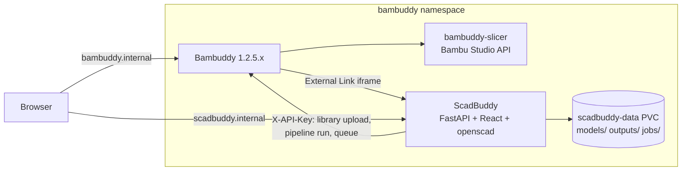

# ScadBuddy — design

**Status:** approved 2026-09-22 (Elan). **Repo:** `eh-homelab/ScadBuddy` (public, MIT).
**Owner of record:** [Hindsight initiative `kp-474d5fa02f3e48fdb7c3833356e385c3`](https://hindsight.internal.nullreference.io).

ScadBuddy is a self-hosted OpenSCAD customizer that reproduces the MakerWorld
Parametric Model Maker experience inside [Bambuddy](https://github.com/maziggy/bambuddy):
pick a model, fill in its parameters, watch the preview update, generate a
multi-colour 3MF, and send it straight to your Bambuddy library and print queue.

## 1. Why

- MakerWorld's PMM is the only good OpenSCAD customizer UI, and it only works
  for models published on MakerWorld and only produces files you then have to
  ferry into Bambuddy by hand.
- Bambuddy has **no plugin system** — upstream proposals #951/#953 were declined
  on security grounds; only the G-code viewer (#963) shipped. Every community
  "plugin" on [wiki.bambuddy.cool/community](https://wiki.bambuddy.cool/community/)
  is an external service on Bambuddy's API. ScadBuddy follows that pattern.
- Bambuddy's **External Links** feature renders a link with
  `open_in_new_tab=false` in a sandboxed `<iframe>` at `/external/{id}` inside
  its own shell (`sandbox="allow-scripts allow-same-origin allow-forms
  allow-popups allow-popups-to-escape-sandbox"`, verified in the 1.2.5.5
  frontend bundle). That is the deepest integration Bambuddy allows: ScadBuddy
  appears as a sidebar entry and its page lives inside Bambuddy's chrome.

## 2. Goals and non-goals

Goals:

1. Parity with the MakerWorld PMM customizer for models written to its
   conventions — a `.scad` that works on MakerWorld works here unchanged.
2. Multi-colour output that Bambuddy's slicer maps to filaments without any
   painting: a Bambu-style 3MF with **one object per colour**, each carrying an
   `extruder` assignment.
3. One click from "generated" to "in the Bambuddy queue".
4. Every generated file is reproducible: parameters are stored with the output.

Non-goals (v1):

- Authentication. ScadBuddy is LAN-only behind the UDM firewall, like the
  `bambuddy-slicer` sidecar. Revisit if it is ever exposed.
- Editing `.scad` source in the browser. Models are uploaded or dropped in a
  folder; editing happens in an editor.
- Running OpenSCAD in the browser (openscad-wasm). Server-side render is
  simpler and uses the Manifold nightly; the door stays open.
- Sandboxing OpenSCAD beyond a timeout and resource limits. `.scad` is a
  scripting language, but it cannot touch the network and its file access is
  limited to `import()`/`include` under the model's directory.

## 3. Verified facts the design rests on

Measured 2026-09-22 against `docker.io/openscad/openscad:dev`
(OpenSCAD 2026.01.19, Debian 13 trixie, amd64/arm64, **no Python in the image**):

- `openscad -o model.param model.scad` writes the **customizer schema as JSON**:
  `{"parameters":[{name, type, initial, caption, group, min, max, step,
  maxLength, options:[{name,value}]}], "title"}`. Types seen: `string`,
  `number`, `boolean`; `// [a,b,c]` → `options`; `// [1:0.1:5]` → min/max/step;
  `// 20` on a string → `maxLength`; `/* [Group] */` → `group`; the comment line
  above a variable → `caption`.
- MakerWorld-only annotations (`// color`, `// font`) are **not** typed by
  OpenSCAD — they come through as plain `string`. ScadBuddy overlays them by
  scanning the source for `<name> = ...; // color` and `// font`.
- `openscad --backend=Manifold -o out.3mf model.scad` emits a **single object
  with `<basematerials>`** and a **per-triangle material index**
  (`<triangle pid="1" p1="N"/>`), one material per distinct `color()` value
  plus a `Default` for uncoloured geometry. Splitting the mesh by `p1` gives
  one closed mesh per colour with no re-render. (Known nightly quirk: the
  `displaycolor` alpha byte is written as `00`; ignore alpha.)
- `-p params.json -P <set>` supplies parameter values in the customizer's own
  file format; `-D var=val` also works and is what we use (one value per flag,
  strings quoted).
- The Bambu 3MF that printed correctly on 2026-09-21
  (`Reagan-Keychain(2)_Plate 1.gcode.3mf`) is the reference for the output
  format: `3D/3dmodel.model` with one `<object>` per part, `3D/Objects/*.model`
  for geometry, `Metadata/model_settings.config` carrying per-object
  `extruder`, and `Metadata/project_settings.config` for colours. Bambuddy's
  pre-slice check reads **object-level `extruder`** from `model_settings.config`
  and ignores `paint_color`, so per-object assignment is the only reliable
  path.

## 4. Architecture



One container, one pod, one PVC. The backend shells out to `openscad`; the
frontend is a static bundle served by the same FastAPI app. No database:
models and outputs are files, metadata is JSON sidecars. This keeps the whole
thing restorable by copying a directory and needs no CNPG cluster for what is,
at most, a few hundred files.

### 4.1 Stack

| Layer | Choice | Why |
|---|---|---|
| Backend | Python 3.12, FastAPI, Pydantic v2, `trimesh` + `numpy` | Bambuddy is FastAPI, so idioms and API shapes match; trimesh reads OpenSCAD's 3MF and writes GLB for the viewer; the 3MF writer is ours (3MF is zip + XML and we need Bambu's metadata anyway, so lib3mf buys nothing) |
| Frontend | TypeScript, React 19, Vite, react-three-fiber + drei, Tailwind | Richest browser-3D ecosystem; what PMM itself is built on |
| Renderer | `openscad/openscad:dev` (Manifold) | Only build with colour-carrying 3MF export |
| Container | `FROM openscad/openscad:dev`, `apt install python3`, `uv` for deps, frontend built in a Node stage and copied in | Keeps the exact OpenSCAD build we measured |
| Tooling | `uv`, `ruff`, `mypy --strict`, `pytest`; `pnpm`, `eslint`, `tsc`, `vitest`, `playwright` | |

### 4.2 Directory layout

```
backend/scadbuddy/
  api/            routes: models, jobs, outputs, bambuddy, settings, health
  core/           config, paths, logging
  render/         openscad runner, param schema, colour split, 3mf writer, glb writer
  bambuddy/       API client (httpx), library/pipeline/queue helpers
  tests/
frontend/         Vite app
models/           example .scad models shipped with the repo (name keychain first)
deploy/           (none — manifests live in eh-homelab/clusters; see §9)
docs/superpowers/specs/
```

Data on the PVC (`SCADBUDDY_DATA_DIR`, default `/data`):

```
models/<slug>/model.scad          the source (plus any included files)
models/<slug>/model.json          name, description, tags, thumbnail, params schema cache
models/<slug>/thumbnail.png
outputs/<slug>/<output-id>/       params.json, model.3mf, preview.glb, thumbnail.png, meta.json
jobs/<job-id>.json                render job state (pending/running/done/failed, log tail)
```

## 5. The customizer (MakerWorld parity)

### 5.1 Parameter schema

`GET /api/v1/models/{slug}/schema` returns the `openscad -o .param` JSON,
normalised and overlaid:

- `type`: `number` | `integer` (step is whole and initial is whole) | `string`
  | `boolean` | `select` (has `options`) | `color` (`// color`) | `font`
  (`// font`) | `slider` (`number` with min and max).
- `groups`: ordered list preserving first appearance; parameters in
  `/* [Hidden] */` are excluded (OpenSCAD convention), `/* [Global] */` shown
  on every tab.
- Captions and descriptions come from the comment line above the variable.

The schema is cached in `model.json` keyed by the source's SHA-256 and rebuilt
when the source changes.

### 5.2 Widgets

| Schema type | Widget |
|---|---|
| `slider` | slider + number input, honouring min/max/step |
| `number`, `integer` | number input |
| `string` | text input with `maxLength` |
| `boolean` | toggle |
| `select` | dropdown; option `name` is the label, `value` is passed to OpenSCAD |
| `color` | colour picker; the value is passed as a `"#RRGGBB"` string |
| `font` | dropdown of fonts installed in the container (`fc-list`), free-text fallback |

### 5.3 The page

Left: tabs per group, widgets, "Reset to defaults". Right: 3D preview
(react-three-fiber, orbit controls, per-colour materials, build-plate grid,
bounding-box dimensions in mm). Bottom bar: **Generate**, then **Download 3MF**
and **Send to Bambuddy**.

The preview is not a separate cheap render — it **is** the render. Every
parameter change (debounced 400 ms) submits a render job; the job produces the
GLB the viewer loads and the 3MF that Generate would produce. Generate merely
persists the current job's output under `outputs/` with its parameters. For
models the size of a keychain a Manifold render is well under a second; models
that take longer show a progress state and the previous preview stays up.

## 6. Render pipeline

```
params → openscad -D … --backend=Manifold -o work/out.3mf --summary all
       → parse 3MF (trimesh): vertices, triangles, per-triangle material index, basematerials
       → split by material → [ {colour, mesh} ], drop Default if empty
       → preview.glb (one mesh per colour, PBR material with the colour)
       → model.3mf (Bambu-style, §6.2)
       → thumbnail.png (rendered from the GLB server-side with a headless
         three.js/pyrender is NOT required for v1: the frontend captures the
         canvas on Generate and POSTs it)
```

### 6.1 Runner

- One job at a time per worker; a small in-process queue (asyncio) with
  `SCADBUDDY_RENDER_CONCURRENCY` (default 2).
- Hard timeout `SCADBUDDY_RENDER_TIMEOUT` (default 120 s); OpenSCAD is killed
  and the job fails with the log tail.
- `-D` values are constructed from the schema, never from raw user strings:
  numbers are formatted, strings are quoted and escaped, booleans are
  `true`/`false`. A parameter not in the schema is rejected (422).
- The working directory is a temp dir under `jobs/`; OpenSCAD's cwd is the
  model's directory so `include`/`import` resolve.

### 6.2 Bambu-style 3MF writer

Output mirrors the structure of the known-good MakerWorld file:

- `[Content_Types].xml`, `_rels/.rels`, `3D/_rels/3dmodel.model.rels`
- `3D/3dmodel.model`: one `<object>` per colour part with `<components>`
  referencing `3D/Objects/object_N.model`, and a single build `<item>` placing
  the assembly at the plate centre (Bambu convention: centred on the plate,
  sitting on z=0).
- `Metadata/model_settings.config`: `<object id=…>` with `<metadata key="name">`
  and `<part>` entries each carrying `<metadata key="extruder" value="N"/>`
  (1-based, in colour order), plus `<plate>` with `plater_id=1`.
- `Metadata/project_settings.config`: `filament_colour` array in the same order
  and nothing else printer-specific — the slicer pipeline supplies printer,
  process and filament presets, so we deliberately do not embed
  `use_embedded_settings`-style presets.
- `Metadata/slice_info.config` is **not** written (unsliced project).

Acceptance: the file opens in Bambu Studio as N parts with N filaments
assigned, and Bambuddy's `/library/files/{id}/slice` slices it with a
`filament_presets` list of length N without a colour/extruder warning.

## 7. Bambuddy integration

Settings (stored in `settings.json` on the PVC, editable in the UI):
`bambuddy_url`, `bambuddy_api_key` (needs **Manage Library** and **Manage
Queue** scopes; **Read Status** to list printers), `library_folder_id`,
default `pipeline_id`.

Flows (all server-side, so the browser never sees the API key):

1. **Send to library** — `POST /api/v1/library/files?folder_id=…`
   (multipart) with `model.3mf`; the returned `library_file_id` is stored in
   `meta.json`.
2. **Slice and queue** — if a pipeline is configured:
   `POST /api/v1/slicer-pipelines/{id}/run` with `source_library_file_id`,
   `copies`. Otherwise `POST /library/files/{id}/slice` with presets from
   settings, then `POST /queue/` with `printer_id`, `plate_id: 1`,
   `use_ams: true`. The AMS mapping is left to Bambuddy's dispatch; the
   response's queue item id is stored so the UI can deep-link to it.
3. **Register in the sidebar** — a one-shot `POST /api/v1/external-links/`
   with `{name:"Customize", url:<scadbuddy url>, icon:"shapes",
   open_in_new_tab:false}` from the settings page ("Add to Bambuddy sidebar"),
   idempotent by name.

Colour → filament: the order of `color` parameters in the schema is the
extruder order (extruder 1 = first colour parameter). Colours that appear in
`color()` calls but are not parameters (hard-coded) are appended after.

## 8. API

All under `/api/v1`. Errors are RFC 9457 problem details.

| Method | Path | Purpose |
|---|---|---|
| GET | `/models` | catalogue |
| POST | `/models` | upload `.scad` (+ optional thumbnail, README); slug from filename |
| GET/PATCH/DELETE | `/models/{slug}` | metadata |
| GET | `/models/{slug}/schema` | customizer schema |
| GET | `/models/{slug}/source` | raw source (read-only) |
| POST | `/models/{slug}/render` | body `{params}` → `{job_id}` (202) |
| GET | `/jobs/{id}` | state, progress, log tail, result URLs |
| GET | `/jobs/{id}/preview.glb` | viewer mesh |
| POST | `/models/{slug}/outputs` | persist a finished job as an output (Generate) |
| GET | `/models/{slug}/outputs` / `/outputs/{id}` | history |
| GET | `/outputs/{id}/model.3mf` | download |
| POST | `/outputs/{id}/send` | body `{mode: "library" \| "queue", copies}` |
| GET/PUT | `/settings` | Bambuddy connection (key write-only) |
| POST | `/settings/test` | verifies the key: `GET /api/v1/printers` on Bambuddy |
| POST | `/settings/register-sidebar` | External Link upsert |
| GET | `/healthz` | liveness (openscad present, data dir writable) |

## 9. Deployment (eh-homelab/clusters)

- `applications/scadbuddy/`: Deployment (1 replica, `Recreate`), Service
  `scadbuddy:8080`, PVC `scadbuddy-data` 5Gi on `vsphere-csi-sc`,
  `nodeSelector: kubernetes.io/arch: amd64` (image is multi-arch but keep it
  next to the slicer), requests 250m/512Mi, limits 2/2Gi (Manifold is
  multi-threaded; OpenSCAD text rendering allocates freely).
- `clusters/prod/scadbuddy/`: HTTPRoute `scadbuddy.internal.nullreference.io`
  on the internal Envoy gateway, `OnePasswordItem` for the Bambuddy API key
  (item `scadbuddy-bambuddy-api-key`), env from it.
- Namespace `bambuddy`, so the existing `bambuddy-twice-daily` Velero schedule
  covers the PVC by default; add a row to `BACKUP-BASELINE.md`.
- Image `ghcr.io/eh-homelab/scadbuddy`, **package public** — nodes pull GHCR
  through the anonymous Nexus `ghcr-proxy`, so a private package cannot be
  pulled with a per-pod secret.
- Bambuddy side: one External Link, created from ScadBuddy's settings page.

## 10. CI (full)

Workflows, all on the `clusters-runner-light` pool unless a job needs Docker
(then `clusters-runner`):

- `ci.yml` (PR + main): backend `ruff`, `mypy`, `pytest` (with a real
  `openscad` from the image — tests run inside the container image built in
  the same job); frontend `eslint`, `tsc`, `vitest`, `playwright` smoke against
  the built container; `actionlint`; `hadolint`. A `CI Summary` job is the
  required check and asserts every upstream job succeeded (no skip-passes).
- `build-image.yml`: buildx multi-arch to GHCR on main and tags; digest
  output; **no `type=gha` cache** (self-hosted TLS intercept breaks it) —
  registry cache on GHCR instead.
- `claude-code-review.yml`: the clusters merge-gate pattern — review run
  dispatched from `ci.yml` after CI, commit status `claude-review` as the
  required check, sticky comment via the `eh-homelab-org-runners` App token.
- `claude.yml`: `@claude` mention agent with the trust gate job.
- `issue-intake.yml`: forge's intake port (`needs-triage` label, triage
  comment, board add).
- `cancel-pr-workflows.yml`, `pr-follow-up-issues.yml`, `ghcr-cleanup.yml`,
  `dependabot.yml` (pip, npm, github-actions, docker), `release-drafter.yml`
  pinned to `@default_branch`.

Branch protection on `main`: PR required, `CI Summary` + `claude-review`
required, linear history, auto-merge allowed.

## 11. Testing

- Unit: schema normalisation (fixtures of `.param` JSON + source overlays),
  `-D` argument construction (quoting, rejection of unknown params), mesh
  split by material, 3MF writer (XML golden files), Bambuddy client (respx).
- Integration (inside the image): render `models/name-keychain/model.scad`
  with `name="Reagan"` → 2 parts, bounding box 95.7 × 34.6 × 6.8 mm ± 0.1,
  extruders 1 and 2, opens with `trimesh` again.
- E2E (playwright): open model, change name, wait for preview, Generate,
  download, assert 3MF part count. Send-to-Bambuddy is exercised against a
  recorded mock, not the live instance.
- Acceptance on the estate: generate "Reagan", slice through the existing
  pipeline with Silk blue + Basic pink on Textured PEI, compare the sliced
  file's layer count (34) and filament switch layer to the 2026-09-21 print,
  then print it.

## 12. Work breakdown

Epics (each is a `Critical Path` workstream on the board):

1. **Renderer** — runner, schema, colour split, 3MF/GLB writers.
2. **API** — FastAPI app, models/jobs/outputs/settings routes, static serving.
3. **Customizer UI** — catalogue, customize page, preview, history, settings.
4. **Bambuddy integration** — client, send/queue flows, sidebar registration.
5. **Container & CI** — Dockerfile, ci.yml, image publish, review gate,
   intake, helpers, dependabot, branch protection.
6. **Deployment** — clusters manifests, HTTPRoute, 1Password item, backup row.
7. **Models & acceptance** — name keychain `.scad`, fixtures, the estate print.
8. **Docs** — README, user guide, wiki community-page submission.

Dependencies: 2 ← 1; 3 ← 2; 4 ← 2; 6 ← 5; 7 ← 1, 3, 4, 6; 8 ← 7.
Epics 1, 5 and the model in 7 can start immediately in parallel.
