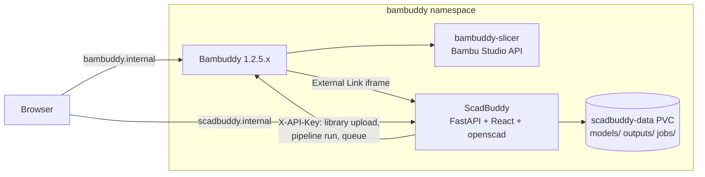

# ScadBuddy — design

**Status:** approved 2026-09-22 (Elan). **Repo:** `eh-homelab/ScadBuddy` (public, Apache-2.0).
**Owner of record:** [Hindsight initiative `kp-474d5fa02f3e48fdb7c3833356e385c3`](https://hindsight.internal.nullreference.io).

ScadBuddy is a self-hosted OpenSCAD customizer that reproduces the MakerWorld
Parametric Model Maker experience inside [Bambuddy](https://github.com/maziggy/bambuddy):
pick a model, fill in its parameters, watch the preview update, generate a
multi-colour 3MF, and send it straight to your Bambuddy library and print queue.

## 1. Why

- MakerWorld's PMM is the only good OpenSCAD customizer UI, and it only works
  for models published on MakerWorld and only produces files you then have to
  ferry into Bambuddy by hand.
- Bambuddy has **no plugin system** — upstream proposals #951/#953 were declined
  on security grounds; only the G-code viewer (#963) shipped. Every community
  "plugin" on [wiki.bambuddy.cool/community](https://wiki.bambuddy.cool/community/)
  is an external service on Bambuddy's API. ScadBuddy follows that pattern.
- Bambuddy's **External Links** feature renders a link with
  `open_in_new_tab=false` in a sandboxed `<iframe>` at `/external/{id}` inside
  its own shell (`sandbox="allow-scripts allow-same-origin allow-forms
  allow-popups allow-popups-to-escape-sandbox"`, verified in the 1.2.5.5
  frontend bundle). That is the deepest integration Bambuddy allows: ScadBuddy
  appears as a sidebar entry and its page lives inside Bambuddy's chrome.

## 2. Goals and non-goals

Goals:

1. Parity with the MakerWorld PMM customizer for models written to its
   conventions — a `.scad` that works on MakerWorld works here unchanged.
2. Multi-colour output that Bambuddy's slicer maps to filaments without any
   painting: a Bambu-style 3MF with **one object per colour**, each carrying an
   `extruder` assignment.
3. One click from "generated" to "in the Bambuddy queue".
4. Every generated file is reproducible: parameters are stored with the output.

Non-goals (v1):

- Authentication. ScadBuddy is LAN-only behind the UDM firewall, like the
  `bambuddy-slicer` sidecar. Revisit if it is ever exposed.
- ~~Editing `.scad` source in the browser.~~ Superseded by #92: source can be
  pasted into a Monaco editor to create a model and edited in place afterwards,
  both through the same create path as an upload and both parse-checked by
  OpenSCAD before they are stored. The editor is bundled (never a CDN loader)
  behind a lazy route, registers an `openscad` Monarch language, and shows the
  check's diagnostics as editor markers against their line. It is deliberately
  syntax-only: a language server over `openscad-lsp` is #95, and the model URI
  (`file:///models/<slug>/model.scad`) is the seam it will attach to.
  Multi-file pastes (a model that `include`s a helper) remain out of scope —
  that is the libraries issue.
- Running OpenSCAD in the browser (openscad-wasm). Server-side render is
  simpler and uses the Manifold nightly; the door stays open.
- Sandboxing OpenSCAD beyond a timeout and resource limits. `.scad` is a
  scripting language that cannot touch the network, but its file access is
  **not** confined by OpenSCAD: `import()` and `surface()` open whatever path a
  string hands them, relative or absolute, with the backend's uid (#281). What
  bounds it is ScadBuddy, not the binary:
  - A template is trusted code. Its own source, its `include`/`use`, and the
    values it writes itself (a parameter's initial, a select's options) can name
    any path the process can read.
  - A value a *client* supplies cannot steer those calls out of the directory of
    the file that reads it. A `// file:` parameter takes only a bare name — a
    staged upload or a shipped sample (#204, #231). Every other string-valued
    parameter (`string`, `font`, `color`, a string `select`) is refused with a
    422 when its value starts with `/` or has a `..` path component; relative
    names below that directory still pass. The check is by path component, so
    ordinary text (`"Wait..."`, `"3/4 inch"`, `"AC/DC"`) is unaffected; the cost
    is that text which genuinely starts with a slash (`"/r/3dprinting"`) or
    contains `/../` cannot be rendered. It judges the value, not what the
    template does with it: a template that builds a path by concatenation
    (`str("/", name)`) must guard its own input, as `flexi-fabric`'s and
    `bookmark`'s `safe_file()` do.
  - openscad (and openscad-lsp, and fontconfig's `fc-*`) gets an allowlisted
    environment — `PATH`, `HOME`, the `XDG_*` directories, locale (`LANG`,
    `LANGUAGE`, `LC_*`), `TZ`, `TMPDIR` and fontconfig's own variables — never a
    copy of the backend's (`core/fontconfig.py`), so `/proc/self/environ` holds
    no API key or database URL.

  Kernel-level confinement (a mount namespace, Landlock, a read-only bind of the
  model directory) would close the rest — what a template itself reads. It stays
  a non-goal for the same reason authentication is: anyone who can reach this
  LAN-only instance can already upload or paste a template (#92), so the
  boundary that matters is what the process can read at all, which is why the
  environment is the part that is locked down.

## 3. Verified facts the design rests on

Measured 2026-09-22 against `docker.io/openscad/openscad:dev`
(OpenSCAD 2026.01.19, Debian 13 trixie, amd64/arm64, **no Python in the image**):

> **Re-verified 2026-09-24 against OpenSCAD 2026.09.23** (the `:dev` tag rolled
> and the Dockerfile's `OPENSCAD_VERSION` assertion fired). Everything below
> still holds — `models/name-keychain/verify.sh` passes every check and the
> `requires_openscad` tests pass — with **one change in the `.param` export**:
> every un-ranged `number` now carries `"step": 1` (2026.01.19 omitted it),
> including non-whole initials such as `wall = 1.2`. That is the customizer's
> default, not a declared step, so `build_schema` keeps `step` only for
> sliders; the three `.param` fixtures were regenerated on the new build.
>
> **Re-verified 2026-09-28 against OpenSCAD 2026.09.28**
> (`openscad/openscad:dev.2026-09-28@sha256:99250895…`, now pinned by tag and
> digest in the Dockerfile). Everything below still holds with no change: all 35
> `models/*/verify.sh` pass, and the backend suite in the `test` image passes
> (1942 passed; the 65 skips are the Postgres-only tests).

- `openscad -o model.param model.scad` writes the **customizer schema as JSON**:
  `{"parameters":[{name, type, initial, caption, group, min, max, step,
  maxLength, options:[{name,value}]}], "title"}`. Types seen: `string`,
  `number`, `boolean`; `// [a,b,c]` → `options`; `// [1:0.1:5]` → min/max/step;
  `// 20` on a string → `maxLength`; `/* [Group] */` → `group`; the comment line
  above a variable → `caption`.
- **Bambu Studio reads `Metadata/project_settings.config` only from a file that
  claims to be its own project, and then requires five options or it
  segfaults.** Measured 2026-09-24 against
  `ghcr.io/maziggy/bambu-studio-api:bambuddy-1.2.5.5` (BambuStudio 02.08.02.61),
  the image the `bambuddy-slicer` sidecar runs.
  `_load_model_from_file` (`bbs_3mf.cpp`) sets `dont_load_config` unless the
  root model's `Application` metadata starts with `BambuStudio-`, and then skips
  that file entirely — so every key in it, including `filament_colour`, was
  discarded for as long as ScadBuddy wrote `Application: ScadBuddy`. Proved
  independently of the tower: `prime_tower_width: "42"` and
  `sparse_infill_density: "7%"` set in the 3MF came out of the slice as the
  process preset's `60` / `15%`.
  Making the claim is only half of it. On the BBL path `BambuStudio.cpp`
  dereferences `printer_settings_id` and `print_settings_id` (2009-2010),
  `filament_settings_id` and `nozzle_diameter` just after, and
  `printable_height` through `opt_float` (2095) with **no null checks**: a file
  that omits one does not fail validation, it segfaults before slicing starts.
  Removing any single one of the five reproduces the crash.
  The values need not be real — the CLI reads them into `current_*`/`old_*`
  locals used for reporting and compatibility comparisons, while the settings
  actually sliced with come from `--load-settings`/`--load-filaments`.
  Placeholder ids, a deliberately wrong nozzle diameter (0.4 while slicing 0.2)
  and 1 or 3 entries on a two-extruder printer all produce byte-identical
  G-code. `Metadata/model_settings.config` is **not** gated this way, which is
  why per-part extruder assignment always worked.
  The version claimed is `02.07.00.00`: the oldest that trips none of the
  importer's five compatibility paths (translate below 1.5.9, regenerate
  thumbnails below 1.5.9, keep old params below 2.0.0, disable wrapping
  detection below 2.2.0, reset `skirt_per_object` below 2.7.0), and low enough
  that a CLI older than the one measured still accepts the file.
- MakerWorld-only annotations (`// color`, `// font`) are **not** typed by
  OpenSCAD — they come through as plain `string`. ScadBuddy overlays them by
  scanning the source for `<name> = ...; // color` and `// font`.
- `openscad --backend=Manifold -o out.3mf model.scad` emits a **single object
  with `<basematerials>`** and a **per-triangle material index**
  (`<triangle pid="1" p1="N"/>`), one material per distinct `color()` value
  plus a `Default` for uncoloured geometry. (Known nightly quirk: the
  `displaycolor` alpha byte is written as `00`; ignore alpha.) `Default` is
  always index 0; the colours follow in the order the geometry **first uses**
  them, not the order the parameters are declared — measured on 2026.09.23: a
  model declaring `base_color` then `text_color` but drawing the text first gets
  the text colour as material 1. Extruder order is therefore imposed by
  ScadBuddy (§7), not inherited.
- **Splitting that mesh by `p1` does *not* give closed meshes.** OpenSCAD
  unions the top-level coloured solids and deletes the faces where they meet,
  so every part that touches another part comes back open — measured
  2026-09-22 on `models/name-keychain/model.scad`: both parts
  `is_watertight == False`, while their union is closed. Only genuinely
  disjoint colour solids split into closed meshes. The split is still exactly
  right for the *preview*, and it is the only way to learn the colour list; the
  printable parts come from the re-renders in §6.3.
- **`--enable=lazy-union` is not the way out.** It does emit one closed object
  per top-level child, but this nightly writes `p1="1"` on every one of them,
  so the colour attribution is lost. Measured 2026-09-22.
- **A user-defined `color` module shadows the builtin.** That is what makes
  §6.3 work: a wrapper that defines `module color(c, alpha = 1)` and keeps only
  the children whose colour matches a target renders one colour on its own, as
  a closed solid. `-D` still overrides the model's parameters through the
  wrapper's `include <model.scad>` (verified), and a target no `color()` call
  matches exits **1** with `Current top level object is empty.` and writes no
  file — which is the signal to fall back.
- `-p params.json -P <set>` supplies parameter values in the customizer's own
  file format; `-D var=val` also works and is what we use (one value per flag,
  strings quoted).
- The Bambu 3MF that printed correctly on 2026-09-21
  (`Reagan-Keychain(2)_Plate 1.gcode.3mf`) is the reference for the output
  format: `3D/3dmodel.model` with one `<object>` per part, `3D/Objects/*.model`
  for geometry, `Metadata/model_settings.config` carrying per-object
  `extruder`, and `Metadata/project_settings.config` for colours. Bambuddy's
  pre-slice check reads **object-level `extruder`** from `model_settings.config`
  and ignores `paint_color`, so per-object assignment is the only reliable
  path.
- **The image's `git` must be at least 2.37**, asserted as a floor in the
  Dockerfile (`MIN_GIT_VERSION`) rather than pinned: 2.9 for `core.hooksPath`,
  2.28 for `--initial-branch`, 2.35.2 for `safe.directory` as protected
  command-line scope, and 2.37 for `http.curloptResolve`, which holds a library
  clone (#93) to the addresses its host was vetted at. An older git ignores that
  key and resolves the host again, so the vetting would not bind the clone.
- **MakerWorld does not serve a model's source to an anonymous server**
  (checked 2026-09-26, #153/#174). Model pages sit behind a Cloudflare challenge
  (403). `api.bambulab.com/v1/design-service/design/<id>` answers without a login
  (title, cover, summary, licence, file list), but the Parametric Model Maker
  `.scad` entry has an empty `modelUrl`, and every download route answers 403
  "Please log in to download models". Some PMM sources are also marked
  `protected`. So the URL import refuses MakerWorld links with a pointer to
  Upload, and a resolver needs a signed-in token (#174).

## 4. Architecture


```mermaid
flowchart LR
  subgraph bambuddy-ns [bambuddy namespace]
    B[Bambuddy 1.2.5.x]
    S[bambuddy-slicer\nBambu Studio API]
    SB[ScadBuddy\nFastAPI + React + openscad]
    PVC[(scadbuddy-data PVC\nmodels/ outputs/ jobs/)]
  end
  U[Browser] -->|bambuddy.internal| B
  B -->|External Link iframe| SB
  U -->|scadbuddy.internal| SB
  SB --> PVC
  SB -->|X-API-Key: library upload,\npipeline run, queue| B
  B --> S
```

One container, one pod, one PVC. The backend shells out to `openscad`; the
frontend is a static bundle served by the same FastAPI app. No database:
models and outputs are files, metadata is JSON sidecars. This keeps the whole
thing restorable by copying a directory and needs no CNPG cluster for what is,
at most, a few hundred files.

### 4.1 Stack

| Layer | Choice | Why |
|---|---|---|
| Backend | Python 3.12, FastAPI, Pydantic v2, `trimesh` + `numpy` | Bambuddy is FastAPI, so idioms and API shapes match; trimesh reads OpenSCAD's 3MF and writes GLB for the viewer; the 3MF writer is ours (3MF is zip + XML and we need Bambu's metadata anyway, so lib3mf buys nothing) |
| Frontend | TypeScript, React 19, Vite, react-three-fiber + drei, Tailwind | Richest browser-3D ecosystem; what PMM itself is built on |
| Renderer | `openscad/openscad:dev` (Manifold) | Only build with colour-carrying 3MF export |
| Container | `FROM openscad/openscad:dev`, `apt install python3`, `uv` for deps, frontend built in a Node stage and copied in | Keeps the exact OpenSCAD build we measured |
| Tooling | `uv`, `ruff`, `mypy --strict`, `pytest`; `pnpm`, `eslint`, `tsc`, `vitest`, `playwright` | |

### 4.2 Directory layout

```
backend/scadbuddy/
  api/            routes: models, jobs, outputs, bambuddy, settings, health
  core/           config, paths, logging
  render/         openscad runner, param schema, colour split, 3mf writer, glb writer
  bambuddy/       API client (httpx), library/pipeline/queue helpers
  tests/
frontend/         Vite app
models/           example .scad models shipped with the repo (name keychain first)
deploy/           (none — manifests live in eh-homelab/clusters; see §9)
docs/superpowers/specs/
```

Data on the PVC (`SCADBUDDY_DATA_DIR`, default `/data`):

```
models/                           A GIT REPOSITORY (see below)
models/<slug>/model.scad          the source (plus any included files)
models/<slug>/model.json          name, description, tags, thumbnail, origin_url (NOT the schema)
models/<slug>/thumbnail.png        legacy cover; the first media write moves it into media/ (#274)
models/<slug>/media/<id>.<ext>    the template's images and videos (#274); their order is `template_media` rows
models/_builtin/<slug>/           a built-in template, mirrored from the image on boot (§4.3)
outputs/<id>/<output-id>/         params.json, model.3mf, preview.glb, thumbnail.png, meta.json
jobs/<job-id>.json                render job state (pending/running/done/failed, log tail)
cache/schema/<id>.json            the DERIVED customizer schema, keyed by source hash
cache/revisions/<id>/<commit>/    an old model revision exported out of git, derived
cache/preview-work/.work-<uuid>/  a default-render preview's scratch space while it renders (§6.2.2)
assets/<sha256>.{svg,png}         a file uploaded for a `// file` parameter (§5.5); its name,
                                  kind, size and last use are an `assets` row (#591)
```

`origin_url` (#153) is the URL a model was imported from, exactly as it was pasted
(not wherever redirects ended), for the catalogue's link back and a later re-pull.
It is `null` for anything uploaded or pasted, and for a built-in, and it is not editable:
`PATCH /models/{slug}` does not take it.

The model record the API returns (`ModelRecord`) is `model.json` plus what is
derived: `slug`, `origin` (`builtin` or `mine`), `updated_at`, `version` (the model's current commit),
`has_readme`, `has_thumbnail`, `thumbnail_source`, `thumbnail_output_id` (#179) and
`thumbnail_preview_id`. `thumbnail_source` is, in order of precedence, `model` when
`thumbnail.png` is set on the model, `output` when there is none and the catalogue
shows the plate image of the model's first generated output instead, `preview` when
there is neither but a default-render preview (§6.2.2) has been made, and `null`
otherwise; `has_thumbnail` is true for any source. `thumbnail_preview_id` names the
preview's render while the source is `preview`, and changes when a source edit is
re-rendered, which is again no commit of its own. The
output fallback is read out of that output's 3MF, never copied into `models/`, and
which output holds it is resolved once per state of the model's outputs rather
than on every listing. `thumbnail_output_id` names that output while `thumbnail_source` is `output`
and is `null` otherwise: the fallback moves without a commit (the covering output
is deleted, or another becomes the first with a plate image), so `version` does not
change with it, and a client keys its cached image on both.

`<id>` is the template's id: its slug for a template of mine, `builtin:<slug>` for a
built-in. Derived files are keyed by the id, so a built-in's live exactly as long as
its `_builtin/<slug>/` does, and the orphan sweep needs no special case for them.

### 4.3 Model history: git is the version store (#90)

`models/` is a git repository, initialised on first start. Every catalogue action
is exactly one commit — upload, source edit, metadata change, delete, built-in
sync, restore — and there is no parallel index of revisions anywhere: `git log`,
`git show` and `git diff` are the read side. Whatever the server reports, a shell
on the volume sees the same thing.

- **Built-in templates are mirrored, not seeded (#155).** On boot, after
  `ensure_repo`, every bundled model (`/app/models`, the repo's `models/` in dev)
  is copied over `models/_builtin/<slug>/`, and a built-in the image no longer has
  is removed; anything that changed lands as one `Sync built-in templates from the
  image` commit. The image is the source of truth, so a newer image's fixes reach
  existing installs, and nothing else writes `_builtin/` — its history is each
  built-in's version history. A built-in's id is `builtin:<slug>`: every route that
  takes a model reads it (model, source, schema, thumbnail, versions, diff, render,
  outputs), and the write routes (source `PUT`, metadata `PATCH`, `DELETE`,
  restore) answer 403. `:` and `_` are not slug characters, so neither the id nor
  the directory can collide with a template of mine, and a template of mine with
  the same slug as a built-in is left alone. `GET /models` lists both, each with
  `origin: "builtin" | "mine"`. This replaces the old copy-if-absent seed, which
  turned a bundled model into an ordinary one the first time it was copied.
- **Seeded templates are linked to their built-ins (#158).** Right after the sync,
  every template of mine with a built-in's slug and no `upstream` whose own
  history reaches a `Seed … from the image` commit (the old seed's subject)
  becomes a duplicate of it: `upstream = {id: builtin:<slug>, path: <slug>, base:
  <that seed commit>}`, where `path` is where the source lived at `base`. The
  seeded source is the true merge base, so an unedited copy merges cleanly to the
  current built-in and an edited one keeps its edits. All of them land as one
  `Link seeded templates to their built-ins` commit. It is idempotent (a linked
  template has an `upstream`) and renames nothing, so outputs, `model_version`
  stamps and deep links are untouched. A template whose newest origin is not a
  seed (uploaded under that slug, or re-created after a delete) is logged and left
  alone; one that fails to link is logged and the rest still link, so the boot
  never fails on it.

- **Shelling out to `git`, not dulwich/pygit2.** The product surface here *is*
  git porcelain, so a library would mean reimplementing log/diff/restore — a
  home-grown version store in a different hat. The follow-ups want the real
  client too: #93 vendors libraries as `git clone --depth 1` checkouts, and the
  optional off-box push wants git's own transports. Cost: `git` in the image,
  which is therefore a **runtime** dependency, not tooling.
- **Hermetic invocation.** `GIT_CONFIG_GLOBAL`/`GIT_CONFIG_SYSTEM` are `/dev/null`
  and hooks are disabled, so no operator's `~/.gitconfig` can reach the
  repository; identity comes from the environment rather than a config file
  (the container runs as uid 10001 whose HOME is not the volume); and
  `safe.directory` is passed as command-line — *protected-scope* — config,
  because a PVC's ownership need not match the runtime uid.
- **Writes are serialised** by a thread lock plus an `flock`, so nothing can
  interleave an `add`/`commit` pair.
- **Generated files never enter the tree.** `render_solids` drops its wrapper
  next to the model source (it has to, for `include <>` to resolve); the prefix
  is the named `WRAPPER_PREFIX` constant and `ensure_repo` writes it into
  `.gitignore`. The derived customizer schema used to live in `model.json` and
  now lives under `cache/`: it is written lazily, by a *read*, outside any
  commit, so in the tree it would leave the repository permanently dirty and
  fold a cache blob into the next unrelated metadata commit.
- **Template media (#274): images are committed, videos are not.** Images
  (PNG, JPEG, WebP, at most 10 MiB each) and video posters are committed with
  the template, like `thumbnail.png`. Videos (MP4, WebM, up to
  `SCADBUDDY_MEDIA_UPLOAD_MAX_BYTES`, 1 GiB by default) would bloat a history that is
  kept for good, so `ensure_repo`'s `.gitignore` carries `*/media/*.mp4`,
  `*/media/*.webm` and the same under `_builtin/`.
- **The media list is Postgres, not history (#274).** The order, captions and
  posters of a template of mine are rows of `template_media` (backend migration
  `20260928T0718Z_template_media.sql`), not `model.json`, so they are not versioned: a restore brings back an
  image's file but not its row. A file with no row is ignored (an orphan sweep is
  a follow-up), and a row whose file is gone -- a video removed by hand, say -- is
  reported `missing: true`, which the cover skips. A write puts the file in place
  first, then the rows, and removes the file again if the rows cannot be written;
  a removal drops the row first. A built-in's list is its bundled `model.json`
  `media`, shipped read-only in the image. A duplicate copies `media/` from the
  working tree, videos included, and the upstream's list as rows of its own. With
  no `SCADBUDDY_DATABASE_URL` (until #401 makes it required) only the legacy
  `thumbnail.png` is listed and every media write answers 503.
- **A commit message is flattened to one printable line** (`subject_line`).
  `PUT /models/{slug}/source` takes a caller-supplied `message`, and the log
  parser splits records on ASCII RS/US — bytes nothing can put in a hash, an
  author or a date, but which a *subject* would carry straight through,
  desyncing every later record boundary and silently dropping the malformed
  chunks.
- **Outputs stamp `model_version`**: the model's own last commit, not the
  repository HEAD — a commit against another model leaves this one where it was,
  and the id has to name an entry in *this* model's history.
- **"Customize this version"** renders an old revision without restoring it. The
  revision is exported to `cache/revisions/<slug>/<commit>/`, an ordinary model
  directory, so the schema cache and the renderer work on it unchanged and
  nothing generated lands in the repository. Commits are immutable, so a
  populated export is never *stale* — but it is still a cache, and it is swept
  on the same TTL and the same two trigger points as `jobs/`, by **last use**
  rather than by export time so a sweep cannot take a revision out from under
  someone still browsing it.
- **Every git call is blocking**, so an `async def` handler hands it to
  `asyncio.to_thread`. FastAPI offloads plain `def` handlers on its own; an
  `async` one runs on the loop uvicorn shares with the render workers, and a
  commit against the PVC there stalls every render poll and `/healthz` with it.
- **Every git call is also bounded** by `SCADBUDDY_GIT_TIMEOUT` (default 30 s),
  and so is the wait for the write lock. Off the event loop is not enough on
  its own: `asyncio.to_thread` runs on the executor `/healthz` and the render
  polls share, and this repository lives on a PVC that Velero snapshots, so an
  `fsync` parked behind a block-storage stall would hold a slot for as long as
  the stall lasts. A deadline makes that an ordinary `GitError` instead, which
  the next bullet already absorbs. `fcntl.flock` takes no deadline, so the
  non-blocking form is retried against one.
- **A failed commit never fails the action.** The files are written first, so a
  `GitError` *or* an `OSError` (the lock file is ordinary filesystem I/O, and a
  PVC can go read-only after boot) is logged and swallowed: losing the revision
  is the smaller harm, and reporting a 500 for an edit that already landed is
  the larger one.
- **Not done here:** pushing the repository to a remote. The seam is
  `ModelHistory.commit`, which returns the new commit id.

## 5. The customizer (MakerWorld parity)

### 5.1 Parameter schema

`GET /api/v1/models/{slug}/schema` returns the `openscad -o .param` JSON,
normalised and overlaid:

- `type`: `number` | `integer` (step is whole and initial is whole) | `string`
  | `boolean` | `select` (has `options`) | `color` (`// color`) | `font`
  (`// font`) | `file` (`// file:svg,png`, §5.5) | `slider` (`number` with min
  and max).
- `accept`: a `file` parameter's kinds, `["svg", "png"]` or a subset.
- `samples`: a `file` parameter's sample files, the bare names of the files the
  template ships in its own directory whose extension it accepts (§5.5). Listed on
  every schema read, never cached with the schema.
- `groups`: ordered list preserving first appearance; parameters in
  `/* [Hidden] */` are excluded (OpenSCAD convention), `/* [Global] */` shown
  on every tab.
- Captions and descriptions come from the comment line above the variable.

The schema is cached in `model.json` keyed by the source's SHA-256 and rebuilt
when the source changes.

### 5.2 Widgets

| Schema type | Widget |
|---|---|
| `slider` | slider + number input, honouring min/max/step |
| `number`, `integer` | number input |
| `string` | text input with `maxLength` |
| `boolean` | toggle |
| `select` | dropdown; option `name` is the label, `value` is passed to OpenSCAD |
| `color` | colour picker; the value is passed as a `"#RRGGBB"` string |
| `font` | free-text field with an installed-font datalist, plus a **Browse** button opening the Google Fonts picker (§5.4) |
| `file` | drop zone plus **Choose…**, a preview of the chosen SVG/PNG, its original name, and **Clear**; under it a row of thumbnails of the template's `samples`, one click to use one (§5.5) |

### 5.3 The page

Left: tabs per group, widgets, "Reset to defaults". Right: 3D preview
(react-three-fiber, orbit controls, per-colour materials, build-plate grid,
bounding-box dimensions in mm, a full-screen toggle). Bottom bar: **Generate**,
then **Download 3MF** and **Send to Bambuddy**.

Full screen takes the whole workspace. The viewer and its overlays (plate, bounding
box, render state, a failed render's log) fill the screen; the parameter panel becomes
a flyout over the scene, opened from **Parameters** (a full-width sheet on a narrow
screen), with the overlays moving clear of it; the bottom bar waits outside. The panel
and the canvas are never remounted, so the camera and the chosen tab survive. It goes
through the Fullscreen API, but a cross-origin frame may only use that API when its
`<iframe>` allows it (`allow="fullscreen"` or `allowfullscreen`), and Bambuddy's is
only known to set its sandbox flags (§1), so wherever the API is refused the workspace
covers the window instead — when embedded, the frame. Escape leaves either, but not
alike. In the stand-in a dialog opened from the flyout takes the key first. In the
API's full screen the key is the browser's, which always leaves and which no page can
stop; whether that Escape also reaches an open dialog is the browser's call.
Automated Chromium never hands Escape to the browser (headless, or headed but driven
over CDP, as measured for this), so that path is checked by hand. While full screen
lasts, the rest of the page is inert: it is covered or unpainted, and Tab must not
reach a control nobody can see. Full screen hides the assistant panel with the rest of
the page, so the assistant's shortcut leaves full screen and shows the panel rather
than toggling it out of sight.

The preview is not a separate cheap render — it **is** the render. Every
parameter change (debounced 400 ms) submits a render job; the job produces the
GLB the viewer loads and the 3MF that Generate would produce. Generate merely
persists the current job's output under `outputs/` with its parameters. For
models the size of a keychain a Manifold render is well under a second; models
that take longer show a progress state and the previous preview stays up.

### 5.4 Fonts

`text()` resolves a family through fontconfig inside the container, so a model can
only use a face fontconfig can see. The picker makes the whole Google Fonts
catalogue usable without rebuilding the image.

**Catalogue, server-side, two sources.** The browser never talks to the Google Fonts
*API* — only `/api/v1/fonts/*` — so no key is ever shipped to it.

| `SCADBUDDY_GOOGLE_FONTS_API_KEY` | Source | Notes |
|---|---|---|
| set | Developer API, `webfonts/v1/webfonts?sort=popularity` | documented and stable |
| unset (the default) | `https://fonts.google.com/metadata/fonts` | the public metadata fonts.google.com itself reads — no key, no quota, same families, categories and popularity. Undocumented, and it may prefix its body with the XSSI guard `)]}'` (seen both ways), which is stripped when present |

**A key is optional and changes nothing but the catalogue.** Everything works without
one.

Either catalogue is cached on the data volume (`fonts/.catalogue.json`, 24 h by
default, `SCADBUDDY_FONTS_CATALOGUE_TTL`). A fetch failure falls back to a *stale*
cache when one exists, because an old catalogue beats none.

**Downloads come from neither catalogue.** They come from the `google/fonts`
repository: `<licence-dir>/<slug>/METADATA.pb` names the exact TTF for every face,
and the three licence directories (`ofl`, `apache`, `ufl`) are probed in turn because
which one holds a family is not in either catalogue — the one that answers also names
the licence to keep beside the font.

The obvious alternative, the CSS endpoint with an old `User-Agent` (what
google-webfonts-helper does), was **measured on 2026-09-23 and rejected on the
evidence**: an IE6/IE8 agent is served **EOT**, which fontconfig cannot read at all,
and the agents that do yield `.ttf` are served *per-subset* files, so a family would
install missing most of its glyphs. The repository serves the complete font — for a
variable family, one file (`NotoSans[wdth,wght].ttf`) listed against every named
instance, downloaded once, with fontconfig reporting each instance as a style.

**Layout on the data volume.**

```
<SCADBUDDY_DATA_DIR>/fonts/
  fonts.conf            generated each startup; the renderer's FONTCONFIG_FILE
  .cache/               fontconfig's own cache, writable by uid 10001
  .catalogue.json       the cached catalogue
  pacifico/
    Pacifico-Regular.ttf
    OFL.txt             the family's own licence, kept next to it
    family.json         family, category, files, licence, source, installed_at
```

`fonts.conf` includes `/etc/fonts/fonts.conf` and adds the fonts directory; its
`<cachedir>` is declared **before** that include, because fontconfig writes to the
first cache directory it can and the image's system cache is baked at build time
and owned by root. `run_openscad` passes `FONTCONFIG_FILE` in the render's
environment — without it the downloaded families are invisible to `text()` no matter
where they land. The variable is left unset while no config exists: fontconfig treats
an unreadable `FONTCONFIG_FILE` as fatal, so pointing at a missing file would break
every render rather than merely hiding the new fonts.

**Licensing.** Google Fonts are OFL 1.1, Apache 2.0 or UFL 1.0. The licence text is
fetched from the family's directory in the `google/fonts` repository and written
beside its files; when the layout does not match, a `LICENSE.txt` naming the three
licences and linking the specimen page is written instead, so a family is never on
disk without one.

**Air-gapped.** `GET /fonts/catalogue` answering 503 is a supported state: the picker
says so and falls back to the families `fc-list` reports, which is also the fast path
for picking one of the image's own faces — an already-resolvable family is returned
as-is and nothing is fetched.

### 5.5 File parameters (#204)

A template can take a picture for one render: a logo, an overlay, a mask for
`surface()`. The parameter is an ordinary string with a trailing annotation naming
the kinds it takes:

```scad
// Picture to overlay
overlay_file = ""; // file:svg,png
```

`// file` alone takes both kinds; `// file:png` takes one. Unlike `// [..]` this is
not OpenSCAD customizer syntax, and that is deliberate: OpenSCAD (measured on
2026.09.23) exports the parameter as a plain `string`, caption kept, so the model
still opens in the OpenSCAD GUI and on MakerWorld, and only ScadBuddy types it
`file`. An annotation naming no kind ScadBuddy stores (`// file:stl`) leaves it a
string.

- **Upload.** `POST /models/{id}/assets` (multipart `file`) sniffs the bytes, never
  the name, and refuses anything but SVG and PNG (422) or over 8 MiB (413). An SVG
  is re-serialised without scripts, event handlers, `foreignObject`/`image`/
  animation elements, entity declarations, or any `href`/`url()` that leaves the
  document. A PNG is decoded (refused past 25 MP), downscaled to 256 px on its
  long side — `surface()` makes a vertex per pixel — and re-encoded without
  metadata. The stored bytes' SHA-256 is the asset's id, so the same picture is
  stored once. Built-ins take uploads too.
- **The value is the id, never a path.** A render refuses (422) a `file` value
  that is not `""`, the model's own default, or the id of a stored asset of an
  accepted kind. The runner additionally refuses any `file` value that is not a
  bare file name, so nothing reaches `import()` as a path whichever route sent it.
- **Staging.** The job copies each asset into the model's directory as
  `_scadbuddy_solid_asset_<random>.<kind>` and passes that bare name with `-D`, so
  `import()`/`surface()` resolve it beside the model as they do a bundled file —
  and so do all of §6.3's wrapper renders, which run in the same directory with
  the same values. A template that guards the parameter to a bare file name keeps
  working. The copies share the wrapper's prefix, so the source hash, the models
  repository's `.gitignore` and a duplicate's copy all skip them; they are deleted
  when the render ends, and each render gets its own.
- **Samples.** A template can ship pictures for its file parameters beside its
  source (`models/flexi-fabric/sample-overlay.svg`), and the viewer can pick one instead
  of downloading and re-uploading it. The schema lists them per parameter as
  `samples`: every regular file directly in the model's directory whose name is
  bare (the runner's own rule: `[A-Za-z0-9_][A-Za-z0-9_.-]*`, no `..`, so no
  dotfile and no subdirectory) and whose extension the parameter accepts. A
  symlink is never one (it could point anywhere), nor are the render's staged
  files and wrappers (`_scadbuddy_solid_*`) or the catalogue's `thumbnail.png`.
  The list is built when the schema is served, not cached with it: the cache is
  keyed by the source's hash, and a sample can come and go without the source
  changing. A sample's value is its bare name; a render accepts it only while it
  is in the list for that parameter, computed again from the directory of the
  revision being rendered, and OpenSCAD reads it in place (nothing is staged).
  `GET /models/{id}/samples/{name}` (`?version=` for an older revision) serves a
  listed sample for the picker's thumbnails with the same `sandbox` CSP and
  `nosniff` as an upload, but `Cache-Control: no-cache`, since an edit changes it
  under the same URL; any other name is a 404. Provenance for a sample is its
  name, so a re-render reproduces the output while the revision still ships it.
- **Provenance.** `params.json` and the 3MF's stamp carry the id, which is the
  content hash; an asset any output names is never swept (below), so a re-render
  and "Customize this version" reproduce the output.
- **Limits and the sweep (#296).** Distinct uploads were otherwise kept forever,
  so every slightly different picture added a blob to the volume for good.
  - *Caps.* `SCADBUDDY_ASSET_MAX_TOTAL_BYTES` (default 1 000 000 000) and
    `SCADBUDDY_ASSET_MAX_COUNT` (10 000); 0 is no limit for either. An upload whose
    content is not already stored and that would take the store past either is a
    413 problem document (RFC 9457, the same shape as the 8 MiB refusal) whose
    `detail` names the setting and whose `usage` extension is the store's
    `{count, bytes, max_count, max_total_bytes}`. Content already stored is
    never refused, so re-uploading what an output uses keeps working at the cap.
    The check and the insert happen in one transaction holding the store's advisory
    lock, so two uploads -- in one process or on two replicas -- cannot both take
    the last slot; a re-upload of stored content needs no room and skips it. Sizes are of the stored bytes, after sanitising and downscaling.
  - *Usage.* `count(*)` and `sum(size)` over the `assets` table (#591), not a
    directory scan and not a running total: the metadata is one row per asset
    (`id, name, kind, size, width, height, created_at, last_used_at`), so there is
    nothing to recount at boot and every replica reads the same numbers. The bytes
    stay on the volume. A blob is written before its row's insert commits, so no row
    is ever without its blob; a blob with no row (an insert that failed, or one from
    before #591, since nothing was copied over) is an orphan that `get` does not
    find and usage does not count. The file-based store's `<id>.json` sidecars,
    `.assets.usage.json` and `.assets.lock` are ignored and removed by the sweep.
    `GET /assets/usage` answers the same four numbers; Settings shows
    them under "Uploaded files". `/metrics` has `scadbuddy_assets_stored`,
    `scadbuddy_assets_bytes`, `scadbuddy_assets_max_count`,
    `scadbuddy_assets_max_bytes` (read per scrape), `scadbuddy_assets_rejected_total`
    and `scadbuddy_assets_swept_total`.
  - *What keeps an asset.* Any 64-hex string equal to its id in: an output's JSON
    records (`params.json`, `meta.json`) or, when `params.json` is gone, the raw
    root model of its 3MF, where the provenance "Edit in ScadBuddy" falls back to
    is stamped (raw rather than through `provenance.read`, which answers "no
    stamp" for a stamp it cannot parse); a
    saved preset (`presets/`); a template's `presets.json` or `model.json`, mine or
    built-in; or a job in the render queue's store, whatever its state (with
    Postgres, every replica's). The match is on raw text, not on parsed `file`
    values, so a damaged record still keeps what it names, and a coincidental
    match only keeps a file longer. An older revision's shipped `presets.json` in
    the models history is not read: shipped presets name samples, not uploads.
  - *Last use.* An asset's last use is its row's `last_used_at` (an orphan blob's is
    its mtime). An upload (a re-upload included) sets it; every `file` value that a render submit,
    a render's staging or a preset save validates is marked used (`AssetStore.use`,
    which `file_assets` calls). So a preset save now also refuses (422) a `file`
    value that is not an upload or a sample, as a render always did.
  - *The sweep* removes an asset nothing keeps whose last use is older than
    `SCADBUDDY_ASSET_SWEEP_GRACE` (default 7 days, at least 3600 s): every row, and
    every orphan blob on the volume. It runs at
    boot, after the render queue has opened its store, and then every
    `SCADBUDDY_ASSET_SWEEP_INTERVAL` (default 1 day; 0 turns the sweep off, boot
    included). Like the tombstone, orphan and library-staging sweeps it is best
    effort: a failure is logged and never stops the boot. (#271 proposes the same
    shape for library checkouts; there is no such sweep yet to share code with.)
  - *Why it is safe against concurrent uploads and renders.* The references are
    read first, and if any source cannot be read (a store outage, an unreadable
    record, a 3MF that will not open as a zip) the sweep removes nothing. A reference made after that read is not in
    the set, so what protects it is the last use: every path that creates one
    marks the asset used (an `UPDATE` of its row), and the sweep re-checks the last
    use with that row locked (`SELECT … FOR UPDATE`) immediately before it removes
    each asset. Either the use wins, and the sweep sees a fresh asset and skips it,
    or the sweep wins and the use is a not-found: a 422 for that render or preset,
    never a job that loses its file halfway. A running render was marked used when
    it staged its files, and its job stays in the store until the TTL prunes it. An
    upload whose first render has not been submitted yet is protected by the grace
    alone, which is why the grace has a floor. Removal deletes the row first, so
    `get` stops finding the asset before its bytes go. Each removal holds that
    asset's advisory lock at session scope, from before the re-check until the blob
    is gone -- past the commit of the delete -- and an upload holds the same lock
    for its transaction, so an upload of the same content waits rather than
    inserting a row over a blob about to be removed, while uploads of other content
    never wait on a removal. The locks are Postgres's, so they hold between
    replicas sharing the volume and the database. A removal that fails, in a file
    or in the database, is logged and skipped; the rest are still tried.
- **A missing file is a warning.** OpenSCAD reports `ERROR: Can't open file …`
  (`import()`) or `WARNING: The file … couldn't be opened` (`surface()`) and still
  exits 0 when anything else rendered. Both are read off the whole log, and the job
  result carries `OpenSCAD could not open <name>; the model rendered without it`.

## 6. Render pipeline

There are **two render paths**, because one render cannot serve both ends: the
material split gives the colour list and an accurate picture of the union, but
its parts are open (§3), and an open part is not something to hand a slicer.

```
params → openscad -D … --backend=Manifold -o work/render.3mf --summary all
       → parse 3MF: vertices, triangles, per-triangle material index, basematerials
       → split by material → [ {colour, mesh} ], drop Default if empty
       → preview.glb (one mesh per colour, PBR material with the colour)  ← open meshes are fine here
       → per colour, one wrapper re-render → one CLOSED solid each (§6.3)
       → model.3mf (Bambu-style, §6.2) built from the solids
       → thumbnail.png (rendered from the GLB server-side with a headless
         three.js/pyrender is NOT required for v1: the frontend captures the
         canvas on Generate and POSTs it)
```

### 6.1 Runner

- One job at a time per worker; `SCADBUDDY_RENDER_CONCURRENCY` (default 2) workers
  per process, as asyncio tasks, over the job store below.
- **Every render request is accepted by default.** `RenderQueue` runs
  `SCADBUDDY_RENDER_CONCURRENCY` workers per process over a job store, oldest job
  first, and keeps latency down without refusing anything:
  - **Supersede.** A render request may name the job it replaces
    (`supersedes`); the preview's debounce sends its previous unsettled job, which
    is dropped unrendered if no worker has taken it (failed as superseded).
  - **Coalesce.** A request identical to a job still *waiting* (same model,
    revision and parameters) is answered with that job. Never a running one: it
    has already read its source, and an edit since would be served stale.
  - **Deadline** (optional). A job that waited longer than
    `SCADBUDDY_RENDER_QUEUE_TIMEOUT` (default 0 = never) for a worker is failed
    unrendered. Measured from the submit, so a retry after a lost worker counts
    the first attempt's time too.
- **Job store.** With `SCADBUDDY_DATABASE_URL` the queue is a Postgres table
  (`render/pg_store.py`): workers claim with `FOR UPDATE SKIP LOCKED`; a partial
  unique index on the render key over pending rows makes coalescing atomic
  (`INSERT … ON CONFLICT DO UPDATE SET claims = claims + 1`); a running job's worker
  heartbeats every third of `SCADBUDDY_RENDER_LEASE_TIMEOUT` (60 s), and a job whose
  heartbeat lapses is requeued, up to `SCADBUDDY_RENDER_MAX_ATTEMPTS` (2). Accepted
  jobs survive a restart. Migrations are one file each in
  `backend/scadbuddy/migrations/`, never edited once merged, and applied at startup
  in timestamp order under an advisory lock (#491). A new or requeued job sends `NOTIFY scadbuddy_render_queue` in
  the transaction that queues it; each process keeps one `LISTEN` connection
  (reconnected with capped, jittered back-off) that wakes its idle workers, so a job
  queued on one replica starts at once on an idle other. While it is connected,
  idle workers poll only every `SCADBUDDY_RENDER_FALLBACK_POLL_INTERVAL` (30 s),
  to catch a notification missed around a reconnect; while it is down, every
  `SCADBUDDY_RENDER_POLL_INTERVAL` (1 s). Without a database URL the store is JSON files under `jobs/`
  with the wait list in the process, and a restart fails unfinished jobs.
  A retry renders into its own `attempt-N/` under the job's work directory, since a
  lapsed lease does not prove the first worker died; only the attempt that still
  holds the job can `finish` it, so the recorded result always names that
  attempt's files. Multiple replicas on one queue additionally need a shared
  (ReadWriteMany) data directory; the deployment in §9 is one replica on RWO.
- **Admission (opt-in).** `SCADBUDDY_RENDER_QUEUE_MAX` (default 0 = no limit): set,
  a request that would be a new job while that many already wait is refused with
  503 and `Retry-After` (about one mean render). The check comes after a supersede
  frees its place, a request that coalesces is never refused, and a refusal changes
  nothing (the Postgres store rolls its transaction back). A soft limit across
  replicas. The preview treats such a 503 as a wait, not a failure: it shows
  "the render queue is full" and resubmits after `retry_after`, unless a newer
  render supersedes it first.
- SLO targets `SCADBUDDY_RENDER_QUEUE_DEPTH_SLO` (16) and
  `SCADBUDDY_RENDER_LATENCY_SLO` (60 s) are exported as gauges for alerts to
  compare against; they limit nothing.
- `GET /metrics` (Prometheus text) reports queue depth, oldest wait and running jobs
  (read from the store per scrape), submissions/coalesced/rejected/retried, jobs finished by
  outcome
  (`done`/`failed`/`expired`/`superseded`), histograms of queue wait, worker time,
  submit-to-settled latency and per-stage time (`source`, `render`, `split`,
  `solids`, `thumbnail`, `write`), and HTTP requests by route template.
- Store health, for alerts: `scadbuddy_render_store_info{backend}` (`postgres` or
  `files`) says where the queue is, and `scadbuddy_render_store_up` whether the last
  scrape could read it. When a read fails, `store_up` goes to 0 and the queue
  gauges keep their last good values rather than going absent, so an outage is
  seen by `store_up`, not by the depth or stall rules.
  `scadbuddy_render_store_errors_total{operation}` counts failed calls: `read`
  (the scrape), `work` (claiming), `reap`, `heartbeat`. The app never falls back to
  files on a database error: an unreachable database at startup fails the start.
  The file store's read is in-process with no I/O, so without a database URL
  `store_up` is always 1. The wake-up listener (Postgres):
  `scadbuddy_render_queue_listener_connected` (always 0 with the file store) and
  `scadbuddy_render_queue_listener_reconnects_total`.
- Hard timeout `SCADBUDDY_RENDER_TIMEOUT` (default 120 s); OpenSCAD is killed
  and the job fails with the log tail.
- `-D` values are constructed from the schema, never from raw user strings:
  numbers are formatted, strings are quoted and escaped, booleans are
  `true`/`false`. A parameter not in the schema is rejected (422).
- **The customizer's range and options are enforced (#432).** A number outside its
  `[min:max]` (inclusive), and a dropdown value that is not one of its options,
  is refused with a 422 problem document whose `detail` names the parameter and
  the range or options and whose `parameters` extension is `[name]`. The render
  submit and a preset save make the same check (`require_valid_params`), and the
  worker's `-D` construction repeats it. A template that turns a count into a loop
  is then bounded by its own customizer range, not by the render timeout.
  - *Refuse, never clamp.* A clamped value renders something the viewer did not
    ask for and records it as though they had; a 422 naming the setting is
    something the customize view can show. This applies to saved values too: a
    preset, or an output reopened for editing, is applied to the template as it is
    now, so a value outside a range that has since narrowed is refused, naming the
    setting, until the viewer moves it back inside. Ranges are rarely narrowed, and
    a silent change to a saved design is the worse failure. A value a template
    renames rather than narrows is kept working with `retired` (below).
  - *The step is not enforced.* It is the widget's increment; OpenSCAD renders any
    value, and a bundled default sits off its own grid (plant-label's
    `thickness = 2.5` on `[1.6:0.2:5]`).
  - *Retired dropdown values.* A value a template renamed but still renders is
    declared on a comment line of its own, `// retired <name> = "<value>"` (or a
    number), and is accepted by a render and a preset save without being offered
    in the dropdown (the schema's `retired`). The pre-#318 `image_threshold` value
    of `overlay_type` / `mask_type` in bookmark, coaster-set and flexi-fabric is
    declared that way, so presets and outputs saved before the rename still
    render. Before this, a render took any value of the right type and only a
    preset save checked a dropdown's options.
  - A test derives the schema of every `models/*/model.scad` and runs its
    defaults, and every shipped `presets.json`, through the same check.
- The working directory is a temp dir under `jobs/`; OpenSCAD's cwd is the
  model's directory so `include`/`import` resolve.
- **Template notes (#285).** A template tells the user what it changed from the
  parameters it was given (a size capped or text shrunk to fit the plate) by
  echoing one string that starts `NOTE: ` — or `WARNING: `, which `wifi-qr-plaque`
  and `flexi-fabric` use; both are accepted rather than renaming them. The main
  render's whole log is scanned (not just the tail: the echo comes early), and
  each distinct message, prefix removed, lands in the job's `notes` (at most 20).
  The customize view shows them under the preview of a successful render. Any
  other echo — `echo("NOTE:", x)`, debug output — and OpenSCAD's own `WARNING:`
  lines stay in the log only. OpenSCAD prints the string raw, embedded quotes
  unescaped (measured on 2026.09.23).
- **Job warnings (#383).** ScadBuddy's own `warnings` on a job (a file
  parameter's asset OpenSCAD could not open, uncoloured geometry, a skipped plate
  thumbnail) show beside the template notes under a "From ScadBuddy" heading, in
  the warn colour, so they do not read as the template's. A failed render shows
  them above its log. A failed job has no result, so its warnings (#408) live on
  the job record beside `diagnostics` (the job file, or the `render_jobs.warnings`
  column, `20260928T0600Z_render_warnings.sql`): the files the run could not open (`OpenSCAD could not
  open pic.svg`, without "rendered without it") and any unreadable colour
  parameter. A template that draws only a missing picture exits 1 with "Current
  top level object is empty.", so this is often the only explanation there is.

### 6.2 Bambu-style 3MF writer

Output mirrors the structure of the known-good MakerWorld file:

- `[Content_Types].xml`, `_rels/.rels`, `3D/_rels/3dmodel.model.rels`
- `3D/3dmodel.model`: one `<object>` per colour part with `<components>`
  referencing `3D/Objects/object_N.model`, and a single build `<item>` placing
  the assembly at the plate centre (Bambu convention: centred on the plate,
  sitting on z=0).
- `Metadata/model_settings.config`: `<object id=…>` with `<metadata key="name">`
  and `<part>` entries each carrying `<metadata key="extruder" value="N"/>`
  (1-based, in colour order), plus `<plate>` with `plater_id=1`.
- `Metadata/project_settings.config`: the `filament_colour` array in the same
  order, the prime-tower corner as `wipe_tower_x`/`wipe_tower_y` (#105), and the
  five options the BambuStudio CLI dereferences without a null check —
  `printer_settings_id`, `print_settings_id`, `filament_settings_id`,
  `nozzle_diameter`, `printable_height` (#110, and see section 3).
  We still do not embed real presets: the slicer pipeline supplies printer,
  process and filament presets, and those five carry placeholders naming
  ScadBuddy plus the plate height we do know. They are there because the file
  cannot be read at all without them, not because we own slicer settings —
  measured, none of their values reaches the G-code.
- `Metadata/plate_1.png` (512x512) and `Metadata/plate_1_small.png` (128x128),
  plus `Metadata/top_1.png` and `Metadata/pick_1.png` — the plate cover images,
  named and sized exactly as Bambu Studio writes them (`bbs_3mf.hpp`). They are
  declared three ways, because three different readers look in three different
  places: a `png` Default in `[Content_Types].xml`; the `metadata/thumbnail`,
  `cover-thumbnail-middle` and `cover-thumbnail-small` relationships in
  `_rels/.rels`; and `thumbnail_file` / `top_file` / `pick_file` on the `<plate>`
  in `model_settings.config`. `Metadata/plate_1.png` is the load-bearing one:
  Bambuddy's `ThreeMFParser._extract_thumbnail` tries it first on an unsliced
  upload and it becomes the library file's `thumbnail_path`. Rendered by
  `render/thumbnail.py` — see §6.2.1.
- `Metadata/slice_info.config` is **not** written (unsliced project).

Acceptance: the file opens in Bambu Studio as N parts with N filaments
assigned, and Bambuddy's `/library/files/{id}/slice` slices it with a
`filament_presets` list of length N without a colour/extruder warning.

### 6.2.1 Plate cover images

Bambuddy's viewer hard-codes `filament_colors: []` for every LIBRARY file (only
archives fetch real colours), so an unsliced 3MF's 3D preview is single-colour
there no matter what the file says — including Bambu Studio's own. The cover
image is what carries the real colours onto the library card, and it is also
what the printer and the handheld app show. See issue #104.

The renderer is a hand-written rasteriser over numpy, deliberately: `pyrender`
needs OSMesa or EGL and a `libGL` the OpenSCAD base image does not ship,
OpenSCAD's own `--render` PNG export needs an offscreen GL context a headless
container has no display for, and matplotlib — what Bambuddy itself uses
server-side — is a 40 MB dependency for one 512x512 image. A z-buffer, a dot
product and a PNG writer are the whole requirement, and numpy plus stdlib
`zlib` already carry all three. The output is then a pure function of the mesh,
with no driver or GL implementation in it.

It runs off the event loop and under the same `SCADBUDDY_RENDER_TIMEOUT` budget
as a render (`render.jobs.plate_thumbnails`). §6.1's guarantee is that a job is
time-bounded, and until now that was delivered by killing an `openscad` child;
this step has no child to kill, and its cost rises with face count, so a mesh
each OpenSCAD pass produced well inside its own budget could still rasterise for
far longer than the whole job is meant to take. Blowing the budget costs the
cover images, not the job: the 3MF is written without them, and the `png`
content type, the three cover relationships and the plate's `thumbnail_file` /
`top_file` / `pick_file` come out with them, so the package never carries a
reference to an entry it does not hold. The job reports
`plate thumbnail timed out; the 3MF carries no cover image` in `warnings`.

### 6.2.2 Default-render previews

A model with no thumbnail of its own and no generated output would otherwise show
nothing in the catalogue. Instead its default configuration -- the parameters as the
source declares them -- is rendered in the background, and that render's
`plate_1.png` stands in (`render/previews.py`, `library/previews.py`).

- **Trigger.** Every catalogue change to a model (create, import and duplicate
  included) calls the scheduler, as do a saved or deleted output and a restored
  revision. The call only records the model's id and returns, so no request waits
  on it. The scheduler's one worker then decides whether a render is needed at all.
- **Priority.** `RenderQueue.run_background` holds a preview in the process, and
  one of that process's render workers runs it only when claiming from the job
  store finds nothing: no render waiting, and with Postgres none waiting on any
  replica. So a preview never starts ahead of a render someone has asked for,
  including ones submitted after it was queued. It runs on a worker slot, so the
  process never runs more openscad than `SCADBUDDY_RENDER_CONCURRENCY` allows. At
  most one preview is in flight, so every other worker stays free for requested
  renders. A preview that has started is not preempted, and it is bounded by three
  render timeouts (schema, render, cover). It never touches the job store, so it is
  not a job: never a `render_jobs` row or job file, never listed, never counted by
  admission (`SCADBUDDY_RENDER_QUEUE_MAX`) or the queue metrics, never a `job.*`
  event, and never makes a model's delete wait.
- **Storage (#454).** In Postgres (`SCADBUDDY_DATABASE_URL`): a `model_previews` row per
  model id (`builtin:` ids included): the source key it was rendered from, whether
  it rendered, the error if not, and the PNG as `bytea`, on the render queue's
  pool and created by its migrations (`20260928T0721Z_model_previews.sql`). A rendered
  row always has its image and a failed one never does (a CHECK constraint), so the
  record and the image cannot
  disagree. Without a database there are no previews at all; the database becomes
  required with #401. A preview is never in the model's
  directory, so never committed, and never among the outputs, so never in a print
  flow. A delete, a reused slug's cleanup and the boot's orphan sweep drop it. The
  files #293 wrote under `cache/previews/` are ignored, not migrated: the previews
  regenerate on their own.
- **Precedence.** Own thumbnail, then the first output's plate, then the preview,
  then none. Setting a thumbnail drops the preview at once. A model that has an
  output drops it on its next change, and gets it back if the output is deleted.
- **Invalidation.** The source key is a hash of `model.scad` and the libraries
  `model.json` declares. It is deliberately not the revision, so a README or
  metadata edit re-renders nothing. A model is rendered only when its key differs
  from the recorded one. Requests are debounced (2 s) and coalesced per model, so
  a burst of changes is one render. A render whose model changed, was deleted, or
  gained a thumbnail or an output while it ran is discarded. That check and the write run in one transaction under a per-model advisory lock (`pg_advisory_xact_lock`) that a drop also takes, so a thumbnail set or a delete landing mid-write is never undone by it, on any replica.
- **Failure.** A render that fails or times out leaves no image and is logged. Its
  key is recorded as failed, so the same source is never retried, at boot
  included. The next source edit tries again.
- **Built-ins and existing models.** Built-ins get previews too; they are derived
  state, so a read-only template is untouched. At boot, every model is passed to
  the scheduler once. A preview already current is left alone, so only the first
  boot after an upgrade renders anything, and it renders one model at a time
  behind requested renders, with a pause (1 s) after each.
- **Off switch.** `SCADBUDDY_PREVIEW_RENDERS=false` turns the whole thing off: nothing is rendered, and the catalogue serves no preview, including ones rendered while it was on. Those stay stored until their model goes; a delete, a reused slug and the orphan sweep still drop them.
- **Frontend.** Only the new `preview` value (the Edit details dialog says a render
  of the default settings stands in) and `thumbnail_preview_id` in the image's
  cache key. There is no "rendering…" placeholder: the card shows no image until
  the preview lands, exactly as before.

### 6.3 Closed parts: one solid render per colour

A user-defined `color` module shadows the builtin (§3), so ScadBuddy writes a
wrapper next to the model and renders it once per colour:

```scad
_sb_targets = ["#0047BB"];          // set per render with -D
// … _sb_hex(c) normalises "#rrggbb" → "#RRGGBB", [r,g,b] → "#RRGGBB",
//   and a CSS name → "name:<lowercase>" …
module color(c, alpha = 1) { if (_sb_match(_sb_hex(c))) children(); }
include <model.scad>
```

Each render is a single Manifold object with no materials, and it **is
watertight** — measured on `models/name-keychain/model.scad`: base z 0–4.0,
text z 4.0–6.8, both closed. The wrapper lives in the model's own directory so
`include`/`import` still resolve, and is deleted afterwards.

Three details are load-bearing:

- **Colour names.** `color("red")` normalises in-SCAD to `name:red` while the
  basematerials side shows `#FF0000`, so a target is sent as a *list* of every
  literal that could have produced that material — the hex plus every CSS name
  mapping to it. The 147-entry name→hex table is read off OpenSCAD itself
  rather than written by hand (`color("<name>") cube(1);` per name).
- **No match, or any other OpenSCAD failure, is a fallback, not an error.**
  The split mesh for that colour is used instead and the job result carries a
  `warnings` entry naming the colour.
- **Uncoloured geometry disables the whole path.** If the `Default` material
  has triangles, every wrapper render would duplicate that geometry into every
  part, so the job falls back to the split parts for *all* colours and warns
  `uncoloured geometry present; parts are not closed`.

Known limitation: a `color()` nested inside a *non-matching* `color()` is
dropped, because the outer module discards its children before the inner one
runs. Models that recolour a subtree get the fallback's open parts for the
affected colour, not wrong geometry, since the outer colour still renders its
own subtree.

**Concurrency (#282).** The wrapper renders of one job run up to
`SCADBUDDY_SOLID_CONCURRENCY` at a time rather than one after another: a colour
costs one whole-model `openscad` run, and dollhouse-kit's window piece has 16 live
colours (an AMS template can have 28). The default, `0`, derives the bound from the
CPUs the process may use — its affinity mask, capped by a cgroup CPU limit (a pod's
`limits.cpu`, rounded up; cgroup v2 `cpu.max`, or v1 `cpu.cfs_quota_us`) — less
`SCADBUDDY_CHECK_CONCURRENCY`, divided by `SCADBUDDY_RENDER_CONCURRENCY`, since every
worker can be in this stage at once; at least 1, at most 8. With the 8-CPU limit the
eh-homelab/clusters deployment runs today, two workers and one check that is 3, so
the pod's worst case (§9) is 2 × 3 + 1 = 7 processes on 8 CPUs; under a 2-CPU limit
it is 1, the old sequential loop. Above that floor the derived bound never
oversubscribes the CPUs: each wrapper render has its own `SCADBUDDY_RENDER_TIMEOUT`,
so contention that stretched every child would turn closed parts into timed-out
fallbacks. When no cgroup CPU controller is readable at all, a limit may be going
unseen, so the process logs a warning once and sizes for the affinity mask; set the
value explicitly there. The clock
starts when a colour's process does, not while it waits for a slot, so a 28-colour
job is not charged for the queue. Set it explicitly to size memory as well; the
derivation reads only CPUs.

The semantics are unchanged from the sequential loop:

- **Order.** Parts, meshes and warnings come back in colour order, whatever order
  the renders finish in, and each colour still writes `solid_<n>.3mf`.
- **Fallback.** An OpenSCAD failure — including a timeout — is still that colour's
  fallback, and its siblings carry on.
- **Failure.** Anything else (a 3MF that cannot be read, a cancelled job) fails the
  job with that colour's own error, not an exception group, and cancels the
  siblings: their `openscad` processes are killed and colours still waiting for a
  slot never start. The wrapper is deleted only after every render has stopped.
  One stage is not interrupted: each solid's 3MF is parsed in a worker thread
  (off the event loop), and a cancelled task abandons that thread rather than
  stopping it, so a parse already under way runs to completion — bounded work,
  unlike an `openscad` run.

### 6.4 More than one plate (#289)

Some templates make parts that cannot share one bed: `models/maze-puzzle` in
`ball_lid` mode at 15 x 15 cells and 16 mm pitch is a 244 mm tray plus a 248 mm
lid, and the H2C reaches 300 x 320 mm with both nozzles. A template says which
part goes on which plate with a **template convention**, not a new API field,
so the same file still opens unchanged in OpenSCAD and on MakerWorld:

```scad
/* [Hidden] */
$plate = 0;                        // 0 = every plate; ScadBuddy sets 1..N
plates = lid_fits ? 1 : 2;
echo(plates = plates);             // logs `ECHO: plates = 2`

if ($plate == 0 || $plate == 1) tray();
if ($plate == 0 || $plate == 2) translate($plate == 0 ? beside : [0, 0, 0]) lid();
```

- **`echo(plates = N)`** is how a template states its plate count. The render
  reads `ECHO: plates = N` off the whole log (not the 50-line tail), the last
  such line wins, and it may depend on parameters. Absent, or 1, and nothing
  below happens: the pipeline and its 3MF are byte-for-byte what §6.1-§6.3
  describe. More than `MAX_PLATES` (16) fails the job, since each plate is a
  render and a solid render per colour of its own.
- **`$plate`** is the plate being drawn. The template declares it as `0` in
  `[Hidden]`, where 0 means "every plate, laid out as the template likes" —
  what a plain OpenSCAD render, MakerWorld and ScadBuddy's preview all draw.
  ScadBuddy renders plate *k* with `-D '$plate=k'`, which overrides the
  template's own `$plate = 0`, and the solid wrapper of §6.3 passes it through
  the same way. Measured on 2026.09.23: a `$`-variable is not exported to the
  customizer schema even outside `[Hidden]`, and the `-D` override works through
  the wrapper's `include`.
- A special variable rather than a module or a parameter: it is dynamically
  scoped, so a template can test it anywhere, including inside its own modules,
  without threading an argument through; and it is not a customizer parameter, so
  it never shows as a control and never reaches a preset.

The pipeline for a multi-plate template:

1. The ordinary render (no `$plate` set, so 0) gives the preview GLB, its
   bounding box, the colour list and the **global extruder order** (§7) exactly
   as for any template. Its log gives `plates`.
2. For each plate *k*: a render with `$plate = k`, split by material, each part
   mapped onto the global extruder list by colour (a colour plate 0 did not show
   is appended, with a warning — the template drew something on one plate that
   it does not draw on all of them), then the per-colour solids of §6.3 with
   `$plate = k`. A plate that renders empty fails the job naming the plate.
3. One cover image set per plate (`Metadata/plate_k.png`, `_small`, `top_k`,
   `pick_k`), under the same single budget §6.2.1 gives the one plate.
4. One 3MF with N plates (§6.2 generalised below).

The job's result carries `plates`: for each, its index, bounding box and
colours. The customizer checks every plate against the printer with
`GET /plate/fit` and prefixes each problem with its plate; a one-plate job
carries an empty list and is checked as before. The print dialog already offers
a plate, or all of them, for any 3MF with more than one (#83, #240).

**The 3MF.** Bambu Studio assigns objects to plates *by position*, not by the
plate list in `model_settings.config`: `PartPlateList::load_from_3mf_structure`
ends in `reload_all_objects`, which puts each instance on the first plate whose
area its bounding box intersects (`src/slic3r/GUI/PartPlate.cpp`), and the CLI
Bambuddy slices with runs the same code (`src/BambuStudio.cpp`). Plate *i*
(0-based) of *n* sits at `(col * W * 1.2, -row * D * 1.2)`, where `W` x `D` is
the printer's bed (`printable_area`, truncated to whole millimetres),
`cols = ceil(sqrt(n))`, `row, col = divmod(i, cols)`, and 1.2 is `1 + LOGICAL_PART_PLATE_GAP`. Because we write no
`printable_area`, the CLI takes the printer's own as the file's
(`old_printable_width = current_printable_width`), so there is no shrink and
nothing moves (`shrink_to_new_bed == 0`). `compute_colum_count` does not spell
it `ceil`: it rounds `sqrt(n)` to the nearest whole number and adds one when that
rounded down. Rounding a non-integer root up gives its ceiling, and rounding it
down and adding one gives the same; a whole root is its own ceiling. So the two
agree for every `n`, and `bambu3mf.plate_columns` keeps Bambu Studio's form while
a test checks it against `ceil(sqrt(n))` for `n` up to ten times `MAX_PLATES`.
So:

- Objects are numbered across plates: `object_1..object_M` are every plate's
  parts in plate order, each a component of its plate's assembly, and the
  assemblies take ids `M+1..M+N`. Each part's `extruder` in
  `model_settings.config` is its index in the global filament list.
- One build `<item>` per plate, at that plate's origin plus the placement §6.2
  already computes for its parts (centred on the reachable area, a prime tower
  only for a plate that uses more than one colour).
- One `<plate>` per plate with `plater_id` 1..N, its `model_instance` and its
  own cover entries. The package cover relationships keep pointing at plate 1.
- `wipe_tower_x`/`wipe_tower_y` become per-plate arrays (Bambu Studio's
  `coFloats`, indexed by plate); a plate with no tower repeats another plate's
  value, which it never reads.
- `replate_3mf` re-places every item on the chosen printer with that printer's
  plate stride, and a `PlateFitError` names the plate that does not fit.
- The mesh analysis (#284, `GET /outputs/{id}/geometry?plate=k`) measures one
  plate at a time, reading the plate's parts from its assembly. Every plate is
  drawn at the model origin, so measuring them together would superimpose
  geometry that is never on one bed. The result's `plate` and `plates` say which
  plate it is and how many there are.

Not verified end to end: no Bambu Studio or Bambuddy runs in CI, so the layout
rests on the source above, and slicing a multi-plate ScadBuddy file through
Bambuddy is an acceptance check still to make on a live instance.

## 7. Bambuddy integration

Settings (stored in `settings.json` on the PVC, editable in the UI):
`bambuddy_url`, `bambuddy_api_key` (needs **Manage Library** and **Manage
Queue** scopes; **Read Status** to list printers), `library_folder_id`,
default `pipeline_id`.

Flows (all server-side, so the browser never sees the API key):

1. **Send to library** — `POST /api/v1/library/files?folder_id=…`
   (multipart) with `model.3mf`; the returned file id is recorded as one of the
   output's library copies, one per folder and printer (print-flow spec §7), in
   Postgres (`output_bambuddy_uploads`, #455).
2. **Slice and queue** — if a pipeline is configured:
   `POST /api/v1/slicer-pipelines/{id}/run` with `source_library_file_id`,
   `copies`. Otherwise `POST /library/files/{id}/slice` with presets from
   settings, then `POST /queue/` with `printer_id`, `plate_id: 1`,
   `use_ams: true`. The AMS mapping is left to Bambuddy's dispatch; the
   response's queue item id is stored so the UI can deep-link to it.
3. **Register in the sidebar** — a one-shot `POST /api/v1/external-links/`
   with `{name:"ScadBuddy", url:<scadbuddy url>, icon:"shapes",
   open_in_new_tab:false}` from the settings page ("Add to Bambuddy sidebar"),
   idempotent by name: an existing `"ScadBuddy"` link is PATCHed in place. A
   link still named `"Customize"` (what earlier builds registered) is adopted
   and renamed only when its URL matches the configured public URL, so
   re-registering never leaves two sidebar entries and never touches an
   unrelated `"Customize"` link.

Colour → filament: the order of `color` parameters in the schema is the
extruder order (extruder 1 = first colour parameter). OpenSCAD does not number
its materials that way — it lists them in the order the geometry first uses
each colour (§3) — so `render/jobs.py` `extruder_order` reorders the split parts
before anything is written from them. Each part goes to the first colour
parameter, in declaration order, whose rendered value (the job's, else the
default; hex in any case, `#RGB`, an alpha channel or a CSS name) is that
part's colour. Numbers are dense, because an extruder is a filament slot:
parameters that share a value share the first one's extruder, and a parameter
no geometry uses gets none, so the ones after it move up. Colours no parameter
names — hard-coded, computed from a parameter, or the uncoloured `Default` —
are appended after, in OpenSCAD's material order. The GLB, the 3MF and the
job's `parts`/`colors` are all written from that one list, so the preview,
the file and the print picker's numbered swatches agree.

## 8. API

All under `/api/v1`. Errors are RFC 9457 problem details.

| Method | Path | Purpose |
|---|---|---|
| GET | `/models` | catalogue |
| POST | `/models` | `multipart/form-data` uploads `.scad` (+ optional thumbnail, README, and a `meta` part: the model's `model.json`, so a dropped `models/<slug>/` directory lands as a built-in would), slug from filename. Non-blank form fields win over `meta`, and a missing, empty or whitespace-only one falls through to it and then to the default: the name is the first non-blank of the form's, the `model.json`'s and the slug; a non-blank description is kept as given. Neither `origin_url` nor `upstream` is ever taken from `meta` (only `/models/import` sets the one and `/models/{slug}/duplicate` the other). A `libraries` entry in it must be a per-model pin `{name, url, ref, commit}` (#93): a bare name or a malformed pin is a 422 naming it, and a pin whose checkout is not on this volume the 409 its render would be; the pins (one per name) are on the parse check's `OPENSCADPATH`. The uploaded `.scad` is held to the same 1,000,000-character cap as a paste (a 422 naming it, before the parse check runs); the README is capped like `PUT /readme`, and the thumbnail like `PUT /thumbnail` (a PNG of at most 10 MiB: every set is a commit, kept for good, so the cap bounds the history). The `meta` part is at most 64 KiB (`MAX_META_BYTES`; a bundled `model.json` is about 1 KiB), refused over it with a 422 naming the limit before it is decoded or parsed, and parsed off the event loop; `application/json` takes `{name, source}` pasted, slug from the name; `text/plain` takes the bare source with the name in `X-Model-Name`. `?force=true` (or `force` in the JSON body) saves source that fails the parse check. The JSON body's `libraries: [name, ...]`, or the multipart form's repeated `libraries` fields, name curated libraries to pin at create (#169): every name must match the library-name pattern and be in the catalogue, else a 422 naming them in `libraries` before anything is cloned (the same body for either content type, #437; a JSON body with other validation errors as well gets the usual `errors` list with that `libraries` key beside it, so neither is lost). Nothing is cloned for a create that would fail without the network: the slug is derived and checked for a conflict (a 422 when it yields no slug, a 409 when the slug is taken) before any clone (#436). Each is then cloned at the catalogue's `ref` exactly as `PUT /models/{slug}/libraries/{name}` without a body would (same install cap, same 502 when the fetch fails, nothing created), put on the parse check's `OPENSCADPATH`, and recorded in the model's first commit, with the checkout gate held from the clone to that commit so no library removal lands in between. A name the `meta` part already pins keeps that pin. The New Model page suggests the catalogue names its source's `use`/`include` lines open, ticked by default |
| POST | `/models/import` | body `{url, name?, force?}` → fetches the source on the server, then creates the model exactly as a JSON paste does, recording `origin_url`; the name defaults to the URL's file name. https only, at most 5 redirects (followed by hand and closed unread; each hop checked like the first), public addresses only (every resolved address must be globally routable, re-checked at connect so DNS rebinding cannot reach the cluster), uncompressed and at most 8 MiB on the wire, one 30 s deadline. MakerWorld pages are refused: its files need a signed-in account (#174). Every refusal is a 422, and a non-public address reads the same as one that did not answer |
| POST | `/models/check` | body `{source, slug?}` → one OpenSCAD run: `{ok, checked, timed_out, diagnostics[], log_tail, parameters}`, saves nothing. `slug` names an existing model, whose directory the source is checked against so its `include` of a sibling resolves |
| GET/PATCH/DELETE | `/models/{slug}` | metadata. Every `{slug}` also takes a built-in's `builtin:<slug>`; PATCH, DELETE, source PUT, restore, the upstream actions and the thumbnail and README writes answer 403 for one (§4.3). `PATCH` takes `{name?, description?, tags?}`; a blank name is a 422, and a name is stored stripped. A duplicate's record carries `upstream_state` (`current`/`update`/`dismissed`/`gone`), which the listing computes from the same single history walk as every `version`. DELETE answers 409 with `duplicates` (the count) and `slugs` while duplicates track the template; `?force=true` deletes it anyway and they report `gone` |
| POST | `/models/{slug}/duplicate` | body `{name}` → copies any template, built-in or mine, to a new template of mine (slug derived from `name` as on `POST /models`, with the same 422/409), recording `upstream: {id, path, base, dismissed}` in its `model.json`, where `base` is the upstream's last commit. The copy includes the upstream's `thumbnail.png` and `README.md`, as its own (#179). One commit, `Duplicate <id> as <new-slug>`; derived files (schema cache, outputs, revisions) are not copied, and a metadata PATCH never touches `upstream` (201) |
| GET | `/models/{slug}/thumbnail` | the model's cover (#274: its first media image, or its first video's poster; a legacy `thumbnail.png` while it has no media rows), or else the `Metadata/plate_1.png` of its first (oldest) generated output that has one (the record's `thumbnail_output_id`), or else its default-render preview (§6.2.2); 404 when there is none of the three. A strong `ETag` over the image with `Cache-Control: no-cache`, so a copy is revalidated on every use and a matching `If-None-Match` is a 304 with no body. Not `immutable` behind the catalogue's `?v=` key: without git `version` is null, so the key is not proven to change with the bytes |
| GET/POST/PATCH/PUT/DELETE | `/models/{slug}/media…` | #274, `api/media.py`: `GET media/{id}` serves one item (honours `Range`; `immutable`, since an id never changes its contents, except the legacy `thumbnail` item) and `GET media/{id}/poster` a video's poster; `POST media` (multipart `file`, optional `poster`, `caption`) adds one, typed by magic bytes (415 otherwise), streamed to `cache/` rather than spooled, behind its own body gate at `SCADBUDDY_MEDIA_UPLOAD_MAX_BYTES` (environment only, reported read-only as `media_upload_max_bytes` by `GET /settings`; 413 naming the limit in MB) in place of the 32 MiB multipart cap; `PATCH media/{id}` `{caption}`; `PUT media/order` `{ids}`, a permutation (422 otherwise); `DELETE media/{id}`. Each write updates the template's `template_media` rows (a commit too when an image or poster file changes) and answers the `ModelRecord`; built-ins answer 403, and with no database every write answers 503. The first item is the cover `GET /thumbnail` serves: the first image, or the first video's poster |
| PUT/DELETE | `/models/{slug}/thumbnail` | multipart `file` (a PNG of at most 10 MiB, else a 422 naming the limit, with nothing written) sets or replaces the model's own thumbnail; `DELETE` removes it (404 when it has none of its own). Each is one git commit in the model's history, and each returns the record, which after a `DELETE` can still show the output fallback (#179), or the default-render preview once that has rendered (§6.2.2) |
| GET/PUT/DELETE | `/models/{slug}/readme` | `GET` returns `text/markdown` (404 when there is none); `PUT` body `{content}`, at most 1,000,000 characters, no NUL; `DELETE` removes it. Each write is one git commit in the model's history (#179) |
| GET | `/models/{slug}/schema` | customizer schema |
| GET | `/models/{slug}/source` | raw source |
| POST | `/models/{slug}/assets` | multipart `file` → `{id, name, kind, size, width, height}` (201); SVG/PNG only, sanitised (§5.5); 413 past the store's caps, with its `usage` |
| GET | `/assets/usage` | the upload store: `{count, bytes, max_count, max_total_bytes}`, a cap of 0 being none (§5.5) |
| GET | `/models/{slug}/assets/{id}` / `…/{id}/content` | an upload's metadata / its stored bytes (served with a sandboxing CSP) |
| PUT | `/models/{slug}/source` | body `{source, force?, message?}` → parse-checks it (unless `force`; `?force=true` works too, as on `POST /models`), replaces it as one revision named by `message`, and re-derives the schema. `?merge_base=<commit>` saves a conflicted upstream merge's resolution: conflict markers are refused (422, `force` or not), and `upstream.base` advances to that revision in the same commit, `Merge <upstream id> into <slug>` by default |
| GET | `/models/{slug}/upstream` | a duplicate's upstream: `{state, upstream, revision, preview}`. `state` is `current`, `update` (the upstream's current revision is neither `base` nor `dismissed`), `dismissed` or `gone`. On `update`, `preview` is `{ours, base, theirs, merged, clean, taken[], kept[]}`: `merged` is `git merge-file -p --diff3 ours base theirs`, `taken` the other files that follow the upstream (unchanged here since `base`) and `kept` those changed on both sides. 404 for a template that is not a duplicate |
| POST | `/models/{slug}/upstream/merge` | clean → writes the merged `model.scad` and the `taken` files, sets `base` to the upstream's revision (and `path` to where it lives now), clears `dismissed`; one commit, `Merge <upstream id> into <slug>` → `{model, taken, kept}`. Conflicted → 409 with the marked-up source as `merged` and `merge_base`, nothing written. `model.json` is always the duplicate's own |
| POST | `/models/{slug}/upstream/dismiss` | sets `dismissed` to the upstream's current revision; one commit, `Dismiss <upstream id> update in <slug>`. 409 unless there is an update |
| POST | `/models/{slug}/upstream/detach` | clears `upstream` from a duplicate whose upstream is `gone`; one commit, `Detach <slug> from <upstream id>`. 409 while the upstream exists |
| GET | `/libraries` | the curated catalogue of third-party OpenSCAD libraries (#93): `{name, url, ref, licence, homepage}`, `ref` being the suggested default |
| PUT/DELETE | `/models/{slug}/libraries/{name}` | PUT body `{url?, ref?}` → clones the library at `ref` (the catalogue's `url`/`ref` when omitted; any other URL is vetted as the URL import's) into `<data>/libraries/<name>/<commit>/` and pins `{name, url, ref, commit}` in **this model's** `model.json`, one commit, `Pin <name> to <ref> (<commit>) for <slug>`. No other model moves: two models can pin one library at two refs, or a fork under the same name. DELETE removes the pin (the checkout stays for older revisions). The model's render, check and schema put only its own pins on `OPENSCADPATH`; restore, duplicate and old-revision renders carry the pins with `model.json`. There is no shared lockfile: a model's pins are its `model.json` alone, and an entry that is not a pin (a bare name, a hand edit) makes the model's render, check and schema a 409 until it is pinned again |
| GET | `/models/{slug}/versions` | the model's git history: commit, date, author, message, changed files |
| GET | `/models/{slug}/versions/{commit}/source` | that revision's `.scad` |
| GET | `/models/{slug}/versions/{commit}/schema` | that revision's customizer schema |
| GET | `/models/{slug}/versions/{commit}/diff` | `?base=` (default: the parent) → unified patch |
| POST | `/models/{slug}/versions/{commit}/restore` | restores it as a NEW commit, never a rewrite |
| POST | `/models/{slug}/render` | body `{params, version?}` → `{job_id}` (202) |
| GET | `/jobs/{id}` | state, progress, log tail, result URLs, the template's `notes` (§6.1) |
| GET | `/jobs/{id}/preview.glb` | viewer mesh |
| POST | `/models/{slug}/outputs` | persist a finished job as an output (Generate) |
| GET | `/models/{slug}/outputs` / `/outputs/{id}` | history |
| GET | `/outputs/{id}/model.3mf` | download |
| POST | `/outputs/{id}/send` | body `{mode: "library" \| "queue", copies}` |
| GET/PUT | `/settings` | Bambuddy connection (key write-only) |
| POST | `/settings/test` | verifies the key: `GET /api/v1/printers` on Bambuddy |
| POST | `/settings/register-sidebar` | External Link upsert |
| GET | `/fonts` | families fontconfig resolves (`fc-list`) |
| GET | `/fonts/catalogue` | `?q=&category=&limit=` over the Google Fonts catalogue; each row flagged `installed` |
| POST | `/fonts/install` | body `{family}` → downloads it onto the data volume and refreshes the fontconfig cache |
| GET | `/healthz` | liveness (openscad present, data dir writable) |
| GET | `/metrics` | Prometheus metrics (render queue, render stages, upload store, HTTP) |

## 9. Deployment (eh-homelab/clusters)

- `applications/scadbuddy/`: Deployment (1 replica, `Recreate`), Service
  `scadbuddy:8080`, PVC `scadbuddy-data` 5Gi on `vsphere-csi-sc`,
  `nodeSelector: kubernetes.io/arch: amd64` (image is multi-arch but keep it
  next to the slicer), requests 1/2Gi, limits 8/16Gi (Manifold is
  multi-threaded; OpenSCAD text rendering allocates freely). Those are the values in
  eh-homelab/clusters' `applications/scadbuddy/scadbuddy.yaml` as of #282; the
  derived `SCADBUDDY_SOLID_CONCURRENCY` (§6.3) follows whatever limit is set there.
- **The pod's worst case is `SCADBUDDY_RENDER_CONCURRENCY` × the solid concurrency +
  `SCADBUDDY_CHECK_CONCURRENCY` concurrent `openscad` processes**, not the render figure
  alone: each worker in its closed-parts stage runs up to `SCADBUDDY_SOLID_CONCURRENCY`
  wrapper renders at once (§6.3; by default the CPUs the checks leave, divided between
  the workers, so the whole sum stays at one process per CPU). The
  editor's parse check (#92) does not go through the render queue — the queue caps
  itself with N worker tasks, so there is no semaphore to share — and it is reached on
  a 700 ms debounce from every open editor tab. It therefore carries its own declared
  budget rather than silently borrowing the render one. A check parses and exports
  parameters without rendering geometry, so 1 is the default; raise it only alongside
  the limits above.
- **On top of that, up to `SCADBUDDY_LSP_SESSIONS` (default 4) `openscad-lsp`
  processes** (#95): one per open source editor, held for as long as the editor stays
  open. Past the cap an editor is refused a language server and works without
  completion and hover.
- `clusters/prod/scadbuddy/`: HTTPRoute `scadbuddy.internal.nullreference.io`
  on the internal Envoy gateway, `OnePasswordItem` for the Bambuddy API key
  (item `scadbuddy-bambuddy-api-key`), env from it.
- `SCADBUDDY_GOOGLE_FONTS_API_KEY` is **optional** (§5.4) — without it the catalogue
  comes from the keyless fonts.google.com metadata. The PVC also carries the
  downloaded fonts, which are regenerable but cheap to keep.
- Namespace `bambuddy`, so the existing `bambuddy-twice-daily` Velero schedule
  covers the PVC by default; add a row to `BACKUP-BASELINE.md`.
- Image `ghcr.io/eh-homelab/scadbuddy`, **package public** — nodes pull GHCR
  through the anonymous Nexus `ghcr-proxy`, so a private package cannot be
  pulled with a per-pod secret.
- Bambuddy side: one External Link, created from ScadBuddy's settings page.

## 10. CI (full)

Workflows, all on `ubuntu-latest`. This repository is PUBLIC, and the
`clusters-runner*` pools this section originally named are ARC scale sets
inside the homelab cluster, on the LAN with Hindsight and the Nexus cache — a
fork PR on those pools would run attacker-controlled code in that network. The
`type=gha` buildx cache works on hosted runners too, which the self-hosted
pools break outright. `ci.yml`'s own header carries the full reasoning.

- `ci.yml` (PR + main): backend `ruff`, `mypy`, `pytest` (with a real
  `openscad` from the image — tests run inside the container image built in
  the same job); frontend `eslint`, `tsc`, `vitest`; `actionlint`; `hadolint`.
  The Playwright suite is split across two jobs by the same `E2E_BASE_URL` that
  `playwright.config.ts` keys on: the frontend job runs the msw-mocked half
  against its own `pnpm preview` of the production bundle, and the image job
  runs `e2e/real-backend.spec.ts` against the container it has just built and
  smoke-tested — a real OpenSCAD render, a two-extruder 3MF downloaded and
  unpacked, and §5.4's install-on-demand font path end to end. That last test
  needs Google Fonts, so `.github/scripts/fonts-probe.sh` decides beforehand
  whether the upstreams are reachable and skips only that test when they are
  not; anything ScadBuddy itself gets wrong still reds. A `CI Summary` job is
  the required check and asserts every upstream job succeeded (no skip-passes).
- `build-image.yml`: buildx multi-arch to GHCR on main and tags; digest
  output; **no `type=gha` cache** (self-hosted TLS intercept breaks it) —
  registry cache on GHCR instead.
- `claude-code-review.yml`: the clusters merge-gate pattern — review run
  dispatched from `ci.yml` after CI, commit status `claude-review` as the
  required check, sticky comment via the `eh-homelab-org-runners` App token.
- `claude.yml`: `@claude` mention agent with the trust gate job.
- `issue-intake.yml`: forge's intake port (`needs-triage` label, triage
  comment, board add).
- `cancel-pr-workflows.yml`, `pr-follow-up-issues.yml`, `ghcr-cleanup.yml`,
  `dependabot.yml` (pip, npm, github-actions, docker), `release-drafter.yml`
  pinned to `@default_branch`.

Branch protection on `main`: PR required, `CI Summary` + `claude-review`
required, linear history, auto-merge allowed.

## 11. Testing

- Unit: schema normalisation (fixtures of `.param` JSON + source overlays),
  `-D` argument construction (quoting, rejection of unknown params), mesh
  split by material, 3MF writer (XML golden files), Bambuddy client (respx).
- Integration (inside the image): render `models/name-keychain/model.scad`
  with `name="Reagan"` → 2 parts, bounding box 95.576 × 34.776 × 6.8 mm ± 0.1,
  extruders 1 and 2, **both watertight**, opens with `trimesh` again. The
  image must carry `fonts-lobster`/`fonts-lobstertwo`: without them
  `Lobster Two` silently falls back to DejaVu and the model measures
  107.21 × 32.00 × 6.80 instead. Skip the check rather than assert the wrong
  numbers when `fc-list` does not list the face.
- E2E (playwright): open model, change name, wait for preview, Generate,
  download, assert 3MF part count. Send-to-Bambuddy is exercised against a
  recorded mock, not the live instance.
- Acceptance on the estate: generate "Reagan", slice through the existing
  pipeline with Silk blue + Basic pink on Textured PEI, compare the sliced
  file's layer count (34) and filament switch layer to the 2026-09-21 print,
  then print it.

## 12. Work breakdown

Epics (each is a `Critical Path` workstream on the board):

1. **Renderer** — runner, schema, colour split, 3MF/GLB writers.
2. **API** — FastAPI app, models/jobs/outputs/settings routes, static serving.
3. **Customizer UI** — catalogue, customize page, preview, history, settings.
4. **Bambuddy integration** — client, send/queue flows, sidebar registration.
5. **Container & CI** — Dockerfile, ci.yml, image publish, review gate,
   intake, helpers, dependabot, branch protection.
6. **Deployment** — clusters manifests, HTTPRoute, 1Password item, backup row.
7. **Models & acceptance** — name keychain `.scad`, fixtures, the estate print.
8. **Docs** — README, user guide, wiki community-page submission.

Dependencies: 2 ← 1; 3 ← 2; 4 ← 2; 6 ← 5; 7 ← 1, 3, 4, 6; 8 ← 7.
Epics 1, 5 and the model in 7 can start immediately in parallel.
