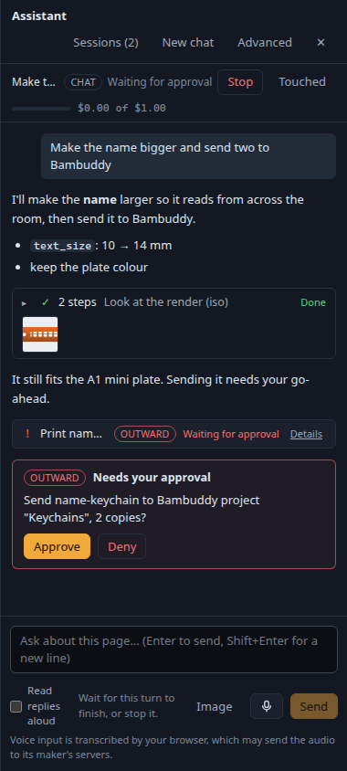
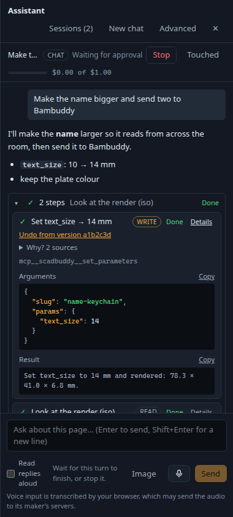

# Friendly tool calls and inline images in the assistant panel (#782)

Status: written on 2026-10-08 for #782, which the owner approved for building. It
overlaps #886 (pretty-printed JSON in the chat) where a call's arguments and result are
shown; §3.4 covers what this ships of it. Part of epic #249.

## 1. What this changes

The assistant panel shows each tool call as a raw card: the `mcp__…` name, a risk
badge, `running…`/`done`/`failed`, the result's first 500 characters, and in Advanced
mode the arguments as JSON. An image a tool returns (a render preview, a print photo)
shows as text: `[image] [Image: source: /tmp/claude-resume-…/tool-results/mcp-scadbuddy-blob-….png]`.

After this:

- each call reads as one line: what it did ("Render cable-clip", "Save preset → Bubbly
  keyring") and how it went (running, done, failed, waiting for approval);
- calls in a row form one group that can be opened and closed;
- arguments and the raw result are behind a Details toggle on each call;
- images a tool returns show as images, in the call and in the group's header.

## 2. Facts this rests on

Measured on 2026-10-08 with the pinned SDK (0.3.289) and its bundled Claude Code
binary, against `test/support/fakeAnthropic.ts`, with an in-process MCP tool returning
images (the probe was a scratch test, not committed):

1. **The bytes are in the stream.** A tool result with MCP `image` content reaches the
   SDK's `user` message as a `tool_result` whose content holds an `image` block,
   `{type: 'image', source: {type: 'base64', media_type, data}}`, with the full base64,
   followed by a text block `[Image: source: <path>]`. An embedded `resource` with an
   image `mimeType` arrives the same way, after a text block `[Resource from <server> at <uri>]`.
2. **The placeholder is a side copy, written for every image.** Claude Code writes each
   MCP image to `<CLAUDE_CONFIG_DIR>/projects/<project>/<session>/tool-results/mcp-<server>-blob-<ms>-<random>.<ext>`
   (the CLI's own pattern, `…/tool-results/mcp-([^/]*)-blob-\d+-[0-9a-z]+`), so the
   model can name the file later. It happens for a 64×64 image as much as a big one: it is
   not the large-output spill. On a resumed turn `CLAUDE_CONFIG_DIR` is the SDK's
   materialisation of the session from our `SessionStore`, `<tmpdir>/claude-resume-<uuid>`
   (`sdk.mjs`), which the SDK removes when the query ends. The path is in a directory
   that is gone by the time anyone reads it, inside a container no browser reaches.
3. **Claude Code may re-encode a large image.** A 1500×1500 PNG of noise came back as a
   JPEG of 631 576 base64 characters. A block's `media_type` is what it says, not what the
   tool sent.
4. Claude Code's large-output spill (a long *text* result written to `tool-results/` and
   replaced by a preview) is a different path. It does not touch images, and the panel
   already caps a result's text at `SUMMARY_MAX` (500).
5. The page policy (`api/static.py` `PAGE_CSP`, `frontend/page-csp.txt`) has
   `img-src 'self' data: blob:`. The agent's `/api/v1/ai/*` is on ScadBuddy's own origin
   (the ingress routes it to the sidecar), so an `` from an agent route is `'self'`.
6. An `` request carries no `Origin` and sends `Sec-Fetch-Site: same-origin`, which
   `routes/guard.ts` `uiReadProblem` accepts as it does the other session reads.

So the image never needs to be read from a file: `sdkEvents.ts` takes it from the
`image` block, and the `[Image: source: …]` and `[Resource from …]` lines are dropped
from what the panel shows (the model still gets them).

## 3. Design

### 3.1 Images: stored per session, served by a session route

**Choice: a session-scoped route, `GET /api/v1/ai/sessions/:id/blobs/:name`, over a
Postgres table. No base64 in the event.**

The panel's events go into `ai_session_events`. Every attach replays that log from the
start, to every watcher, over the socket and the SSE route, and a fork copies it. One
render preview Claude Code re-encoded is ~630 kB of base64 (§2.3), and a session that
renders ten times would replay megabytes on every attach and every reconnect.
Inlining only small images would leave two paths to build and test, and would still
grow the log. A route keeps the event to a few dozen bytes per image. The browser
fetches it lazily, can cache it for good (the name is the content hash), and every
replica serves it, because the bytes are in Postgres like the rest of the session.

- **Table** `ai_session_blobs (session_id → ai_sessions ON DELETE CASCADE, name,
  media_type, data bytea, created_at, PRIMARY KEY (session_id, name))`, a new migration.
  A session's images go when it is deleted. A fork copies its parent's rows along with
  the events that name them (`manager.ts` `fork`).
- **Name** `<sha256 of the bytes, hex>.<png|jpg|gif|webp>`, so the same image twice in a
  session is one row (`ON CONFLICT DO NOTHING`).
- **What is kept.** Only the four types the Messages API takes, only when the bytes
  start with their type's signature (`images.ts` `sniff`, as for images the user sends,
  #1866), at most `IMAGE_DATA_MAX` (5 MB of base64) each and `RESULT_IMAGES_MAX` (8) per
  result. Anything else stays the `[image]` placeholder in the summary. No SVG can get
  in, so the route never serves script.
- **Event.** `tool.result` gains `images?: {name, mediaType}[]`. The mapper hands the
  bytes to the manager (`SdkEventMapper.takeImages()`), which writes the rows *before* it
  logs the event, so a watcher never sees a name it cannot load. A write that fails drops
  the `images` from the event, never the event.
- **Route** (`routes/sessions.ts`), a `read` like the other session reads: the same guard
  (`uiReadProblem`: the HTTPS ingress, the UI's origin, `src/http/origins.ts`), then
  `sessions.get(id, BROWSER_USER)` for visibility (404 when the session is not there),
  then the row by `(session_id, name)`. **No path is built from the request.** A name
  that is not `^[0-9a-f]{64}\.(png|jpg|gif|webp)$` is a 404 before the database is
  asked, and a name from another session is not found under this one. Headers:
  `Content-Type` from the row, `X-Content-Type-Options: nosniff`,
  `Content-Security-Policy: default-src 'none'; sandbox`,
  `Cross-Origin-Resource-Policy: same-origin`,
  `Cache-Control: private, max-age=31536000, immutable`.
- **Coverage.** The route is the agent's own, not a backend operation, so it is not in
  `backend/openapi.json` and needs no `tools/coverage.ts` entry. No tool reads it: a
  tool caller already got the image in the tool result. The MCP transcript
  (`tools/sessions.ts` `condense`) shows a result's images as a count, as it does for
  a user turn's.
- **CSP.** No change (§2.5).

### 3.2 Friendly titles, declared by the tool

`ToolSpec` gains `title?: (args) => string`. The registry computes a call's title, and
`tool.call` gains `title?: string`, so the panel never keeps its own list of tool names
and a new tool gets a title the day it lands:

- A tool that declares `title` gets that, e.g. `render_model` → `Render cable-clip`,
  `save_preset` → `Save preset → Bubbly keyring`.
- A registry tool that declares none gets its name humanised, plus its `slug` argument
  when it has one: `get_readme {slug: 'cable-clip'}` → `Get readme → cable-clip`.
- Titles are worded as the action ("Render …"), since the status beside them says
  whether it is running or done.
- The title is computed by the mapper through a `TitleResolver` (`tools/harness.ts`
  `titleOf`, wired like `tierOf`). It is capped at 120 characters and goes through
  `scrubForLog` like every string. A title function that throws gives no title; it
  never breaks the stream.
- Anything not in the registry (plugin tools, Claude Code's `Agent`, `Skill`,
  `AskUserQuestion`, the headless browser's tools) has no `title`. The panel humanises
  it (`toolTitle` in `chat/labels.ts`): `mcp__hindsight__recall` → `Recall (hindsight)`,
  `Agent` → `Subagent: <description>`, `Skill` → `Skill: <skill>`.

### 3.3 Grouping and status

- **A group is a run of consecutive `tool` items** in the feed. Any other item ends it:
  text, a user turn, a memory line, an error, and the approval and question cards. Those
  cards stay exactly as they are, outside any group, where they are today. (Another
  change, scadbuddy-c5, is reworking them; this one does not touch them.)
- A run of one call shows the call alone. Two or more get a header: a button with
  `aria-expanded`/`aria-controls`, reading "N steps", the group's status, and its last
  call's title. The header also shows the group's image thumbnails, so an image is
  visible with the group closed.
- **Open or closed.** Open while any of its calls is live (running, or waiting on an
  approval or an answer), closed once all have ended. The user's own toggle wins after
  that. Advanced mode opens every group.
- **Status of a call** is from the feed: `failed` when its result is not ok; `done` when
  ok; else `waiting for approval` when an approval names it (`approval.tool`) and is
  pending or sent; `waiting for you` when a question names it; `not run` when its
  approval was denied, expired or cancelled and no result came; else `running`. It is
  shown as words and an icon (`aria-hidden`). A group's status is its first live call's,
  then "failed" if any failed, else "done". A subagent's calls (`parent`) are indented
  under its `Agent` call when that call is in the same group.
- **Each call:** status icon, title, risk badge, and a Details button
  (`aria-expanded`). A failed call's message shows without opening it, and so do the
  version link ("Undo from version …") and the sources. Details holds the tool's name,
  its arguments and its raw result. Advanced mode opens Details.
- **Keyboard.** Every toggle is a real `<button>`. Images have alt text (the call's
  title), and each opens the full image in a new tab (a link to the same route).

### 3.4 JSON (#886's part)

Arguments, and a raw result that parses as JSON, are pretty-printed with 2-space
indentation and highlighted by token (keys, strings, numbers, booleans, null). Long
strings wrap. Each has a Copy button. Text that does not parse, such as a result cut at
500 characters, is shown as it is. Collapsing large objects, and `json` blocks in
messages, stay with #886.

## 4. Tests

- Agent (`vitest`): the mapper carries image blocks as `images` and drops the
  placeholder lines; it refuses an unknown type, mismatched bytes, an oversized image,
  and more than the per-result cap; the title resolver (declared, default, unknown,
  throwing). The blob store, the route and `condense` run against Postgres
  (`test/sessionBlobs.pg.test.ts`): the bytes and headers served, a 403 from a foreign
  origin, a 404 for an unknown or other session, a 404 for traversal-shaped and
  malformed names, a fork carrying its images, cascade on delete. The frontend schema
  parses the new fields (`sessions.protocol.test.ts`).
- Frontend (`vitest`): grouping (runs, the cards that end them, nesting), status (each
  state), titles (declared, fallback humanising), the toggles and their ARIA, the JSON
  view, images. The msw mock (`src/mocks/features/assistantBlobs.ts`) serves a PNG for
  the scripted session's render preview.
- e2e (`e2e/assistant.spec.ts`, mocked agent): the scripted turn shows a group of two
  calls with the preview image, opens Details, and still reaches the approval card.

## 5. Screens

The mocked panel (`src/mocks/agent.ts`'s first turn), captured headlessly with Playwright:
a group of two calls closed, with the render view's image in its header, then the
outward call waiting for its approval card; and the group open, with one call's Details.

