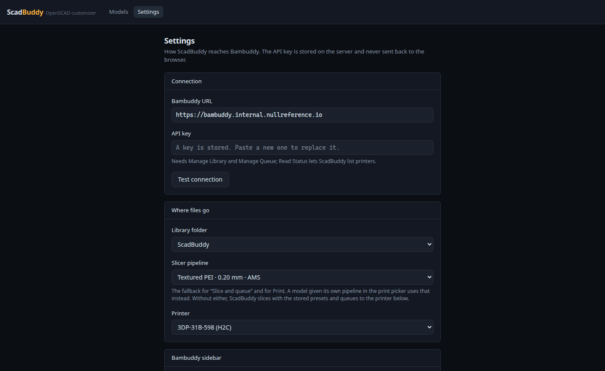
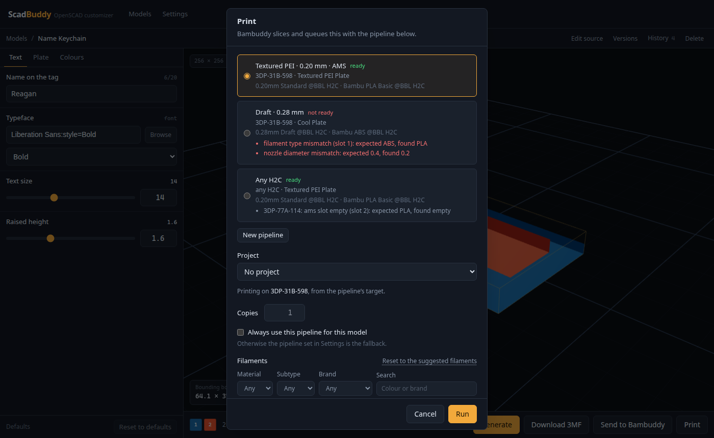
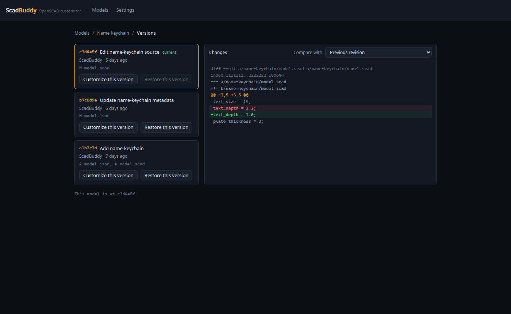

# ScadBuddy user guide

Covers writing models for ScadBuddy, the multi-colour rules, connecting it to
Bambuddy, and the day-to-day features. For installing it, see the
[README](../README.md).

- [Writing a model](#writing-a-model)
- [Multi-colour output](#multi-colour-output)
- [Connecting Bambuddy](#connecting-bambuddy)
- [Using ScadBuddy](#using-scadbuddy)

## Writing a model

ScadBuddy reads a `.scad` file the same way the
[MakerWorld Parametric Model Maker](https://makerworld.com/makerlab/parametricModelMaker)
does. A model written for MakerWorld works here without changes. The parameters
come from OpenSCAD's own customizer export (`openscad -o model.param`), so the
standard [OpenSCAD customizer](https://en.wikibooks.org/wiki/OpenSCAD_User_Manual/Customizer)
syntax applies. ScadBuddy adds the two MakerWorld annotations on top.

```scad
/* [Text] */                       // a group: one tab in the parameter panel

// Word to put on the keychain     // the comment line above a variable is its caption
name = "Reagan"; // 20             // string limited to 20 characters

// Typeface
font = "Lobster Two:style=Bold"; // font

/* [Size] */

// Letter height in mm
text_size = 20; // [8:0.5:40]      // min:step:max -> slider

style = "round"; // [round, square] // options -> dropdown

hole = true;                       // boolean -> toggle

/* [Colours] */

// Base colour (extruder 1)
base_color = "#0047BB"; // color

// Letter colour (extruder 2)
text_color = "#FF1493"; // color

/* [Hidden] */                     // never shown

$fn = 64;
```

| You write | Widget |
|---|---|
| `x = 5; // [1:0.5:10]` (min and max) | slider plus number field, with that min/max/step |
| `x = 5;` | number field (whole-number field when the value is whole) |
| `x = "a"; // [a, b, c]` or `// [1:One, 2:Two]` | dropdown; the label is shown and the value is passed to OpenSCAD |
| `x = "text"; // 20` | text field with a maximum length |
| `x = true;` | toggle |
| `x = "#RRGGBB"; // color` | colour picker; the value reaches OpenSCAD as a `"#RRGGBB"` string |
| `x = "Family:style=Bold"; // font` | font field with the installed families, plus **Browse** for Google Fonts |

Groups:

- `/* [Name] */` starts a group. Each group is a tab, in the order the groups first
  appear.
- Parameters under `/* [Hidden] */` are left out.
- Parameters under `/* [Global] */` get no tab of their own.

The `// color` and `// font` annotations have to be on the same line as the
assignment, after the `;`. OpenSCAD itself sees both as plain strings.

### Fonts

`text()` can only use a font that the container's fontconfig can see. The image
ships DejaVu, Noto and Lobster Two. The **Browse** button on a font parameter
searches the Google Fonts catalogue. Picking a family that isn't installed
downloads it onto the data volume, along with its licence, and it can be used in
renders straight away. No API key is needed. `SCADBUDDY_GOOGLE_FONTS_API_KEY` only
changes where the catalogue list comes from. If ScadBuddy can't reach Google Fonts,
the picker falls back to the installed families.

The Debian package `fonts-lobster` provides a family called **"Lobster Two"**, and
there is no family called "Lobster". If you ask for a family that doesn't exist,
OpenSCAD silently uses a different font, and the text comes out a different size.

### Includes

A model can `include`/`use`/`import` files from its own directory. Upload and paste
both create single-file models. Multi-file models (a model with helper files) aren't
supported yet.

## Multi-colour output

ScadBuddy outputs a Bambu-style 3MF with **one object per colour**. Each object is
assigned to an extruder, so the slicer maps colours to filaments without any
painting.

- **Each distinct `color()` value becomes one part and one filament slot.** Two
  colour parameters set to the same value produce one part, not two.
- **Extruder order.** Extruder numbers follow the order of the materials in
  OpenSCAD's 3MF export. ScadBuddy numbers them 1, 2, 3… in that order and doesn't
  reorder them. The convention is that **colour parameters are the extruder order**:
  declare them in the order you want the extruders, and use them in that order. The
  bundled name keychain does this (`base_color` is extruder 1, `text_color` is
  extruder 2). Before you send, check the numbered colour swatches in the bottom
  bar. They show which colour went to which extruder.
- **Colour everything.** When any geometry is outside a `color()` call, ScadBuddy
  can't build closed per-colour solids. The job then falls back to open parts for
  every colour and warns `uncoloured geometry present; parts are not closed`.
- Colours can be hex strings, `[r, g, b]` vectors or CSS names (`color("red")`).
- One known limitation: a `color()` nested inside a different `color()` falls back
  to open parts for that colour. The geometry is still correct.

Each output also stores the parameters that made it, so any output can be
re-opened and rendered again.

## Connecting Bambuddy

Everything ScadBuddy sends to Bambuddy goes through Bambuddy's API. The key is
stored on ScadBuddy's server and is never sent to the browser.

1. In Bambuddy, create an API key with these scopes:

   | Scope | Used for |
   |---|---|
   | **Manage Library** | uploading 3MFs, library folders, slicing, presets, and the sidebar External Link |
   | **Manage Queue** | queueing prints and running slicer pipelines |
   | **Read Status** | listing printers, spools and AMS slots for the print picker and **Test connection** |
   | **Manage Projects** | only if you use the project picker |

   Which scope Bambuddy checks for `/slicer-pipelines/` hasn't been confirmed:
   ScadBuddy assumes Manage Queue. If a call is refused, ScadBuddy's error names the
   scope that call asked for.

2. Open **Settings** in ScadBuddy. Enter the Bambuddy URL and the key, then press
   **Test connection**.
3. Under **Where files go**, choose the library folder, the fallback slicer pipeline
   and the printer.
4. Under **Bambuddy sidebar**, enter ScadBuddy's own URL (the address Bambuddy
   should link to; ScadBuddy can't work it out from behind a proxy). Then press
   **Add to Bambuddy sidebar**. This creates an External Link called "ScadBuddy"
   with "open in new tab" turned off, so ScadBuddy opens inside Bambuddy in a
   sandboxed frame. Pressing it again updates the existing entry instead of adding
   a second one.
5. Press **Save changes**.

The same values can be set on first start with `SCADBUDDY_BAMBUDDY_URL`,
`SCADBUDDY_BAMBUDDY_API_KEY` and `SCADBUDDY_PUBLIC_URL`. Once settings have been
saved from the UI, the saved values take precedence.



## Using ScadBuddy

### Catalogue

The **Models** page lists every model. Use **Add model** to upload a `.scad` file,
or **Paste source** to paste source into an editor. OpenSCAD parse-checks the
source before it's saved, and errors are marked on their line.

### Customizing

Changing a parameter starts a real render. The preview *is* the render (debounced),
so it shows exactly what the 3MF will contain, with the bounding box in mm. Then:

- **Generate** saves the current render as an output, with its parameters and a
  thumbnail.
- **Download 3MF** downloads that output.
- **Send to Bambuddy** uploads the output to the library, or slices and queues it.
  If ScadBuddy's own URL is set, the library file gets an "Edit in ScadBuddy" link
  that opens these parameters again.
- **Print** opens the print picker.

### Print picker



The print picker runs one of Bambuddy's slicer pipelines for the output:

- Opening the picker uploads the 3MF once. Bambuddy then checks the upload against
  every pipeline. Pipelines that aren't ready show Bambuddy's own reasons, per slot,
  and **Print anyway** overrides the check.
- **New pipeline** creates one from printer, process and filament presets.
- **Always use this pipeline for this model** remembers the choice for this model.
  Otherwise the pipeline set in Settings is used.
- Set the number of copies, a Bambuddy project, and the filament for each colour
  from your spool inventory. Print options can be remembered for every print, for a
  printer, or for this model.
- If you pick filaments or queue-level options, Bambuddy slices with the pipeline's
  presets and queues the result directly (the dialog tells you before you run).
  Otherwise the pipeline runs as is. The panel then follows the run.

### History and versions

- **History** lists every output generated for a model, with the parameters that
  differ from the defaults and any Bambuddy library and queue ids. Each output has
  **Edit** (reopen it in the customizer), **Send again** and **Delete**.
- **Versions** shows the model's revision history. Every upload, source edit,
  metadata change, restore and delete is a commit in a git repository on the data
  volume. You can diff two revisions, **Customize this version** (render an old
  revision without restoring it), or **Restore this version** (restoring adds a new
  commit and never rewrites history).
- **Edit source** opens the model's source in the editor. Saving it creates a new
  revision.



### Deleting a model

**Delete** (top right of the customizer) removes the model and its outputs, after
you confirm. It is refused while one of its renders is still running. The source
stays in the git history. A bundled example model is added back on the next
restart.
