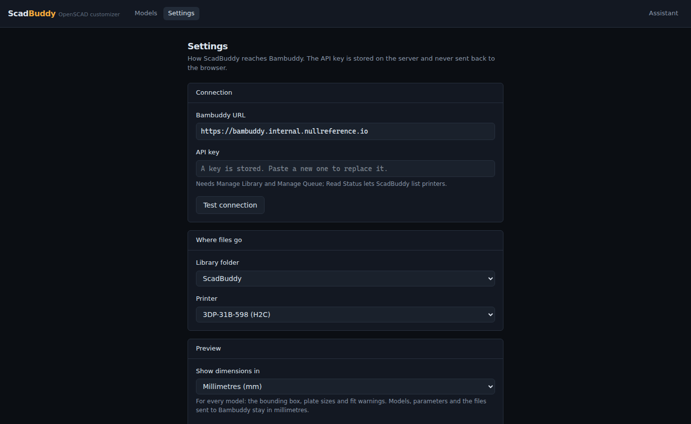
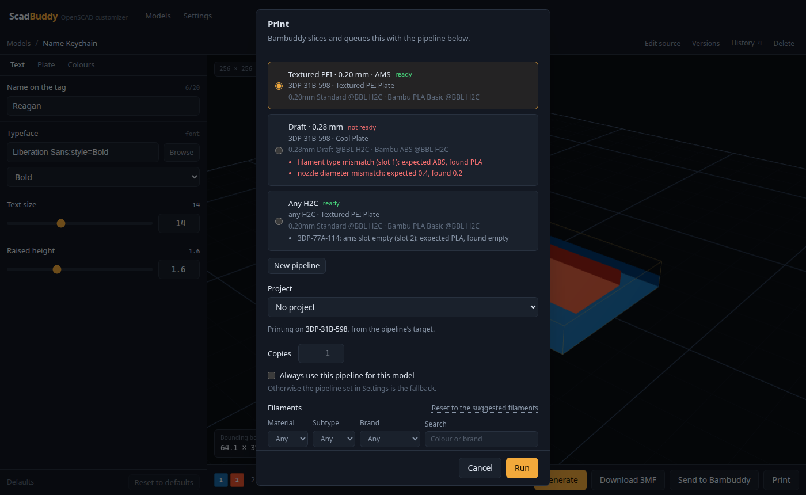
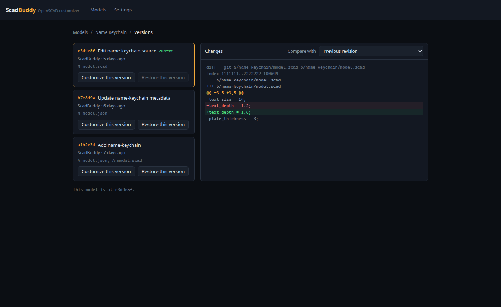

# ScadBuddy user guide

Covers writing models for ScadBuddy, the multi-colour rules, connecting it to
Bambuddy, and the day-to-day features. For installing it, see the
[README](../README.md).

- [Writing a model](#writing-a-model)
- [Multi-colour output](#multi-colour-output)
- [Connecting Bambuddy](#connecting-bambuddy)
- [Using ScadBuddy](#using-scadbuddy)

## Writing a model

ScadBuddy reads a `.scad` file the same way the
[MakerWorld Parametric Model Maker](https://makerworld.com/makerlab/parametricModelMaker)
does. A model written for MakerWorld works here without changes. The parameters
come from OpenSCAD's own customizer export (`openscad -o model.param`), so the
standard [OpenSCAD customizer](https://en.wikibooks.org/wiki/OpenSCAD_User_Manual/Customizer)
syntax applies. ScadBuddy adds the two MakerWorld annotations on top.

```scad
/* [Text] */                       // a group: one tab in the parameter panel

// Word to put on the keychain     // the comment line above a variable is its caption
name = "Reagan"; // 20             // string limited to 20 characters

// Typeface
font = "Lobster Two:style=Bold"; // font

/* [Size] */

// Letter height in mm
text_size = 20; // [8:0.5:40]      // min:step:max -> slider

style = "round"; // [round, square] // options -> dropdown

hole = true;                       // boolean -> toggle

/* [Colours] */

// Base colour (extruder 1)
base_color = "#0047BB"; // color

// Letter colour (extruder 2)
text_color = "#FF1493"; // color

/* [Hidden] */                     // never shown

$fn = 64;
```

| You write | Widget |
|---|---|
| `x = 5; // [1:0.5:10]` (min and max) | slider plus number field, with that min/max/step |
| `x = 5;` | number field (whole-number field when the value is whole) |
| `x = "a"; // [a, b, c]` or `// [1:One, 2:Two]` | dropdown; the label is shown and the value is passed to OpenSCAD |
| `x = "text"; // 20` | text field with a maximum length |
| `x = true;` | toggle |
| `x = "#RRGGBB"; // color` | colour picker; the value reaches OpenSCAD as a `"#RRGGBB"` string |
| `x = "Family:style=Bold"; // font` | font field with the installed families, plus **Browse** for Google Fonts |
| `x = ""; // file:svg,png` | drop zone for an SVG or PNG, with a preview and **Clear** (see [File parameters](#file-parameters)) |

Groups:

- `/* [Name] */` starts a group. Each group is a tab, in the order the groups first
  appear.
- Parameters under `/* [Hidden] */` are left out.
- Parameters under `/* [Global] */` get no tab of their own.

The `// color` and `// font` annotations have to be on the same line as the
assignment, after the `;`. OpenSCAD itself sees both as plain strings.

### Fonts

`text()` can only use a font that the container's fontconfig can see. The image
ships DejaVu, Noto and Lobster Two. The **Browse** button on a font parameter
searches the Google Fonts catalogue. Picking a family that isn't installed
downloads it onto the data volume, along with its licence, and it can be used in
renders straight away. No API key is needed. `SCADBUDDY_GOOGLE_FONTS_API_KEY` only
changes where the catalogue list comes from. If ScadBuddy can't reach Google Fonts,
the picker falls back to the installed families.

The Debian package `fonts-lobster` provides a family called **"Lobster Two"**, and
there is no family called "Lobster". If you ask for a family that doesn't exist,
OpenSCAD silently uses a different font, and the text comes out a different size.

### File parameters

A parameter annotated `// file` takes a picture the viewer attaches in the
customizer, without editing the model:

```scad
// Picture to overlay
overlay_file = ""; // file:svg,png

if (overlay_file != "")
  linear_extrude(0.6) resize([30, 30]) import(overlay_file);
```

- List the kinds after the colon: `// file:svg`, `// file:png` or both. A bare
  `// file` takes both. Use an SVG with `import()` and a PNG with `surface()`.
- The value is a bare file name in the model's directory, so `import()` and
  `surface()` resolve it as they would a file shipped beside the model. A default
  such as `"sample.svg"` keeps working; `""` means no file.
- Ship sample pictures next to `model.scad` and the customizer offers them as
  thumbnails under the drop zone, so a viewer can pick one instead of uploading
  their own. Every `.svg` or `.png` directly in the model's folder is offered to
  the parameters that take its kind, except `thumbnail.png`, hidden files
  (a leading `.`), and names with spaces or characters other than letters,
  digits, `_`, `-` and `.`.
- ScadBuddy checks the upload's content, not its name. It strips scripts and
  external references from an SVG, and scales a PNG down to 256 px on its long
  side, because `surface()` gets slow with large images. Other files are refused.
- The render records the file's SHA-256 with the output's parameters, so
  re-rendering an output uses the same picture.
- An uploaded file is kept while a saved output, a preset or a render uses it. One
  that nothing uses is removed after a week (the server's
  `SCADBUDDY_ASSET_SWEEP_GRACE`). The server also caps how many uploaded files it
  keeps and their total size; **Settings → Uploaded files** shows both.
- If OpenSCAD can't open the file, the model still renders without it, and the
  render shows a warning.
- OpenSCAD itself sees an ordinary string, so the model still works in the OpenSCAD
  GUI and on MakerWorld.

### Includes

A model can `include`/`use`/`import` files from its own directory. Upload and paste
both create single-file models. Multi-file models (a model with helper files) aren't
supported yet.

## Multi-colour output

ScadBuddy outputs a Bambu-style 3MF with **one object per colour**. Each object is
assigned to an extruder, so the slicer maps colours to filaments without any
painting.

- **Each distinct `color()` value becomes one part and one filament slot.** Two
  colour parameters set to the same value produce one part, not two.
- **Extruder order.** **Colour parameters are the extruder order**: the first
  colour parameter you declare is extruder 1, the next is extruder 2, and so on,
  whatever order the geometry draws them in. In the bundled name keychain
  `base_color` is extruder 1 and `text_color` is extruder 2. A part gets the
  extruder of the first colour parameter whose value is its colour, so:
  - two colour parameters with the same value share one extruder, and the numbers
    after them close up;
  - a colour parameter that no geometry uses gets no extruder, and the ones after
    it move up;
  - colours that aren't a parameter's value (a hard-coded `color("red")`, a colour
    computed from a parameter) come after all the parameters, in the order the
    model first draws them.

  Before you send, check the numbered colour swatches in the bottom bar. They show
  which colour went to which extruder.
- **Colour everything.** When any geometry is outside a `color()` call, ScadBuddy
  can't build closed per-colour solids. The job then falls back to open parts for
  every colour and warns `uncoloured geometry present; parts are not closed`.
- Colours can be hex strings, `[r, g, b]` vectors or CSS names (`color("red")`).
- One known limitation: a `color()` nested inside a different `color()` falls back
  to open parts for that colour. The geometry is still correct.

Each output also stores the parameters that made it, so any output can be
re-opened and rendered again.

## Connecting Bambuddy

Everything ScadBuddy sends to Bambuddy goes through Bambuddy's API. The key is
stored on ScadBuddy's server and is never sent to the browser.

1. In Bambuddy, create an API key with these scopes:

   | Scope | Used for |
   |---|---|
   | **Manage Library** | uploading 3MFs, library folders, slicing, presets, and the sidebar External Link |
   | **Manage Queue** | queueing prints and running slicer pipelines |
   | **Read Status** | listing printers, spools and AMS slots for the print picker and **Test connection** |
   | **Manage Projects** | only if you use the project picker |

   Which scope Bambuddy checks for `/slicer-pipelines/` hasn't been confirmed:
   ScadBuddy assumes Manage Queue. If a call is refused, ScadBuddy's error names the
   scope that call asked for.

2. Open **Settings** in ScadBuddy. Enter the Bambuddy URL and the key, then press
   **Test connection**.
3. Under **Where files go**, choose the library folder, the slicer pipeline the send
   bar runs and the printer. That one pipeline is used for every model; a per-model
   pipeline saved by an older ScadBuddy is no longer used.
4. Under **Bambuddy sidebar**, enter ScadBuddy's own URL (the address Bambuddy
   should link to; ScadBuddy can't work it out from behind a proxy). Then press
   **Add to Bambuddy sidebar**. This creates an External Link called "ScadBuddy"
   with "open in new tab" turned off, so ScadBuddy opens inside Bambuddy in a
   sandboxed frame. Pressing it again updates the existing entry instead of adding
   a second one.
5. Press **Save changes**.

The same values can be set on first start with `SCADBUDDY_BAMBUDDY_URL`,
`SCADBUDDY_BAMBUDDY_API_KEY` and `SCADBUDDY_PUBLIC_URL`. Once settings have been
saved from the UI, the saved values take precedence.



## Using ScadBuddy

### Catalogue

The **Models** page lists every model. Use **Add model** to upload a `.scad` file,
or **Paste source** to paste source into an editor. OpenSCAD parse-checks the
source before it's saved, and errors are marked on their line.

**Add model** also takes an optional PNG thumbnail and a README. Dropping a whole
model folder (`model.scad`, `model.json`, `thumbnail.png`, `README.md`, the layout
of `models/<slug>/`) adds it with the same name, metadata, thumbnail and README the
bundled models get.

On a model's page, **Edit details** changes its name, description, tags, thumbnail
and README. Each change is a revision in the model's history. A model with no
thumbnail of its own shows the plate image of its first generated output.

### Customizing

Changing a parameter starts a real render. The preview *is* the render (debounced),
so it shows exactly what the 3MF will contain, with the bounding box in mm. Then:

- **Generate** saves the current render as an output, with its parameters and a
  thumbnail.
- **Download 3MF** downloads that output.
- **Send to Bambuddy** uploads the output to the library, or slices and queues it.
  If ScadBuddy's own URL is set, the library file gets an "Edit in ScadBuddy" link
  that opens these parameters again.
- **Print** opens the print picker.

The button at the top right of the preview shows it full screen, with the plate and
bounding box still on it; **Esc** or the button again puts it back. In full screen,
**Parameters** opens the parameters in a flyout over the view, so you can change them
and watch the render; the buttons along the bottom wait until you leave full screen.
Where the browser refuses full screen, as it does inside a frame that isn't allowed
it, the view fills the frame instead.

### Print picker



The print picker is spool-first: you choose the spools, the nozzle size, a quality
tier and a plate, and ScadBuddy derives every Bambu printer, process and filament
preset itself, then slices and queues through Bambuddy. There is no slicer pipeline to
pick or maintain here — pipelines still exist in Bambuddy, and the one-click send bar
and Settings' default pipeline still use one, until #312.

Top to bottom, the dialog is:

- **Advanced switch.** Off (Simple) by default. Advanced adds the full process list, a
  High Flow choice per side, and a filament preset override per slot. Switching back to
  Simple resets those to Standard flow, the tier's process and each spool's own preset,
  so nothing chosen in Advanced is sent unseen.
- **Printer** — shown only when more than one printer is active (today there is one).
  Otherwise ScadBuddy has already picked one: this model's remembered printer, else the
  printer set in Settings, else the first active printer — skipping a remembered or
  Settings printer that is no longer active. Presets are only resolved for the H2C, so
  printing on any other model is refused before anything is sliced.
- **Filament** — the same spool-inventory picker the send bar uses. Loaded spools are
  marked with printer and AMS slot and listed first; an unloaded spool is still allowed,
  with a warning to load it first. Advanced adds a preset dropdown per slot, listing the
  presets Bambuddy has for the chosen nozzle size — "The spool's own preset" is always
  the first option. On the H2C each AMS feeds one extruder, so every spool loaded in the
  chosen printer carries an **L** or **R** badge for its side, and the print is sliced
  with each color on its spool's side. A spool on a side whose fitted nozzle is not the
  chosen size is grayed out with the reason (for example "L · 0.4 fitted"), and printing
  one anyway is refused before upload. A spool that isn't loaded in the chosen printer
  has no side, so the slicer picks the extruders and the dialog says so.
- **Nozzle size** — one choice for both sides; Bambuddy can't slice mixed sizes, so
  there is no per-side size control. Sizes installed in the rack are marked
  "(installed)"; picking one that isn't warns you to install it first. Advanced adds
  Standard or High Flow per side. Bambuddy has no High Flow presets yet, so a High Flow
  choice slices as Standard and the dialog says so: "Bambuddy slices this as Standard
  flow; High Flow presets aren't supported by Bambuddy yet."
- **Quality** — Fine / Standard / Draft in Simple mode. Advanced replaces that with the
  full list of Bambu processes for the chosen nozzle size.
- **Plate** — every plate type the H2C supports, preselected from the printer's last
  print, else the plate last remembered for this printer, else Textured PEI Plate.
  Choosing anything other than the last print's plate shows a reminder: "The
  *printer*'s last print used *plate*. Swap to *plate* before this starts." For an
  output with more than one plate, a separate choice of which plate (or all of them)
  to print also appears here. Choosing all plates lists every plate's colors under
  Filament, so a color only a later plate uses gets a spool too.
- **Print options** — Bambuddy's own queue-item options (manual start, waiting for
  filament, and the rest), remembered per print, per printer or per model as before.
- **Project** — file the print under a Bambuddy project.
- **Copies** — leave the field blank to use the remembered quantity, shown beside it.
- **Print** — slices, then queues through Bambuddy; the panel then follows the run to
  completion.

**Errors that keep the dialog open.** A combination ScadBuddy cannot turn into presets —
a filament slot with no resolvable preset, mixed nozzle sizes, or a spool on the side
whose nozzle doesn't match — comes back as an
error shown above Print and disables the button until something changes. Any other
failure (Bambuddy unreachable, a timeout) shows the same way but leaves Print enabled to
retry as it stands.

**What's remembered.** The chosen printer, the spools (only the slots moved off the
suggestion), the nozzle choice, the quality tier and process name are remembered per
model, the same way print options and copies already are. The plate type is remembered
per **printer**, not per model. Reopening the dialog restores all of it, and opens
straight into Advanced mode if the remembered choice is a named process or a High Flow
flow — either would otherwise apply unseen from Simple mode.

### History and versions

- **History** lists every output generated for a model, with the parameters that
  differ from the defaults and any Bambuddy library and queue ids. Each output has
  **Edit** (reopen it in the customizer), **Send again** and **Delete**.
- **Versions** shows the model's revision history. Every upload, source edit,
  metadata change, restore and delete is a commit in a git repository on the data
  volume. You can diff two revisions, **Customize this version** (render an old
  revision without restoring it), or **Restore this version** (restoring adds a new
  commit and never rewrites history).
- **Edit source** opens the model's source in the editor. Saving it creates a new
  revision.



### Deleting a model

**Delete** (top right of the customizer) removes the model and its outputs, after
you confirm. It is refused while one of its renders is still running. The source
stays in the git history. A built-in template (a bundled example, such as the
name keychain) cannot be deleted or edited; it is refreshed from the image on every
restart.
