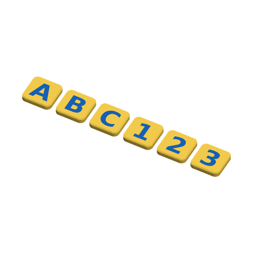

# Alphabet Tiles



Chunky letter and number tiles, one tile per character of the text, laid out
in rows on the plate. Use them for learning letters and numbers, spelling
names on the fridge, or matching games. The letter is a flush inlay in its own
colour, or raised so it can be felt with a finger. There is an optional inlaid
border ring in a third colour. The tiles can take 6 × 2 mm or 8 × 3 mm disc
magnets, either glued into a pocket in the back or pushed into a sealed
cavity through a slot in the top edge. Neither needs a pause mid-print.

Inspired by "Magnetic Letters - Refrigerator Alphabet Magnets" by Kyle
Falconer (465 downloads on Printables) and Grandpa 3DPrints' customizable
word-game wall tiles (1,039), looked up on 2026-09-27. Letter tiles are a
small niche on Printables, so both counts are modest. Written to the
Parametric Model Maker customizer conventions, so the same file works
unchanged on MakerWorld and in ScadBuddy.

## Parameters

### Text

| Parameter | Default | What it does |
|---|---|---|
| `text` | `ABC123` | Up to 24 characters, one tile each, in reading order: left to right, then the next row down. Spaces are skipped. With no characters at all you get one blank tile. |
| `font` | `DejaVu Sans:style=Bold` | Typeface. ScadBuddy fills this dropdown from the fonts installed in the container. |
| `letter_scale` | `75` | Letter height as a percentage of the room inside the tile, 40–95. Wide letters (W, M) and ones with descenders (g, Q, J) shrink so they still fit. On round tiles the whole glyph fits inside a circle. |
| `underline_6_9` | `true` | Puts a bar under 6 and 9, so a tile turned upside down can't be misread. |

### Tile

| Parameter | Default | What it does |
|---|---|---|
| `shape` | `rounded_square` | `rounded_square`, `circle`, `hexagon` (points left and right), `scalloped` (ten round bumps) or `heart`. Every shape is `tile_size` wide. |
| `tile_size` | `30` | Tile width in mm, 20–50. |
| `thickness` | `5` | Tile thickness in mm, 3–10. It is raised automatically when a magnet, or the edge rounding plus the inlay, needs more room, and the log says so with `NOTE: thickness raised`. |
| `corner_radius` | `5` | Corner radius of the rounded square. Ignored for the other shapes. |
| `edge_round` | `1.2` | Rounding on the top edge, in four steps. 0 gives a sharp edge. |
| `letter_style` | `inlay` | `inlay`: the letter is flush with the top. `raised`: it stands up by `letter_depth`. The border follows the same style. |
| `letter_depth` | `0.6` | Inlay depth, or how far raised letters stand up, 0.4–2 mm. |
| `gap` | `5` | Gap between tiles on the plate. Rows wrap at 300 mm, the H2C's two-nozzle width. If the rows would run past the bed's 320 mm depth, the gap shrinks until they fit, and the log says so with `NOTE: gap reduced`. |

### Border

| Parameter | Default | What it does |
|---|---|---|
| `border` | `false` | Adds a ring that follows the tile's outline, in the border colour. |
| `border_width` | `2` | Ring width in mm. |
| `border_inset` | `1.5` | Distance from the tile's edge to the ring. It is kept at least 0.3 mm inside the edge rounding, so the ring is always on the flat top. |

The border and its inset may take at most 60 % of the room inside the tile, so
every tile keeps room for its letter. On a small tile a wide or far-inset
border is narrowed first (down to 1 mm), then moved out towards the edge. The
log says so with `NOTE: border set to`, giving the width and inset used. A
border inset smaller than the edge rounding is moved in clear of it, and the
log says `NOTE: border moved in`.

### Magnets

| Parameter | Default | What it does |
|---|---|---|
| `magnet` | `none` | `6x2` or `8x3`: diameter × thickness of a disc magnet. |
| `mount` | `glue_in` | `glue_in`: a round pocket open on the back (bed side). Glue the magnet in after printing. `slide_in`: a cavity sealed under 0.6 mm of floor, with a slot out through the tile's top edge. Push the magnet in after printing; it clicks past a detent at the mouth, which is 0.2 mm narrower than the magnet. |
| `magnet_clearance` | `0.2` | Extra room around the magnet, added to the diameter and the depth, 0.1–0.4 mm. |

There is at least 1.2 mm of tile over the magnet under the inlay.

### Colours

| Parameter | Default | What it does |
|---|---|---|
| `tile_color` | `#FFD54F` | The tiles. |
| `letter_color` | `#1565C0` | Letters (and the 6/9 underline). |
| `border_color` | `#E53935` | Border rings. |

## Colours and extruders

**The order of the `color` parameters in the source is the extruder order:**

| Parameter | Part | Extruder |
|---|---|---|
| `tile_color` | tiles | 1 |
| `letter_color` | letters | 2 |
| `border_color` | border rings | 3 |

The border only exists when it is switched on, so the defaults print in two
colours. Equal colours merge into one part and one filament. The inlays are
`letter_depth` deep, so with a flush inlay the colour changes happen only in
the top 0.6 mm.

## Printing

- Face up, flat on the bed, no supports. The glue-in pocket opens on the bed
  and the slide-in cavity has a floor under it. Both are bridged over.
- If a glue-in pocket comes out tight, it is usually first-layer squish at its
  mouth. Raise `magnet_clearance` or use elephant-foot compensation.
- A slide-in magnet goes in north or south up as you choose. Decide before you
  push it in, because it is hard to get out again. For tiles that should all
  stick the same way round, mark one face of every magnet first.

## Safety

- The tiles are small parts and a choking hazard for children under 3.
- **Magnets are dangerous if swallowed.** Two or more swallowed magnets can
  attract each other through the intestine walls and cause serious injury.
  The detent holds a slide-in magnet, and glue holds a glue-in one. For young
  children, put a drop of glue behind a slide-in magnet too, check the tiles
  now and then, and keep magnet tiles away from children who still put things
  in their mouths. Without magnets the tiles have no small loose parts.

## Verifying

```bash
./verify.sh
```

Renders the defaults and fifteen variations in `scadbuddy-verify:local`:

- every shape with a border and the awkward glyphs `WQg69&`;
- both magnet sizes and both mounts;
- raised letters;
- 24 of the biggest heart tiles, which fill five rows;
- 24 of the biggest tiles with a 15 mm gap, where the gap has to shrink to
  12 mm to fit the bed;
- the smallest, thinnest tile with the deepest inlay and the biggest magnet;
- a thin tile with no magnet whose edge rounding and inlay raise the thickness;
- a border inset less than the edge rounding, so the border moves in;
- sharp square tiles with spaces in the text;
- text that is all spaces;
- a serif face;
- the smallest square and heart tiles with the widest, furthest-in border,
  where the border has to narrow.

For each one it checks (besides the list below) that every value the model
changes is logged with a `NOTE:`, with the right reason, and nothing else is.

For each one it checks:

- the tile thickness is what the parameters imply (raised for the magnet when
  needed), and the roof over a magnet is at least 1.2 mm;
- exactly the colour parts the parameters imply, nothing on the `Default`
  material, z from 0 to the top the parameters imply;
- one separate tile per non-space character, in rows of the width and height
  the parameters imply, with the gap expected, on the 300 × 320 bed;
- every tile has its letter, at least half as tall as `letter_scale` asks;
- every letter lies inside its tile's letter room (it was sized to fit, not
  clipped), and that room is at least 40 % of the tile's;
- every border ring is between 1 mm and `border_width` wide, and lies inside the
  tile's edge by at least the inset it reports;
- rendered once per colour the way ScadBuddy builds its closed parts, the
  colour parts do not overlap;
- magnets, through a hidden `probe_magnet` render:
  - a magnet of the nominal size in its seat does not touch the tile;
  - swept out through the slot, a slide-in magnet meets only the detent at
    the mouth;
  - a magnet 0.3 mm smaller meets nothing.

The 3MF and STL parsing runs on the host with `python3` and the standard
library only.

Some things need a physical test print. How firmly the slide-in detent holds a
real magnet. Whether the glue-in pocket's first layer needs more clearance on
a given printer.
