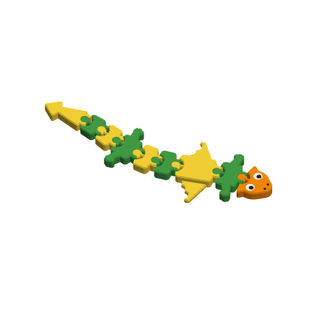

# Articulated Critter



A print-in-place flexi animal. The head, a chain of body segments and the tail
come off the plate already joined by hinges, and the whole thing wiggles. Pick a
snake, dragon, lizard, fish or caterpillar. The eyes, nostrils and an optional
name (one letter per body segment) are flush inlays in the top face, so there
is nothing to glue.

Inspired by the most-downloaded articulated animals on Printables when this was
written (2026-09-27): "Articulated Snake" by TechnicaL (45,859 downloads) and
"ARTICULATED poison DRAGON flexible" by sunset3d (38,874). Written to the
Parametric Model Maker customizer conventions, so the same file works unchanged
on MakerWorld and in ScadBuddy.

## How the hinges work

Each pair of neighbouring segments shares one vertical hinge:

- The rear segment has a C-shaped ring at its front.
- The front segment has a pin at its rear, on a neck that runs out through the
  gap in the C.
- The pin is a barrel. It is 3.2 mm in radius at the bed and at the top, and
  4.6 mm in the middle, with 45° cones between. The ring's hole follows the
  same shape, `clearance` bigger. So the pin cannot lift out of the ring
  (the lip overlaps it by 1 mm at the default clearance), and it cannot slide
  out through the gap in the C (the pin is 0.66 mm wider than the gap).
- Every overhang is 45° or less, so the hinges print without supports.
- Segments are cut apart by V-shaped gaps that open by 22° on each side of
  every hinge. The neck clears the edges of the C over the same range.
- Every gap is `clearance` wide on every layer. The bottom 0.3 mm of every
  edge is set in by 0.3 mm, and the ring's hole is flared by the same amount
  at the bed, so first-layer squish (elephant's foot) cannot weld a hinge.

The segment pitch can't be shorter than the hinge needs: two ring radii plus
the clearance plus 2 mm, which is 16 mm at the defaults. With a name, it also
has to leave room for a letter at least 4.5 mm tall between the hinge hole
and the notch, which is about 18–19 mm. If `length` is too short for
`segments` at that pitch, the model makes as many segments as fit, and
`length` stays exact. If even one segment does not fit (a wide critter on a
short length), the critter makes one segment and comes out longer than
`length`. The render log's `SB_CRITTER` line reports the segment count (`N=`),
the pitch and the length.

## Parameters

### Critter

| Parameter | Default | What it does |
|---|---|---|
| `animal` | `dragon` | `snake`: a broad head and a long tapering tail. `dragon`: horns, splayed front and rear legs, scalloped wings (thinner than the body) and a spade tail. `lizard`: front and rear legs with round toes and a long tail. `fish`: seen from the side, with a dorsal fin, an anal fin and a forked tail fin. `caterpillar`: round humps with little feet, a round head with antennae and a smile. |
| `segments` | `7` | Body segments between the head and the tail, 3–20. Leg and wing segments are longer (1.25× and 2×) so the limbs fit. Fewer segments are made if the length is too short for them, see above. |
| `length` | `220` | Nose to tail tip in mm when laid out straight, 120–300. |
| `width` | `26` | Body width at its widest, 22–40 mm. The head, legs, wings and fins stick out beyond it. The body narrows towards the tail, but never below the hinge minimum (about 20 mm). |
| `thickness` | `8` | Height in mm, 6–12. Wings and fins are 45 % of this (2.4 mm minimum). |
| `pose` | `wave` | How it lies on the plate: `straight`, a gentle S-shaped `wave`, or a `curl` into a C. The pose bends each hinge by at most 12°. That is inside the 22° it can bend, so the joints work the same in every pose. A critter too long for the plate in the pose asked (a long name can grow it past 300 mm) lies in the next more compact pose that fits, straight then wave then curl, and the log says `NOTE: pose changed from … to …`. |

### Name

| Parameter | Default | What it does |
|---|---|---|
| `name` | *(empty)* | Up to 12 characters. Each letter goes on its own body segment, centred along the body, and reads left to right with the head on the right. Segments are added if the name has more letters than `segments`. All letters are the same size: the largest that fits the smallest segment, and never under 4.5 mm. If the length has no room for a segment per letter at that size, the critter is lengthened to fit and the log says `NOTE: length raised from … to … mm to fit the N-letter name`. It never drops letters. If the grown critter does not fit the plate in the pose asked, it curls (see `pose`); every name the field accepts fits curled. |
| `font` | `DejaVu Sans:style=Bold` | Typeface for the name. |

### Hinges

| Parameter | Default | What it does |
|---|---|---|
| `clearance` | `0.4` | Gap per side in every hinge and between segments, 0.25–0.6 mm. 0.4 suits a calibrated printer with a 0.4 mm nozzle at 0.2 mm layers. Raise it if the joints print fused, lower it if they are floppy. At 0.6 the pin still overlaps the gap in the C by 0.5 mm. |

### Colours

| Parameter | Default | What it does |
|---|---|---|
| `body_color` | `#43A047` | Odd body segments, counting back from the head. |
| `stripe_color` | `#FDD835` | Even body segments, which make the stripes. The tail follows the alternation. |
| `head_color` | `#FB8C00` | The head, with its horns or antennae. |
| `eye_color` | `#FFFFFF` | Whites of the eyes. |
| `detail_color` | `#212121` | Pupils, nostrils, the caterpillar's smile and the fish's mouth. |
| `name_color` | `#1E88E5` | Name letters. |

## Colours and extruders

**The order of the `color` parameters in the source is the extruder order:**

| Parameter | Part | Extruder |
|---|---|---|
| `body_color` | odd body segments | 1 |
| `stripe_color` | even body segments | 2 |
| `head_color` | head | 3 |
| `eye_color` | eye whites | 4 |
| `detail_color` | pupils, nostrils, mouth | 5 |
| `name_color` | name letters | 6 |

Equal colours merge into one part and one filament. Set `stripe_color` to
`body_color` for a plain body, or `head_color` to `body_color` for a matching
head. With no name there is no name part. The inlays are 0.6 mm deep (three
0.2 mm layers), so colour changes happen only in the top 0.6 mm of the head
and the named segments.

## Printing

- Print it as it lies, flat on the bed, with no supports and no brim. A brim
  would bridge the gaps.
- 0.2 mm layers and a 0.4 mm nozzle. Use elephant-foot compensation if your
  slicer has it, even though the bottom edges are already set in.
- When it comes off the plate, flex every joint gently both ways to free it.
  If one is stuck, work it back and forth rather than forcing it. The necks
  are 2.7 mm wide.

## Safety

The segments and the dragon's horns are small parts and a choking hazard for
children under 3. Supervise young children. A hinge can pinch small fingers.

## Verifying

```bash
./verify.sh
```

Renders the defaults and nineteen variations in `scadbuddy-verify:local`:

- every animal, with and without a name;
- every pose;
- 20 segments at the tightest clearance, curled;
- the widest, thickest and loosest settings at the shortest length, where
  segments have to be dropped;
- a 12-letter name on a 3-segment request;
- a name with wide letters on a snake too short for the segments asked, so
  segments are dropped, but never below the pitch a 4.5 mm letter needs;
- the smallest dragon, and a dragon too wide for its length to fit even one
  segment, so it grows;
- names longer than the length has segments for (12 letters at 120 mm, wide
  letters on a short caterpillar, 8 letters at the defaults), so it grows;
- 12-letter names that grow the critter past the plate in the pose asked
  (straight, and a wave with every numeric at its maximum and the widest
  letters), so it curls; and a fish, whose wave already fits, so straight
  falls back to wave rather than curl.

Dropped segments, a raised length and a changed pose must each be reported
with a `NOTE:` line in the log, and must not be when nothing changed. No
customizer combination is too big for the plate once curled, so to prove the
plate-fit assert below still fires it narrows the plate to 150 mm (through the
hidden `bed_w`) and checks the render fails with a message giving the curled
size too.

For each one it checks:

- the plate has exactly the colour parts the parameters imply, nothing on the
  `Default` material, sits on z=0, is `thickness` tall and fits the 300 × 320
  bed;
- the render lies inside the bounding box the model computes for itself. The
  model asserts that box fits the 300 × 320 plate, for every parameter
  combination, not only the sampled ones. It puts one rectangle round each
  segment, from joint to joint in its posed heading, as wide as anything can
  reach from the spine;
- laid out straight, it is `length` long (or longer, only where one segment
  does not fit) and at least `width` wide;
- with a name, the pitch leaves room for a 4.5 mm letter, and the letters
  are at least 4.5 mm;
- **the print is exactly head + segments + tail separate pieces.** A fused
  hinge would join two;
- **every gap between neighbouring segments is at least `clearance` on every
  layer.** A hidden `probe_gap` render slices every pair of neighbours (and
  every pair two apart) at ten heights: the bed, the elephant-foot band, both
  cones, the middle, the wing height and the chamfer. It grows each slice by
  half the probe and intersects them. At `clearance - 0.03` the result must be
  empty. At `clearance + 0.03` it must not be, which proves the probe really
  measures the hinges;
- **every pin is captured.** A hidden `probe_capture` render moves each segment
  2 mm forwards out of its neighbour's C ring, then 1.5 mm up out of it, and
  checks that this collides at every joint;
- rendered once per colour the way ScadBuddy builds its closed parts, the
  colour parts do not overlap (the volume of the union equals the sum of the
  parts).

The 3MF and STL parsing runs on the host with `python3` and the standard
library only.

Some things need a physical test print. How freely the hinges move at 0.4 mm
on a real printer. Whether the 45° pin cones sag enough to stick at the
tightest clearance. How robust the 2.7 mm necks are in play.
