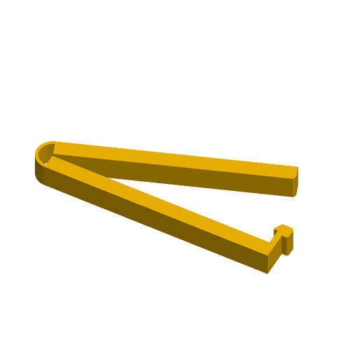

# Bag Clip



A one-piece bag clip, printed flat and open. A thin flexure loop at one end is
the hinge; at the other end the lower arm turns up into a post with a hook lip
that snaps over the tip of the upper arm. Fold the bag, squeeze the arms
together until the tip clicks under the lip, and push the tab on the post
outwards to let go.

Inspired by the Printables "Bag Clip" customizer and the geometry of MasterFX's
classic Bag Clip (Thingiverse 330151); written to the Parametric Model Maker
customizer conventions, so the same file works unchanged on MakerWorld and in
ScadBuddy.

**Needs a physical print test.** The loop thickness and latch play are
starting points taken from the reference design, not values proven on a
printer. Print one in PLA and one in PETG at the defaults before trusting a
batch: the loop should close without cracking, and the latch should hold a
folded bag and release with a thumb push on the tab.

## Parameters

### Clip

| Parameter | Default | What it does |
|---|---|---|
| `length` | `100` | Overall length of the closed clip, from the back of the loop to the release tab. |
| `width` | `10` | Width of the arms across the bag. The clip prints on its side, so this is the print height. |
| `thickness` | `6` | Thickness of each arm. The loop's outer radius is `thickness + 0.5`. |
| `hinge_t` | `1.2` | Thickness of the flexure loop. Thinner closes more easily and fatigues sooner. |
| `latch_tol` | `0.3` | Play between the hook lip and the tip of the upper arm when latched. Raise it if the latch will not close, lower it if the clip slips. |
| `style` | `flat` | `flat` jaws, or `wave_grip`: interlocking 0.8 mm waves on both jaws that hold a slippery bag better. |

### Text

| Parameter | Default | What it does |
|---|---|---|
| `text` | *(empty)* | Text raised 0.6 mm on the top face of the lower arm, up to 24 characters. Empty for none. |
| `font` | `DejaVu Sans:style=Bold` | Typeface. |

Text is sized to fit the arm: its height is limited by `thickness` (and by the
waves in `wave_grip`) and it shrinks to fit a long string into the arm's
length. On a 4 mm arm it is small — use a thicker arm for legible labels.

### Colors

| Parameter | Default | What it does |
|---|---|---|
| `clip_color` | `#F2B705` | The clip. |
| `text_color` | `#1E1E1E` | The raised text. |

## Colours and extruders

**The order of the `color` parameters in the source is the extruder order**:

| Parameter | Part | Extruder |
|---|---|---|
| `clip_color` | the clip | 1 |
| `text_color` | raised text (only when `text` is set) | 2 |

With no text the model is a single part.

## How it prints

The clip lies on its side with the upper arm swung 20° open, so the loop is
relaxed on the plate and only bends when the clip is latched. Everything is a
straight extrusion of one profile: no overhangs, no supports. Jaws are 1 mm
apart at the loop so they cannot fuse there.

Hidden constants that set the latch and loop geometry: 20° print opening, 1 mm
jaw gap at the loop, 1.6 mm hook lip on a 2.4 mm post, 2.5 mm release tab.

## Variations

- `style = "wave_grip"` — interlocking waves on both jaws.
- `text = "..."` — two-colour clip with a raised label.

## Verifying

```bash
./verify.sh
```

Renders the defaults, `wave_grip` with text, a short thick clip (50 mm, 10 mm
arms, 0.8 mm loop) and a long thin one (200 mm, 4 mm arms, 2 mm loop, long
text). For each it checks: the expected number of parts (one, or two with
text), nothing on the `Default` material, the model sits on z=0, X equals
`length`, Y equals the height of the opened arm computed from the parameters,
Z equals `width` (plus 0.6 mm with text), the text sits on the lower arm's top
face, and the whole thing is one connected piece. Output lands in `.verify/`.

The 3MF parsing runs on the host with `python3` and the standard library only.
