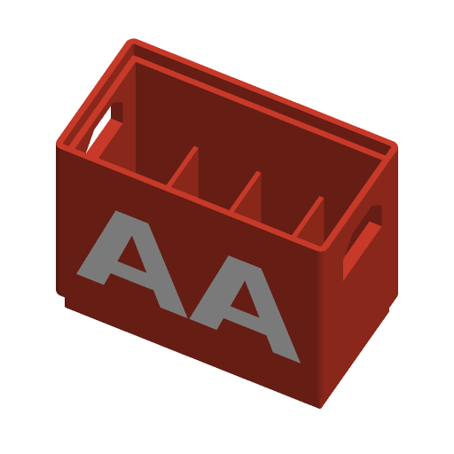

# Stackable Battery Crate



A beer-crate style holder for one battery type. It has a grid of cells, a foot
that nests into the crate below, handle cut-outs in both ends, and the battery
name inlaid in the front wall. Two colours: the crate is one part and the
label is another.

Inspired by Printables' "Customizable & stackable beer crate for all types of
batteries"; written to the Parametric Model Maker customizer conventions, so
the same file works unchanged on MakerWorld and in ScadBuddy.

Prints upright with no supports. The step from the foot to the full outline is
a 45° chamfer. The handle slots have 45° shoulders under a short bridge. The
label is inlaid 0.8 mm into a vertical wall.

## Parameters

### Battery

| Parameter | Default | What it does |
|---|---|---|
| `cell` | `AA` | `AAA`, `AA`, `C`, `D`, `9V`, `18650` or `CR2032`. Picks the cell size from the table below. |
| `clearance` | `0.6` | Added to the battery's diameter (or to each dimension of a 9V or coin cell). |

Cell sizes are the maximum dimensions from the IEC 60086 standard sizes and
cell datasheets, so any brand fits:

| `cell` | Standard | Size used (mm) | Held |
|---|---|---|---|
| `AAA` | R03 / LR03 | Ø10.5 × 44.5 | standing on end |
| `AA` | R6 / LR6 | Ø14.5 × 50.5 | standing on end |
| `C` | R14 / LR14 | Ø26.2 × 50.0 | standing on end |
| `D` | R20 / LR20 | Ø34.2 × 61.5 | standing on end |
| `9V` | 6LR61 | 26.5 × 17.5 × 48.5 | terminals up, 26.5 mm side along X |
| `18650` | Li-ion | Ø18.6 × 65.2 | standing on end |
| `CR2032` | coin cell | Ø20.0 × 3.2 | on edge in a slot, 3.2 mm side along X |

The 18650 length is an unprotected cell (65.0 ± 0.2 mm). Protected cells are
67–70 mm long and will not clear a stacked crate above; turn `stackable` off
for them or accept the crate above sitting on the cells.

### Layout

| Parameter | Default | What it does |
|---|---|---|
| `cols` | `4` | Cells along X. |
| `rows` | `2` | Cells along Y. |
| `height_pct` | `60` | Cell depth as a percentage of the battery's length. Lower leaves more of each battery to grab. |
| `stackable` | `true` | Raises the walls to 1 mm above the batteries and adds a 4 mm nesting foot and rim (see below). |
| `handle_cutouts` | `true` | Handle slots in the two end walls (±X). |
| `style` | `crate` | `crate`: square cells with 1.2 mm grid walls and a push-out hole in each cell floor. `solid_block`: a solid block with pockets that fit the battery shape and 1.6 mm between them. |

**Stacking.** A stackable crate has 3.2 mm side walls up to 1 mm above the
battery tops. Above that is a 1.6 mm rim 4 mm high. The foot is inset 1.9 mm
from the outside (the rim plus 0.3 mm clearance), so it drops into the rim of
the crate below. The crate then rests on the ledge where the wall steps from
3.2 mm to the rim. A non-stackable crate has 2.4 mm walls and is exactly as
tall as its cells.

**Handles.** In `crate` style the slots go through the end walls, like a beer
crate. In `solid_block` style the end walls are 5 mm thicker and the handles
are 5 mm deep blind recesses. Slots are up to 40 mm wide and 12 mm tall. They
are left out when the crate is too low for a 6 mm slot.

### Label

| Parameter | Default | What it does |
|---|---|---|
| `label_text` | empty | Text inlaid in the front (−Y) wall, up to 12 characters. **Empty means the battery name**: `AA`, `18650`, `CR2032`, and so on. |
| `font` | `DejaVu Sans:style=Bold` | Label typeface. |

The label is sized to fill the front wall between the foot chamfer and the rim.
It is left out when that area is under 4 mm tall or 10 mm wide (for example a
low, non-stackable coin-cell crate), and then the crate prints in one colour.

### Colours

| Parameter | Default | What it does |
|---|---|---|
| `crate_color` | `#D23C2A` | The crate. |
| `label_color` | `#FFFFFF` | The inlaid label. |

## Colours and extruders

**The order of the `color` parameters in the source is the extruder order:**

| Parameter | Part | Extruder |
|---|---|---|
| `crate_color` | crate | 1 |
| `label_color` | label inlay (0.8 mm deep, flush with the front wall) | 2 |

## Variations

- **Cell type**: all seven sizes, including the rectangular 9V and the
  coin-cell slots.
- **Stackable**: tall walls with a foot and rim, or a flat tray exactly as
  tall as its cells.
- **Style**: open crate or solid block.

## Verifying

```bash
./verify.sh
```

Renders the defaults and 13 variations. These cover every cell type, both
styles, stackable on and off, handles on and off, a custom label, a crate too
low for a label, a single cell at maximum clearance, and a 12 × 8 grid of D
cells. Each 3MF is checked for:

- the expected number of non-empty materials, with nothing on `Default`
- a bounding box exactly equal to what the parameters imply (the checker
  recomputes it from its own copy of the cell table)
- the crate sitting on z = 0
- the label flush with the front face and inside the band between the foot
  chamfer and the rim

Output lands in `.verify/`. The 3MF parsing runs on the host with `python3` and
the standard library only.

## Not yet print-tested

Two things need a test print before they can be trusted:

- The stacking fit: 0.3 mm between the foot and the rim, on a 1.3 mm ledge.
- The default 0.6 mm cell clearance, which is computed against maximum
  battery sizes.
