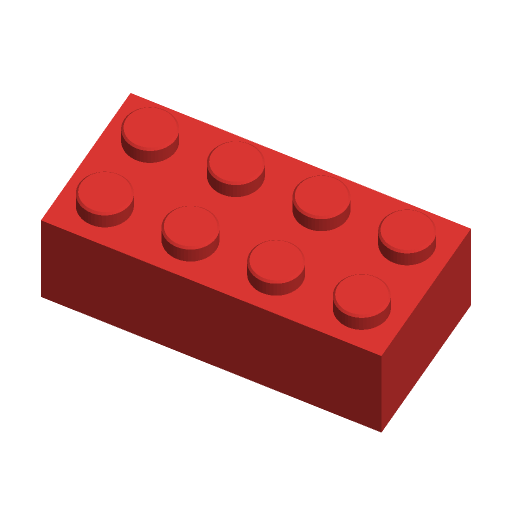

# Building Brick



A parametric stud-and-tube brick that clicks onto the standard 8 mm-pitch
system bricks, or, with `system = big`, onto the 16 mm-pitch toddler bricks.
Bricks, plates, smooth tiles and 45-degree slopes from 1x1 to 16x16 studs, with
two fit sliders for tuning the clutch on your printer and an optional word
inlaid in a tile's top or a brick's front face.

Parametric brick generators are among the most downloaded things on Printables:
"Lego compatible Bricks all sizes upto 50x50!" (#116754, 21.6k downloads) and,
for the big bricks, "Lego Duplo Brick Collection with Parametric Source Files"
(#340295, 3.2k downloads). This one is written to the Parametric Model Maker
customizer conventions, so the same file works unchanged on MakerWorld and in
ScadBuddy.

**Safety:** small bricks (especially 1x1 and plates) are a choking hazard for
children under 3. Use the big system for toddlers, and supervise.

## Parameters

### Brick

| Parameter | Default | What it does |
|---|---|---|
| `system` | `standard` | `standard`: 8 mm pitch. `big`: 16 mm pitch toddler bricks. |
| `type` | `brick` | `brick` (9.6 / 19.2 mm), `plate` (3.2 / 9.6 mm), `tile` (plate height, no studs, smooth top), `slope` (brick height, the last row on +X drops at 45 degrees). |
| `studs_x` | `4` | Length in studs, 1-16. A slope drops along X. |
| `studs_y` | `2` | Width in studs, 1-16. |

### Fit

| Parameter | Default | What it does |
|---|---|---|
| `stud_fit` | `0` | Added to the stud diameter, -0.2 to +0.2 mm. Raise it if this brick's studs are loose in other bricks. |
| `wall_fit` | `0` | Moves every surface the studs below press against — wall rib tips, tube outsides, 1-wide pins — inwards by this much, -0.2 to +0.2 mm. Raise it if the brick falls off; lower it if it will not go on. |

### Decor

| Parameter | Default | What it does |
|---|---|---|
| `top_text` | `""` | Word inlaid in a tile's top, or in the front (-Y) face of a brick, plate or slope; up to 20 characters. Shrinks to fit, never grows. Dropped when there is no room (a standard plate's 3.2 mm face, a 1-stud slope). |
| `font` | `DejaVu Sans:style=Bold` | Typeface (`// font`). |

### Colors

| Parameter | Default | What it does |
|---|---|---|
| `brick_color` | `#E53935` | The brick. |
| `text_color` | `#FFFFFF` | The inlaid word. |

## Colours and extruders

**The order of the `color` parameters in the source is the extruder order:**

| Parameter | Part | Extruder |
|---|---|---|
| `brick_color` | the brick | 1 |
| `text_color` | the inlaid word (only when there is one) | 2 |

The word is inlaid: the pocket is cut out of the brick and filled by the text
part, so the two parts touch but never overlap, and the face stays flat.

## Dimensions

| | standard | big | Source |
|---|---|---|---|
| Pitch | 8.0 | 16.0 | Orionrobots spec; 2x for big |
| Play (each side) | 0.1 | 0.1 | cfinke/LEGO.scad `wall_play` |
| Stud Ø x height | 4.8 x 1.7 | 9.4 x 4.5, hollow Ø6.5 | Brick Owl / Orionrobots; big measured (stealingcommas.blogspot.com, cfinke) |
| Brick height | 9.6 | 19.2 | Orionrobots; 2x |
| Plate / tile height | 3.2 | 9.6 | Orionrobots; the big system's flat pieces are half-height |
| Wall | 1.2 + ribs | 1.6 + ribs | cfinke/LEGO.scad `wall_thickness_with_splines` |
| Roof | 1.0 | 2.0 | cfinke; 2x |
| Tube OD / ID | 6.51 / 4.8 | 13.23 / 9.6 | OD = pitch x √2 − stud Ø, so it touches the four studs around it |
| 1-wide pin Ø | 3.2 | 6.6 | pitch − stud Ø |

A 1.2 mm wall alone stops 0.3 mm short of the stud below (the stud's edge is
`4 − 0.1 − 2.4 = 1.5` mm in from the outer face), so like the moulded part the
wall carries a narrow rib (0.7 / 1.0 mm wide) at every stud position, reaching
exactly to the stud. `wall_fit` moves the rib tips, tube outsides and pins
together.

Studs get a 0.2 / 0.4 mm lead-in chamfer. Under a tile the roof is as thick as
it can be while clearing the studs below (1.3 / 4.9 mm), so an inlaid word
leaves a solid skin underneath.

The slope drops across the last stud row only, exactly 45 degrees, from the top
down to a 1.7 / 3.3 mm lip at the +X face; the roof follows it underneath.

Note: the brief suggested a 1.8 mm stud and a big system that is pure 2x
scale. 1.7 is the published stud height; and real big-system studs measure
Ø9.4 x 4.5 (not 9.6 x 3.4), so those measured values are used and the tube is
sized from them.

## Print orientation

Studs up, open underside down — the way the moulded part comes out of the
tool. The roof bridges between the walls and tubes (at most one pitch, 8 / 16
mm), the slope's underside is a 45-degree overhang, and studs, tubes and ribs
are vertical, so no supports. Printing studs-down would put the studs on the
bed, where elephant's foot distorts exactly the surface that has to fit, and
leave the whole cavity hanging.

## Variations

- `type`: brick, plate, tile, slope.
- `system`: standard or big.
- Size: `studs_x` x `studs_y`, 1-16 each.
- Text: none, on a tile's top, or on the front face.

## Verifying

```bash
./verify.sh
```

Renders 18 cases — the defaults, every type in both systems, 1x1 and 1-wide
pieces, tight fit settings, text on tiles, bricks and slopes, text that does not
fit, and 16x16 in both systems — and checks for each: the expected colour
parts, nothing on the `Default` material, the bounding box the stud counts
imply (`n x pitch − 0.2`, height plus studs), sitting on z=0, the stud diameter
including `stud_fit`, tube OD/ID or pin diameter and rib reach including
`wall_fit`, and the 45-degree slope plane and lip. From one closed render per
colour it checks every part is a closed mesh, the word sits at the right depth,
and brick + word volumes equal the plain brick's (no overlap, no gap). The
largest case renders in about 2 s.

The checking runs on the host with `python3` and the standard library only.

## Needs a test print

- Clutch against real bricks of both systems, at the default fit. Expect to
  tune `stud_fit` / `wall_fit` by ±0.05-0.1 for your printer and filament.
- The big system's dimensions are from measured parts, not a published drawing.
