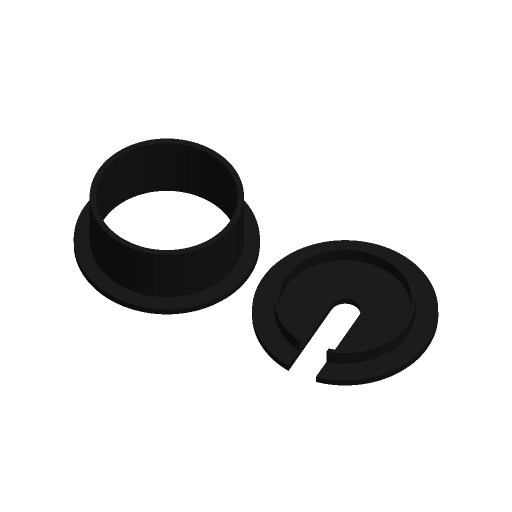

# Desk Cable Grommet



A sleeve that lines a hole through a desk, with a flange that sits on the desk
top, and a cap that drops into the sleeve. Round or square holes. The cap has a
cable slot, flexible brush fingers, a solid blank or an open trim ring.

Inspired by Printables' "Parametric Cable Grommet"; written to the Parametric
Model Maker customizer conventions, so the same file works unchanged on
MakerWorld and in ScadBuddy.

## Print layout

Both pieces are on one plate, side by side with a 6 mm gap, and neither needs
supports:

- **Sleeve** — flange down, the tube standing up from it.
- **Cap** — upside-down: its top face on the bed, the locating lip pointing
  up. The visible face comes off the bed smooth, and `cap_text` is inlaid flush
  into it (the first three layers). The cap is turned over by a rotation, not a
  mirror, so the text reads correctly once the cap is fitted.

## Parameters

### Hole

| Parameter | Default | What it does |
|---|---|---|
| `hole_d` | `60` | Diameter of the hole in the desk, or its side for `square`. |
| `desk_thickness` | `25` | Desk top thickness. The sleeve's tube is this long below the flange. |
| `flange_w` | `6` | How far the flange (and the cap, which matches it) reaches over the desk beyond the hole. |
| `fit` | `0.3` | Clearance at each joint: the sleeve is `hole_d - fit` across, and the cap's lip is `fit` smaller than the sleeve's bore. `0` is a press fit. |
| `shape` | `round` | `round`, or `square` with 5 mm corner radius at the hole (the radius tracks each offset, so every outline stays concentric). |

### Cap

| Parameter | Default | What it does |
|---|---|---|
| `cap_style` | `slot` | `slot`: a round-ended slot from the middle out through the edge (and the lip) for the cables. `brush_segments`: radial fingers 1.2 mm thick across the opening, split by 0.8 mm slits, that flex apart around cables — about one finger per 6 mm of circumference. `solid`: blank. `open_ring`: a trim ring only, the whole bore open. |
| `slot_w` | `12` | Slot width. Capped at 80 % of the lip's bore so a wide slot on a small hole cannot cut the cap in two. |
| `cap_text` | *(empty)* | Up to 12 characters inlaid 0.6 mm into the cap's top face, `slot` and `solid` styles only (the other two have no face to put it on). Letter height is `0.13 * hole_d`; text is centred in the solid half opposite the slot and cut off 1.5 mm inside the edges, not scaled. |
| `font` | `DejaVu Sans:style=Bold` | Typeface for the cap text (`// font`). |

### Colors

| Parameter | Default | What it does |
|---|---|---|
| `sleeve_color` | `#1E1E1E` | Sleeve and flange. |
| `cap_color` | `#1E1E1E` | Cap. |
| `cap_text_color` | `#FFFFFF` | Inlaid cap text. |

Hidden: sleeve wall 2.4 mm, flange 3 mm, cap plate 3 mm, lip 6 mm deep with a
1.6 mm wall.

## Colours and extruders

| Parameter | Part | Extruder |
|---|---|---|
| `sleeve_color` | sleeve | 1 |
| `cap_color` | cap | 2 |
| `cap_text_color` | cap text | 3 |

The order of the `color` parameters in the source is the extruder order. The
defaults give the sleeve and the cap the same colour, so they merge into one
part on one filament; with no `cap_text` the default plate is single-colour.

## Dimensions

For the defaults: sleeve 72 mm flange, 59.7 mm tube with a 54.9 mm bore,
28 mm tall; cap 72 mm across, 9 mm tall with a 54.6 mm lip. Plate footprint
150 × 72 mm. In general the flange and cap are `hole_d + 2 * flange_w` across
and the plate is `2 * flange + 6` long.

## Variations

- `cap_style = "brush_segments"` — cables pass anywhere; the fingers close
  behind them. Best in PETG or TPU; PLA fingers will take a set if left bent.
- `cap_style = "solid"` with `cap_text` — a labelled blank for an unused hole.
- `cap_style = "open_ring"` — trim only, for a hole with a lot of cables.
- `shape = "square"` — for routed square cut-outs.
- Different `sleeve_color` and `cap_color` — two filaments.

## Verifying

```bash
./verify.sh
```

Renders the defaults, the slot cap with text, brush fingers, a square solid cap
with text, the open ring, a 20 mm hole with `fit = 0` and a too-wide slot, and a
100 mm hole with `fit = 1`, and checks each 3MF: the number of non-empty
materials (1 for the defaults, 2 or 3 with a distinct cap colour and text),
`Default` empty, the plate footprint and height, z=0, the sleeve and cap
heights, that the pieces do not overlap, and for round holes the sleeve OD, bore
and cap lip OD against `hole_d` and `fit` — plus fingers present for
`brush_segments`, nothing inside the bore for `open_ring`, and the text in the
cap's bed-side face. The 3MF parsing runs on the host with `python3` and the
standard library only.

## Needs a test print

Not yet printed. The fit depends on how the printer holds dimensions: 0.3 mm
should slide into a drilled hole and seat the cap snugly, but a real hole saw
cut is rarely exact, so measure the hole. The brush fingers' stiffness (1.2 mm,
six layers) is untested.
