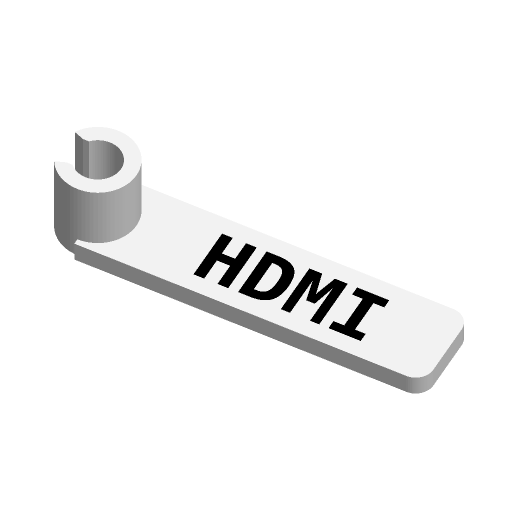

# Clip-on Cable Label



A C-clip that snaps sideways onto a cable, carrying a text label. The text is
inlaid flush into the label in a second colour, so it cannot snag or wear off.

Inspired by MakerWorld's "Configurable cable label" / "Parametric cable label
tag holder" and Printables' KLAMMA cable label; written to the Parametric Model
Maker customizer conventions, so the same file works unchanged on MakerWorld
and in ScadBuddy.

## Print orientation

Every style prints with the cable axis vertical. The C-clip's cross-section
lies in the build plane, so each layer is a whole C: pushing a cable in bends
the C within its layers, never across them. A clip printed lying down (cable
axis horizontal) opens by pulling layers apart and splits along a layer line.

| Style | Shape | Where the text is |
|---|---|---|
| `flag` | Flat tag lying on the bed, the clip standing `clip_len` tall at one end. The tag sits perpendicular to the cable; read it looking along the cable. | Inlaid 0.6 mm into the top face — the last three layers. |
| `double_sided` | Same tag. | Top face, and the bottom face mirrored so it reads the right way round when the tag is turned over. The bottom text is the first three layers on the bed, so no supports. |
| `wrap_band` | The clip stretched `flag_len` along the cable, with a flat face on the side opposite the opening. | Inlaid into that face, running up the band — along the cable, like a wrap-around label. |

`wrap_band` has its text on a vertical wall: it prints without supports, but
the colour changes on every layer of the band's height, so it purges far more
filament than the flat tags, which change colour on three (or six) layers only.

## Parameters

### Cable

| Parameter | Default | What it does |
|---|---|---|
| `cable_d` | `5` | Cable outer diameter. The bore is `cable_d + 0.2`. |
| `clip_opening_pct` | `70` | Width of the opening as a percentage of the cable diameter (55–85). Lower grips harder and snaps on less easily. The jaws have a lead-in chamfer. |
| `clip_len` | `10` | Length of the clip along the cable — its print height. Not used by `wrap_band`, where the band is `flag_len` long. |

### Label

| Parameter | Default | What it does |
|---|---|---|
| `text` | `HDMI` | Label text, up to 16 characters. Empty leaves a blank single-colour label. |
| `font` | `DejaVu Sans Mono:style=Bold` | Typeface (`// font`). |
| `text_size` | `6` | Letter height. Text that does not fit the label face (1 mm margin) is cut off at the margin, not scaled — shorten it or reduce the size. |
| `flag_len` | `35` | Tag length beyond the clip, or the band's length along the cable for `wrap_band`. |
| `flag_h` | `10` | Width of the label face: the tag's width across, or the band face's width. |
| `style` | `flag` | `flag`, `double_sided`, `wrap_band` — see above. |

### Colors

| Parameter | Default | What it does |
|---|---|---|
| `body_color` | `#FFFFFF` | Clip and label body. |
| `text_color` | `#000000` | Inlaid text. |

Hidden: clip wall `max(1.6, 0.15 * cable_d + 1.0)` mm, tag thickness 2.4 mm,
text inlay depth 0.6 mm, band face standing 1 mm off the clip's outer wall.

## Colours and extruders

| Parameter | Part | Extruder |
|---|---|---|
| `body_color` | clip and label | 1 |
| `text_color` | text | 2 |

The order of the `color` parameters in the source is the extruder order. With
empty text the model is a single part.

## Dimensions

For the defaults: 43.1 × 10 × 10 mm (tag 2.4 mm thick, clip 10 mm tall).
In general, with `r_out = (cable_d + 0.2)/2 + wall`:

- `flag` / `double_sided`: X runs to `r_out + flag_len`, Y is
  `max(flag_h, 2 * r_out)`, Z is `clip_len`.
- `wrap_band`: X runs to `r_out + 1` (the face), Y is `max(flag_h, 2 * r_out)`,
  Z is `flag_len`.

## Variations

- `style = "double_sided"` — text readable from either side of the tag.
- `style = "wrap_band"` — label runs along the cable.
- `text = ""` — blank, one colour.
- `cable_d = 15`, `clip_opening_pct = 85` — thick power cables.

## Verifying

```bash
./verify.sh
```

Renders the defaults, `double_sided`, `wrap_band`, empty text, a 15 mm cable
tag and a 12 mm cable band, and checks each 3MF: the number of non-empty
materials (2, or 1 with no text), `Default` empty, the bounding box against the
formulas above, z=0, the clip opening clear of geometry, and the text flush with
the face its style puts it on (top only, top and bottom, or the band face).
The 3MF parsing runs on the host with `python3` and the standard library only.

## Needs a test print

Not yet printed. The grip depends on the filament and the cable jacket: the
default 70 % opening asks the jaws to spread 1.5 mm on a 5 mm cable, which PETG
should take repeatedly; PLA may want 75-80 %. Print one and try it on the cable
you actually have before printing a batch.
