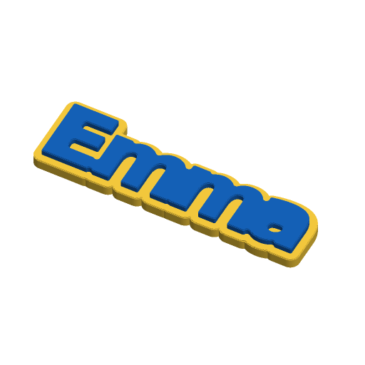
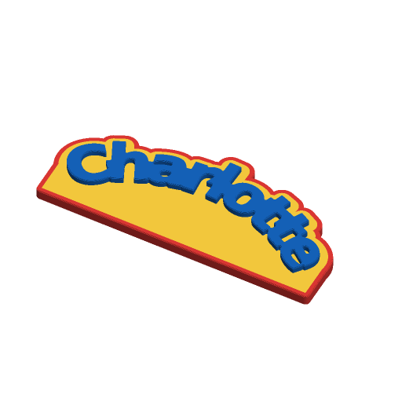
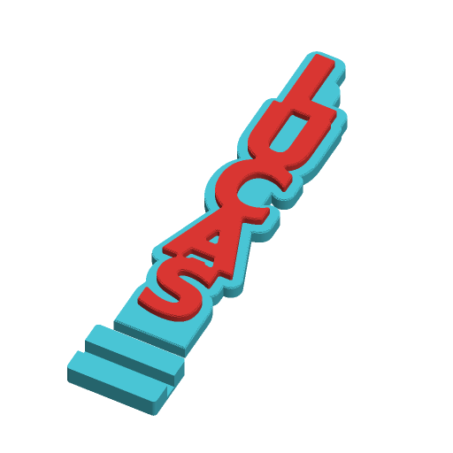

# Chunky Name Sign



A word in a heavy display face standing on a thick backing cut to the outline
of the letters, with the letters raised on top. The backing is the letters'
footprint grown outwards by `border` with every hole filled, so it is one solid
piece; the letters are welded together so the word is one piece too.

On top of that basic sign there are WordArt-style text shapes, a vertical
layout, an outer ring and a letter outline in their own colours, a flat bottom
or a slotted foot so the sign stands on a shelf, and magnet pockets or keyhole
slots in the back.

With the defaults (`Emma`, 40 mm letters) the sign is about 178 × 53 × 11 mm:
a 7 mm backing with 4 mm letters on it, in two colours.

Inspired by the MakerWorld "Namensschild" (name sign) customizer; written to
the Parametric Model Maker customizer conventions, so the same file works
unchanged on MakerWorld and in ScadBuddy.

It prints flat, back down, with no supports: the backing and ring are one flat
slab and the letters and outline stand on it. Magnet pockets and keyholes open
on the bed and are bridged over.

## Parameters

### Text

| Parameter | Default | What it does |
|---|---|---|
| `text` | `Emma` | The word, up to 20 characters. Empty shows the placeholder `Name`. |
| `font` | `DejaVu Sans:style=Bold` | Typeface (`// font`). See [Fonts](#fonts). |
| `text_size` | `40` | Letter size in mm, about the height of a capital. Auto-fit only ever makes it smaller. |
| `letter_spacing` | `0.9` | Spacing factor between letters; 1 is the font's own. Below 1 pulls chunky letters into each other. |
| `boldness` | `1` | Thickens every letter by this many mm all round, so any face comes out chunkier. It scales down with the text when auto-fit shrinks it. |
| `auto_fit` | `true` | Shrinks the text so the word is never longer than `max_length`. Off or on, a word too long for the plate is always shrunk to fit it (see [Plate fit](#plate-fit)). |
| `max_length` | `180` | Longest the word may run in mm: its width when horizontal, its height in the vertical layouts. For the circle it limits the badge's diameter. Capped at what fits the plate. |

### Layout

| Parameter | Default | What it does |
|---|---|---|
| `layout` | `horizontal` | `horizontal`; `vertical_stacked` — one letter per row, each centred, top to bottom, like a door sign or a book spine; `vertical_rotated` — the whole sign turned 90° so the word reads bottom to top. |
| `row_gap` | `2` | Stacked layout: extra gap between rows in mm; negative overlaps the rows. |

Auto-fit follows the layout: a stacked column is fitted to `max_length` in
height, a rotated word in height too.

### Shape

| Parameter | Default | What it does |
|---|---|---|
| `text_shape` | `straight` | `straight`, `arch_up`, `arch_down` (valley), `circle` (round badge), `wave`, `slant_up`, `slant_down`, `bulge`, `pinch`, `perspective` (letters shrinking left to right), `stairs`. |
| `arc_radius` | `120` | Arches: radius of the curve in mm. Smaller bends more. |
| `circle_radius` | `0` | Circle: radius of the ring the letters stand on. `0` picks it so the word wraps 80 % of the ring (never less than two letter sizes). A badge too wide for the plate is shrunk. |
| `wave_amplitude` | `8` | Wave height either side of the centre line, mm. |
| `wave_length` | `120` | Length of one full wave, mm. |
| `skew_angle` | `15` | Slant angle in degrees. |
| `shape_amount` | `40` | Bulge, pinch and perspective: how much the letter size changes, in percent. |
| `stair_step` | `6` | Stairs: how far each letter steps up from the one before, mm. Reduced when the staircase would not fit the plate. |

Shapes apply to the horizontal and rotated layouts; the stacked layout ignores
them.

### Plate fit

The sliders reach well past the H2C's 300 × 320 mm plate (a 400 mm
`max_length`, 20 letters at 100 mm with `auto_fit` off, a 150 mm circle with a
ring, 20 stairs of 30 mm). The model caps them: the word's run is held to the
plate width (horizontal) or depth (vertical, less the foot) minus the border,
ring and thickening, the circle badge to the plate width, and the stair step to
what fits the depth. This applies with `auto_fit` off too — `auto_fit` only
decides whether `max_length` is honoured below that. A tall slant or wave with
a foot can still overflow the depth; ScadBuddy then refuses the plate with the
size it needed.

### Backing

| Parameter | Default | What it does |
|---|---|---|
| `border` | `5` | Width of the backing around the letters, mm. |
| `backing_thickness` | `7` | Thickness of the backing, mm. |
| `letter_height` | `4` | How far the letters stand proud of the backing, mm. Total height is `backing_thickness + letter_height`. |
| `bevel` | `0.6` | Chamfer on the top edges of the letters and of the outermost part of the backing, mm, as three layer-sized steps. `0` for square edges. |

### Extras

| Parameter | Default | What it does |
|---|---|---|
| `outer_ring` | `false` | A second border around the backing in its own colour — a double border. Full backing height. |
| `ring_width` | `3` | Width of that ring, mm. |
| `text_outline` | `false` | An outline stroke around the letters in its own colour, as tall as the letters. |
| `outline_width` | `2` | Width of the outline, mm. Kept at least 0.5 mm inside the border. |
| `stand` | `none` | `none`; `flat_bottom` — the bottom of the backing is hulled down to a straight edge so the sign stands on it; `foot` — the flat bottom plus a separate slotted foot printed below the sign. |
| `mount` | `none` | `none`, `magnets` (two round pockets in the back), `keyholes` (two keyhole slots in the back for screws or nails). |
| `mount_spacing` | `0` | Distance between the two pockets or keyholes, mm. `0` puts them under the letters a quarter of the word in from each end (for the circle, either side of the centre; for the stacked layout, under the first and last letters). |
| `magnet_d` | `10` | Magnet diameter; the pocket is 0.3 mm wider. |
| `magnet_h` | `2` | Magnet thickness; the pocket is 0.2 mm deeper, but always leaves at least 1 mm of backing. |

- **Flat bottom** — the part of the backing near the lowest letter is hulled
  down to a straight line one `border` below the lowest ink. Under an arch the
  whole bay fills in, so the arch sits on a solid base.
- **Foot** — the flat bottom is dropped far enough that the lowest letter
  clears the foot's 8 mm lip. The foot is a 10 mm tall block, at least 30 mm
  deep, with a straight slot `backing_thickness + 0.3` mm wide, printed below
  the sign on the same plate.
- **Keyholes** — a 9 mm entry for the screw head, a 4.5 mm slot 10 mm long
  upwards for the shank, a 1.5 mm lip and a 3 mm channel behind it for the
  head. Needs a backing of about 4 mm or more; below that they are left out.
  Hang the sign so the screw ends at the top of the slot.
- Pockets and keyholes are always kept 1.5 mm inside the outline, so an odd
  `mount_spacing` can make a pocket smaller but never breaks through the edge.

### Colors

| Parameter | Default | What it does |
|---|---|---|
| `backing_color` | `#FFD23F` | Backing, and the foot. |
| `text_color` | `#1565C0` | Letters. |
| `ring_color` | `#E53935` | Outer ring (only with `outer_ring`). |
| `outline_color` | `#FFFFFF` | Letter outline (only with `text_outline`). |

## Colours and extruders

**The order of the colour parameters in the source is the extruder order** —
the first one is extruder 1:

| Parameter | Part | Extruder |
|---|---|---|
| `backing_color` | backing and foot | 1 |
| `text_color` | letters | 2 |
| `ring_color` | outer ring | 3 |
| `outline_color` | letter outline | 4 |

The ring and outline only exist when switched on, so the defaults print in two
colours and everything on in four. Colours with the same value merge into one
part and one filament. Differently coloured parts never overlap; they only
touch — the ring sits around the backing, the outline around the letters on
top of it.

## Shapes and layouts






From the left: `arch_up` with `outer_ring` and `stand=flat_bottom`; `circle`
with `outer_ring`; `wave` with `text_outline`; `vertical_stacked` with
`stand=foot`.

- `straight` and the two slants use OpenSCAD's own text layout (with the
  font's kerning, any font). The slants shear the word.
- Every other shape places the letters one at a time along a path: arches and
  the circle bend the letters' centre line to the radius and turn each letter
  to it; the wave does the same along a sine curve; bulge, pinch and
  perspective change each letter's size about the centre line; stairs step
  each letter up. Letter advances come from metrics measured from the fonts in
  the ScadBuddy image for `DejaVu Sans:style=Bold`, `DejaVu Sans`,
  `Lobster Two:style=Bold` and `DejaVu Serif:style=Bold`. Any other face gets
  a generic advance, so its letters may sit a little unevenly in a shape (the
  straight layout is unaffected).
- Shaped words are fitted along their path, so letters tilted by a wave or an
  arch can reach up to about 3 % past `max_length`.
- The circle puts a disc under the ring of letters, so it prints as a round
  badge with the word around its top.

### One piece

- Straight text is welded with a morphological close (grow, then shrink back)
  of 5 % of the letter size, which joins neighbouring letters without changing
  the word's size.
- Shaped and stacked letters are welded pair by pair. Where a pair still does
  not touch, a short rod between the two letters' centres fills just the space
  between them (the pair's convex hull minus each letter's own hull), so no
  counter is filled.
- What stays separate: the dots of `i` and `j`, words either side of a space,
  and occasionally two stacked rows whose shapes meet only at a point (such as
  `X` above `A`). They are still fused to the backing.
- The backing is always one piece: a chain of discs through the letter centres
  holds it together across spaces and between stacked rows.

## Fonts

The default is `DejaVu Sans:style=Bold`, the heaviest face installed in the
ScadBuddy image (the image carries `fonts-lobster`, `fonts-lobstertwo`,
`fonts-dejavu` and `fonts-noto-core`; none of them has a Black weight), made
chunkier by `boldness`.

For a real display face, install one of these with ScadBuddy's Google Fonts
picker and pick it in the `font` dropdown:

- Luckiest Guy
- Fredoka One
- Lilita One
- Titan One
- Bungee

They work in every layout; in the per-letter shapes they use the generic
advance (see above).

## Verifying

```bash
./verify.sh
```

Renders the defaults and 32 variations in `scadbuddy-verify:local` (building it
from `openscad/openscad:dev` plus ScadBuddy's font packages when it is missing,
and failing if `DejaVu Sans`, `Lobster Two` or `Noto Sans` is not installed),
then checks each one:

- the parts are exactly the expected set of colours, and the `Default`
  material has no triangles;
- the model sits on z=0 and its top is at `backing_thickness + letter_height`;
- one closed render per colour — the way ScadBuddy builds its parts — puts the
  backing and ring at 0–7 mm and the letters and outline at 7–11 mm (the
  backing to 10 mm with the foot);
- the letters are one connected piece (or the expected number, for two words),
  and the backing is one piece (two with the foot), the ring one piece;
- the colour parts do not overlap: their volumes add up exactly to the volume
  of the whole model rendered as one solid;
- auto-fit holds the word to `max_length` (a long word is shrunk to it, and
  with auto-fit off it keeps its size); stacked and rotated words run up the
  sign;
- the whole plate fits 300 × 320 mm, including five cases whose sliders
  would run off it;
- the straight backing is the letters grown by exactly `border`, and the ring
  is exactly `ring_width` outside the backing;
- a flat bottom is a straight edge, and the foot is below the sign and 10 mm
  tall;
- two magnet pockets remove exactly the volume of two 10.3 × 2.2 mm pockets.

The 3MF and STL parsing runs on the host with `python3` and the standard
library only. Output lands in `.verify/`.

## Needs a test print

- The foot's slot fit (0.3 mm clearance) and whether a tall stacked sign is
  steady on it.
- Magnet pocket fit for the magnets you have.
- Keyhole fit for your screw heads (9 mm entry, 4.5 mm shank slot).
- The stepped bevel at your layer height (three steps of `bevel / 3`).
