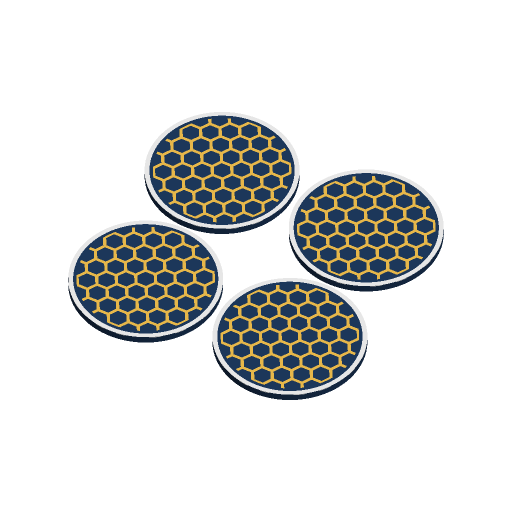

# Coaster Set



A set of flat drink coasters with a pattern inlaid flush in a second colour:
a geometric pattern, a monogram letter (a different one on each coaster if you
like), a line of text, or your own SVG or PNG picture. An optional border ring
takes a third colour. The set is laid out on one plate, with an optional
recess underneath for a cork or felt pad and an optional holder the stack
drops into.

Coasters are for standing drinks on. This is not a food-contact item; do not
use it as a plate or cup.

Inspired by two of the most-downloaded coasters on Printables, "Sunflower
fabric coaster" (#285153, 40,326 downloads) and "Leaf Drink Coasters with
Decorative Plant Holder" (#230363, 19,486 downloads). No geometry was copied.
Written to the MakerWorld Parametric Model Maker customizer conventions, so
the same file works unchanged on MakerWorld and in ScadBuddy.

## Print layout

Coasters are laid out in a grid with `gap` mm between them, as many as fit the
H2C plate (300 × 320 mm with both nozzles), in the squarest arrangement. If
`count` coasters do not fit, the model places as many as do and logs
`NOTE: only N coasters of M fit on the plate`; print the rest as a second
plate. The holder, when on, takes the last cell of the grid, and every cell is
then sized for the holder.

The inlays are `inlay_depth` (0.6 mm) deep, so only the first or last three
layers change colour.

- **`face = up`** (default): the decorated face is the top of the print.
- **`face = down`**: the decorated face is on the plate and gets the plate's
  finish (smooth PEI or texture). Artwork is mirrored so it reads correctly
  when the coaster is turned over.
- **`underside = recess`** always prints face down: a recess on the bed side
  would be an 80 mm unsupported ceiling, on the top it is just an open pocket.

The holder prints upright; its finger slots are open at the top. Nothing
needs supports.

## Parameters

### Coaster

| Parameter | Default | What it does |
|---|---|---|
| `shape` | `round` | `round`, `square`, `hexagon` (flats top and bottom), `rounded_square`. |
| `size` | `95` | Diameter (round), side (square, rounded square) or across the flats (hexagon), mm. 60–150. |
| `thickness` | `5` | Coaster thickness, mm. |
| `corner_radius` | `14` | Corner radius of the rounded square, mm. |
| `border_width` | `3` | Width of the border ring in `border_color`, mm; 0 = no border. |
| `inlay_depth` | `0.6` | Depth of every inlay (pattern, border, picture), mm. |
| `face` | `up` | Which face prints on the plate (see above). |

### Pattern

| Parameter | Default | What it does |
|---|---|---|
| `pattern` | `honeycomb` | `none`, `stripes` (diagonal), `chevron`, `checker`, `rings` (concentric), `honeycomb`, `dots` (polka dots), `sunburst`, `monogram`, `text`. The pattern fills the area 2 mm inside the border. |
| `spacing` | `12` | Pattern pitch, mm: stripe and ring spacing, cell and square size, dot pitch; also sets the number of sunburst rays. |
| `line_width` | `2` | Line width of stripes, chevron, rings and honeycomb, mm. |
| `pattern_rotation` | `0` | Rotates the geometric patterns, degrees. |
| `letters` | `A` | Monogram letters, one per coaster in order, repeating: `ABCD` gives four coasters four letters, `A` puts an A on every one. |
| `text` | `CHEERS` | Text for the `text` pattern, up to 20 characters; shrinks to fit. |
| `font` | `DejaVu Serif:style=Bold` | Typeface for the monogram and text. |
| `alternate_colors` | `false` | Every other coaster swaps coaster and pattern colours. |

### Overlay

| Parameter | Default | What it does |
|---|---|---|
| `overlay_file` | *(empty)* | An SVG or PNG to inlay in `overlay_color`. Upload it in the customizer (a `// file:svg,png` parameter, ScadBuddy #204 / PR #231), or give a bare file name in this model's directory (`sample-overlay.svg`, `sample-overlay.png`). Empty = off. A path (`/`, `\`) or a leading dot is refused and turns the overlay off, so the parameter cannot read files outside the model. |
| `overlay_type` | `auto` | `auto` picks by extension, in any case (`.png`, `.PNG`): a PNG goes through `surface()`, anything else is imported as an SVG. `svg` imports the outline; `image_threshold` reads a PNG and keeps the pixels darker than `image_threshold`. |
| `overlay_scale` | `60` | Picture width as a percentage of `size` (aspect kept). |
| `overlay_x`, `overlay_y` | `0` | Move the picture, mm. |
| `overlay_rotation` | `0` | Rotate the picture, degrees. |
| `image_threshold` | `50` | Brightness cut-off (%) for PNGs. |
| `overlay_invert` | `false` | Swap picture and background: the whole pattern area except the picture takes `overlay_color`. |
| `overlay_clears_pattern` | `true` | Clear the pattern under the picture and 1 mm around it, so the outline stays clean. Off: the pattern stops only where the picture is. |

The picture is clipped to the pattern area and goes on every coaster. Until
ScadBuddy's file parameters (PR #231) are merged, `overlay_file` shows as a
plain text field; typing a bare file name in the model directory works either
way. A name that does not exist does not break the render: OpenSCAD logs that
it cannot open the file and the coasters render without the picture.

### Set

| Parameter | Default | What it does |
|---|---|---|
| `count` | `4` | Number of coasters, 1–12 (fewer if they do not fit the plate). |
| `gap` | `5` | Gap between parts on the plate, mm. |
| `underside` | `plain` | `plain`, or `recess` for a cork or felt pad (prints face down). |
| `recess_depth` | `2` | Recess depth, mm: 2 for 2 mm cork, 1 for felt. Capped so at least 1.2 mm is left above the inlay; when it is reduced (or, on a thin coaster with a deep inlay, dropped) the log says `NOTE: recess reduced ...`. |
| `recess_rim` | `4` | Rim left around the recess, mm; the pad is the coaster outline shrunk by this much. |
| `holder` | `false` | Add a holder: a tray in the coaster's shape, walls 2.4 mm, a 2.4 mm base, 70% as tall as the stack of `count` coasters (at least 10 mm), with finger slots front and back. |
| `holder_clearance` | `1` | Clearance between coasters and holder, per side, mm. |

### Colours

| Parameter | Default | What it does |
|---|---|---|
| `coaster_color` | `#1E3A5F` | Coaster body. |
| `pattern_color` | `#F2C14E` | Pattern, monogram and text. |
| `border_color` | `#F2F2F2` | Border ring. |
| `overlay_color` | `#E4572E` | Picture. |
| `holder_color` | `#1E3A5F` | Holder; the coaster colour by default, so it shares extruder 1. |

## Colours and extruders

**The order of the `color` parameters in the source is the extruder order:**

| Parameter | Part | Extruder |
|---|---|---|
| `coaster_color` | coaster bodies | 1 |
| `pattern_color` | pattern / letters / text inlay | 2 |
| `border_color` | border ring inlay | 3 |
| `overlay_color` | picture inlay (only with an overlay) | 4 |
| `holder_color` | holder (only with a holder) | 5 |

Parts that are switched off take no extruder, and equal colours merge into
one part and one filament. The defaults print in three colours.

## Variations

- **Shape** — round, square, hexagon, rounded square.
- **Pattern** — eight geometric patterns, a monogram per coaster, or text.
- **Picture** — any SVG or PNG, normal or inverted, over or instead of the
  pattern.
- **Set** — 1–12 coasters, alternating colours, cork recess, holder.

## Verifying

```bash
./verify.sh
```

Renders the defaults and 35 variations: every pattern (read from the
dropdown, so a new one is tested automatically) cycling through the shapes, a
cork recess on every shape, face-down text, per-coaster monograms with a
holder and alternating colours, SVG and PNG overlays (including a `.PNG`
upper-case extension picked up by `auto`, a forced threshold, inverted and
face down), a missing overlay file, five refused `overlay_file` values
(`../`, absolute, a subdirectory, a dotfile, a backslash), a set too large for
the plate, twelve small coasters with a holder, a recess reduced and a recess dropped because the
coaster is too thin, and the finest pattern on the largest coaster. Each 3MF is
checked for: no geometry on the `Default` material; exactly the expected
colour parts, each rendered closed on its own and summing to the whole (no
overlaps); the layout's coaster count and columns; z = 0; the bounding box
equal to the layout the parameters imply and inside the plate; every inlay
exactly `inlay_depth` deep and flush with the decorated face; the solid volume
equal to outline × thickness minus the recess; refused overlay names never
reaching `import()`/`surface()`; no OpenSCAD warnings or errors. `ONLY=<regex>`
runs a subset. The 3MF parsing runs on the host with `python3` and the
standard library only.

## Not yet print-tested

The holder clearance (1 mm per side) and the recess depth for real cork sheet
are computed, not measured. Fine patterns at `line_width = 0.8` are two lines
of a 0.4 mm nozzle; the pattern is clipped at the edge of its area, so a few
slivers smaller than a line width may not print.
