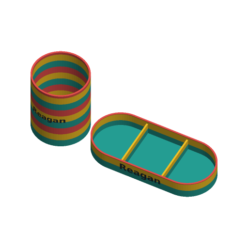

# Desk Organizer



A pen cup and a matching tray, as a set or on their own, with a name inlaid
flush in the front of each piece. Both pieces share one shape and one colour
pattern: horizontal stripes that line up across the set, or vertical colour
blocks.

Inspired by Printables' "Catch-All Trays / Desk organizer" by HribaDesign
(38,230 downloads), "Woven Pencil Holder" by JamesThePrinter (26,701) and
"Wavy Pencil Holder - Vase mode" by SNASA (22,902). The file follows the
Parametric Model Maker customizer conventions, so it works unchanged on
MakerWorld and in ScadBuddy.

## Parameters

### Set

| Parameter | Default | What it does |
|---|---|---|
| `pieces` | `set` | Cup and tray, cup only, or tray only. The set sits side by side, or with the cup above the tray when the row would be wider than 300 mm. |
| `shape` | `round` | `round`, `hex` (flat side to the front), `square` (4 mm corners) or `stacked_rings`. The tray follows: stadium, pointed hexagon, rounded rectangle, stadium of rings. |
| `wall` | `2.4` | Wall thickness (six 0.4 mm lines). For stacked rings, this is the wall at the thinnest point, between two rings. |
| `floor_thickness` | `2.4` | Floor thickness. |

### Pen cup

| Parameter | Default | What it does |
|---|---|---|
| `cup_width` | `80` | Diameter (round, rings) or across the flats (hex, square). |
| `cup_height` | `100` | Height. **Capped at twice the footprint width**, with a `NOTE:`, so the cup stays stable. For rings, the footprint is the base of the bottom ring, 0.586 × ring radius in from the widest point. |
| `cup_compartments` | `1` | 1, 2 (a wall across), 3, 4 or 6 (radial walls). |
| `cup_divider_height` | `70` | Divider height, % of the cup height. |

### Tray

| Parameter | Default | What it does |
|---|---|---|
| `tray_length` / `tray_width` | `180` / `80` | Outside size. A width greater than the length is reduced to it (`NOTE:`). |
| `tray_height` | `25` | Height. |
| `tray_compartments` | `3` | Compartments along the length. |
| `tray_divider_height` | `80` | Divider height, % of the tray height. |

### Pattern

| Parameter | Default | What it does |
|---|---|---|
| `pattern` | `stripes` | `solid` (`color_1` only), `stripes` (horizontal bands from the bed up, the same on both pieces), or `blocks` (vertical panels: sectors of the cup, the first centred on the front; equal slices along the tray). |
| `pattern_colors` | `3` | How many of `color_1`–`color_6` the pattern cycles through. |
| `stripe_height` | `12` | Band height in mm. With `stacked_rings`, stripes follow the rings and change colour in the groove between two rings. |
| `ring_height` | `10` | Height of one ring (`stacked_rings`). Piece heights snap to whole rings, at least two, with a `NOTE:` whenever that changes the height asked for (a 10 mm tray on 12 mm rings is 24 mm tall). The top ring keeps a flat rim at least 0.4 mm wide, however tall the ring. |

### Name

| Parameter | Default | What it does |
|---|---|---|
| `name` | `Reagan` | Up to 24 characters. Empty = no name. |
| `name_on` | `both` | Both pieces, cup only, tray only, or none. |
| `font` | `DejaVu Sans:style=Bold` | Typeface (`// font`). |
| `text_size` | `14` | Letter height. Only ever shrunk: to fit the front face's width, to 40 % of the cup height (60 % of the tray's), or, on rings, to 80 % of one ring. On rings, the name sits on the crest of the middle ring. |
| `text_depth` | `0.8` | Inlay depth. Capped at `wall - 0.8` (`NOTE:`), so 0.8 mm of wall always stays behind the letters. |

## Colours and extruders

The order of the colour parameters is the extruder order. Colours the pattern
does not reach produce no part.

| Parameter | Part | Extruder |
|---|---|---|
| `color_1` … `color_6` | pattern colours, cycled in order (`color_1` only for `solid`) | 1–6 |
| `text_color` | the inlaid name | 7 |

## Print settings

- Print both pieces upright, open side up, with no supports. The rings'
  undersides are 45° slopes. The name is extruded straight back into the
  front wall, so it adds no overhang.
- 0.2 mm layers, at least 3 walls. Stripes change colour only every
  `stripe_height`. Colour blocks change colour on every layer, which purges
  far more filament: pick blocks for looks, stripes for economy.
- Not for food or drink.

## Verifying

```bash
./verify.sh
```

Renders 32 cases:

- the defaults
- every shape × pattern
- every cup compartment count
- single pieces and the stacked layout
- the clamps: a 200 mm cup on a 50 mm footprint (prism and rings), a 1.2 mm
  wall with a 2 mm inlay, a 1.2 mm wall whose inlay exactly fits, and a tray
  wider than it is long
- rings heights that snap: a 10 mm tray on 12 mm rings (24 mm, the two-ring
  minimum) and a 95 mm cup on 10 mm rings (100 mm)
- 20 mm rings at the default wall and 12 mm rings on a 1.2 mm wall, whose
  crests would otherwise curve in past the cavity and shave the top ring
- a long name, and no name

Each 3MF is checked for:

- no geometry on `Default`, and exactly the colour parts the stripes, rings
  or panels imply
- every colour rendered closed on its own (ScadBuddy's per-colour wrapper)
  adds up to the whole
- sits on z = 0 and has the expected height and bounding box, inside the
  300 × 320 mm plate
- **wall thickness, measured.** A horizontal ray through the back wall of
  each piece crosses exactly `wall` of material. On rings it is checked at a
  trough (at least `wall`) and at a crest.
- **stability.** The convex hull of the cup's footprint on the bed is at
  least half the cup height wide in every direction. The empty cup's centre
  of mass leaves at least 25° of tip margin (measured 28.8°–53.5°).
- the name's part reaches the front face exactly (flush, neither raised nor
  sunk). It is centred and fits the face box. Measured on the mesh rather
  than from the model's formulas, the surface under both ends of the name
  faces forward, within 40° in plan, so the name never wraps round a
  corner or a curved end.
- a `NOTE:` reports every clamp

Output lands in `.verify/`.
