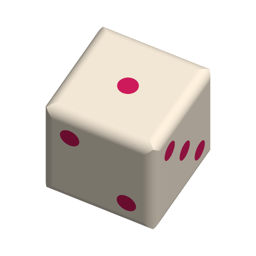

# Custom Dice



A six-sided die with rounded edges and its faces inlaid flush in a second
colour. Pick standard pips, numbers, your own words — an activity die for
kids: HOP, JUMP, SPIN, CLAP, SING, DANCE — or six picture shapes.

Face 1 is on top and face 6 on the bed; 2 faces the front, 5 the back, 3 the
right and 4 the left, so opposite faces add up to 7 as on a standard die. Each
face pattern is cut into the die and filled with the face colour, so nothing
stands proud and nothing needs supports: the bottom face's inlay is simply the
first layers, the side inlays are shallow pockets filled in the same layers.

Inspired by Printables' "Complete Giant Dice Set" (16.7k downloads) and the
smaller "Customizable Dice" customizers. Written to the Parametric Model Maker
customizer conventions, so the same file works unchanged on MakerWorld and in
ScadBuddy.

**Safety:** a 12–16 mm die is small enough to swallow. Not for children under
3; supervise younger players, or print at 30 mm and up.

## Parameters

### Die

| Parameter | Default | What it does |
|---|---|---|
| `size` | `20` | Edge length in mm, 12–40. |
| `rounding` | `2` | Radius of the rounded edges, capped at a fifth of `size`. `0` gives sharp edges. |
| `faces` | `pips` | `pips`, `numbers` (the 6 is underlined so it cannot be read as a 9), `custom_text`, or `emoji_shapes`: heart, star, moon, sun, cloud, lightning on faces 1–6. |
| `face_1` … `face_6` | `HOP`, `JUMP`, `SPIN`, `CLAP`, `SING`, `DANCE` | Words for `custom_text`, up to 8 characters each. Long words shrink to fit the face; short ones are left alone. An empty word leaves that face blank. |
| `font` | `DejaVu Sans:style=Bold` | Typeface for numbers and words (`// font`). |
| `inlay_depth` | `0.8` | Depth of the face inlays, 0.4–2 mm. |

### Batch

| Parameter | Default | What it does |
|---|---|---|
| `count` | `1` | Dice on the plate, 1–6: up to three in a row, 6 mm apart, then a second row. |

### Colours

| Parameter | Default | What it does |
|---|---|---|
| `die_color` | `#FFF3E0` | Die body. |
| `face_color` | `#D81B60` | Pips, numbers, words and shapes. |

## Colours and extruders

**The order of the `color` parameters in the source is the extruder order:**

| Parameter | Part | Extruder |
|---|---|---|
| `die_color` | die body | 1 |
| `face_color` | face inlays | 2 |

If every word is empty in `custom_text` mode there is no face part and the die
prints in one colour.

## Variations

- **Faces:** `pips`, `numbers`, `custom_text`, `emoji_shapes`.
- **Size:** 12–40 mm, with `rounding` from sharp to soft.
- **Batch:** up to six identical dice on one plate.

## Verifying

```bash
./verify.sh
```

Renders the defaults and 8 variations (every face style, 12 to 40 mm, sharp
and fully rounded, a blank face, a long word, deeper inlays, all faces blank,
batches of 2–6) and checks for each:

- the expected colour parts, nothing in `Default`, the exact bounding box the
  size and count imply, sitting on z = 0;
- from one closed render per colour: the parts do not overlap, the die plus
  its inlays has exactly the volume of a plain die (the inlays are flush —
  nothing proud, no gaps), every inlay vertex is within `inlay_depth` of the
  surface, each face with artwork has it on every die and a blank face has
  none, one die body per die;
- pips: face *k* carries *k* pips on every die, opposite faces add up to 7,
  and the pip volume is exactly 21 pip-sized discs `inlay_depth` deep.

Output lands in `.verify/`. The checking runs on the host with `python3` and
the standard library only.

## Needs a test print

- Balance: flush inlays of a similar filament keep the die fair, but it is not
  a casino die.
- Words on a 12 mm die come out about 1.5 mm tall with strokes near the
  nozzle width; use 20 mm and up for `custom_text`.
