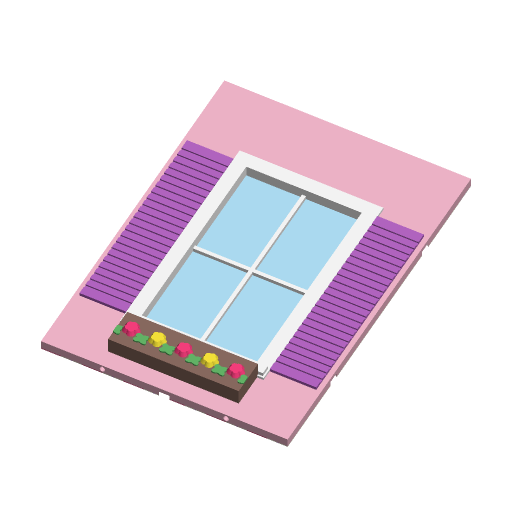
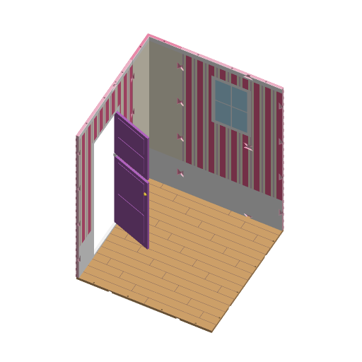
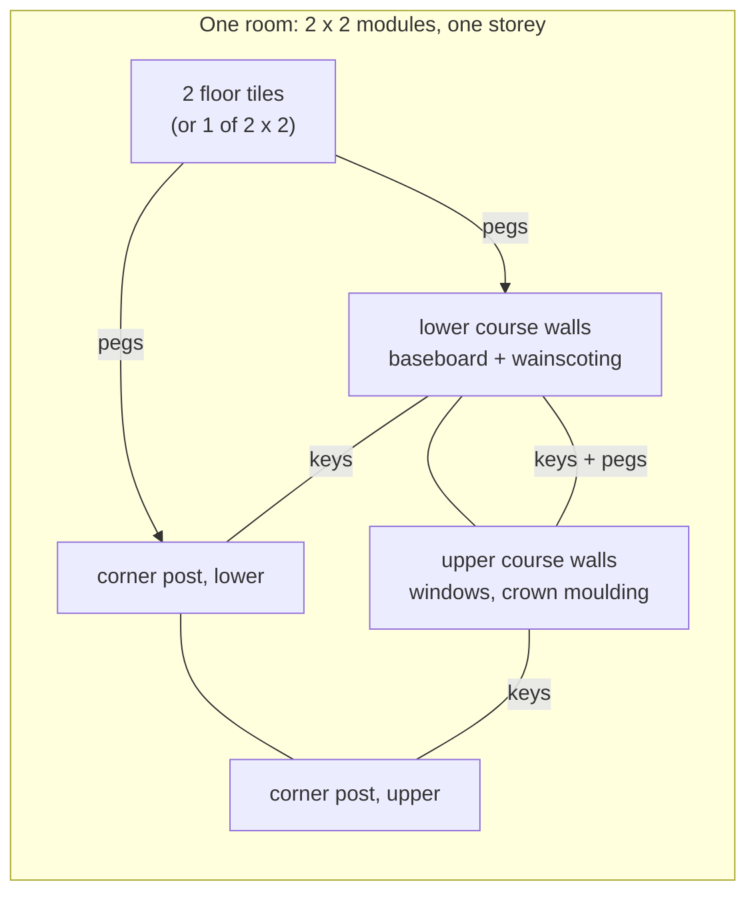
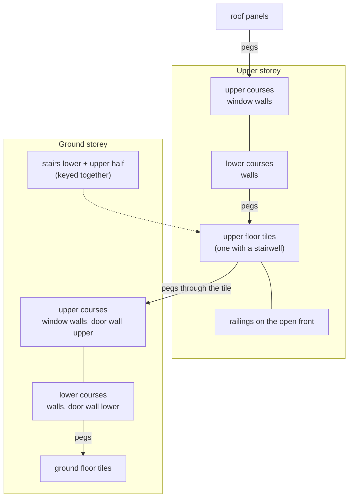

# Dollhouse Kit



A modular 1:6 ("playscale") dollhouse for 29-30 cm fashion dolls, printed as
panels on one grid and keyed together into as big a house as you want. One
template, one dropdown: walls, window walls, door walls, door leaves, corner
posts, floor tiles, roof panels, stairs, railings and the connectors. Every
piece made with the same **Grid** settings joins every other piece.



The second picture is the hidden `preview = "room"` mode: one back corner of a
2 x 2 module room, assembled. It is for this page only, not a print plate.

**Safety:** the keys, pegs and hinge pins are small parts and a choking hazard
for children under 3. Supervise play, and keep the connector bag away from
small children.

## Research

What the popular printable dollhouses do (checked 2026-09-26):

| Model | Site | Downloads | What it tells us |
|---|---|---|---|
| Fully Modular & Scaleable Dollhouse (6POiNT6, #1417985) | MakerWorld | 841 (1.2k likes, 218 prints) | Largest modular printed dollhouse: 124 parts, floors / walls / windows / doors / stairs / facades, click-together; 1:18, and the author says scale 300 % for 1:6 "if your bed allows" — at 1:6 its parts no longer fit a 300 mm bed, which is the gap this template fills. |
| A Modular Dollhouse Garden Cottage (#472786) | MakerWorld | 1.0k | Glue-free modular rooms, "build up and out". |
| Modular 3d Printed Doll House (L1076, #919649) | MakerWorld | 305 | Pink and white, ~2 kg of PLA for a small house; screws and rods. Shows the filament budget to expect. |
| #NoWalls Standard Dungeon Tiles (OpenLock/MagBall, #11945) | Printables | 2.4k | OpenLOCK: a clip slid into bow-tie slots that straddle the joint of two tiles, the most-used printable panel connector. The hourglass key here is the same idea. |
| Barbies dollhouse furniture (#1029620) | Printables | 527 | The most-downloaded explicitly 1:6 dollhouse item on Printables; there is no popular 1:6 *house* there. |

Playscale numbers: 1 ft = 50.8 mm at 1:6, so a 30 cm doll is a 5'9" person.
The grid module is 150 mm (0.9 m); a course is 210 mm and a room two courses,
420 mm (a 2.5 m ceiling); the door is 330 mm clear (1.98 m), which a 30 cm doll
walks through; the default window sits in the upper course 250-370 mm above the
floor, around the doll's eye height (about 280 mm).

Bed: the Bambu H2C's build volume is 330 x 320 x 325 mm, or 300 x 320 x
325 mm when both nozzles print. Every piece here, at every setting, fits a
**300 x 300 x 300 mm** envelope (verify.sh renders every piece at its largest
settings and checks this).

## How the pieces join

- **Hourglass keys** join any two pieces that meet edge to edge in one plane:
  wall to wall in line, wall to corner post, lower course to upper course,
  floor tile to floor tile, roof panel to roof panel, stair half to stair
  half, railing to railing. A key is a 14 x 20 x 3 mm plate with 45-degree
  flares; it presses into two half-pockets that straddle the joint and cannot
  pull out sideways. Wall pockets open on the **inside** face (the key sits
  flush with the wallpaper), floor and roof pockets on the **underside**, so
  the outside of the house stays clean.
- **Pegs** join pieces that stack: floor tile to the wall standing on it, and
  one storey to the next. Every floor tile has holes 3 mm across, half a wall
  thickness in from each edge, at every quarter module; walls, corner posts
  and railings have matching holes in their bottom and top edges. A storey
  peg goes up through the floor tile into the walls above and below it.
- **Walls stand on the outer band of the floor tiles**, outside face flush with
  the tile edge.
- **Corner posts are L-shaped with half-module arms**, so every wall joint
  falls half a module along the grid and walls of whole or half modules always
  meet. A side of *n* modules between two corners takes walls totalling
  *n* - 1 modules; a side of *n* modules from a corner to an open front takes
  *n* - 0.5.
- **Everything is exactly `units x module - 0.4 mm`** long (the 0.4 mm is the
  joint gap), so pieces tile at exact module pitch.





### Doors

A door spans both courses: `wall_door_lower` has the threshold and a small
hinge block at the top of the jamb, `wall_door_upper` has the header. The door
leaf is a **Dutch door** in two halves (`door_leaf_lower`, `door_leaf_upper`),
each hinged on a 2.4 mm pin: the lower leaf's own pin drops into the
threshold, a loose pin goes down through the hinge block into the top of the
lower leaf and up into the bottom of the upper leaf, and a second loose pin
goes down through the header into the top of the upper leaf. The floor or roof
above keeps the pins in. `french` doors hang a glazed pair the same way (print
the leaf plates, which carry both leaves, and two pin sets). Without leaves the
doorway is simply open.

Assembly: stand the lower door wall, tilt the lower leaf's pin into the
threshold and swing it upright under the hinge block, drop the short pin in;
set the upper leaf on the pin, lower the upper door wall over it, drop the long
pin through the header.

## Pieces

Sizes at the default settings (module 150, course 210, wall 6, floor 6).

| Piece | Size (mm) | Prints | Joins with |
|---|---|---|---|
| `wall` | units x 150 - 0.4, x 210, 6 thick | flat, inside face down | keys at both ends and along top and bottom edges, pegs top and bottom |
| `wall_window` | as `wall` | flat, inside face down | as `wall` |
| `wall_door_lower` / `wall_door_upper` | as `wall`, at least 1 unit | flat, inside face down | as `wall` (not across the doorway) |
| `door_leaf_lower` / `door_leaf_upper` | 98 x 199 (with its pin) and 98 x 124, 5 thick | flat, outside face up | hinge pins |
| `corner_post` | L, arms 74.6 from the outer corner, 210 tall | upright | keys at both arm ends, pegs top and bottom |
| `floor_tile` | units x depth units modules, 6 thick | flat, top up | keys along every edge underneath, peg holes through |
| `roof_panel` | as `floor_tile` | flat, top up | keys underneath, blind peg holes underneath |
| `stairs_lower` / `stairs_upper` | 144 x 213 and 123 x 243, 100 wide | on one side | keys through both stringers at the joint |
| `railing` | units x 150 - 0.4, x 150, 6 thick | flat | keys at both ends, pegs underneath |
| `connectors` | keys 14 x 20 x 3, pegs 3 x 16.5, hinge pins 2.4 | flat | — |

The stairs climb one storey (two courses plus a floor, 426 mm) in 12 steps of
35.5 mm rise and 24 mm tread; the lower half stands on its own back plate and
the upper half keys onto it. They fit along the side wall of a 2-module-deep
room under a floor tile with `stairwell` on.

## Parameters

### Piece

| Parameter | Default | What it does |
|---|---|---|
| `piece` | `wall_window` | Which piece to make (table above). |
| `course` | `upper` | Lower courses stand on the floor and get the baseboard and wainscoting; upper courses meet the ceiling and get crown moulding. Wallpaper and brick patterns also line up with the course below. Door walls know their own course. |

### Grid

Keep these the same for every piece of one house.

| Parameter | Default | What it does |
|---|---|---|
| `module_size` | `150` | Grid module, 100-150 mm. |
| `width_units` | `1` | Length of walls, railings, floor tiles and roof panels in modules, 0.5-2. |
| `depth_units` | `2` | Depth of floor tiles and roof panels, 0.5-2. |
| `course_height` | `210` | One wall course; a room is two. 180-240. |
| `wall_thickness` | `6` | Walls, corner posts and railings, 4-10. Keys are half of it (up to 3 mm) thick; below 5 mm the pegs and hinge pins get thin. |
| `floor_thickness` | `6` | Floor tiles and roof panels, 5-10. |

### Exterior

| Parameter | Default | What it does |
|---|---|---|
| `exterior` | `plain` | `siding` (clapboards, thick edge down), `brick` (running bond), `stone` (random widths), `stucco` (fine bumps), or `plain`. |
| `texture_size` | `12` | Brick course height; siding boards are 1.6x and stone rows 2.2x. |

### Interior

| Parameter | Default | What it does |
|---|---|---|
| `wallpaper` | `stripes` | `stripes` (with a pinstripe), `polka_dots`, `diamonds`, `hearts`, `stars` in two colours, or `none`. |
| `pattern_repeats` | `6` | Repeats per module. Patterns are anchored to the grid and continue across wall joints and courses. |
| `wainscoting` | `true` | Lower courses: panelling up to `wainscot_height` with a rail. |
| `wainscot_height` | `90` | From the floor. |
| `baseboard` | `true` | Lower courses: 14 mm baseboard. |
| `crown_moulding` | `true` | Upper courses: 12 mm crown. |

### Windows

| Parameter | Default | What it does |
|---|---|---|
| `window_style` | `square` | `square`, `arched` (round top), `round`. |
| `window_width` | `70` | Opening width (round: diameter). Shrinks to leave room for the end keys. Whenever a window setting, the shutters or the flower box cannot be honoured, the render prints a `NOTE:` saying what was made instead. |
| `window_height` | `120` | Opening height; limited so the top clears the top-edge pegs and keys. |
| `window_sill` | `40` | Bottom of the opening above the bottom of the course. |
| `window_panes_x`, `window_panes_y` | `2`, `2` | Glazing bars. |
| `glass` | `true` | 0.6 mm pane on the inside face, in `window_pane_color` (translucent filament looks best). |
| `shutters` | `true` | Louvred shutters either side, as wide as there is room for (none on round windows or when under 10 mm). |
| `flower_box` | `true` | A box under the sill with blossoms in two colours and leaves. |
| `trim` | `true` | Frame lining in the opening, architrave (flush inside, raised outside), sill, door threshold and hinge blocks in their own colours. Off: all wall colour, except the glazing bars, which stay in `window_frame_color`. |

### Doors

| Parameter | Default | What it does |
|---|---|---|
| `door_style` | `plain` | `plain` and `arched` hang one Dutch-door leaf; `french` a glazed pair. |
| `door_width` | `100` | Clear width. A width, height or `width_units` the wall cannot take is reduced (or raised to 1 unit) with a `NOTE:`. |
| `door_height` | `330` | Clear height above the threshold; the header keeps at least 25 mm. |
| `door_panels` | `2` | Raised panels per leaf half. |

### Floors & roof

| Parameter | Default | What it does |
|---|---|---|
| `floor_texture` | `wood_planks` | `wood_planks` (seams and staggered ends), `herringbone` (two colours), `tiles` (grout lines), `checkerboard`, `plain`. |
| `planks_per_module` | `8` | Plank width = module / this. Herringbone lines up across tiles when this is a multiple of 4. |
| `tiles_per_module` | `5` | Tile size for tiles and checkerboard; also shingle and roof-tile rows. |
| `rug` | `none` | `rectangle` or `oval` inlaid in the middle, with a border. |
| `stairwell` | `false` | Cut a slot along the tile's left edge for the stairs (turn the tile round for the right edge). |
| `roof_style` | `shingles` | `shingles` (raised, a scatter in the accent colour), `tiles` (half-round ridges over accent valleys), `flat` (accent border). |

### Stairs & railing

| Parameter | Default | What it does |
|---|---|---|
| `stair_width` | `100` | Including both 6 mm stringers. |
| `tread_depth` | `24` | Tread; reduced if a half would be longer than 290 mm. |
| `railing_height` | `150` | 0.9 m at 1:6. |

### Connectors

| Parameter | Default | What it does |
|---|---|---|
| `connector_type` | `keys` | `keys`, `pegs`, or `hinge_pins` (a short and a long pin per leaf). |
| `connector_count` | `12` | How many (hinge pins: sets per door). |

### Fit

| Parameter | Default | What it does |
|---|---|---|
| `clip_clearance` | `0.2` | Play per side between key and pocket (0.28 across the 45-degree flares) and around pegs and hinge pins. Raise it if keys need a mallet. |

## Colours and extruders

**The order of the colour parameters is the extruder order.** A piece only
produces the colours it uses, and parameters with the same value merge into
one part (the defaults use white for eleven of them). Tabs:

| # | Parameter | Default | Used on |
|---|---|---|---|
| 1 | `wall_color` | `#F8BBD0` | wall body, plain outside face |
| 2 | `exterior_color` | `#F48FB1` | siding, brick, stone, stucco; corner post body when not plain |
| 3 | `mortar_color` | `#FFFFFF` | brick and stone joints |
| 4 | `trim_color` | `#FFFFFF` | window sills, door thresholds |
| 5 | `wall_inside_color` | `#FFF8E1` | inside face background |
| 6 | `wallpaper_color` | `#F06292` | wallpaper, first colour |
| 7 | `wallpaper_color_2` | `#CE93D8` | wallpaper, second colour |
| 8 | `wainscot_color` | `#FFFFFF` | wainscoting |
| 9 | `baseboard_color` | `#FFFFFF` | baseboard and wainscot rail |
| 10 | `crown_color` | `#FFFFFF` | crown moulding |
| 11 | `window_frame_color` | `#FFFFFF` | window lining, architrave, glazing bars |
| 12 | `window_pane_color` | `#B3E5FC` | window and french-door glass |
| 13 | `shutter_color` | `#BA68C8` | shutters |
| 14 | `flower_box_color` | `#A1887F` | flower box |
| 15 | `flower_color` | `#FF4081` | blossoms |
| 16 | `flower_color_2` | `#FFEB3B` | blossoms, alternate |
| 17 | `leaf_color` | `#66BB6A` | leaves |
| 18 | `door_frame_color` | `#FFFFFF` | door lining, architrave, hinge blocks |
| 19 | `door_color` | `#9575CD` | door leaves |
| 20 | `door_knob_color` | `#FFD54F` | knob (both faces) |
| 21 | `floor_color` | `#D7A86E` | floor |
| 22 | `floor_accent_color` | `#8D6E63` | seams, herringbone, grout, checkerboard |
| 23 | `rug_color` | `#80DEEA` | rug |
| 24 | `rug_border_color` | `#FFFFFF` | rug border |
| 25 | `roof_color` | `#7E57C2` | roof |
| 26 | `roof_accent_color` | `#B39DDB` | odd shingles, tile valleys, flat-roof border |
| 27 | `stair_tread_color` | `#C8945A` | treads |
| 28 | `stair_riser_color` | `#FFFFFF` | risers and stringers |
| 29 | `railing_color` | `#FFFFFF` | railing posts and rails |
| 30 | `spindle_color` | `#F06292` | spindles |
| 31 | `clip_color` | `#FFFFFF` | keys, pegs, hinge pins |

The busiest piece, a lower-course window wall with brick, wallpaper, wainscot,
shutters and a flower box, uses 16 of them at once.

### Where the colour changes are (purge)

Every colour change on one nozzle costs a purge, so the orientations keep
colour detail in few layers:

- **Walls** lie on their inside face. Wallpaper, wainscoting, baseboard, crown
  and the inside frame are a 0.6 mm inlay: layers 1-3. The glass is also in
  layers 1-3. Brick, stone and stucco put the mortar or stucco colour in the
  top 3 layers of the wall and the bricks in the next 6; frames, shutters,
  sills and the flower box sit on top, blossoms and leaves on the box. A wall
  has no colour changes in its middle layers except the frame lining and
  glazing bars.
- **Floor tiles and roof panels**: the pattern, rug and accent are the top 3
  layers (shingles and roof tiles 4 and 15 more).
- **Corner posts** stand up, so their colours run through the height: the body
  colour, the inside colour, and horizontal bands (baseboard, wainscot, rail,
  crown, mortar lines) only in their own layers. Wallpaper patterns are not
  carried onto corner posts for that reason.
- **Stairs** lie on their side, so treads and risers share every middle
  layer. Give `stair_tread_color` and `stair_riser_color` the same value to
  print them in one colour, or put them on the H2C's two nozzles.
- **Door leaves**: knob disc in layers 1-3, panels and the knob dome on top;
  french-door glass in layers 1-3.

## Starter house: 2 rooms, 2 storeys

One room per storey, each 3 modules wide x 2 deep (450 x 300 mm outside),
open at the front, flat roof, a Dutch door in the ground-floor
left wall, stairs along the ground-floor right wall up into a stairwell, and a
railing along the open front of the upper floor. About 450 x 300 x 860 mm.

| Piece | Settings | Count | Typical g each | Solid g each |
|---|---|---|---|---|
| `floor_tile` | 1.5 x 2 units, wood planks | 3 | 199 | 497 |
| `floor_tile` | 1.5 x 2 units, `stairwell` | 1 | 107 | 266 |
| `corner_post` | lower | 4 | 89 | 222 |
| `corner_post` | upper | 4 | 89 | 222 |
| `wall` | 2 units, lower (back walls) | 2 | 186 | 464 |
| `wall_window` | 2 units, upper (back walls) | 2 | 183 | 457 |
| `wall` | 1.5 units, lower (side walls) | 3 | 139 | 348 |
| `wall_window` | 1.5 units, upper (side walls) | 3 | 137 | 341 |
| `wall_door_lower` + `wall_door_upper` | 1.5 units | 1 + 1 | 81 + 104 | 204 + 261 |
| `door_leaf_lower` + `door_leaf_upper` | | 1 + 1 | 107 + 67 | 134 + 84 |
| `stairs_lower` + `stairs_upper` | | 1 + 1 | 262 + 170 | 328 + 213 |
| `roof_panel` | 1.5 x 2 units | 2 | 221 | 552 |
| `railing` | 1.5 units | 2 | 51 | 127 |
| `connectors` keys | | 48 | 0.5 | 0.7 |
| `connectors` pegs | | 74 | 0.1 | 0.14 |
| `connectors` hinge pins | | 1 set | 0.5 | 0.6 |

Total about **4.3 kg** of PLA typical (10 kg if printed solid). "Solid" is
the rendered volume at 1.24 g/cm3; "typical" assumes 2 walls, 4 top and 4
bottom layers and 15 % infill, which for these 6 mm panels is about 40 % of
solid (80 % for the stairs, leaves and connectors, which are mostly
perimeter). Keys: 8 per course at the corners, 7 across course joints, 2 per
floor or roof joint, 2 in the stairs (47, one spare). Pegs: one per hole along every wall, corner and
railing bottom edge, and one per hole between storeys and under the roof.

## Variations

- Bigger houses: more floor tiles and walls. Interior partitions are not a
  separate piece; put two rooms side by side, each with its own walls.
- A modern dream house: `exterior = "stucco"`, `roof_style = "flat"`,
  `window_style = "square"` with `shutters = false`, railings along the roof.
- A cottage: `exterior = "siding"`, `window_style = "arched"`, flower boxes,
  `door_style = "arched"`.
- A townhouse: `exterior = "brick"`, `door_style = "french"` on 2-unit walls.
- Half-unit walls (`width_units = 0.5`) close a side that ends at an open
  front.

## What needs a test print

- Key fit at `clip_clearance = 0.2` on the H2C (keys should press in by hand
  and not fall out); the pocket roofs are 20 mm bridges.
- Peg holes in the wall edges are horizontal teardrops 3.4 mm across in a 6 mm
  wall.
- The Dutch-door hinge: pin 2.4 mm in a 2.8 mm hole, the lower leaf's pin
  printed as a short octagonal cantilever.
- The corner post standing 210 mm tall on a 75 x 75 mm L footprint (use a
  brim if it wobbles).
- The stairs' top stringer bridges over 30-40 mm gaps.
- The 23 mm legs either side of a 1-unit door wall's opening are stiff enough
  once keyed to their neighbours, but floppy on their own.

## Verifying

```sh
./verify.sh
```

Renders every piece with its defaults, the style variations above, every
piece at its largest settings, eight "max colour" cases with all 31 colours
distinct, three cases whose settings cannot all be honoured, and the room
preview (69 cases), renders the closed per-colour
solids of 21 of them, then runs 26 fit probes. It
checks colour parts and no Default geometry, that the per-colour closed solids
add up to the whole piece (no two colours overlap), the 300 mm bed envelope,
exact grid lengths, key and peg play, mated pieces not intersecting, a
320 mm-tall doll-sized box passing through the door (and a 331 mm one not),
the window height against a doll's eye, the NOTE lines a piece prints when it
cannot be what was asked for (and that the defaults print none), and render
time per piece. Output goes
to `.verify/`; it exits non-zero on any failure.
