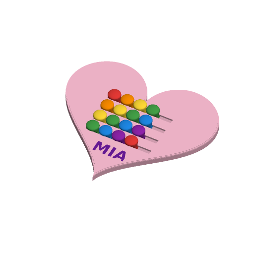

# Fidget Slider Board



A print-in-place sliding fidget toy. The board is a heart, star, dinosaur,
rounded rectangle or circle. It carries rows of straight tracks, and each
track holds a row of beads with round knobs. Every row has an empty place, so
the beads can be pushed back and forth along their track. The beads print
already inside their tracks and come off the plate free. Nothing needs
assembling or gluing.

It is inspired by the most-downloaded sliding fidgets on Printables when this
was written (2026-09-27): "Triangle Sliding Fidget Toy" by Martin Šlefr
(10,295 downloads) and "Slider Fidget" by TomoDesigns (4,136). It also borrows
the captured-slider idea of zcassell's "Print in Place Sliding Number Puzzle"
(10,733). It is written to the Parametric Model Maker customizer conventions, so
the same file works unchanged on MakerWorld and in ScadBuddy.

A push-pop board was the other option. Pop-it bubbles only work in a flexible
filament with very thin walls, so this template uses sliders, which print
reliably in PLA.

## How a bead is held

Across a track, a bead has this shape:

- a stem, 4.4 mm wide, runs through a slot in the bottom of the board;
- it widens at 45° to 8.4 mm in the middle, inside the board;
- it narrows at 45° to a stem through a slot in the top;
- it ends in a round knob above the board.

The track is the same shape, `clearance` bigger all round, and it is closed
at both ends. The wide middle cannot pass either slot, so a bead cannot lift
out, drop out or leave its track. It can only slide along it.

The knob's underside is a 45° cone that starts `clearance` above the board. So
every overhang, on the beads and on the board, is 45° or less, and nothing
needs support. The bottom 0.3 mm of every bead is set in and the bottom slot
is flared by 0.3 mm, so first-layer squish (elephant's foot) cannot weld a
bead to its track.

The board is 8 mm thick. A bead stands about 16–21 mm tall, depending on its size and the clearance.

## Where the rows go

The tracks are fitted into the shape with at least 3 mm of board between any
track, knob or the name and the edge.

- Each row gets as many beads as fit, up to `beads_per_row`.
- The stack of rows, with the name under it, is slid up and down the shape to
  the position where the most beads fit, with the name first.
- A row that does not fit the shape at all is left out.
- If not even one bead fits with the free room asked for, the free room is cut
  half a place at a time until one does.

In each of these cases the render log says so with a `NOTE:` line. The log's
`SB_FIDGET` line lists the beads in each row.

## Parameters

### Board

| Parameter | Default | What it does |
|---|---|---|
| `shape` | `heart` | `heart`, `star` (five rounded points), `dinosaur` (a long-necked dinosaur facing right), `rounded_rectangle` (1 : 0.78) or `circle`. |
| `board_size` | `180` | The board's longest side in mm, 100–280. |

### Beads

| Parameter | Default | What it does |
|---|---|---|
| `rows` | `4` | Rows of tracks, 1–10. Rows that do not fit the shape are left out. |
| `beads_per_row` | `4` | Beads in each row, 1–10. A row that is too short for them holds fewer. |
| `bead_size` | `15` | Knob diameter in mm, 12–20. Beads are 1 mm apart along a row, and rows are `bead_size` + 2 mm apart. |
| `free_places` | `1` | Empty room left in every row, in bead places, 0.5–3. At 1, the whole row can move one place. |
| `clearance` | `0.4` | Gap per side between each bead and its track, 0.25–0.6 mm. Raise it if beads print stuck, lower it if they rattle. |

### Colours

| Parameter | Default | What it does |
|---|---|---|
| `color_pattern` | `diagonal` | `rows`: one colour per row. `columns`: one colour per column. `diagonal`: the colours run in rainbow diagonals. |
| `bead_colors` | `6` | How many of the eight bead colours to use, 1–8. The pattern cycles through them. |
| `board_color` | `#F8BBD0` | The board. |
| `bead_color_1` … `bead_color_8` | red, orange, yellow, green, blue, purple, cyan, pink | Bead colours, in the order the pattern uses them. |
| `name_color` | `#6A1B9A` | Name letters. |

### Name

| Parameter | Default | What it does |
|---|---|---|
| `name` | `MIA` | Up to 12 characters, inlaid flush into the board below the rows. Leave empty for none. |
| `font` | `DejaVu Sans:style=Bold` | Typeface. ScadBuddy fills this dropdown from the fonts installed in the image. |
| `name_size` | `14` | Largest letter height in mm, 8–30. A long name is made smaller to fit the shape, down to 6 mm. Below that it is left out, and a `NOTE:` says so. |

## Colours and extruders

**The order of the `color` parameters in the source is the extruder order:**

| Parameter | Part | Extruder |
|---|---|---|
| `board_color` | board | 1 |
| `bead_color_1` | beads | 2 |
| `bead_color_2` | beads | 3 |
| `bead_color_3` | beads | 4 |
| `bead_color_4` | beads | 5 |
| `bead_color_5` | beads | 6 |
| `bead_color_6` | beads | 7 |
| `bead_color_7` | beads | 8 |
| `bead_color_8` | beads | 9 |
| `name_color` | name inlay | 10 |

Only the bead colours the pattern uses are made. At the defaults that is six,
so the default print uses eight filaments. Equal colours merge into one part
and one filament, so set `bead_colors` to 1 for single-colour beads. With no
name there is no name part.

Each bead is one colour from the bed to the top of its knob, so every layer
up to the knobs changes colour on each bead. With many colours that is a lot
of purging. Fewer `bead_colors`, or `rows` with one colour per row, prints
faster.

## Printing

- Print it as it lies, flat on the bed, with no supports and no brim. A brim
  would bridge the bottom slots.
- Use 0.2 mm layers and a 0.4 mm nozzle. Use elephant-foot compensation if
  your slicer has it, even though the bottoms are already set in.
- When it comes off the plate, push every bead to both ends of its track to
  free it. If one is stuck, work it back and forth rather than forcing it.

## Safety

The beads are captured, but a bead snapped off its stem is a small part and a
choking hazard for children under 3. Supervise young children, and check the
beads now and then.

## Verifying

```bash
./verify.sh
```

It renders the defaults and eight variations in `scadbuddy-verify:local`:

- every shape;
- every colour pattern;
- names that fit, that shrink to fit, and that do not fit;
- the biggest beads at the loosest clearance with three free places;
- one tiny bead at the tightest clearance with half a free place;
- the smallest heart and dinosaur with the biggest beads, where rows are
  dropped and the free room is cut.

For each one it checks:

- the plate has exactly the colour parts the pattern implies, nothing on the
  `Default` material, and sits on z=0;
- it is as tall as a bead, its longest side is `board_size`, and it fits the
  300 × 320 bed;
- the render log carries the `NOTE:` lines the case expects, and no others;
- **the print is exactly the board plus one separate piece per bead.** A bead
  fused to its track, or to its neighbour, would merge two;
- **every bead is at least `clearance` from the board and from the next
  bead.** A hidden `probe_gap` render grows each bead and intersects it with
  the board and its neighbour. At `clearance - 0.03` the result must be empty.
  At `clearance + 0.03` it must touch the track of every bead, which proves the
  probe measures the real gap;
- **every bead is captured.** Moved 1.5 mm up, 1.5 mm down or 1.5 mm sideways,
  every bead hits the board;
- **every row can slide.** Each bead is swept along its track by the free
  room, grown by `clearance - 0.03`, and must touch nothing;
- every track, knob and the name stay at least 3 mm inside the outline;
- rendered once per colour the way ScadBuddy builds its closed parts, the
  colour parts do not overlap. The volume of the union equals the sum of the
  parts.

The 3MF and STL parsing runs on the host with `python3` and the standard
library only.

Some things need a physical test print:

- how freely the beads slide at 0.4 mm on a real printer;
- whether the 45° cones inside the track sag enough to drag at the tightest
  clearance;
- how well the 4.4 mm stems stand up to rough play.
