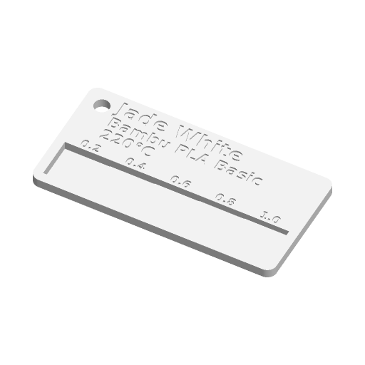

# Filament Swatch Card



A flat card for cataloguing spools. The colour name, brand, material and print
temperature are debossed into the face (one filament) or inlaid flush in a
second colour. A row of stepped windows, 0.2 mm thick at the thin end and
0.2 mm thicker at each step, shows how the filament looks and lets light
through at different wall thicknesses; each window is labelled with its
thickness. A hole in the corner takes a swatch ring.

Inspired by the Printables "Filament swatch" customizer; written to the
Parametric Model Maker customizer conventions, so the same file works
unchanged on MakerWorld and in ScadBuddy.

## Parameters

### Info

| Parameter | Default | What it does |
|---|---|---|
| `brand` | `Bambu` | Up to 16 characters. |
| `material` | `PLA Basic` | Up to 16 characters. In landscape it shares a line with the brand. |
| `color_name` | `Jade White` | Up to 20 characters. The top line, and the largest. |
| `temp` | `220°C` | Up to 10 characters. DejaVu has the degree sign; with a face that lacks it, write `220C`. |
| `font` | `DejaVu Sans:style=Bold` | Typeface for all lettering. ScadBuddy fills this dropdown from the fonts installed in the container (`// font`). |

Each line shrinks to fit the card's width; the other lines are never larger
than the colour name. Empty lines are left blank.

### Card

| Parameter | Default | What it does |
|---|---|---|
| `width` | `80` | Long side in mm (60–100). |
| `height` | `40` | Short side in mm (30–60). |
| `thickness` | `3.2` | Card thickness in mm (2–4). |
| `step_count` | `5` | Number of windows (3–8), floors 0.2, 0.4, … `0.2 × step_count` mm. |
| `hole` | `true` | 5 mm hole for a swatch ring: top-left in landscape, top centre in portrait. |
| `text_mode` | `deboss` | `deboss`: lettering cut 0.6 mm into the face, one filament. `inlay`: the same pockets filled flush with `text_color`. |
| `orientation` | `landscape` | `landscape`: `width` × `height`, windows in a row along the bottom with their labels above, text top-left. `portrait`: `height` × `width`, text centred at the top, windows stacked in the lower 45 % with their labels to the left. |

The window band is 34 % of the card height in landscape; the cards keep a
3 mm full-thickness rim and 3 mm rounded corners.

### Colors

| Parameter | Default | What it does |
|---|---|---|
| `swatch_color` | `#FFFFFF` | The card. Set it to the filament being catalogued. |
| `text_color` | `#000000` | Lettering, inlay mode only. |

## Colours and extruders

**The order of the `color` parameters in the source is the extruder order**:

| Parameter | Part | Extruder |
|---|---|---|
| `swatch_color` | card | 1 |
| `text_color` | lettering (inlay mode only) | 2 |

In deboss mode the lettering is not a part at all — the render contains
exactly one material, so the card prints on a single spool without an AMS.

## Variations

- **Text mode** — debossed (single filament) or inlaid (two colours, flush).
- **Orientation** — landscape or portrait.
- **Step count** — 3 to 8 windows; 8 goes up to 1.6 mm.

## Printing notes

- Prints face up, flat on the bed, no supports. The window floors are solid
  layers from the bed up, so they come out at exactly 0.2 mm multiples only
  with a 0.2 mm layer height (first layer included).
- Step labels are sized to the window width: at 60 mm and 8 steps they drop to
  about 2 mm, which reads on a 0.4 mm nozzle but not generously.

## Text fitting

OpenSCAD's `textmetrics()` is still an experimental feature and is not enabled
on MakerWorld, so the fit uses DejaVu Sans Bold advance widths measured
offline at size 10 (a hidden table in the source). Other faces are fitted with
the same table, which is on the wide side for most of them.

## Verifying

```bash
./verify.sh
```

Renders the defaults and six variations (inlay, portrait, portrait inlay with
8 steps on a 2 mm 100 × 60 card, 3 steps with no hole on a 4 mm 60 × 30 card,
8 steps on the smallest card, and inlay with every text field empty) in
`openscad/openscad:dev` and checks, for each: exactly one material in deboss
mode and two in inlay, no triangles on `Default`, the card's width, height and
thickness, the model on z = 0, horizontal faces at exactly 0, each window
floor (0.2, 0.4, …), the deboss floor and the top — and nowhere else — and
the card's volume against the volume the steps imply. Each colour is then
re-rendered alone with a `color()` override, the way ScadBuddy builds closed
parts; the lettering must span `thickness − 0.6 .. thickness`, and the
per-colour volumes must add up to the whole model's volume.

The 3MF/STL parsing runs on the host with `python3` and the standard library
only.
