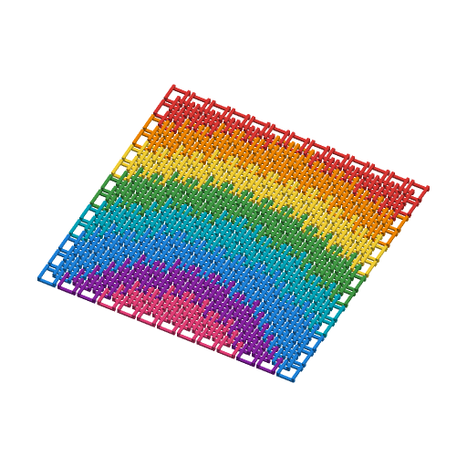

# Flexi Fabric



A sheet of small interlocking links that prints flat, in place, with no
supports, and comes off the plate able to drape, fold and squish like fabric.
Every link is its own loose piece, linked to its neighbours like chainmail;
nothing is fused. Pick a link pattern, an outline, a colour scheme, and
optionally lay a picture across it.

Inspired by MakerWorld's
[Flexi Fabric Fidget](https://makerworld.com/en/models/2550125-flexi-fabric-fidget)
("a dense network of small interlinked elements that are printed in place
without being fused together") and, for the triangle pattern, Rossero's
[TriFlex - Super Flexible Fabric](https://makerworld.com/en/models/1958162-triflex-super-flexible-fabric)
(also on [Printables](https://www.printables.com/model/1460006), 7,908
downloads). MakerWorld only serves its pages to browsers, so the mechanism was
worked out from the descriptions and photos there and from the two most
downloaded print-in-place chainmail fabrics on Printables:
[Fabric/Chainmail Fidget](https://www.printables.com/model/1538278) by Molodos
(9,743 downloads; 0.2 mm layers, no supports, dual-colour profile) and
Flowalistik's [Chainmail 2.0](https://www.printables.com/model/288) (3,622
downloads). No geometry was copied; every link here is generated from the
parameters.

Written to the MakerWorld Parametric Model Maker customizer conventions, so the
same file works unchanged on MakerWorld and in ScadBuddy.

**Safety:** a sheet is hundreds of small loose links. If one breaks free it is
a choking hazard for children under 3; supervise younger children and check
the sheet for broken links.

## How it works

Every link is a closed loop of straight bars at two or three heights
("levels"), joined at its corners by posts that stand on the bed. Neighbouring
links overlap in plan: each link's corner post stands inside the neighbour's
loop, and where the two loops cross, one bar passes over and the other under.
Two loops that cross once over and once under are linked like chain links, so
a link cannot be lifted out, and there is `clearance` of air between any two
links everywhere, sideways and vertically.

Level-0 bars lie on the bed. Higher bars bridge between their own link's
posts, so the only thing ever printed over air is a short straight bridge
(3-13 mm). The link spacing is set so that a post's slack inside its
neighbour's loop equals the gap to the next link along the row — the loosest,
most fabric-like spacing that still keeps every gap at least `clearance`.

## Patterns

| `pattern` | Link | Lattice | Levels | Height at defaults | Smallest `link_size` at 0.3 mm clearance |
|---|---|---|---|---|---|
| `square_links` | square loop | checkerboard, 4 neighbours (diagonal) | 2 | 2.2 mm | 5 (bar 1.0) |
| `chainmail_rings` | round ring, posts at 45° | checkerboard, 4 neighbours | 2 | 2.2 mm | 8 (bar 0.8) |
| `diamond` | square loop turned 45° | rows and columns, 4 neighbours | 2 | 2.2 mm | 6 (bar 0.8) |
| `hex_scales` | hexagon | triangular, 6 neighbours | 3 | 3.6 mm | 6.5 (bar 0.8) |
| `triflex_triangles` | up and down triangles | honeycomb, 3 neighbours | 3 | 3.6 mm | 10 (bar 0.8) |

- **Two levels** suffice when every link has four neighbours: in the square
  weave, sides along X lie on the bed and sides along Y bridge over them.
- **Hexagons need three.** With six neighbours, the three edges leaning one
  way would all have to differ from each other, so they take levels 0/1/2 and
  the other three 2/0/1. Every crossing pair is then at different heights and
  every neighbour pair still crosses once over, once under.
- **TriFlex triangles** are the triangle idea done this way: hollow up and
  down triangles on a honeycomb, each up triangle's corner standing in the
  corner of the down triangle it points at. The real TriFlex uses solid
  three-armed plates with columns and bridges; this is a hollow-loop
  interpretation of the same triangular layout, not a copy of that mechanism.
- **`dragon_scales` was dropped.** A pointed scale's tip has to reach the row
  below it, and in a flat, one-body-per-link mesh that tip collides with the
  next row: all 24 tip-length / row-spacing combinations tried in the
  prototype came out with negative clearance, as did a stretched (pointed)
  hexagon. The hexagon pattern is the closest printable relative.

**`link_size` and `bar_width` are adjusted automatically.** If the links would
come closer than `clearance`, the bar width is reduced in 0.1 mm steps down to
0.8 mm (two 0.4 mm lines); if that is still not enough, `link_size` is raised
in 0.5 mm steps. The render log says so (`NOTE:` / `WARNING:`). `link_size` is
also capped at a quarter of the sheet's narrower side, so there are always
several links across.

`square_links` and `diamond` spacing is exact (closed form in `model.scad`).
The other three use linear fits of the spacing and clearance measured with a
geometry prototype that places the links and computes every piece-to-piece
gap and the linking number of every pair; `verify.sh` then measures the real
rendered gaps (below).

## Parameters

### Fabric

| Parameter | Default | What it does |
|---|---|---|
| `shape` | `rectangle` | Sheet outline: rectangle, circle/ellipse, hexagon, heart, star. A link is placed when its whole bounding box is inside the outline; links left with no neighbour are dropped. A star or heart too small for two links falls back to the rectangle. |
| `width` | `120` | Sheet width, mm (40-300). |
| `height` | `120` | Sheet height, mm (40-300). |
| `pattern` | `square_links` | Link pattern, see above. |
| `link_size` | `8` | Link size across its widest point, mm (5-15). |
| `clearance` | `0.3` | Air gap between links, mm (0.2-0.6), both sideways and between levels. |

### Print

| Parameter | Default | What it does |
|---|---|---|
| `layer_height` | `0.2` | Layer height all heights are multiples of. |
| `bar_layers` | `4` | Bar thickness in layers (0.8 mm at 0.2). |
| `bar_width` | `1.2` | Widest bar to use, mm; reduced automatically (see above), never below 0.8. |

The vertical gap between levels is `max(2, ceil(clearance / layer) + 1)`
layers — 0.6 mm at the defaults. The extra layer allows for the first layer of
a bridge sagging.

### Colours

| Parameter | Default | What it does |
|---|---|---|
| `colour_mode` | `rainbow` | `single`, `checker`, `stripes` (vertical), `rows` (horizontal), `gradient_bands` (left to right), `rainbow` (arcs, `palette_1` outermost), `random_seeded`, `overlay_only` (all `palette_1`, plus the overlay). |
| `colour_count` | `8` | How many palette colours `stripes`, `rows`, `gradient_bands`, `rainbow` and `random_seeded` use. |
| `stripe_width` | `2` | Stripe / row width in links. |
| `seed` | `7` | Seed for `random_seeded`. |
| `palette_1` … `palette_8` | red, orange, yellow, green, teal, blue, purple, pink | The palette. `palette_1` is the single / base colour. |
| `two_tone` | `false` | The top layers of every bar and post take `top_color`. |
| `top_layers` | `2` | Layers of top colour (at most `bar_layers - 1`); also the depth of the exact-outline overlay. |
| `top_color` | `#FFFFFF` | Top-layer colour. |

`checker` gives every link a different colour from every link it interlocks
with: two colours (`palette_1`, `palette_2`) for the four-neighbour patterns
and TriFlex (up triangles vs down triangles), three (`palette_1`-`palette_3`)
for hexagons.

### Overlay

| Parameter | Default | What it does |
|---|---|---|
| `overlay_file` | *(empty)* | Upload an SVG or PNG in the customizer (a `// file:svg,png` parameter, #204), or give a bare file name in this model's directory (`sample-overlay.svg`, `sample-overlay.png`). Empty = no overlay. A path (`/`, `\`) or a leading dot is refused and turns the overlay off, so the parameter cannot read files outside the model. |
| `overlay_type` | `auto` | `auto` picks by extension: `.png` goes through `surface()`, anything else is imported as an SVG. `svg` imports the outline; `png_threshold` reads a PNG through `surface()` and keeps the pixels darker than `image_threshold`. The old value `image_threshold` still works (see below). |
| `overlay_detail` | `links` | `links`: every link whose centre falls inside the picture takes `overlay_color` whole, so the picture appears in link-sized pixels. `inlay`: the exact outline, cut into the top `top_layers` of the links it covers. |
| `overlay_color` | `#212121` | Overlay colour. |
| `overlay_scale` | `80` | Picture width as % of the sheet width (aspect kept). |
| `overlay_x`, `overlay_y` | `0` | Move the picture, mm. |
| `overlay_rotation` | `0` | Rotate the picture, degrees. |
| `image_threshold` | `50` | Brightness cut-off (%) for images. |
| `overlay_invert` | `false` | Swap picture and background. |

**`overlay_type` value renamed (#318).** The PNG choice's value is
`png_threshold`; it was `image_threshold`, the same spelling as the numeric `image_threshold` parameter. The
model still reads the old value as `png_threshold`, so saved presets and past outputs
that hold it render exactly as before, with no migration step. The customizer does
not offer the old value, so a preset that holds it shows no matching dropdown
choice, and saving that preset again is refused (422, not one of the options) until
the PNG choice is re-picked.

**Getting a picture in.** In a ScadBuddy with file parameters (#204, shipped by
PR #231), drop an SVG or PNG on the `overlay_file` field; on an older ScadBuddy the
field is a plain text box, so type a bare file name as below. The customizer uploads it and the render stages it next to
`model.scad` under a generated bare name, so a PNG is picked up by
`overlay_type = auto` without changing anything else. Outside ScadBuddy (or to
use a file shipped with the model), type a bare file name in this model's
directory. Two samples ship with the model: `sample-overlay.svg` (a heart) and
`sample-overlay.png` (a 96 x 96 black star on white). A name that does not
exist does not break the render: OpenSCAD logs `ERROR: Can't open file ...`,
still exits 0, and the sheet renders without the picture (ScadBuddy reports it
as a job warning).

**How whole-link recolouring works.** OpenSCAD cannot ask whether a point is
inside an imported picture, so it is answered with geometry: a 0.02 mm dot at
every link centre is intersected with the picture, any dot that is hit is
restored to a whole dot, and the Minkowski sum of those dots with the link's
footprint is the union of the footprints of exactly the links that were hit.
Links are split into classes that never overlap in plan (the `checker`
classes), so within a class that mask covers whole links and never touches
another. Both overlay modes are clipped to the links themselves, so the
overlay never fills or bridges a clearance gap.

## Colours and extruders

**The order of the `color` parameters in the source is the extruder order.**
Each distinct colour is one part and one filament; a parameter the chosen mode
does not use produces no part and takes no extruder, and later ones move up.

| Parameter | Part | Extruder |
|---|---|---|
| `palette_1` … `palette_8` | links of that palette colour | 1-8 |
| `top_color` | top layers (`two_tone`) | next |
| `overlay_color` | overlay | last |

Two parameters with the same value merge into one part. The default rainbow is
8 parts; with two-tone and an overlay it is 10, well inside the H2C's AMS.

## Size, print settings and render time

- **Plate.** The Bambu Lab H2C prints 325 x 320 mm with one nozzle and
  300 x 320 mm when both nozzles print; `width`/`height` stop at 300, so
  every size fits either way.
- **Settings.** 0.4 mm nozzle, 0.2 mm layers, no supports, no brim needed for
  the defaults (every link has bars on the bed). A smooth or textured PEI
  plate and a tuned first layer matter: an over-squished first layer is the
  usual way links fuse. Print a 60 x 60 mm swatch first when changing
  filament or `clearance`.
- **Minimum features.** Bars 0.8 mm wide (two lines) and 3 layers thick;
  vertical gaps at least 2 layers; bridges 3-13 mm long.
- **Render time** (Manifold, this machine, wall clock including container
  start): about 0.5 s at the defaults (313 links), 3-5 s for a 300 x 300 mm
  sheet of the smallest links (6,161 square links, 591k facets; hexagons 5,711
  links, 1.1M facets), 9-14 s for that sheet with two-tone and an overlay.
  Time grows with the link count, i.e. with area / link_size². ScadBuddy renders
  once more per colour for its closed parts, so a 10-colour job is about 11
  renders.

## Verifying

```bash
./verify.sh              # all cases, about 100 s
ONLY='overlay' ./verify.sh   # a subset by name regex
```

The pattern and colour-mode lists are read from the dropdown annotations in
`model.scad`, so every pattern and every mode is rendered; on top of those it
renders two-tone, SVG links / inlay, PNG threshold (and the pre-#318
`overlay_type="image_threshold"` value, which must render the same parts as
`png_threshold`), inverted and rotated
overlays, overlays on hexagons and TriFlex, a missing overlay file, every
outline, tight (5 mm links at 0.6 mm clearance), large links on thin layers, a
tiny sheet, and the largest sheet (300 x 300 mm, 5 mm links, timed). Each 3MF
is checked for:

- no uncoloured geometry and the expected number of colour parts;
- on z=0, exactly as tall as the levels imply, inside `width` x `height`;
- **no fused links:** one connected body per link (merging a link's own
  colour parts), equal to the number of links the model placed;
- **one sheet:** every link reachable through links it overlaps in plan;
- **clearance:** around the sheet centre, the smallest distance between any
  two linked neighbours (vertex-to-face and edge-to-edge) is at least
  `clearance`;
- **interlocked:** every sampled overlapping pair passes over each other
  somewhere (a downward face of each above an upward face of the other), so
  neither can be lifted off;
- **colour parts do not overlap:** every colour is re-rendered on its own
  through a `color()`-filtering wrapper like ScadBuddy's closed-part renderer,
  and the closed parts' volumes add up to the whole render's.

Last run: `OK: all cases passed` (37 cases). Sampled minimum gaps at 0.3 mm
clearance: square 0.600 (the vertical gap), rings 0.404, diamond 0.419, hexagon
0.458, TriFlex 0.353.

## How to add a pattern or colour mode

### A pattern

A pattern is one function in `model.scad` returning a spec for a link size `L`
and bar width `w`:

| Index | Field | Meaning |
|---|---|---|
| `S_LEVELS` | levels | 2 or 3 |
| `S_GAP` | gap | smallest sideways gap between links at this `L`, `w` (drives the automatic bar width / link size) |
| `S_A`, `S_B` | lattice | the two lattice vectors, mm |
| `S_VARIANTS` | links | `[[offset, nodes], ...]`: one link shape per lattice cell (TriFlex has two) |
| `S_NEIGH` | neighbours | per variant, `[di, dj, variant]` of the links it interlocks with |
| `S_CLASS` | classes | `[K, ci, cj, cv]`: class `(ci*i + cj*j + cv*v) mod K`, different for any two links that overlap |

`nodes` is the loop's outline, counter-clockwise, as `[point, kind]` — `kind`
is the level of the segment starting at that point, or `-1` for a post.
`poly_nodes(corners, levels, post_length)` builds it for a convex polygon with a
post at every corner; `ring_pieces()` turns it into bars and posts, and
everything else (filling the outline, colours, overlay, parts) is generic.

Worked example — rectangles, the square weave stretched to 3:2 (tested: it
passes `verify.sh` unchanged):

```scad
// --- rect_links ------------------------------------------------------------
function rect_spec(L, w) =
    let (a = L / 2, b = L / 3, px = (4 * a - 2 * w) / 3, py = (4 * b - 2 * w) / 3)
    [2, 2 * (b - 2 * w) / 3, [px, py], [px, -py],
     [[[0, 0], poly_nodes([[a, -b], [a, b], [-a, b], [-a, -b]], [1, 0, 1, 0], w)]],
     FOUR_NEIGH, [2, 1, 1, 0]];
```

then one line in `pattern_spec()`:

```scad
  : p == "rect_links"        ? rect_spec(L, w)
```

and one dropdown entry: `..., rect_links:Rectangle links]`. `verify.sh` picks
it up from the dropdown and checks the invariants every pattern must hold:
no fused links (bodies == links), the sampled gap is at least `clearance`,
every overlapping pair is interlocked, the sheet is one connected net, and
colour parts do not overlap. For a new shape, work out the spacing where the
post's slack in the neighbour's loop equals the gap to the nearest link it is
*not* linked with, and let `verify.sh` confirm it.

### A colour mode

`link_colour_index(mode, cell)` returns a palette index (0-7) for one link;
add a line and a dropdown entry. `cell` is `[x, y, i, j, variant, class,
index]`, and `X0`/`X1`/`Y0`/`Y1`, `COL_STEP`/`ROW_STEP` (lattice spacing),
`NCOL` and `RAND` are available. For example, a diagonal mode:

```scad
  : mode == "diagonal"       ? floor((c[0] - X0 + c[1] - Y0) / (stripe_width * COL_STEP)) % NCOL
```

Overlays, two-tone and the parts are layered on top of whatever index it
returns.
