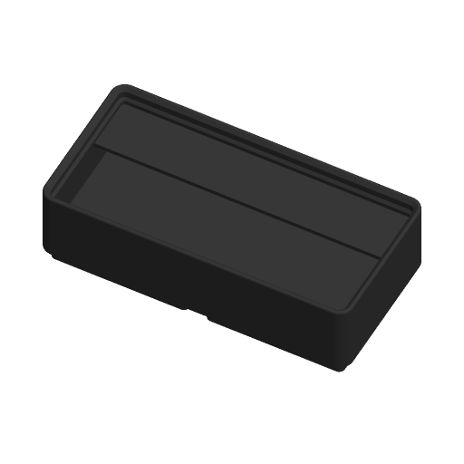

# Gridfinity Bin



A Gridfinity storage bin that drops into any standard 42 mm Gridfinity
baseplate and stacks on other Gridfinity bins. One file, no libraries: the
feet, stacking lip and holes are built from the constants listed under
[Dimensions](#dimensions), so the geometry can be checked line by line against
the spec.

Inspired by MakerWorld's "Parametric Gridfinity Generator" and Printables'
"Gridfinity Rebuilt" and "Ultra Light Bins"; written to the Parametric Model
Maker customizer conventions, so the same file works unchanged on MakerWorld
and in ScadBuddy.

## Parameters

### Size

| Parameter | Default | What it does |
|---|---|---|
| `units_x` | `2` | Width in grid units, 1–8. The bin is `units_x × 42 − 0.5` mm wide. |
| `units_y` | `1` | Depth in grid units, 1–8. The bin is `units_y × 42 − 0.5` mm deep. |
| `height_units` | `3` | Height in 7 mm units, 2–12, from the bottom of the feet to the top of the wall. The stacking lip adds 3.55 mm on top. |

### Features

| Parameter | Default | What it does |
|---|---|---|
| `stacking_lip` | `true` | Adds the stacking lip so another bin's feet locate in the top of this one. Off, the wall stops flat at `height_units × 7`. |
| `magnet_holes` | `false` | 6.5 mm × 2.4 mm holes for 6 × 2 mm magnets, four per foot. |
| `screw_holes` | `false` | 3 mm × 6 mm holes for M3 screws, four per foot. With magnets as well, the screw hole runs through the magnet hole. |
| `divisions_x` | `1` | Compartments across the width, 1–8. |
| `divisions_y` | `1` | Compartments front to back, 1–8. |
| `label_tab` | `full` | `full`: a tab across the back of every compartment. `left`: the tab covers the left 42 mm of each compartment (the whole width if the compartment is narrower). `none`: no tabs and no label. |
| `scoop` | `true` | A concave fillet along the front of every compartment, so small parts slide out. |
| `wall` | `1.2` | Outer wall thickness, 0.8–2.4 mm. Also the wall thickness of the hollow feet in `ultralight`. |
| `floor_style` | `solid` | `solid`: solid feet, floor 7 mm up. `ultralight`: hollow feet with a 1 mm bottom skin, so the compartments reach down into the feet; far less filament. |

### Label

| Parameter | Default | What it does |
|---|---|---|
| `label_text` | *(empty)* | Text inlaid 0.6 mm into the back-left label tab, up to 24 characters. Empty means no label part. |
| `label_size` | `6` | Letter height in mm. A label that would not fit the tab is shrunk to fit (estimated from the character count); anything still too wide is clipped at the tab edge. |
| `font` | `DejaVu Sans:style=Bold` | Typeface. ScadBuddy fills this dropdown from the fonts installed in the container (`// font`). |

### Colors

| Parameter | Default | What it does |
|---|---|---|
| `bin_color` | `#3A3A3A` | The bin. |
| `label_color` | `#F2F2F2` | The inlaid label. |

## Colours and extruders

**The order of the `color` parameters in the source is the extruder order** —
the first one is extruder 1:

| Parameter | Part | Extruder |
|---|---|---|
| `bin_color` | the whole bin | 1 |
| `label_color` | label inlay | 2 |

The label part is only produced when `label_text` is not empty, `label_tab` is
not `none`, and the compartments are deep enough to carry a tab (a tab is
dropped when half a compartment's depth is under 4 mm, e.g. 8 rows in a
one-unit bin). Otherwise the render has one part and prints in one colour.

The label is an inlay: its letters are cut 0.6 mm (three 0.2 mm layers) into
the top of the tab and filled with the label part, so the two parts touch but
never overlap.

## Dimensions

The constants in the `[Hidden]` section, and where each one comes from. The
primary reference is `src/core/standard.scad` in
[kennetek/gridfinity-rebuilt-openscad](https://github.com/kennetek/gridfinity-rebuilt-openscad/blob/main/src/core/standard.scad),
whose constants cite the [Gridfinity specification](https://gridfinity.xyz/specification/).

| Quantity | Value | Source |
|---|---|---|
| Grid pitch | 42 mm | `GRID_DIMENSIONS_MM = [42, 42]` |
| Bin outer size | `n × 42 − 0.5` mm | `BASE_TOP_DIMENSIONS = [41.5, 41.5]`, `BASE_GAP_MM` = 0.5 |
| Outer corner radius | 3.75 mm | `BASE_TOP_RADIUS = 7.5 / 2` |
| Foot profile, from the bottom | 0.8 at 45°, 1.8 vertical, 2.15 at 45° = 4.75 mm tall, 2.95 mm in | `BASE_PROFILE` |
| Foot bottom | 35.6 × 35.6 mm, corner radius 0.8 | `base_bottom_dimensions()`, `BASE_BOTTOM_RADIUS` |
| Base height (feet + bridge) | 7 mm | `BASE_HEIGHT = 7` |
| Height unit | 7 mm; bin height `height_units × 7` including the base, excluding the lip | `fromGridfinityUnits()`, `new_bin()` "Excludes STACKING_LIP_HEIGHT. Includes BASE_HEIGHT." |
| Stacking lip, from the inner tip up | 0.7 at 45°, 1.8 vertical, 1.9 at 45° = 4.4 mm nominal, 2.6 mm deep | `STACKING_LIP_LINE` |
| Lip support | 1.2 mm vertical under the tip, then 45° down to the wall | `STACKING_LIP_SUPPORT_HEIGHT`, `STACKING_LIP` |
| Lip top fillet | r 0.6 mm, which puts the real top 3.551 mm above `height_units × 7` | `STACKING_LIP_FILLET_RADIUS` |
| Magnet hole | 6.5 mm Ø × 2.4 mm | `MAGNET_HOLE_RADIUS = 6.5 / 2`, `MAGNET_HOLE_DEPTH = 2 + 2 × 0.2` |
| Screw hole | 3 mm Ø × 6 mm | `SCREW_HOLE_RADIUS = 3 / 2`; depth chosen here to leave a 1 mm skin under the 7 mm floor |
| Hole position | ±13 mm from each cell centre | 35.6 / 2 − `HOLE_DISTANCE_FROM_BOTTOM_EDGE` (4.8) = 13 |
| Divider | 1.2 mm | `d_div = 1.2` |
| Label tab | 15.85 mm deep, 36° underside, 1.2 mm ledge, ≤ 42 mm wide (left) | `_tab_depth`, `_tab_support_angle`, `_tab_support_height`, `TAB_WIDTH_NOMINAL` |

Why the lip and the foot differ (0.7/1.9 against 0.8/2.15): the two 45° faces
of a stacked bin's foot land exactly on the lip's two 45° faces, with the
upper bin's foot bottom 0.35 mm below the lower bin's `height_units × 7`. The
vertical faces are 0.25 mm apart. `verify.sh` checks this seat directly.

Everything inside the bin — dividers, tabs, the label — stops 1.2 mm below the
wall top when the lip is on (the height of the lip's support), so the feet of
a stacked bin clear it. Kennetek's bins stop their infill at the same height.

## Variations

- **Plain**: the defaults — a 2 × 1 × 3 bin with lip, full-width tab and scoop.
- **Divided**: `divisions_x` / `divisions_y`. Every compartment gets its own
  tab and scoop; the tab is capped at half the compartment's depth.
- **Ultralight**: `floor_style = ultralight`. Each foot is hollowed to a
  `wall`-thick shell (measured normal to the 45° faces) over a 1 mm skin.
  Magnet and screw holes get solid pillars to sit in.
- **Label tab on/off**: `label_tab = none` removes tabs and the label part.
- **With/without magnets**: `magnet_holes`, `screw_holes`.

The whole bin is built without `minkowski`: rounded rectangles are
`offset()`s of squares, the stepped foot profile is a stack of
rounded-rectangle frustums written as polyhedra, and the lip is its 2D profile
swept round the corners with `rotate_extrude` and along the sides with
`linear_extrude`. An 8 × 8 × 12 ultralight bin with 64 compartments and
magnets renders in about 1.6 s.

## Verifying

```bash
./verify.sh
```

Renders the defaults and eight variations (label, divided, left tab, no tab,
magnets + screws, ultralight, no lip at 1 × 1 × 2, and the 8 × 8 × 12 maximum)
in `scadbuddy-verify:local`, building it from `openscad/openscad:dev` with the
image's font packages when it is missing. For each render it checks:

- one non-empty material, or two when a label is expected, and nothing on
  `Default`;
- the bounding box is exactly `units × 42 − 0.5` in X and Y and
  `height_units × 7` (+ 3.551 with the lip) in Z, sitting on z = 0;
- the z = 0 footprint is `(n − 1) × 42 + 35.6` mm — the foot bottoms;
- the label's exposed face is the tab top;
- magnet and screw holes are present at the right diameter, depth and
  position;
- the 8 × 8 × 12 bin renders in under 60 s.

It then drops a second default bin onto the first: 0.02 mm above the expected
seat the two must not intersect, 0.1 mm below it they must.

The 3MF parsing runs on the host with `python3` and the standard library only.
Output lands in `.verify/`.

A physical test print against a real baseplate is still worth doing before
relying on the fit; the numbers match the spec, but printer tolerance varies.
