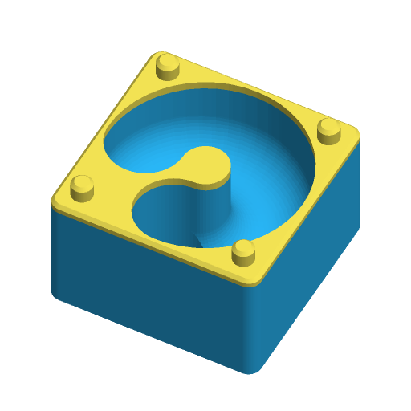
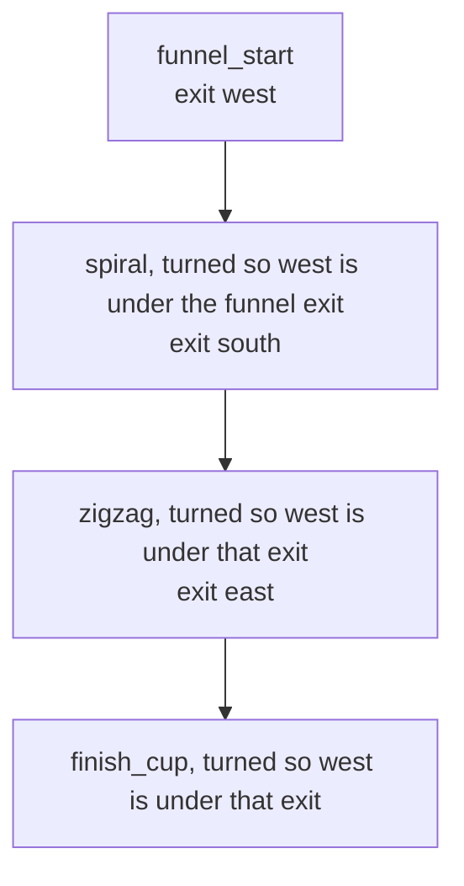

# Stackable Marble Run



Square tiles that stack into a marble-run tower. Each tile has an open-top
channel for a standard marble; the marble rolls along it, drops through a hole
in the floor, and lands at the start of the channel in the tile underneath.
Four corner pegs locate each tile on the one below. Pick a piece with `type`,
print a few of each, and build a tower.

Inspired by the most-downloaded marble runs on Printables — "Marble Run"
(#725269, 4,069 downloads) and "Wall-Mounted Modular Marble Run – No Screws"
(#1724688, 441 likes); written to the Parametric Model Maker customizer
conventions, so the same file works unchanged on MakerWorld and in ScadBuddy.

**Safety:** marbles and pegs are a choking hazard for children under 3.
Supervise play.

## Pieces

| `type` | Enters | Exits (through the floor) | What it does |
|---|---|---|---|
| `funnel_start` | the whole top | west | A wide funnel to drop marbles into. Goes at the top of a tower; it has no pegs on top. |
| `straight_drop` | west | west | A straight vertical drop, with a slot window in the west wall so you can see the marble fall. Adds height without turning. |
| `zigzag` | west | east | A straight run across the tile. Stack zigzags turned half a turn each level and the marble zigzags down the tower. |
| `spiral` | west | south | A three-quarter turn around a central post. Stack spirals turned a quarter turn each level and the marble spirals all the way down. |
| `cross` | west, north or south | east | A junction: three inlets drain to one exit. Use it to merge two towers, or when you do not want to think about which way a tile faces. |
| `finish_cup` | west | none | A run into a bowl at the east side. A notch in the east wall lets you see the marble and flick it out. Goes at the bottom. |

## Connection standard

Every piece follows the same rules, so any piece connects to any other:

- There are four **ports** on the tile's centre lines — west, north, east and
  south — each `q = tile/2 − 1.6 − (marble_d + channel_clearance)/2` mm from the
  centre (14.4 mm with the defaults). The port hole is the full channel width.
- The marble always **enters at the west port**, at the top, where the channel
  starts — the end of the groove with no hole in it.
- It **exits straight down through the floor** at one port (see the table).
- **Turn the next tile down so its entry sits under the exit** of the tile
  above. The four pegs are symmetric, so every quarter turn fits.
- A channel's top is closed by the tile stacked on it, so the marble cannot jump
  out; only the exit hole of the tile above opens into it.
- Every tile uses the same `tile`, `marble_d` and `channel_clearance`. `height`
  may differ between tiles.



## Parameters

### Piece

| Parameter | Default | What it does |
|---|---|---|
| `type` | `spiral` | Which piece to make (see [Pieces](#pieces)). |
| `tile` | `50` | Footprint of the square tile in mm, 40–80. |
| `height` | `30` | Height of one level in mm, 20–60, not counting the pegs. Raised automatically to at least `marble_d + channel_clearance + 5.6` so the channel always has headroom and some fall. |
| `marble_d` | `16` | Marble diameter in mm, 12–25. |
| `channel_clearance` | `2` | Extra room around the marble, added to the diameter of every channel and hole. The channel is `marble_d + channel_clearance` wide. |
| `slope` | `6` | Channel slope in degrees, 3–12. Reduced automatically when the level is too short for the channel to fall that far and still keep a 1.6 mm floor. |

### Stacking

| Parameter | Default | What it does |
|---|---|---|
| `peg` | `true` | Four 5 mm × 4 mm pegs on top at the corners, and matching sockets underneath. Off, there are neither. |
| `peg_clearance` | `0.3` | Gap between a peg and its socket, per side. The socket is `5 + 2 × peg_clearance` mm across and 0.4 mm deeper than the peg is tall. |

### Colours

| Parameter | Default | What it does |
|---|---|---|
| `piece_color` | `#29B6F6` | The body of the tile. |
| `accent_color` | `#FFEE58` | The top 2 mm rim and the pegs. |

## Colours and extruders

**The order of the `color` parameters in the source is the extruder order** —
the first one is extruder 1:

| Parameter | Part | Extruder |
|---|---|---|
| `piece_color` | body, from the plate up to 2 mm below the top | 1 |
| `accent_color` | top 2 mm rim and the pegs | 2 |

The split is a single horizontal layer change, so it costs one filament swap
per tile. Set both colours the same to print in one colour.

## Printing

Print each tile as it comes, bottom down. It needs no supports: the channels are
open at the top, the exit holes and the drop window are vertical (the window
has a pointed top), and the sockets underneath have 45° roofs.

Channel floors are at least 1.6 mm thick and the thinnest outside wall is
1.6 mm. With the defaults a tile is 50 × 50 × 34 mm including pegs.

Things worth a physical test print:

- the peg fit at `peg_clearance = 0.3` on your printer;
- whether the marble stays in the finish cup at your `slope` — it sits in a
  3 mm dip behind a lip at 40 % of the marble's diameter;
- the spiral on a 40 mm tile, where there is no room for the central post and
  the channel becomes a bowl — use 45 mm or more for a proper spiral.

## Variations

- `type`: the six pieces above.
- `tile`, `height`, `slope`: bigger tiles give longer runs; steeper slopes and
  taller levels make the marble faster.
- `marble_d` / `channel_clearance`: for 12–25 mm marbles.
- `peg = false`: plain blocks that stack by hand.

## Verifying

```bash
./verify.sh
```

Renders the defaults, every piece type, and edge cases (40 mm and 80 mm tiles,
a 25 mm marble on a 20 mm level, a 12 mm marble, pegs off, loosest and tightest
peg clearance) in the ScadBuddy OpenSCAD image, and checks for each:

- exactly two colour parts and no uncoloured (`Default`) geometry;
- the bounding box is `tile × tile × (level height + 4 mm pegs)` (no pegs on the
  funnel), sitting on z=0;
- rendered one colour at a time, the way ScadBuddy builds its parts, the body is
  closed from 0 to 2 mm below the top and the accent from there to the top of
  the pegs;
- the socket radius is exactly the peg radius plus `peg_clearance`;
- the marble path: at points every millimetre along the channel centre line,
  down the entry drop and down the exit hole, no surface comes closer than
  `(marble_d + channel_clearance) / 2`, and straight down from the centre line
  the floor is where the slope puts it, all the way to the exit;
- the finish cup's bowl radius and floor thickness.

Output lands in `.verify/`. The 3MF and STL parsing runs on the host with
`python3` and the standard library only.
