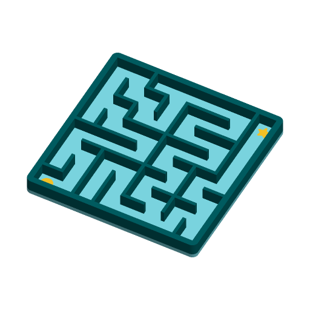

# Ball Maze



A tilt-and-roll ball maze. The maze is generated inside OpenSCAD from a seed:
every seed gives a different maze and the same seed always gives the same one.
A round marker inlaid in the floor shows the start and a star shows the
finish; tip the tray to roll a ball bearing, BB or small marble from one to the
other.

The maze is *perfect*: every cell can be reached, and there is exactly one
route between any two cells, so there is exactly one way from the circle to
the star.

Inspired by the maze puzzles that top Printables' popular list — "Russian Doll
Maze Puzzle Box" (18.4k downloads) and "Puzzle box (Maze)" (5.4k) — and the
smaller "Random Maze Generator" customizers. Written to the Parametric Model
Maker customizer conventions, so the same file works unchanged on MakerWorld
and in ScadBuddy.

**Safety:** balls, BBs and marbles are choking hazards. Not for children under
3; supervise younger players, and use the lid mode so the ball stays inside.

## Parameters

### Maze

| Parameter | Default | What it does |
|---|---|---|
| `cells_x` | `8` | Cells across, 4–15. |
| `cells_y` | `8` | Cells front to back, 4–15. |
| `seed` | `42` | Maze number, 0–9999. Change it for a new maze. |
| `cell_size` | `10` | Grid pitch in mm (wall centre to wall centre). Widened automatically when the ball would not fit — see `ball_d`. |
| `shape` | `square` | `square`, or `round`: the grid clipped inside a disc. A cell is kept when its whole corridor lies inside the disc; the space between the grid and the disc is solid wall. The disc's diameter follows the *smaller* of `cells_x` and `cells_y`, so a non-square grid in round mode only uses the cells that fit. |
| `wall_height` | `6` | Wall height above the floor. Raised automatically in lid mode — see `ball_d`. |
| `wall_thickness` | `1.6` | Maze wall thickness. The outer border is 1.2 mm thicker. |

### Play

| Parameter | Default | What it does |
|---|---|---|
| `mode` | `open_tray` | `open_tray`, or `ball_lid`: a flat lid with a snap skirt prints upside down beside the tray, to the right when the pair fits the bed's 300 mm width (both nozzles), else behind within its 320 mm depth. When neither fits (15 × 15 at 16 mm, or a large round maze) the lid goes on **plate 2** of the same 3MF, with an `ECHO: "NOTE: ..."` line saying so. It clicks over a V-groove round the outside of the border. Put the ball in, then snap the lid on. A clear filament lets you see the maze. |
| `ball_d` | `6` | Ball diameter. Corridors are at least `ball_d + 1` mm wide: if `cell_size - wall_thickness` is narrower, the pitch is widened. In lid mode the walls are at least `ball_d + 0.5` mm tall so the ball cannot jam against the lid. Either change is reported by an `ECHO: "NOTE: ..."` line. |
| `markers` | `true` | Inlays the start circle and finish star, 0.6 mm deep and flush with the floor. |

### Colours

| Parameter | Default | What it does |
|---|---|---|
| `floor_color` | `#80DEEA` | Floor. |
| `wall_color` | `#006064` | Maze walls and outer border. |
| `marker_color` | `#FFCA28` | Start circle and finish star. |
| `lid_color` | `#FFFFFF` | Lid (lid mode only). |

## Colours and extruders

**The order of the `color` parameters in the source is the extruder order:**

| Parameter | Part | Extruder |
|---|---|---|
| `floor_color` | floor, 2 mm | 1 |
| `wall_color` | walls and border | 2 |
| `marker_color` | start and finish inlays | 3 |
| `lid_color` | lid | 4 |

The open tray is three parts; lid mode adds the fourth. The lid keeps extruder 4
when it moves to plate 2. Turning `markers` off
drops the marker part. Setting two colours to the same value merges those
parts into one filament.

## How the maze is generated

A recursive backtracker (randomised depth-first search) over the active
cells, starting at the start cell. OpenSCAD has no loops that carry state, so
the search is one tail-recursive function over an explicit stack; OpenSCAD
runs tail calls as a loop, so a 15 × 15 maze (about 450 steps) has no
recursion depth to worry about and renders in well under a second.

Random numbers come from a hand-rolled Park–Miller generator
(`s = s * 16807 mod 2^31-1`) rather than `rands()`: it is exact in double
precision and gives the same maze on every OpenSCAD build.

The start is the first cell in row order (front-left for a square maze) and
the finish the last (back-right). The model echoes the maze it built:

```
ECHO: "MAZE", cells_x, cells_y, active[], east_open[], north_open[], start, finish
```

## Plates

The model follows ScadBuddy's plate convention (design spec §6.4): it declares
`$plate = 0` and echoes `plates = N`. With `$plate = 0` — plain OpenSCAD,
MakerWorld, ScadBuddy's preview — it draws everything, and a lid that needs its
own plate sits to the right of the tray, past the edge of the bed. ScadBuddy
renders `$plate = 1` (the tray, plus the lid when it fits beside it) and, when
the model echoes `plates = 2`, `$plate = 2` (the lid alone, where the tray would
be), and writes both plates into one 3MF. The print dialog then offers plate 1,
plate 2, or both.

## Variations

- **Size:** `cells_x`/`cells_y` from 4 × 4 (a 44 mm pocket puzzle) to 15 × 15
  (154 mm); `cell_size` scales the whole thing.
- **Shape:** `square` or `round`.
- **Mode:** `open_tray` or `ball_lid`.

## Verifying

```bash
./verify.sh
```

Renders the defaults and 17 variations (both shapes, both modes, 4 × 4 to
15 × 15, non-square grids, an auto-widened 12 mm ball, thick walls without
markers, a lid placed behind the tray, and three trays and lids too big to
share a plate) and checks for each:

- the echoed maze is perfect: every active cell reachable from the start,
  openings == cells − 1, no opening into a missing cell, start ≠ finish;
- different seeds give different mazes, the same seed the same maze;
- the expected colour parts, nothing in `Default`, the exact bounding box the
  parameters imply (including where the lid goes, and that a lid on plate 2 says so in
  a note), sitting on z = 0 and fitting the 300 × 320 mm bed;
- the echoed plate count: 2 exactly when the tray and lid cannot share the
  bed. Then each plate is rendered on its own with `-D '$plate=k'`, as
  ScadBuddy does: plate 1 holds the tray's colours and plate 2 only the lid,
  each at its expected bounding box and fitting the bed, and each colour's
  closed part (rendered through the colour wrapper with the same `$plate`) has
  the volume of that colour in the everything-at-once render;
- from one closed render per colour: the floor, wall, marker and lid z ranges;
  the parts do not overlap; the wall volume equals the outline minus exactly
  the cells and openings of the echoed maze (so the geometry is the maze that
  was checked), and the floor volume the outline less the inlays.

Output lands in `.verify/`. The checking runs on the host with `python3` and
the standard library only.

## Needs a test print

- The lid snap: a 0.4 mm bead on the skirt against a 0.5 mm groove, with
  0.25 mm side clearance, so 0.15 mm of interference to click over. Tune
  `lid_fit`/`bead_d` in the Hidden section if it is too stiff or too loose.
- 4.5 mm steel BBs and 6 mm ball bearings are the intended balls; check the
  1 mm corridor clearance rolls freely on your printer.
