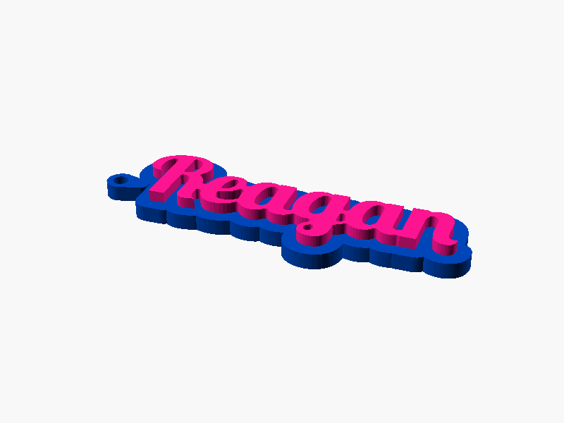

# Name Keychain



A name in a bold connected script, raised on a base plate cut to the outline of
the word, with a keyring hole at the left. Two colours, no painting: the base
and border are one part, the letters are another.

Inspired by MakerWorld's "Name Keychain (Font Basic)"; written to the
Parametric Model Maker customizer conventions, so the same file works unchanged
on MakerWorld and in ScadBuddy.

## Parameters

### Text

| Parameter | Default | What it does |
|---|---|---|
| `name` | `Reagan` | The word on the keychain, up to 20 characters. |
| `font` | `Lobster Two:style=Bold` | Typeface. ScadBuddy fills this dropdown from the fonts installed in the container (`// font`). |

### Size

| Parameter | Default | What it does |
|---|---|---|
| `text_size` | `20` | Letter height in mm, capitals to descenders. Everything else scales around it. |
| `letter_height` | `2.8` | How far the letters stand proud of the base. |
| `base_thickness` | `4` | Thickness of the base plate. Total height is `base_thickness + letter_height`. |
| `outline` | `3.5` | How far the base is grown outwards from the word's footprint — the visible border. |

### Keyring

| Parameter | Default | What it does |
|---|---|---|
| `hole` | `true` | Adds the keyring tab and punches the hole. With it off there is no tab at all. |
| `hole_diameter` | `4` | Keyring hole diameter. |
| `ring_wall` | `1.6` | Material left around the hole; the tab radius is `hole_diameter/2 + ring_wall`. |

### Colours

| Parameter | Default | What it does |
|---|---|---|
| `base_color` | `#0047BB` | Base and border. |
| `text_color` | `#FF1493` | Letters. |

## Colours and extruders

There are exactly two `color()` calls, so the render produces exactly two
parts. **The order of the `color` parameters in the source is the extruder
order** — the first one is extruder 1:

| Parameter | Part | Extruder |
|---|---|---|
| `base_color` | base plate and border | 1 |
| `text_color` | raised letters | 2 |

Reorder the parameters and you reorder the filaments; the colour values
themselves carry no extruder meaning.

## Fonts

Only families from the Debian trixie packages the ScadBuddy image installs are
available: `fonts-lobster`, `fonts-lobstertwo`, `fonts-dejavu`,
`fonts-noto-core`.

Note that Debian's `fonts-lobster` registers its face as **`Lobster Two`**, not
`Lobster` — `fc-match "Lobster"` falls back to DejaVu Sans. The default here is
therefore `Lobster Two:style=Bold`.

Two hidden parameters make an arbitrary word come out as one printable piece,
which no font does on its own here because OpenSCAD applies no contextual
alternates:

- `spacing = 0.95` — slight negative tracking.
- `weld = 0.8` — a morphological close (`offset(r=-weld) offset(r=weld)`) that
  bridges gaps up to `2 * weld` between glyphs without changing the word's
  overall size. In `Lobster Two:style=Bold` the capital `R` stops 2.08 mm short
  of the following lowercase at the default size; this closes it.

## Verifying

```bash
./verify.sh
```

Renders `name="Reagan"` with the default parameters in `openscad/openscad:dev`
and checks the result against the reference keychain that printed on
2026-09-21 (95.7 × 34.6 × 6.8 mm): two non-empty materials besides `Default`,
the bounding box within ±1.5 mm in X and Y and exactly 6.8 mm tall, the base
0–4 mm and the letters 4–6.8 mm, and the letters one connected piece. Output
lands in `.verify/`, including a preview PNG.

The base image ships DejaVu only, so the script derives a throwaway image with
the four font packages when `Lobster Two` is missing — without it OpenSCAD
silently falls back to DejaVu Sans and every measurement is meaningless.
Override with `SCADBUDDY_OPENSCAD_IMAGE` once a ScadBuddy image exists.

The 3MF parsing runs on the host with `python3` and the standard library only:
`openscad/openscad:dev` has no Python.
