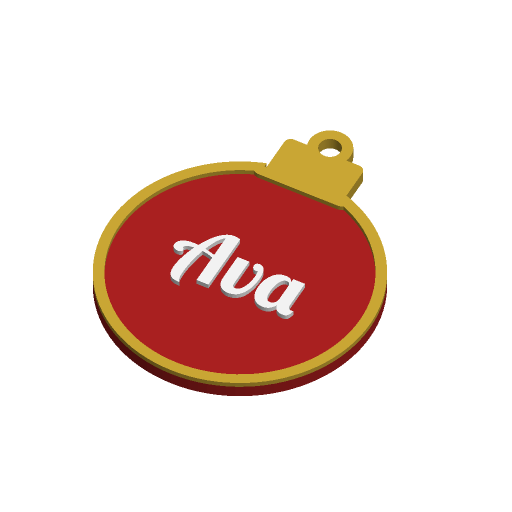

# Christmas Name Ornament



A flat Christmas ornament with a name on it, in one of five shapes: a bauble
with a cap, a five-point star with rounded tips, a tiered tree with a trunk and
a star on top, a heart, or a disc ringed with small snowflakes. An optional
second line (a year, say) goes under the name. It hangs from a loop above the
top or a hole through the body. Up to three colours, no painting.

Inspired by Printables' "Customizable Christmas Name Ornament"; written to the
Parametric Model Maker customizer conventions, so the same file works unchanged
on MakerWorld and in ScadBuddy.

## Parameters

### Text

| Parameter | Default | What it does |
|---|---|---|
| `name` | `Ava` | Name on the ornament, up to 12 characters. Empty is allowed. |
| `font` | `Lobster Two:style=Bold` | Typeface. ScadBuddy fills this dropdown from the fonts installed in the container (`// font`). |
| `year` | *(empty)* | Optional second line, up to 12 characters. Where it goes depends on the shape: under the name, or in the bottom tier of the tree. |
| `text_size` | `14` | Requested name size in mm (6–30). The name shrinks automatically when it would not fit the shape's text area, in width or height. The year line is requested at 0.6× this and fitted the same way. |
| `text_style` | `raised` | `raised`: letters stand 1.2 mm proud of the face. `inlay`: letters are set flush into the face, 1 mm deep (half the thickness at 2 mm). The border and snowflakes follow the same style. |

### Shape

| Parameter | Default | What it does |
|---|---|---|
| `shape` | `bauble` | `bauble`, `star`, `tree`, `heart` or `snowflake_disc`. |
| `size` | `70` | Height of the body in mm (40–120), bottom to top of the silhouette. A loop adds up to 6.4 mm above it. |
| `thickness` | `3` | Thickness of the body in mm (2–6). Raised text and border add 1.2 mm on top. |
| `hanger` | `loop` | `loop`: an accent-coloured ring (5 mm hole, 2.4 mm wall) set into the top. `hole`: a 5 mm hole through the body — through the cap of the bauble, the top arm of the star, the top tier of the tree, just under the heart's cusp, or in place of the top snowflake on the disc. |
| `border` | `true` | An accent-coloured border following the outline (and around the hole), `max(1.2, 0.035 × size)` mm wide. |

Width follows from `size` and the shape:

| Shape | Width | Notes |
|---|---|---|
| `bauble` | `(size − cap) / 0.96`, cap = `max(0.15 × size, 9)` | 62.0 mm at the default size |
| `star` | ≈ 1.05 × `size` | 73.3 mm |
| `tree` | 0.9 × `size` | 63.0 mm |
| `heart` | ≈ 1.09 × `size` | 76.6 mm |
| `snowflake_disc` | `size` | 70.0 mm |

### Colors

| Parameter | Default | What it does |
|---|---|---|
| `base_color` | `#B22222` | The body. |
| `text_color` | `#FFFFFF` | Name and year. |
| `accent_color` | `#D4AF37` | Border, bauble cap, tree star, hanging loop, snowflakes. |

## Colours and extruders

Each colour parameter is one part; **the order of the `color` parameters in the
source is the extruder order**:

| Parameter | Part | Extruder |
|---|---|---|
| `base_color` | body | 1 |
| `text_color` | name and year | 2 |
| `accent_color` | border, cap, tree star, loop, snowflakes | 3 |

Some combinations have no accent geometry at all — a star or heart with
`hanger = hole` and `border = false` — and print in two colours. With the name
and year both empty there is no text part either. Setting two colour
parameters to the same value merges those parts.

The parts never overlap: raised text and trim sit on the face, inlaid text and
trim fill pockets cut into it, and the loop and cap replace the body where they
meet it.

## Variations

- **Shape** — the five outlines above.
- **Text style** — raised letters, or flush inlay for a flat ornament.
- **Border** — on or off. The snowflakes on `snowflake_disc` stay either way;
  they are the shape.
- **Hanger** — loop or hole.

## Printing notes

- Prints face up, flat on the bed, no supports.
- Inlay mode puts all colour changes in the top 1 mm, which keeps the number
  of filament swaps low.
- The snowflakes are drawn with 0.8 mm minimum strokes; below about
  `size = 55` they blur into small rosettes.
- The loop and body are different filaments fused side by side in the same
  layers. Same-material filaments bond fine this way; the loop's joint to a
  star or tree tip is the weakest point of the model.

## Text fitting

OpenSCAD's `textmetrics()` is still an experimental feature and is not enabled
on MakerWorld, so the fit uses per-glyph advance widths measured offline at
size 10 for `Lobster Two:style=Bold` and `DejaVu Sans:style=Bold` (hidden
tables in the source). Other faces use the DejaVu table, which is on the wide
side, so they may come out slightly smaller than necessary. Text is also
clipped to the area inside the border, so an estimate that is a little short
can never reach the border or the edge.

## Verifying

```bash
./verify.sh
```

Renders the defaults and nine variations (every shape, both text styles,
both hangers, border on and off, a 40 mm heart where the loop extends above
the top, a 120 mm bauble with a long name, an empty name, and the snowflake disc
with a hole at 70 and 40 mm) in
`openscad/openscad:dev` and checks, for each: the expected number of non-empty
materials, no triangles on `Default`, the width and height the parameters
imply, the model on z = 0, and the top at `thickness` (+1.2 mm when anything
is raised). Each colour is then re-rendered alone with a `color()` override,
the way ScadBuddy builds closed parts; the base must span 0..`thickness`, the
text must sit where `text_style` says, every snowflake on the disc must be
whole (a hole that clips one leaves a sliver), and the per-colour volumes must add up
to the whole model's volume — so no two colours overlap.

If the base image lacks `Lobster Two`, the script derives `scadbuddy-verify:local`
with the font packages the ScadBuddy image installs. The 3MF/STL parsing runs
on the host with `python3` and the standard library only.
