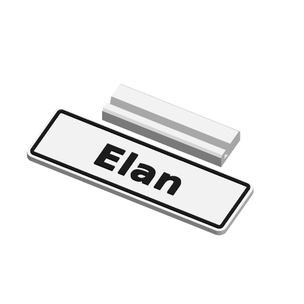

# Name Sign



A desk nameplate or door sign: one or two lines of text on a flat plate, with
an optional border line. The sign prints flat and face up; with the default
desk-stand mount a separate slotted foot prints next to it, and the sign's
bottom edge drops into the slot.

Inspired by Printables' "Sweeping 2-line name plate" and MakerWorld's
"Ultimate Sign & Nameplate Generator"; written to the Parametric Model Maker
customizer conventions, so the same file works unchanged on MakerWorld and in
ScadBuddy.

## Parameters

### Text

| Parameter | Default | What it does |
|---|---|---|
| `line1` | `Elan` | First line, up to 30 characters. |
| `line2` | *(empty)* | Second, smaller line under the first. Empty means a single line. |
| `font` | `DejaVu Sans:style=Bold` | Typeface (`// font`). |
| `text_size` | `18` | Letter height of the first line in mm (6–100). With `auto_fit` this is the largest it will be, so a large value fills the plate. |
| `line2_size` | `10` | Letter height of the second line in mm (4–60); auto-fit shrinks it like the first line. |
| `auto_fit` | `true` | Shrinks each line to the width of the text box, then the whole block to its height. Never enlarges. |
| `text_style` | `raised` | `raised`: letters and border stand 1.2 mm proud. `inlay`: letters and border are pockets filled flush with the face. `cutout`: the face layer has the letters cut through it, showing a backing layer in the text colour. |

Text is always clipped to the space inside the border (and kept clear of the
screw heads), so with `auto_fit` off, text that is too big is cut off rather
than overhanging the plate.

### Plate

| Parameter | Default | What it does |
|---|---|---|
| `width` | `140` | Plate width in mm. |
| `height` | `45` | Plate height in mm. |
| `thickness` | `4` | Plate thickness in mm. Raised letters add 1.2 mm on top. |
| `corner` | `rounded` | `square`, `rounded` or `chamfered`. |
| `corner_r` | `5` | Corner radius or chamfer size. |
| `border` | `true` | A border line 2 mm in from the edge, following the corner shape. |
| `border_w` | `2` | Border line width. |

### Mounting

| Parameter | Default | What it does |
|---|---|---|
| `mount` | `desk_stand` | `none`, `screw_holes`, `magnet_pockets`, `hanging_loop` or `desk_stand`. |
| `magnet_d` | `8` | Magnet diameter. Pockets are 0.2 mm wider and 2.2 mm deep, for 2 mm disc magnets. |
| `stand_angle` | `70` | Desk-stand lean in degrees from horizontal. |

- **desk_stand** — a separate foot, 60 % of the sign's width, printed beside
  it. Its slot leans back at `stand_angle`; the slot's front wall overhangs by
  `90 - stand_angle` degrees (at most 45), so it prints without support. The
  foot is deep enough that the sign's centre of mass sits over it, and the
  slot is `thickness` (+1.2 mm when raised) + 0.4 mm wide and 8–16 mm deep
  (12 % of the sign height, within those limits).
- **screw_holes** — two 4.2 mm holes at the ends with a 90° countersink for an
  8.4 mm head, opening upwards so it prints without support. The text box
  narrows to stay clear of them.
- **magnet_pockets** — four pockets open on the back, in the corners and clear
  of the corner rounding. They are bridged over, which prints without support.
  Pocket depth is capped so at least 0.8 mm (raised) or the face detail plus
  0.6 mm (inlay, cutout) is left above it; on thin plates they get shallower
  than a magnet.
- **hanging_loop** — a tab with a 5 mm hole centred on the top edge, adding
  9.5 mm to the height.

### Colors

| Parameter | Default | What it does |
|---|---|---|
| `plate_color` | `#FFFFFF` | Plate, and the desk-stand foot. |
| `text_color` | `#1E1E1E` | Letters; in `cutout` style, the backing layer. |
| `border_color` | `#1E1E1E` | Border line. |

## Colours and extruders

**The order of the colour parameters in the source is the extruder order** —
the first one is extruder 1:

| Parameter | Part | Extruder |
|---|---|---|
| `plate_color` | plate (face layer in `cutout`), stand foot | 1 |
| `text_color` | letters (backing layer in `cutout`) | 2 |
| `border_color` | border line | 3 |

Colours with the same value merge into one part and one filament. With the
defaults the text and the border are both `#1E1E1E`, so the sign prints in two
colours. Differently coloured parts never overlap; they only touch.

`cutout` needs only one colour change per plate: the backing prints first in
the text colour, then the face on top of it in the plate colour.

## Variations

- `mount`: none, screw holes, magnet pockets, hanging loop, desk stand.
- `text_style`: raised, inlay, cutout.
- `corner`: square, rounded, chamfered.

## Verifying

```bash
./verify.sh
```

Renders the defaults and twelve variations in `scadbuddy-verify:local`
(building it from `openscad/openscad:dev` plus ScadBuddy's font packages when
it is missing), then checks each one:

- the parts are exactly the expected set of colours, and the `Default`
  material has no triangles;
- the overall bounding box is the one the parameters imply, including the
  desk-stand foot or the hanging loop, and the model sits on z=0;
- one closed render per colour — the way ScadBuddy builds its parts — puts
  each part at the expected height (for example inlay letters at 2.8–4.0 mm,
  cutout backing at 0–2.8 mm);
- auto-fit shrinks an over-long line to exactly the text box width, and with
  auto-fit off it is clipped to the plate;
- on a 300 × 150 mm plate, 100 mm text fills the text box's height;
- the four magnet pockets remove the volume of four 8.2 × 2.2 mm pockets, in
  both raised and cutout styles.

The 3MF and STL parsing runs on the host with `python3` and the standard
library only. Output lands in `.verify/`.

## Needs a test print

- The desk-stand slot fit (0.4 mm clearance) and whether the slot depth holds
  a tall sign at a shallow `stand_angle`.
- Magnet pocket fit for the magnets you have.
