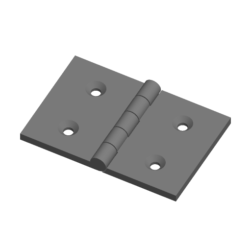

# Parametric Hinge



A two-leaf butt hinge with alternating knuckles, printed flat and opened 180
degrees. By default it prints in place: it comes off the plate assembled and
turns straight away. It can also be printed with a bore for a separate printed
pin or a length of 1.75 mm filament.

Inspired by the Printables "Parametric hinge"; written to the Parametric Model
Maker customizer conventions, so the same file works unchanged on MakerWorld
and in ScadBuddy.

## Parameters

### Leaf

| Parameter | Default | What it does |
|---|---|---|
| `leaf_w` | `30` | Width of each leaf, from the pin axis to its outer edge. The open hinge is `2 * leaf_w` wide. |
| `leaf_l` | `40` | Length of the hinge along the pin axis. |
| `thickness` | `3` | Leaf thickness. |
| `screw_holes` | `2` | Screw holes per leaf, for #6 / M3.5 wood screws (3.6 mm hole, 7.2 mm head). |
| `countersink` | `true` | Countersinks the holes on the face that is up as printed. |
| `leaf_shape` | `rect` | `rect`, `rounded` (outer corners rounded) or `tapered` (each leaf narrows to 60 % of its length at the outer edge). |

### Knuckle

| Parameter | Default | What it does |
|---|---|---|
| `knuckles` | `5` | Knuckle count, odd, alternating between the leaves; leaf 1 has the two outer ones. |
| `pin_d` | `3` | Pin diameter — the cone base diameter for print-in-place, the pin itself for a separate pin. Ignored for `filament_pin`. |
| `clearance` | `0.35` | Gap between every pair of surfaces that move against each other. |
| `pin_type` | `print_in_place` | `print_in_place`, `separate_pin` or `filament_pin`, below. |

The knuckle diameter is derived, not set: the larger of twice the leaf
thickness (so the leaves fold flat onto each other) and the bore plus 1.2 mm
of wall each side. With the defaults it is 6.1 mm.

### Colors

| Parameter | Default | What it does |
|---|---|---|
| `color1` | `#808080` | Leaf 1 (left as printed), and the separate pin. |
| `color2` | `#808080` | Leaf 2 (right as printed). |

## Pin types

- **`print_in_place`** — each of leaf 2's knuckles carries a 45-degree cone on
  both ends, sitting in a matching conical socket in the neighbouring knuckle
  of leaf 1. Every face is `clearance` from the other leaf: the knuckle ends,
  the cone and socket, and the cut-outs each leaf has around the other's
  knuckles. The cones point along the pin axis, which is horizontal as
  printed, so their surfaces are 45-degree overhangs and need no support.
  After printing, flex the leaves a few times to break any stringing.
- **`separate_pin`** — a `pin_d + 2 * clearance` bore through every knuckle,
  and a headed pin laid on the plate to the right of the hinge. The pin has a
  flat on its underside so it prints lying down.
- **`filament_pin`** — a `1.75 + clearance` bore for a length of 1.75 mm
  filament, cut flush and melted over at the ends. `pin_d` is ignored.

## Colours and extruders

**The order of the `color` parameters in the source is the extruder order**:

| Parameter | Part | Extruder |
|---|---|---|
| `color1` | leaf 1 (and the separate pin) | 1 |
| `color2` | leaf 2 | 2 |

The two colours are equal by default, so the hinge is one part on one
extruder. The leaves are still separate bodies with no geometry touching,
which is what lets a print-in-place hinge turn.

## Limits

- Knuckles shorter than 4 mm are not worth printing, so `knuckles` is reduced
  to the largest odd count (at least 3) that keeps them 4 mm long: a 20 mm
  hinge gets at most 5.
- For `print_in_place` the cone radius is limited so both sockets fit inside
  one knuckle; on short knuckles it is smaller than `pin_d / 2`.
- Screw holes are dropped (not shrunk) when they will not fit: fewer holes on a
  short leaf, none on a leaf too narrow to clear the knuckles.

## Variations

- Pin type: `print_in_place`, `separate_pin`, `filament_pin`.
- Leaf shape: `rect`, `rounded`, `tapered`.
- Two colours: set `color2` different from `color1`.

## Verifying

```bash
./verify.sh
```

Renders the defaults, `separate_pin` with rounded leaves, `filament_pin` with
tapered leaves in two colours, and two print-in-place extremes (15 x 20 mm
leaves, 6 mm thick, 11 knuckles requested, 0.6 mm clearance; and 80 x 150 mm, 2
mm thick, 0.2 mm clearance). For each it checks: the expected number of parts,
nothing on the `Default` material, the model sits on z=0, the bounding box is
`2 * leaf_w` by `leaf_l` by the knuckle diameter (plus the pin for
`separate_pin`), and the expected number of separate bodies (two leaves, plus
the pin).

For the leaves it also measures the smallest vertex-to-face distance between
the two bodies and requires it to be at least `clearance` (less 2 % for the
faceting of a 64-sided circle), and for print-in-place that leaf 2's cone tip
reaches past the face of leaf 1's knuckle, so the hinge is actually captive.
Output lands in `.verify/`.

The 3MF parsing runs on the host with `python3` and the standard library only.

**Needs a physical print test.** The 0.35 mm clearance default is the usual
starting point for print-in-place hinges, not a value proven on a printer here;
print the defaults once in PLA and PETG and adjust `clearance` if the leaves
fuse or rattle.
