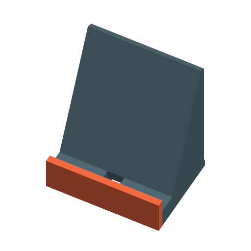

# Phone / Tablet Stand



A desk stand for a phone or tablet. The device leans back against a backrest
with its bottom edge in a slot behind a front lip. Pick a style (solid wedge,
lightweight cut-out A-frame, or folded plate), the viewing angle and the
device's thickness, and optionally cut a pass-through for the charging cable
and inlay a name or word flush in the front of the lip.

Inspired by the most-downloaded stands on Printables, "Phone Stand" (#187125,
86,578 downloads) and "Phone/Tablet Stand - Flat fold" (#1161, 58,991
downloads). No geometry was copied. Written to the MakerWorld Parametric Model
Maker customizer conventions, so the same file works unchanged on MakerWorld
and in ScadBuddy.

## Print layout

One part, printed upright the way it stands on the desk (front lip towards
−Y), with no supports:

- the backrest leans back at most 40° from vertical (`angle` ≥ 50);
- the cut-out windows have 50° pointed tops;
- the folded plate's rear leg drops at 65° (a 25° overhang);
- the cable channel roof and the folded-plate floor are short flat bridges.

The text is inlaid 1 mm deep in the vertical front face of the lip, so the
colour changes run the height of the lip. 0.2 mm layers, 3-4 walls, 15-20%
infill is plenty; the solid style is the heaviest and most stable.

## Stability

The stand has to carry a device whose centre of mass sits behind the slot and
up the backrest. The base is lengthened automatically so that it reaches at
least 15 mm behind the device's centre of mass (and always behind the
backrest): set `device_height` to the height of the device as it stands. The
device's centre of mass and the stand's own are then both inside the
footprint, so any combination of the two is too. `verify.sh` measures this on
the rendered mesh for every case, including the shallowest and steepest
angles.

## Parameters

### Device

| Parameter | Default | What it does |
|---|---|---|
| `device_thickness` | `11` | Thickness of the device including its case, mm. The slot floor is `device_thickness / sin(angle) + clearance` long, because the device leans. 4–30. |
| `device_height` | `160` | Height of the device as it stands (the long side in portrait, the short side in landscape), mm. Only used to lengthen the base so it cannot tip. 60–350. |
| `clearance` | `1` | Extra room in the slot, mm. |

### Stand

| Parameter | Default | What it does |
|---|---|---|
| `style` | `solid` | `solid` (filled wedge), `cutout` (A-frame: the wedge is hollowed and the backrest has a pointed window), `folded` (constant-thickness plate: lip, bridged floor, backrest and a rear leg). |
| `angle` | `65` | Backrest tilt from the desk, degrees. 50 (reclined) to 80 (nearly upright). |
| `width` | `80` | Width of the stand, mm. 150+ for a tablet in landscape. |
| `backrest_length` | `90` | Length of the backrest along its slope from the slot floor, mm. |
| `lip_height` | `10` | Height of the front lip above the slot floor, mm. |
| `floor_height` | `14` | Height of the slot floor above the desk, mm (at least `thickness` + 1). This is the room under the device for a charging plug. |
| `thickness` | `5` | Wall / plate thickness, mm. |

### Cable

| Parameter | Default | What it does |
|---|---|---|
| `cable_slot` | `true` | A slot through the floor under the charging port, down to the desk, and a channel along the underside to the back. |
| `cable_width` | `12` | Width of the slot and channel, mm. Make it fit the plug, not just the cable. Capped at `width − 2 × thickness`. |
| `cable_channel_height` | `8` | Height of the channel under the stand, mm; capped at `floor_height − 2`. |

A straight USB-C plug with its strain relief is about 20–25 mm long, so with a
straight cable set `floor_height` to about 25; a right-angle cable fits the
default 14 mm.

### Text

| Parameter | Default | What it does |
|---|---|---|
| `text` | empty | Text inlaid in the front face of the lip, up to 30 characters. Empty means no text and no third colour. |
| `font` | `DejaVu Sans:style=Bold` | Typeface. |
| `text_size` | `10` | Text size, mm. Shrinks automatically (never grows) to fit the lip face with a 1.5 mm margin. |

### Colours

| Parameter | Default | What it does |
|---|---|---|
| `stand_color` | `#546E7A` | The stand. |
| `front_color` | `#FF7043` | The front lip (the full height of the front face). Set it to `stand_color` for a one-colour stand. |
| `text_color` | `#FFFFFF` | Inlaid text. |

## Colours and extruders

**The order of the `color` parameters in the source is the extruder order:**

| Parameter | Part | Extruder |
|---|---|---|
| `stand_color` | backrest, base, floor | 1 |
| `front_color` | front lip | 2 |
| `text_color` | text inlay (1 mm deep, flush) | 3 |

Equal colours merge into one part and one filament; the text colour only
exists when there is text.

## Variations

- **Style** — solid, cut-out, folded plate.
- **Angle** — 50–80°; a tablet stand at 55° with `width = 250`,
  `backrest_length = 250` and `device_thickness = 30` fits the plate.
- **Cable** — pass-through on or off.
- **Text** — any word in the front lip, in its own colour.

## Verifying

```bash
./verify.sh
```

Renders the defaults and 19 variations (every style at the steepest angle, at
the most upright with text, at the smallest settings and as a 250 mm tablet
stand; long text that must shrink; no cable; one colour; a script face; a
floor, cable slot and channel the model has to clamp; a cut-out too short for
windows) and
checks each 3MF: no geometry on the `Default` material, the expected colour
parts, and no overlap between them (each colour rendered closed on its own,
as ScadBuddy does, sums to the whole); on z = 0; the bounding box equal to the
width, depth and height the parameters imply, and inside the plate; the
stand's and the device's centres of mass inside the footprint; no downward
surface steeper than 45° from vertical except flat bridges; text inside and
flush with the front face; no OpenSCAD warnings; a `NOTE:` in the log for
every value the model changes (`floor_height` raised to `thickness` + 1,
`cable_width` or `cable_channel_height` reduced, no room for cut-out windows)
and none otherwise. `ONLY=<regex>` runs a subset.
The 3MF parsing runs on the host with `python3` and the standard library only.

## Not yet print-tested

The slot clearance and the stability margin are computed, not measured. Worth
a test print: a heavy tablet on the folded style (the thinnest structure), and
whether the 1 mm slot clearance suits a grippy case.
