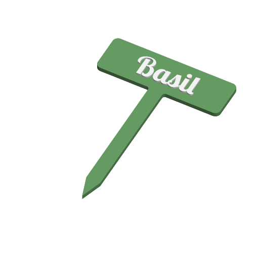

# Plant Label



A plant name on a flat label, in one of four shapes: a garden stake, an
arrow-shaped stake, a clip that hooks over a pot rim, or a hanging tag. Every
shape is one flat outline printed face up, so nothing needs supports. Two
colours: the label is one part, the letters another.

Inspired by Printables' "Fully Customizable PET Bottle Watering Spike/Plant
Label" and "Stylish Plant Labels"; written to the Parametric Model Maker
customizer conventions, so the same file works unchanged on MakerWorld and in
ScadBuddy.

## Parameters

### Text

| Parameter | Default | What it does |
|---|---|---|
| `text` | `Basil` | The plant name, up to 20 characters. |
| `font` | `Lobster Two:style=Bold` | Typeface (`// font`). |
| `text_size` | `12` | Letter height in mm. A name that does not fit the label is shrunk to fit; it is never enlarged. |
| `text_style` | `raised` | `raised`: letters stand 1 mm proud. `inlay`: letters fill a pocket flush with the face, 1 mm deep (at most 40 % of the thickness). |

### Shape

| Parameter | Default | What it does |
|---|---|---|
| `style` | `stake` | `stake`, `arrow_stake`, `pot_rim_clip` or `hanging_tag`. |
| `label_w` | `70` | Width of the label area in mm. |
| `label_h` | `22` | Height of the label area in mm. |
| `stake_len` | `80` | Stake length below the label, to the tip. Stake styles only. |
| `thickness` | `2.5` | Label thickness. Raised letters add 1 mm on top. |
| `rim_thickness` | `3` | Thickness of the pot rim the clip fits over. Pot rim clip only. |

The text box is the label less 2.5 mm on every side.

- **stake** — rounded label with an 8 mm stake centred below it, ending in a
  12 mm point.
- **arrow_stake** — the label is an arrow pointing right (the point adds
  `label_h / 2` to the width) with a notch on the left, on the same stake.
- **pot_rim_clip** — two 4 mm legs, 18 mm long, hang from the label's bottom
  edge with a `rim_thickness` gap between them. The rim slides up between the
  legs until it meets the label; a 0.3 mm bump at each leg tip grips it. The
  label stands up above the rim, edge-on to the pot wall.
- **hanging_tag** — rounded label with a 4 mm hole in a tab at the left end,
  for string or a twist tie. The tab adds 7.5 mm to the width.

### Colors

| Parameter | Default | What it does |
|---|---|---|
| `label_color` | `#6BA368` | The label, stake, clip or tag. |
| `text_color` | `#FFFFFF` | The letters. |

## Colours and extruders

There are exactly two `color()` calls, so the render produces two parts.
**The order of the colour parameters in the source is the extruder order**:

| Parameter | Part | Extruder |
|---|---|---|
| `label_color` | label | 1 |
| `text_color` | letters | 2 |

Set them equal and the label prints in one colour.

## Variations

- `style`: stake, arrow stake, pot rim clip, hanging tag.
- `text_style`: raised, inlay.

## Verifying

```bash
./verify.sh
```

Renders the defaults, all eight `style` × `text_style` combinations and five
edge cases (a long name on a narrow tag, a 1.6 mm inlay, an 8 mm rim, empty
text, a 200 mm stake with a serif face) in `scadbuddy-verify:local`, building it
from `openscad/openscad:dev` plus ScadBuddy's font packages when it is missing.
For each it checks:

- exactly the expected colour parts, and no triangles on `Default`;
- the bounding box the parameters imply (stake length, arrow point, clip legs,
  tag tab) and that the model sits on z=0;
- from one closed render per colour, the way ScadBuddy builds its parts, the
  label at 0–`thickness` and the letters above it (raised) or in the top of it
  (inlay);
- the letters fit inside the text box, and a long name is shrunk to exactly its
  width;
- the pot rim clip's gap is `rim_thickness` at the label edge and
  `rim_thickness - 0.6` at the grip bumps.

The 3MF and STL parsing runs on the host with `python3` and the standard
library only. Output lands in `.verify/`.

## Needs a test print

- The pot rim clip's grip on a real pot, and whether 4 × 2.5 mm legs are stiff
  enough in your material.
- How far an 8 × 2.5 mm stake pushes into firm soil without bending.
