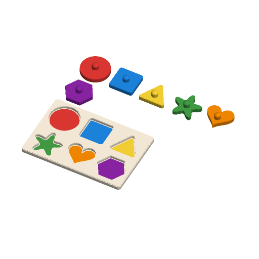

# Shape Sorter Puzzle



A toddler's peg puzzle. The tray has a hole for every piece. The pieces are
chunky, with a knob on top to lift them by. Pick one of four sets:

- basic shapes;
- animals built from simple round shapes;
- the numbers 0–9;
- the letters of a word.

Every piece has its own colour. The floor of each hole carries a flush inlay of
its piece's shape in the piece's colour, so matching colours helps with
matching shapes. The tray and the pieces print together on one plate when they
fit, and on two plates of the same 3MF when they do not.

It is inspired by the most-downloaded toddler peg puzzles on Printables when
this was written (2026-09-27): "educational baby/toddler puzzle" by Bas (761
downloads) and "Educational Number and Shape Puzzle for kids" by hvrkh (445).
It is written to the Parametric Model Maker customizer conventions, so the same
file works unchanged on MakerWorld and in ScadBuddy.

## How the pieces fit

- Each piece is its hole's outline shrunk by `clearance` all round, so it
  drops in without forcing. The top of every hole has a 0.8 mm lead-in
  chamfer.
- Pieces are `piece_thickness` thick and the holes are `hole_depth` deep. At
  the defaults a piece stands 3 mm proud of the tray, so it can be picked out
  even without a knob.
- The sets:
  - **Shapes**: circle, square, triangle, star, heart and hexagon.
  - **Animals**: cat, fish, bunny, turtle, bird and whale. Each is a union of
    circles and ellipses, softened so there are no thin points.
  - **Numbers and letters**: the glyph in DejaVu Sans Bold, thickened by 5 % of
    the piece size, with gaps under 2 % filled in. The pieces stay chunky and
    the tray has no thin slivers. Lower case is made upper case, and anything
    other than A–Z and 0–9 is skipped.
- Each knob sits at the point of its piece furthest from any edge. The
  positions come from a table measured on every shape, animal and glyph. A knob
  is made narrower when its piece has no room for the full `knob_diameter`,
  down to 6 mm. Below that the piece has no knob. The render log says so
  (`NOTE:`) in both cases.

## Layout

The tray is a grid of cells, each `piece_size` square with `tray_wall` between
them and round the edge. It has as many columns as the 300 mm plate allows, and
balanced rows. If the tray would be deeper than 320 mm, `piece_size` is reduced
until it fits.

The pieces go beside the tray on the same plate, 5 mm apart, when they fit.
When they do not, they go on a second plate of the same 3MF: the model echoes
`plates = 2`, ScadBuddy renders the tray on plate 1 and every piece on plate 2,
and the render log says so with a `NOTE:`. That happens with twelve letters,
with the numbers at the largest sizes, and with the shapes at 80 mm. Nothing is
ever left out of the print. (Before #512 a `layout` parameter chose the tray,
the pieces or both, and a tray and pieces that did not fit together printed the
tray alone. A preset that still sets it applies without it: the preset picker
skips a parameter the template no longer has, and says so.)

## Parameters

### Puzzle

| Parameter | Default | What it does |
|---|---|---|
| `set` | `shapes` | `shapes` (6 pieces), `animals` (6), `numbers` (0–9, 10 pieces) or `letters` (one piece per character of `letters`). |
| `letters` | `ANNA` | The word for the letters set, up to 12 characters. Repeated letters get a piece and a hole each. An empty word makes one `A`. |
| `piece_size` | `55` | Each piece's cell in mm, 35–80. A piece is this size less the clearance. |

### Pieces

| Parameter | Default | What it does |
|---|---|---|
| `knobs` | `true` | A knob on every piece to lift it by. |
| `knob_diameter` | `12` | Knob diameter in mm, 8–16. It is narrower on a piece with no room for it. |
| `knob_height` | `10` | Knob height above the piece in mm, 6–16, including its domed top. |
| `piece_thickness` | `8` | Piece thickness in mm, 4–14. It is never less than `hole_depth`. |
| `clearance` | `0.5` | Gap per side between each piece and its hole in mm, 0.3–1.0. 0.5 is an easy fit for small hands. |

### Tray

| Parameter | Default | What it does |
|---|---|---|
| `hole_depth` | `5` | Depth of each hole in mm, 3–10. |
| `floor_thickness` | `2.4` | Tray floor under the holes in mm, 2–4. |
| `tray_wall` | `7` | Tray between neighbouring holes and round the edge, in mm, 5–14. |
| `color_hints` | `true` | Inlay each hole's floor with its piece's shape in the piece's colour, 0.6 mm deep and 1.5 mm in from the hole's edge. |

### Colours

| Parameter | Default | What it does |
|---|---|---|
| `tray_color` | `#FFF3E0` | The tray. |
| `piece_color_1` … `piece_color_12` | red, blue, yellow, green, orange, purple, pink, cyan, lime, indigo, brown, deep orange | Piece *n*, and its hole's colour hint. |

## Colours and extruders

**The order of the `color` parameters in the source is the extruder order:**

| Parameter | Part | Extruder |
|---|---|---|
| `tray_color` | tray | 1 |
| `piece_color_1` … `piece_color_12` | pieces 1–12 and their hole hints | 2–13 |

A set uses as many piece colours as it has pieces: six for shapes and animals,
ten for numbers. With `color_hints` on, the tray plate uses the same colours as
the pieces. Equal colours merge into one part and one filament. Set every piece
colour the same for a two-colour print.

## Printing

- Print everything as it lies, flat, with no supports. The knobs point up.
- The hint inlays put colour changes in the three layers of the hole floors.
  Turn `color_hints` off for a single-colour tray.
- Use 0.2 mm layers and a 0.4 mm nozzle. Try one piece in its hole before
  printing the whole set. If it is tight, raise `clearance`.

## Safety

The pieces are too big to swallow, but a knob snapped off a piece is a small
part and a choking hazard for children under 3. Check the knobs, and supervise
young children. Narrow knobs, 8 mm or less, are the easiest to break.

## Verifying

```bash
./verify.sh
```

It renders the defaults and twenty variations in `scadbuddy-verify:local`:

- every set;
- a twelve-letter word, where the pieces go on plate 2;
- a word with lower case, spaces and punctuation, and an empty word;
- all 36 letters and digits, at the smallest piece size with the biggest knob,
  and at the full size at three clearances;
- numbers at the largest size, where the pieces shrink and go on plate 2;
- the loosest, deepest tray with no knobs and no hints;
- numbers at the largest size with no knobs, so plate 2 is exactly
  `piece_thickness` tall;
- the smallest animals at the tightest clearance with the tallest knobs;
- the largest shapes.

For each one it checks:

- the print has exactly the colour parts the set implies, nothing on the
  `Default` material, sits on z=0, and is as tall as a piece and its knob;
- it echoes `plates = 2` exactly when the tray and the pieces do not fit
  together. Each plate, rendered on its own with `$plate` as ScadBuddy renders
  it, fits the 300 × 320 bed: plate 1 is the tray, plate 2 is every piece;
- the tray is exactly the size of its grid, and is full height to its top
  edge;
- the render log carries the `NOTE:` lines the case expects, and no others;
- the print is exactly the tray plus one separate piece per hole, so no piece
  is ever left out;
- **every piece fits its hole at the set clearance.** A hidden `probe_fit`
  render sits each piece in its hole, grows it and intersects it with the
  tray. Grown by `clearance - 0.03` it must touch nothing. Grown by
  `clearance + 0.03` it must touch the wall of every hole, which proves the
  probe measures the real gap;
- every hole, with its lead-in, stays inside its cell, and neighbouring holes
  stay `tray_wall` apart;
- every knob sits wholly on its piece, with 1.1 mm to spare;
- rendered once per colour the way ScadBuddy builds its closed parts, the
  colour parts do not overlap. The volume of the union equals the sum of the
  parts.

The 3MF and STL parsing runs on the host with `python3` and the standard
library only.

Some things need a physical test print:

- how the 0.5 mm clearance feels in small hands;
- whether the knobs are strong enough;
- whether the thickened letters read clearly to a child.
