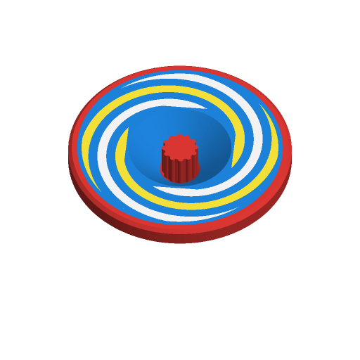

# Spinning Top (Print in Place)



A spinning top that comes off the plate ready to spin: no assembly, no
supports. The face carries a pattern in two colours — spiral arms, rays,
rings or dots — that turns into a swirl or a flicker when it spins, and an
optional name. It is the print-in-place companion of
[`spinning-top`](../spinning-top/), which is three pieces pushed together.

Three variants:

| Variant | What comes off the plate |
|---|---|
| `one_piece` (default) | One solid top, printed face down. |
| `with_launcher` | The top, its launcher housing and a pull rack, printed assembled. |
| `gyro_ring` | The one-piece top with a free ring around its rim, printed in place. |

The thumbnail shows the top face up (rendered with the hidden
`display = "show"`, which turns the plate over); on the plate it is upside
down (see below).

Inspired by what was popular on Printables when this was written
(2026-09-26). The most-downloaded launcher tops, "Pull Start Spinning Top
Launcher" by Medweator (497 downloads) and "Spinning Top with pull cord
Launcher" by colbster302 (421), both use a rack that turns a gear on the top,
but print it as separate parts that are glued or snapped together. The
print-in-place tops, "Spinning top Print in place" by MdeMAKER (158) and
"Spinning Top (Print-in-Place)" by kida (135), are single solids. The captive
ring comes from print-in-place gyro fidgets such as "Gyro Fidget Spinner" by
Maker Lessons (7,727). Written to the Parametric Model Maker customizer
conventions, so the same file works unchanged on MakerWorld and in ScadBuddy.

## How each variant prints and works

### One piece

Printed upside down, face on the bed, so the pattern is the first three
layers and comes out bed-smooth; the tip is the last layers and narrows
upwards, so nothing overhangs.

A stem that stood proud of the face could not share the bed with it, so the
stem stands in a funnel-shaped well in the middle of the face, flush with
it. The well's wall is a 45° cone, which prints without support. Pinch the
stem in the well and twist. It has twelve small ribs for grip.

This differs from the brief this was built to ("stem and tip pointing up"):
with the face on the bed, only one of the two can point up.

### With launcher

The top's stem is a 12-tooth gear. It is printed gear-down: the gear stands
on the bed in a through-hole in the launcher housing, the top's face is a 45°
dome above the housing, and the rack lies in a roofed channel beside the gear,
its teeth meshed with it. The three are separate bodies, `clearance` apart
everywhere, so the plate comes off as one working toy.

To launch:

1. Stand the top on its tip, housing uppermost (the way it is printed, turned
   over). Hold the housing by its handle, just clear of the dome.
2. Pull the ring sharply along the rack. The rack spins the gear.
3. Lift the housing straight up: the gear slides out of the through-hole and
   the top keeps spinning.

To launch again, push the rack's toothed end back into the channel from the
ring side until the ring meets the housing. The gear turns backwards as the
teeth go past; that is fine.

The face is a dome rather than flat because the dome is what the housing
holds up: printed gear-down, a flat face would be a large overhang above the
housing. The pattern and the name are inlaid in the dome.

Gear details: 12 teeth, 25° pressure angle (12 teeth at 20° would undercut),
generated by rolling the rack around the gear so the flanks are true involutes
of that rack. The clearance is split: gear and rack are each `clearance / 2`
under size, so they are `clearance` apart and both keep full-strength teeth. A
45° notch under the rack's back edge rides over a lip in the channel, which
stops the rack dropping out of the channel's open side in use.

### Gyro ring

The one-piece top with a ring around its rim. A 45° V ridge on the ring sits
in a matching groove in the rim, `clearance` apart, reaching 1 mm into it, so
the ring is captive but turns freely. Both 45° flanks print without support.
Spin the top and the ring rides along loose; hold the ring lightly and the core
spins inside it.

## Balance

Everything on the top is a solid of revolution, and each colour's part of the
pattern is itself spread evenly around the axis (two of the four spiral arms,
four of the eight rays, alternate rings, a whole ring of dots, two copies of
the name 180° apart). So each colour's centre of mass lies on the spin axis,
whatever filament densities you use — `verify.sh` checks this. The launcher
top's gear is one generated tooth space repeated twelve times, so it is
balanced too.

## Parameters

### Top

| Parameter | Default | What it does |
|---|---|---|
| `variant` | `one_piece` | `one_piece`, `with_launcher` or `gyro_ring` (see above). |
| `diameter` | `50` | Top diameter in mm, 30–80. |
| `style` | `classic_cone` | `classic_cone`: a straight cone down to the tip. `ufo_disc`: a thinner disc over a saucer. `flower`: the classic cone cut to a six-petal outline. |
| `stem_length` | `8` | One piece and gyro ring: how deep the well is, i.e. how much stem you can grip (clamped so the well leaves at least 4 mm of face). With launcher: the gear's length, at least housing thickness + 2 mm (10 mm at the default clearance). |
| `stem_d` | `7` | One piece and gyro ring: stem diameter (at most half the top's radius). Ignored with the launcher, where the stem is the gear. |
| `tip` | `ball` | `ball`: a rounded tip (6 % of the diameter, 2–4 mm radius) that is safer and wanders around a table. `point`: a 0.6 mm-radius point that spins in place longer. |
| `clearance` | `0.4` | Air gap between parts printed in place: gear and housing, gear and rack, rack and channel, ring and rim. Raise it if parts come off fused; lower it if they rattle. |

The top's height follows from the diameter and style: a one-piece body grows
taller if the well needs the room (the well's floor stays 2 mm above the
tip-coloured zone).

### Launcher

| Parameter | Default | What it does |
|---|---|---|
| `gear_module` | `1.5` | Tooth size, 1.25–2. The gear's diameter is 12 × this plus 2 × this (21 mm at 1.5). Bigger teeth are sturdier; on a small top use 1.25. |
| `pull_length` | `100` | Toothed length of the rack, 60–160 mm. 100 mm turns a module-1.5 gear about 1.8 times; how fast the top spins depends on how fast you pull. |

### Decor

| Parameter | Default | What it does |
|---|---|---|
| `pattern` | `spiral` | `spiral` (four arms), `rays` (eight), `rings` (four bands out of seven), `dots` (rings of 6 and 12; on the flower, both rings of 6 on the petals), or `none`. Half of it is in `pattern_color`, half in `pattern2_color`. Inlaid 0.6 mm (three layers) flush with the face; in the launcher's dome, 0.6 mm measured square to the dome. |
| `name` | *(empty)* | Up to 12 characters around the face, twice, 180° apart, reading clockwise. Letters are 3.5 mm tall, spaced by their own widths, and shrink to fit; the pattern moves inwards to make room. On the flower the name stays inside the centre disc. |

The pattern fills the face from just outside the stem's well (or the gear) to
just inside the rim border, following the petals on the flower. Guards: if the
space left is narrower than 3 mm the pattern is left off; if the name would be
smaller than 1.5 mm or would not fit, the name is left off. A small top with a
fat stem and a long name can end up with neither.

### Colors

| Parameter | Default | What it colours |
|---|---|---|
| `body_color` | `#1E88E5` blue | The body. |
| `pattern_color` | `#FFEB3B` yellow | Half the pattern: arms 1 and 3, rays 1, 3, 5, 7, the inner rings, the inner dots. |
| `pattern2_color` | `#FFFFFF` white | The other half of the pattern. |
| `name_color` | `#FFFFFF` white | The name. |
| `rim_color` | `#E53935` red | A 2 mm border round the face and the disc's edge. |
| `stem_color` | `#E53935` red | The stem (one piece, gyro ring) or the gear (launcher). |
| `tip_color` | `#E53935` red | The tip, up to 2 × the ball radius + 0.5 mm (4 mm for the point). |
| `ring_color` | `#43A047` green | The gyro ring. |
| `launcher_color` | `#FB8C00` orange | The launcher housing. |
| `rack_color` | `#8E24AA` purple | The rack and its pull ring. |

## Colours and extruders

**The order of the `color` parameters in the source is the extruder order**,
and equal colours share one extruder (one part):

| Parameter | Extruder |
|---|---|
| `body_color` | 1 |
| `pattern_color` | 2 |
| `pattern2_color` | 3 |
| `name_color` | 4 |
| `rim_color` | 5 |
| `stem_color` | 6 |
| `tip_color` | 7 |
| `ring_color` | 8 |
| `launcher_color` | 9 |
| `rack_color` | 10 |

With the defaults the one-piece top is four filaments (blue, yellow, white and
red, the name sharing white and the rim, stem and tip sharing red); the gyro
ring adds green, the launcher orange and purple. Colours that are not used by
the chosen variant (the ring's without a ring, say) produce no part. Give the
rim, stem and tip their own colours for up to seven on the top alone.

On the one-piece top the colour changes are concentrated where they are cheap:
the pattern and name are only the first three layers; the rim runs the disc's
thickness, the stem the well's depth, and the tip is the last few millimetres.

## Printing

- No supports. Every downward-facing surface is at 45° or steeper, except the
  flat roof over the rack channel, which is a short bridge (about 9 mm).
- Print-in-place needs a clean first layer: parts are `clearance` apart
  right at the bed (gear and housing, ring and rim), so turn on elephant-foot
  compensation. If a part is stuck, twist or pull it firmly once to break the
  first-layer skin; if it keeps happening, raise `clearance`.
- The launcher top stands on its 21 mm gear and is about 50 mm tall: add a
  brim to the top.
- 100 % infill (or many walls) spins longest: a heavier rim stores more spin.

## Safety

The top, the gear and a small ring are choking hazards for children under 3.
Supervise young children. The point tip is rounded to 0.6 mm, but the ball tip
is the one for small hands. Pull the rack along the channel, not towards a
face.

## Verifying

```bash
./verify.sh
```

Renders the defaults and thirteen variations (every variant, style, pattern and
tip, names that fit and one that does not, a name with narrow letters, the smallest and biggest tops,
every gear module, the tightest and loosest clearances, the shortest and
longest rack) in `scadbuddy-verify:local`, and checks:

- the plate has exactly the colour parts the parameters imply, nothing on the
  `Default` material, and the bounding box the parameters imply, on z=0;
- rendered as one closed solid per colour of **the top alone** (the way
  ScadBuddy builds its parts): the parts do not overlap, and **each colour's
  centre of mass, and the whole top's, lies on the spin axis within 0.05 mm**;
- rendered as one closed solid per printed body (top, ring, launcher, rack):
  - the top is **one connected piece**, and so is every other body;
  - every pair of bodies printed together is **at least `clearance` apart**
    (smallest vertex-to-face distance, both ways; facets of a round part may
    sit up to 2 % closer);
  - **no downward-facing face is steeper than 45°** from vertical anywhere
    above the bed, except flat faces at the height of the launcher's channel
    roof, which are reported as bridge area;
- with the launcher, the top releases: nothing of the housing reaches into
  the gear's through-hole, and nothing of the top inside the housing's
  thickness is wider than the gear;
- with the gyro ring, the ring is captive: its ridge reaches inside the rim;
- the letters of a name with narrow `l` and `i` are evenly spaced (they used
  to be placed at a fixed pitch, which left gaps).

The 3MF and STL parsing, the mass properties and the distance checks run on
the host with `python3` and the standard library only.

What needs a physical test print: whether the parts break free cleanly at
0.4 mm on your printer, how well the rack drives the gear (backlash is
`clearance`, and the rack's tooth tips narrow to about 0.5 mm at module 1.5),
how fast a pull spins the top, how long each style runs, and whether the
one-piece stem is comfortable to grip in its well.
