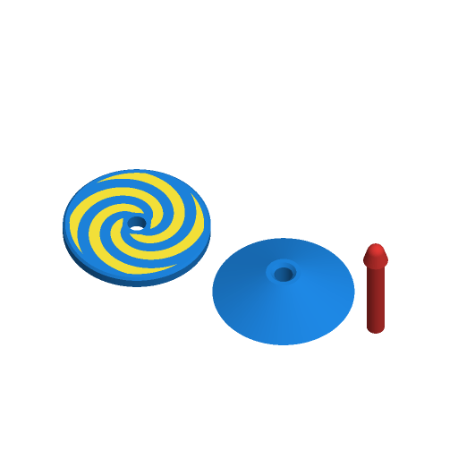

# Spinning Top



A spinning top in three pieces: a wide disc with a pattern inlaid in its face,
a cone (or saucer bowl) under it, and a spindle that runs through both. The
pattern — a four-arm spiral, rays or dots — is in a second colour, so it turns
into a swirl or a flicker when the top spins. A name can go around the rim.

Inspired by the most-downloaded spinning tops on Printables when this was
written (2026-09-26): "Twisted Spinning Top - Spins like forever" by prntmkr
(8,397 downloads) and "Spinning Top" by fifindr (6,387). Written to the
Parametric Model Maker customizer conventions, so the same file works unchanged
on MakerWorld and in ScadBuddy.

## How it goes together, and why three pieces

| Piece | Colour | Prints | Why |
|---|---|---|---|
| Disc | body + pattern | face up, flat underside on the bed | The pattern is the top layers, so it is crisp and it is what you see on the plate. |
| Cone | body | upside down, its flat top on the bed | Upside down it narrows upwards, so it needs no support. |
| Spindle | stem | standing on its flat stem end, tip up | The stem and the tip are one piece, so they are on the same axis whatever the printer does. |

Push the spindle's stem end up through the hole in the cone's point, then
through the disc, until the collar above the tip seats in the cone. The collar
is a 45° cone that sits in a matching countersink, so the tip centres itself and
the load of spinning goes into the cone, not into the friction fit. The disc
sits on the cone's flat top.

A single-piece body (disc and cone printed together, face down) was the other
option. It prints fine, but the pattern then faces the bed and the card shows a
plain cone; and a separate stem pressed into it only has the tip on the axis if
the socket is. Here the tip and stem are one print, and the disc and cone are
centred on it by the holes.

Everything is a solid of revolution, and each pattern and the name are
repeated around the axis (four spiral arms, eight rays, rings of 6 and 12 dots,
two copies of the name 180° apart), so every colour's centre of mass is on the
spin axis — even if the pattern filament is heavier than the body's.

## Parameters

### Top

| Parameter | Default | What it does |
|---|---|---|
| `diameter` | `50` | Disc diameter in mm, 30–80. |
| `style` | `classic_cone` | `classic_cone`: a straight cone down to the tip; tip to disc is 34 % of the diameter. `ufo_disc`: a thinner disc over a shallow saucer bowl, tip to disc 16 % of the diameter. `flower`: the classic cone cut to a six-petal outline. |
| `stem_length` | `20` | How far the stem stands above the disc's face. |
| `stem_d` | `6` | Spindle diameter. The collar above the tip is 1.2 mm bigger all round. |
| `tip` | `ball` | `ball`: a rounded tip (6 % of the diameter, 2 mm minimum, never wider than the collar) that is safer and wanders around a table. `point`: a 0.6 mm-radius point that spins in one place for longer. |
| `fit_clearance` | `0.15` | Clearance per side between the spindle and the holes in the disc and cone. 0.15 is a firm push fit on a calibrated printer; raise it if the spindle will not go in, lower it if the disc spins loose on the spindle. |

### Decor

| Parameter | Default | What it does |
|---|---|---|
| `pattern` | `spiral` | `spiral` (four arms at half coverage), `rays` (eight wedges), `dots` (rings of 6 and 12), or `none`. Inlaid 0.6 mm (three layers) into the face, flush. |
| `name` | *(empty)* | Up to 12 characters around the rim, twice, 180° apart, reading clockwise. Letters are 3.5 mm tall and shrink to fit half the circumference; the pattern moves inwards to make room. |

Guards: if the pattern's ring would be narrower than 3 mm (a small disc with a
fat spindle and a name), the pattern is left off; if the name would have to be
smaller than 1.5 mm, the name is left off.

### Colors

| Parameter | Default | What it does |
|---|---|---|
| `body_color` | `#1E88E5` | Disc and cone. |
| `pattern_color` | `#FFEB3B` | Pattern and name. |
| `stem_color` | `#E53935` | Spindle. |

## Colours and extruders

**The order of the `color` parameters in the source is the extruder order:**

| Parameter | Part | Extruder |
|---|---|---|
| `body_color` | disc and cone | 1 |
| `pattern_color` | pattern and name | 2 |
| `stem_color` | spindle | 3 |

With `pattern = none` and no name there is no pattern part, and the top is
two colours.

## Printing

- No supports. The spindle is tall and thin (42 mm × 6 mm at the defaults, up
  to 70 mm × 4 mm): add a brim, and print it slowly or with other parts so each
  layer has time to cool.
- The pattern is inlaid in the disc's top layers, so the colour changes happen
  only in the last 0.6 mm of the disc.

## Safety

The spindle and a small disc are choking hazards for children under 3.
Supervise young children. The point tip is rounded to 0.6 mm, but the ball tip
is the one for small hands.

## Verifying

```bash
./verify.sh
```

Renders the defaults and eight variations (every style, pattern and tip, a
name, no decor, the smallest disc with the fattest spindle and a long name, the
biggest disc with the thinnest spindle and zero clearance) in
`scadbuddy-verify:local`, and checks:

- the plate has exactly the colour parts the parameters imply, and nothing on
  the `Default` material;
- the plate bounding box is what the parameters imply, on z=0;
- rendered **assembled** (hidden `assembled = true`), one closed solid per
  colour the way ScadBuddy builds its parts: each part sits at the heights the
  parameters imply, the parts do not overlap (the volume of the union equals
  the sum of the parts), and **each part's centre of mass, and the whole
  top's, lies on the spin axis within 0.05 mm**.

The 3MF and STL parsing and the mass properties run on the host with `python3`
and the standard library only.

How well it spins — the push fit, the collar seating, how long it runs — needs
a physical test print.
