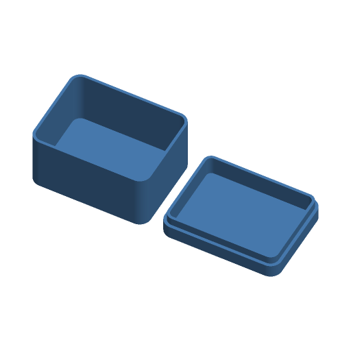

# Storage Box with Lid



A parametric box with a lid. Four footprints (rectangle, rounded rectangle,
hexagon, round/oval), optional grid dividers, and three kinds of lid: a
friction plug, a dovetail sliding lid, or a snap-fit. Optional text is inlaid
flush in the lid top in its own colour.

Inspired by Printables' "Rugged Box (Parametric)" and MakerWorld's "Parametric
Box with Lid" and "Box with Slide Lid"; written to the Parametric Model Maker
customizer conventions, so the same file works unchanged on MakerWorld and in
ScadBuddy.

## Print layout

Everything prints without supports, laid out left to right along X with a
10 mm gap. When that row is wider than the H2C's 300 mm (both nozzles; from
about 145 mm inside length with a friction lid), the lid goes behind the box
instead, 10 mm away in +Y, as long as that fits 300 × 320 mm. A box too big
for either layout (both sides over about 150 mm) keeps the row and echoes a
`NOTE:`: print the box and the lid on separate plates.

| Part | Orientation |
|---|---|
| Box | upright, open side up |
| Friction / snap lid | upside down: lid top on the bed, locating lip pointing up |
| Knob (friction / snap with `handle = knob`) | head down, peg pointing up |
| Sliding lid | flat, the right way up |

Because the friction and snap lids print upside down, their text is inlaid
into the face on the bed. It is modelled mirrored for that orientation, so it
reads correctly when the lid is on the box.

## Parameters

### Box

| Parameter | Default | What it does |
|---|---|---|
| `inner_l` | `80` | Inside length (X), wall to wall. 20–250. |
| `inner_w` | `60` | Inside width (Y), wall to wall. 20–250. |
| `inner_h` | `40` | Inside height, floor to rim. With a sliding lid it is floor to the underside of the lid; the box is 2 mm taller for the lid. |
| `wall` | `2` | Wall thickness. Dividers use the same thickness. |
| `floor` | `1.6` | Floor thickness; also the thickness of a friction/snap lid's top. |
| `shape` | `rounded` | `rectangle`, `rounded`, `hexagon` or `round`. The dimensions are always the inside extents. |
| `corner_r` | `6` | Inside corner radius, `rounded` only. Clamped to fit. The outside radius is `corner_r + wall`. |
| `dividers_x` | `0` | Evenly spaced dividers across the length (walls parallel to Y). |
| `dividers_y` | `0` | Evenly spaced dividers across the width (walls parallel to X). |

`hexagon` is an elongated hexagon with 120° corners, pointed along the longer
inside dimension. `round` is an ellipse (a circle when `inner_l = inner_w`).

### Lid

| Parameter | Default | What it does |
|---|---|---|
| `lid_type` | `friction` | `none`, `friction`, `sliding` or `snap` (see below). |
| `lid_h` | `10` | Friction/snap lid height, top to the rim it sits on. Ignored for sliding lids. |
| `tolerance` | `0.25` | Clearance between lid and box, per side. |
| `handle` | `none` | `none`, `knob` or `finger_notch` (see below). |
| `lid_text` | empty | Text inlaid in the lid top, up to 24 characters. Empty means no text and no third colour. |
| `lid_text_size` | `12` | Text height in mm. Text wider than the lid shrinks to fit it (never grows): the lid top less 1.5 mm each side (70 % of it on hexagon and round lids), and on a sliding lid clear of the knob or thumb dimple. |
| `font` | `DejaVu Sans:style=Bold` | Typeface for the lid text. |

**Lid types**

- `friction` — a cap the same outline as the box with a locating lip that drops
  `min(6, inner_h/2)` mm inside the walls with `tolerance` clearance. Dividers
  are cut down by the lip depth + 0.5 mm so the lip clears them.
- `snap` — the friction lid plus a 45° V bump on the middle third of each long
  side of the lip, clicking into a V groove all round the inside of the box
  wall. Bump and groove are `min(0.6, 0.4 * wall)` deep.
- `sliding` — a 2 mm plate with 45° dovetail edges running in grooves cut into
  the two long walls, entering from the open end (−X, or −Y when the box is
  longer in Y). The groove is `min(max(wall/2, tolerance + 0.4), wall − 0.4)`
  deep. **Rectangle and rounded only**: hexagon and round boxes have no
  straight long sides to run in, so choosing `sliding` with those shapes gives
  a friction lid instead. Dividers stop 0.5 mm under the plate so it slides
  over them without rubbing.
- `none` — just the box.

**Handles**

| `handle` | Friction / snap lid | Sliding lid |
|---|---|---|
| `knob` | A separate 18 mm knob with a 6 mm peg, pressed into a hole in the lid centre (add a drop of glue if loose). Lid text moves below the knob. | A 10 mm knob printed on the lid near the open end. |
| `finger_notch` | A half-round notch in the rim of the long wall, to get a finger under the lid edge. | A shallow thumb dimple in the lid top near the open end. |

### Colours

| Parameter | Default | What it does |
|---|---|---|
| `box_color` | `#4A7FB5` | Box and dividers. |
| `lid_color` | `#4A7FB5` | Lid and knob. Same as the box by default, so they share an extruder. |
| `lid_text_color` | `#FFFFFF` | Inlaid lid text. |

## Colours and extruders

**The order of the `color` parameters in the source is the extruder order:**

| Parameter | Part | Extruder |
|---|---|---|
| `box_color` | box, dividers | 1 |
| `lid_color` | lid, knob | 2 |
| `lid_text_color` | lid text inlay (0.6 mm deep, flush) | 3 |

Two parameters with the same value are one part and one filament, so the
defaults print single-colour; adding lid text makes it two. Give the lid its
own colour for three.

## Variations

- **Lid type** — friction, snap, sliding, or no lid.
- **Shape** — rectangle, rounded, hexagon, round.
- **Dividers** — 0–6 each way, for up to a 7 × 7 grid of compartments.
- **Handle** — knob or finger notch, plus lid text.

## Verifying

```bash
./verify.sh
```

Renders the defaults and fourteen variations (every lid type, every shape,
sliding lids in both orientations, the hexagon sliding fallback, three colours,
the largest and smallest settings, long lid text on a sliding and a knob lid,
and two boxes wide enough that the lid goes behind them) and checks each 3MF: the expected number of
non-empty materials, nothing left on `Default`, the bounding box exactly equal
to what the parameters imply (the checker recomputes it), the plate on z = 0,
the plate within the 300 × 320 mm bed where any layout allows it, dividers
0.5 mm under the lid, the lid text no wider than its room, and the lid text on
the bed face of a flipped lid or flush with the top of a sliding lid. Output lands in `.verify/`. The 3MF parsing runs on the host with
`python3` and the standard library only.

## Not yet print-tested

The fits are computed, not measured: the friction lip clearance, the snap
bump interference (`snap_b − tolerance`, 0.35 mm at the defaults), the sliding
dovetail at thin walls (at `wall = 1.2` the wall behind the groove is 0.55 mm),
and the knob peg (hole is `6 + tolerance/2` mm) all want a test print before
being trusted.
