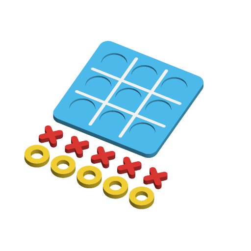

# Travel Tic-Tac-Toe



A tic-tac-toe board with nine round, recessed wells and grid lines inlaid
flush in a second colour, plus five pieces for each player. Pieces are
classic X and O, or a star and a heart. It prints as a flat board, or as a box
that stores the pieces under a sliding lid whose top is the board.

Everything prints flat on one plate without supports: the board (or the box,
open side up, with the lid face up beside it) and the pieces in two rows in
front. Piece corners are rounded 1.2 mm and the grid lines have round ends.

Inspired by Printables'
[Tic-Tac-Toe Game Set (Easy To Print)](https://www.printables.com/model/996434)
(5,796 downloads) and
[Tic Tac Toe in a box](https://www.printables.com/model/68328) (3,360
downloads); written to the Parametric Model Maker customizer conventions, so
the same file works unchanged on MakerWorld and in ScadBuddy.

With the defaults the board is 100 × 100 × 5 mm, the wells are 22.3 mm across
and 2 mm deep, and the pieces are 21.5 mm across and 5 mm thick.

**Safety:** the pieces are small enough to be a choking hazard for children
under 3. Supervise play.

## Parameters

### Board

| Parameter | Default | What it does |
|---|---|---|
| `size` | `100` | Board side in mm (70–150). The box is this square too. |
| `thickness` | `5` | Board thickness; on the box, the lid's thickness. Wells are `min(2, thickness - 1.2)` deep; the grid inlay is 1 mm deep. |
| `style` | `flat_board` | `flat_board`, or `box_with_storage`: a box with a sliding lid (see below). |

### Pieces

| Parameter | Default | What it does |
|---|---|---|
| `piece_style` | `classic_xo` | `classic_xo` (X and O) or `animals` (star and heart — two instantly recognisable flat shapes; the value keeps the brief's name). |
| `piece_thickness` | `5` | Piece thickness. Pieces stand proud of the wells. |
| `clearance` | `0.4` | Per side: a piece is `2 × clearance` narrower than its well, and the lid has `clearance` all round in its grooves. |

### Colors

| Parameter | Default | What it does |
|---|---|---|
| `board_color` | `#4FC3F7` | Board, or box and lid (sky blue). |
| `grid_color` | `#FFFFFF` | Inlaid grid lines (white). |
| `x_color` | `#E53935` | X pieces, or stars (red). |
| `o_color` | `#FDD835` | O pieces, or hearts (yellow). |

## Colours and extruders

**The order of the `color` parameters in the source is the extruder order** —
the first one is extruder 1:

| Parameter | Part | Extruder |
|---|---|---|
| `board_color` | board (box and lid) | 1 |
| `grid_color` | grid lines | 2 |
| `x_color` | X / star pieces | 3 |
| `o_color` | O / heart pieces | 4 |

The grid is an inlay: the board has 1 mm deep line-shaped pockets and the
grid part fills them, so the two never overlap and the face is flat. Only the
board's top millimetre needs the second colour. Setting two colours equal
merges them into one part.

## Layout

The play area is a square (`size` for the flat board, the lid's width for the
box) with a margin of 6 % (at least 4 mm). It is split into three cells each
way; grid lines are 3 % of the play area wide (at least 2 mm), and each well
is the cell less the line and a 2 mm wall each side.

## Box with storage

- **Box:** `size` square, 4 mm walls, 2 mm floor. The storage well is
  `2 × piece_thickness + 1.5` mm deep and holds all ten pieces in two layers (in
  fact 16 or more fit in one layer at every size `verify.sh` checks).
- **Lid:** its face is the board. It is `size - 8 - 2 × clearance` wide and
  runs from the box front to `clearance` short of the back wall. A 1.5 mm
  flange with a 45° top face and a 0.6 mm vertical land runs along both long
  edges at the bottom and slides in matching dovetail grooves in the side
  walls. The grooves run out through the front wall, which is cut down to the
  lid's underside. The lid rests on the groove floors with its face flush with
  the rim and cannot lift out.
- **Printing:** the box prints open side up; the groove ceilings are 45°
  overhangs. The lid prints face up; its flange sits on the bed.

At `size` 125 and up the box and lid side by side are wider than 250 mm, and
the render echoes a `NOTE:`; print the lid on a second plate.

## Variations

- `style`: `flat_board`, `box_with_storage`.
- `piece_style`: `classic_xo`, `animals`.

## Needs a test print

- The lid's slide fit at 0.4 mm clearance: it should slide freely but not
  rattle. Nothing latches it closed; it stays shut by friction, so carry the
  box lid-up.
- Whether the pieces drop into and lift out of the 2 mm wells easily.

## Verifying

```bash
./verify.sh
```

Renders seven cases in `scadbuddy-verify:local` (building it from
`openscad/openscad:dev` when it is missing): the defaults, the box, star and
heart pieces on the board and in the box, the smallest and thinnest box with
0.2 mm clearance, and the largest box and board with 0.8 mm clearance. For
each it checks the four colour parts, that `Default` has no triangles, the
plate's bounding box, and from one closed render per colour (the way
ScadBuddy builds its parts): the board's and grid's z ranges, the grid's span
and inlay area, the flat board's volume (slab less nine wells and the grid),
that every piece lies within `well - 2 × clearance`, and that no two pieces
overlap on the plate. For the box it also checks the storage holds ten
pieces, and, with the hidden `assembled`/`lid_lift` parameters, that the lid
seats in the box without touching it, that it collides with the grooves when
raised `clearance × (1 + √2) + 0.5` mm, and that the closed box is a `size`
square with the lid flush with the rim. Output lands in `.verify/`.
