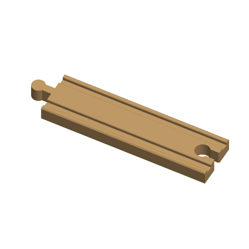

# Train Track



Wooden-railway track pieces that join each other and the common 40 mm wooden
train track (BRIO, IKEA LILLABO and the many compatible sets): straights,
curves, an ascending ramp, a 90-degree crossing, an end stop with a buffer, and
a name tile with a word inlaid between the rails.

Printed wooden-railway track is one of the most popular kids' categories on
Printables: "Extended Set of Wooden Train Track with 50+ Unique Pieces"
(#117903, 14.8k downloads) and "Connectors - Brio/IKEA Wooden Train Track"
(#48018, 5.5k downloads). This one is written to the Parametric Model Maker
customizer conventions, so the same file works unchanged on MakerWorld and in
ScadBuddy.

**Safety:** the pieces are large, but a snapped-off peg is a choking hazard for
children under 3. Supervise.

## Parameters

### Piece

| Parameter | Default | What it does |
|---|---|---|
| `type` | `straight` | `straight`, `curve`, `ramp` (ascending), `crossing` (90 degrees), `end_stop` (buffer at the far end), `name_tile` (straight with a word between the rails). |
| `length` | `144` | Length in mm, end face to end face, of a straight, ramp, crossing arm, end stop or name tile. 36-216 in 18 mm steps, which reaches every standard size: 54, 72, 108, 144, 216. |
| `curve_radius` | `182` | Curve inner-edge radius in mm. 182 is the standard large curve, 90 the short curve. |
| `curve_angle` | `45` | Curve angle, 22.5-90. Eight 45-degree curves make a circle. |
| `ramp_rise` | `64` | Height the ramp climbs, 16-96 mm. 64 is one standard level. |
| `connectors` | `male_female` | Peg and socket at the two ends, or two pegs, or two sockets. A crossing uses the pair on both arms; an end stop uses only the first. |

### Fit

| Parameter | Default | What it does |
|---|---|---|
| `connector_clearance` | `0.3` | Extra gap around the peg in each socket, 0.1-0.6 mm. |

### Decor

| Parameter | Default | What it does |
|---|---|---|
| `text` | `""` | Word inlaid between the rails of a `name_tile`, or in the front (-Y) side of a `straight`; up to 20 characters. Shrinks to fit, never grows; dropped when the piece is too short. Ignored for other types. |
| `font` | `DejaVu Sans:style=Bold` | Typeface (`// font`). |

### Colors

| Parameter | Default | What it does |
|---|---|---|
| `track_color` | `#C8A06A` | The track (wood tone). |
| `text_color` | `#5D4037` | The inlaid word. |

## Colours and extruders

**The order of the `color` parameters in the source is the extruder order:**

| Parameter | Part | Extruder |
|---|---|---|
| `track_color` | the track | 1 |
| `text_color` | the inlaid word (only when there is one) | 2 |

The word is inlaid 1 mm deep: its pocket is cut out of the track and filled by
the text part, so the two touch but never overlap.

## Dimensions

From [woodenrailway.info's BRIO track guide](https://woodenrailway.info/track/brio-track-guide)
and [track math](https://woodenrailway.info/track/track-math), with the
centre-line radius cross-checked against
[cscott/3d-track60](https://github.com/cscott/3d-track60):

| | Value |
|---|---|
| Profile | 40 wide x 12 high, 1 mm chamfer on the top outside edges |
| Grooves | two, 6 wide x 3 deep, 20 apart (inner edges), 26 centre to centre; 0.5 mm lip chamfer |
| Peg | Ø11.5 head on a 7 mm long, 6.5 mm wide neck; head centre 12.75 from the end face, reaching 18.5 |
| Socket | Ø12 + 2 x clearance, 7 + 2 x clearance throat, centred 12.75 in, 0.8 mm flared mouth |
| Straights | 54 (A2), 108 (A1), 144 (A), 216 (D), measured end face to end face |
| Large curve | 45 degrees, 182 inner / 202 centre-line / 222 outer radius |
| Short curve | 90 inner radius |
| Ascending track | rises 64 over 216 |

Real sockets are 15-17 mm across and deliberately sloppy. Here the socket is
sized for the largest common peg (12 mm head, 7 mm neck) plus
`connector_clearance`, so store-bought pegs fit, and two printed pieces join
with `0.25 + clearance` of play per side — enough to flex a layout a little
without the joint pulling apart.

Notes against the brief: `length` steps by 18 mm rather than 36, because a
36 mm step skips the standard 54 mm short straight; `curve_radius` is the
**inner** edge radius, because 182 mm — the brief's suggested default — is the
large curve's inner radius, not its centre line (202 mm).

## The pieces

- **straight / name_tile**: the profile swept along X.
- **curve**: the profile swept around the arc; starts on +X, turns
  anticlockwise.
- **ramp**: level 20 mm landings at both ends and a cosine S between them;
  solid underneath so it prints flat. A peg at the top end stands on a post down
  to the bed — the post passes through the mating piece's socket hole, so it
  does not get in the way, and it holds the peg up without supports. For the
  standard ascending track use `length = 216`, `ramp_rise = 64`.
- **crossing**: two straights at 90 degrees, grooves cut through each other.
- **end_stop**: a straight with a rounded 26 mm-tall buffer across the far end
  and a connector only at the near end.

## Print orientation

Flat on the bottom face, grooves up. The profile is vertical walls and an
open-topped groove, pegs sit on the bed and sockets are through-holes, so
nothing needs supports.

## Variations

- `type`: straight, curve, ramp, crossing, end_stop, name_tile.
- `connectors`: peg-socket, peg-peg, socket-socket.

## Verifying

```bash
./verify.sh
```

Renders 15 cases — every type, short and long, small and wide curves, a steep
peg-peg ramp, a 36 mm crossing, all three connector pairs, loose clearance, and
text on a straight, a name tile and a name tile too short for it — and checks
for each: the expected colour parts, nothing on the `Default` material, the
bounding box the piece's dimensions imply (including 18.5 mm per peg), sitting
on z=0, the grooves 6 wide / 3 deep / 26 apart at the end face, every peg and
socket at the right diameter from the bed to the deck top (and the ramp's top
peg standing on its post), and the ramp climbing exactly `ramp_rise`. From one
closed render per colour it checks every part is a closed mesh, the word sits
1 mm deep in the right place, and track + word volumes equal the plain track's.

It also joins two default straights, peg into socket, for clearances 0.1, 0.3
and 0.6, and nudges one sideways: they must not intersect until the nudge
exceeds `0.25 + clearance`.

The checking runs on the host with `python3` and the standard library only.

## Needs a test print

- Peg fit in genuine and other-brand wooden track, and printed-to-printed, at
  the default 0.3 clearance.
- Whether a wooden train climbs the default 64 mm ramp at `length = 216`.
