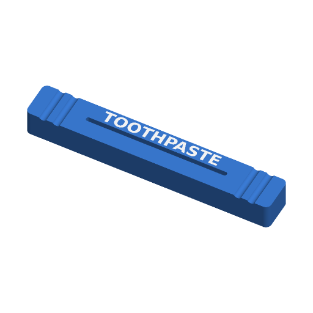

# Tube Squeezer



A bar with a narrow slot. Feed the crimped end of a tube (toothpaste, lotion,
paint, glue) through the slot and slide the bar towards the cap to press the
last of the contents out. The slot's length comes from the tube's flattened
width, and its rounded ends don't catch on the folded edges.

Inspired by the tube squeezer template in vibe-print (Hunter Stradley, MIT);
rewritten to the Parametric Model Maker customizer conventions, so the same
file works unchanged on MakerWorld and in ScadBuddy.

## Print layout

One piece, flat on the bed, with the slot running straight down through it. The
slot walls are vertical and nothing overhangs, so it needs no supports. The
label is inlaid flush into the top face (the last layers).

## Parameters

### Tube

| Parameter | Default | What it does |
|---|---|---|
| `tube_width` | `50` | Width of the tube when flattened. Measure across the crimped end. |
| `slot_gap` | `1.6` | Width of the slot. About twice the tube's wall: narrower squeezes harder but slides less easily. |
| `clearance` | `1` | Extra slot length beyond `tube_width` at each end. |

### Body

| Parameter | Default | What it does |
|---|---|---|
| `style` | `closed` | `closed`: the slot is enclosed; thread the tube's flat end through. `open_end`: the slot runs out through the +X end, so the bar slips on from the side of a tube that is already half used. |
| `height` | `10` | Height of the bar: how much of the tube it presses at once. |
| `jaw` | `6` | Thickness of each jaw beside the slot. Thicker jaws flex less, which matters most for `open_end`, where they are held at one end only. |
| `wing` | `15` | Length of the grip wing beyond each end of the slot. `0` for none. |
| `grooves` | `true` | Half-round finger grooves across the top of each wing (one per 5 mm). |

### Label

| Parameter | Default | What it does |
|---|---|---|
| `label` | *(empty)* | Up to 16 characters inlaid 0.6 mm into the top of the +Y jaw. Letters are `0.7 * jaw` tall (8 mm at most) and shrink to fit the slot's length rather than being cut off. |
| `font` | `DejaVu Sans:style=Bold` | Typeface for the label (`// font`). |

### Colors

| Parameter | Default | What it does |
|---|---|---|
| `body_color` | `#3A7BD5` | The bar. |
| `label_color` | `#FFFFFF` | The inlaid label. |

Hidden: 4 mm of solid bar beyond each end of a closed slot, 2 mm corner
radius, grooves 3 mm wide and 0.8 mm deep.

## Colours and extruders

| Parameter | Part | Extruder |
|---|---|---|
| `body_color` | bar | 1 |
| `label_color` | label | 2 |

With no `label` the plate is single-colour.

## Dimensions

For the defaults: 90 × 13.6 × 10 mm, with a 52 × 1.6 mm slot. In general the
bar is `tube_width + 2 * clearance + 8 + 2 * wing` long and
`slot_gap + 2 * jaw` wide.

## Variations

- `style = "open_end"` — slips onto a tube from the side, no threading.
- `slot_gap = 1` — for thin aluminium tubes (paint, ointment).
- `slot_gap = 2.5`, `jaw = 8` — for thick plastic lotion tubes.
- `wing = 0` — a plain bar for a drawer.

## Verifying

```bash
./verify.sh
```

Renders the defaults, a label, `open_end` with a label, the smallest tube with
a tight slot and a 16-character label, the largest tube with no wings, and long
wings with no grooves, and checks each 3MF: no OpenSCAD warnings, the number of
non-empty materials (2 with a label, else 1), `Default` empty, z=0, the bar's
length, width and height against the parameters, the slot gap and the slot's
ends (open through +X for `open_end`), grooves on the wings when asked for, and
the label flush in the top of the +Y jaw and shrunk to the slot's length. The
3MF parsing runs on the host with `python3` and the standard library only.

## Needs a test print

Not yet printed. The right `slot_gap` depends on the tube: 1.6 mm suits a
typical toothpaste tube, but measure a flattened tube's thickness and add a few
tenths. In PLA the `open_end` jaws may splay on a stiff tube; raise `jaw`.
