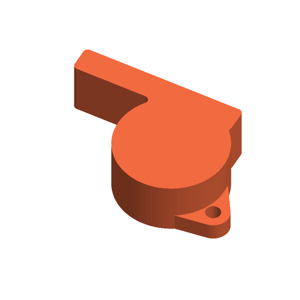

# Whistle



A pea-less referee-style whistle that prints lying on its side with no
supports, with an optional lanyard loop and a name inlaid flush in the side.

Inspired by the most-downloaded whistles on Printables when this was written
(2026-09-26): "Flat Pocket Whistle" by Jonas Daehnert (99,539 downloads) and
"Ultra Compact Mini Whistle 100 dB on your Keychain" by Franken 3D (68,836).
Written to the Parametric Model Maker customizer conventions, so the same file
works unchanged on MakerWorld and in ScadBuddy.

## How it makes a sound

Breath goes down a flat **windway**, crosses an open **window**, and splits on
a sharp **labium** edge. Part of the jet spills out of the window and part goes
into the round **chamber**, whose trapped air pushes it back out — the jet flips
from side to side of the edge at the chamber's resonance, and that is the note.
There is no pea: a pea only adds the warble of a referee's whistle, not the
sound.

The numbers follow the usual fipple-whistle proportions:

| Feature | Here (size 1) | Reference |
|---|---|---|
| Windway height | 1.2 mm (1.0 mini), never under 1 mm at any size | 1–1.5 mm is the working range for printed and PVC fipples; Gonzato's Low-D design uses 1.5 mm. |
| Window length (windway exit to edge) | 3.3 × windway height, at least 3 mm: 4.0 mm | Gonzato's preferred D whistle window is 7.5 × 4 mm. |
| Window / windway width | 9 mm (6 mm mini) | Gonzato: 8 mm for a pure, quieter tone, 10 mm for louder and breathier. |
| Labium | edge on the jet's centre line, 25° bevel outside, flat underneath | The edge must split the jet; its position relative to the windway is the most sensitive dimension. |
| Chamber | Ø 20 mm (22 pebble, 13 mini) | A referee whistle's chamber is about 20 mm; smaller is higher-pitched. |

Sources: Guido Gonzato, [*The "Low-Tech" Whistle: How to make a fine PVC
whistle*](https://www.flutopedia.com/refs/Gonzato_2015_LowTechWhistle.pdf)
(window and windway dimensions); [Chiff & Fipple forum, "3D Printed
Whistle"](https://forums.chiffandfipple.com/viewtopic.php?t=109753) (edge
position is adjusted in fractions of a millimetre); Lindstruments,
[Qwistle](https://lindstruments.com/products/qwistle-printable-file-kit-stl-format)
(the shaping of the windway and blade is the main factor in the sound of a
printed whistle).

## Why it prints on its side

The whistle is one 2D profile — chamber, mouthpiece, windway, window, labium —
extruded straight up and closed by a flat floor and roof:

- The windway's 1.2 mm height lies in the XY plane, where the printer is most
  accurate, and its walls are vertical. Nothing hangs over it that could sag
  and close it; the roof crosses its 1.2 mm gap as a short flat bridge.
- The labium edge is a vertical edge traced by the nozzle, not a layer step.
- There are no sloped faces at all. The only unsupported spans are flat
  bridges: the roof over the chamber (a 20 mm circle at size 1), the windway
  and the window.

## Parameters

### Whistle

| Parameter | Default | What it does |
|---|---|---|
| `style` | `classic_referee` | `classic_referee`: round chamber with a straight mouthpiece, the classic silhouette. `round_chamber`: the same inside, with the outline hulled into a rounded pebble — no gap to catch. `keychain_mini`: a 13 mm chamber, 1.0 mm windway and 6 mm internal width, for a keyring. |
| `size` | `1` | Scale factor, 0.8–1.5. Scales the chamber, mouthpiece, width and walls; the windway height never drops below 1 mm, the walls never below 1.6 mm. |
| `loop` | `true` | A lanyard loop on the back of the chamber, 3.2 mm hole, 4 mm thick (scaled). |

### Decor

| Parameter | Default | What it does |
|---|---|---|
| `name` | *(empty)* | Up to 12 characters, inlaid 0.6 mm flush into the upper side over the chamber. Letters are half the chamber radius tall and shrink to fit 1.7 × the chamber radius. |
| `font` | `DejaVu Sans:style=Bold` | Typeface (`// font`). |

### Colors

| Parameter | Default | What it does |
|---|---|---|
| `whistle_color` | `#FF7043` | The whistle. |
| `text_color` | `#FFFFFF` | The name. |

## Colours and extruders

**The order of the `color` parameters in the source is the extruder order:**

| Parameter | Part | Extruder |
|---|---|---|
| `whistle_color` | whistle | 1 |
| `text_color` | name | 2 |

With no name the whistle is one colour.

## Printing

- Print as laid out, flat side down, no supports. Bridging must be tuned well
  enough to span the chamber: a sagging roof over the windway is what stops a
  printed whistle working.
- Do not use "fuzzy skin", ironing on the side, or a large elephant-foot
  compensation that could reach the windway.
- If it only hisses, check the windway with a strip of paper: it must be clear
  from the mouth to the window, and the labium edge must be clean. A stray
  string across the window, or a blob on the edge, is enough to silence it.

**Sound depends on print quality and needs a physical test.** The geometry is
checked, the tone is not: the pitch and how easily it sounds come down to the
windway and the edge as printed.

## Safety

A whistle is loud: not next to anyone's ears. The mini whistle and a small
size are choking hazards for children under 3; supervise, and use a
breakaway lanyard.

## Verifying

```bash
./verify.sh
```

Renders the defaults and seven variations (every style, sizes 0.8 to 1.5, loop
on and off, short and long names) in `scadbuddy-verify:local`, and checks:

- exactly the colour parts the parameters imply, nothing on the `Default`
  material, the bounding box the parameters imply, on z=0, the name inlaid
  flush;
- by casting rays through the closed whistle part: the windway is open from the
  mouth to the window at nine points across its section, and exactly the
  height (never under 1 mm) and width the parameters imply; the window is open
  to the outside; a jet 0.2 mm above centre meets the labium bevel where the
  parameters put it, and one 0.2 mm below runs under the labium into the
  chamber; the chamber wall, floor and roof are where they should be;
- every face is vertical or horizontal — nothing overhangs at an angle.

The 3MF and STL parsing and the ray casting run on the host with `python3` and
the standard library only.
