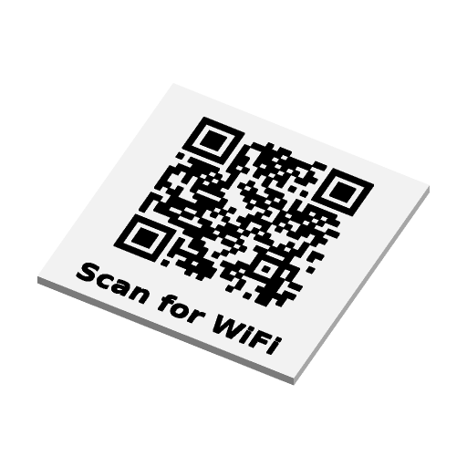

# WiFi / URL QR Code Plaque



A flat plaque, or a fridge magnet, carrying a QR code that joins a WiFi
network, opens a web link or shows plain text, with an optional caption and
the network name and password printed underneath. Square, rounded or round;
the code either stands on the plate or is inlaid flush with it.

Inspired by Printables' "Easy and Customizable QR Code Plaques/Fridge Magnet
for WiFi"; written to the Parametric Model Maker customizer conventions, so the
same file works unchanged on MakerWorld and in ScadBuddy.

## The QR encoder

The code is generated in plain OpenSCAD inside `model.scad`, with no library
and no include. It is an original implementation of ISO/IEC 18004; no code was
taken from another project.

- Byte mode, the payload encoded as UTF-8 (no ECI header, which is what phone
  scanners expect).
- Versions 1-10 (21 to 57 modules); the smallest version that holds the
  payload at the chosen level is used.
- Error correction L, M, Q or H. If the payload does not fit version 10 at the
  chosen level, the level steps down until it does and a warning is echoed;
  past 271 bytes (10-L) the payload is truncated at a character boundary, also
  with a warning. The WiFi fields' length limits keep a WiFi payload inside
  10-M.
- Reed-Solomon over GF(256) (polynomial 285), block interleaving per the
  standard's tables.
- All eight masks are applied and scored with the four ISO penalty rules
  (runs, 2x2 blocks, finder-like patterns with the outside of the symbol
  counted as light, dark proportion); the lowest wins. Implementations differ
  in details of the finder-like rule, so another encoder can pick a different,
  equally valid, mask for the same data.

Each dark run in a row is one rectangle, so even a version-10 code renders in
well under a second.

### WiFi payload

`WIFI:T:<security>;S:<ssid>;P:<password>;H:<true|false>;;`, with `\`, `;`,
`,`, `:` and `"` in the SSID and password escaped with a backslash. For an open
network (`nopass`) the `P:` field is left out.

## Parameters

### Network

| Parameter | Default | What it does |
|---|---|---|
| `mode` | `wifi` | `wifi` joins a network, `url` opens a link, `text` shows plain text. |
| `ssid` | `MyWiFi` | Network name, up to 32 characters. |
| `password` | `secret` | Password, up to 63 characters. Ignored for `nopass`. |
| `security` | `WPA` | `WPA` (covers WPA2/WPA3), `WEP` or `nopass`. |
| `hidden_ssid` | `false` | Tells the phone the network does not broadcast its name. |
| `url` | `https://example.com` | Link for `url` mode, up to 250 characters. |
| `text` | *(empty)* | Text for `text` mode, up to 250 characters. Empty encodes an empty code. |
| `error_correction` | `M` | `L` 7 %, `M` 15 %, `Q` 25 %, `H` 30 % of the code can be damaged and still scan. Higher levels make a bigger code with smaller modules. |

### Plaque

| Parameter | Default | What it does |
|---|---|---|
| `size` | `80` | Width and height of the plaque (diameter when round), 50-150 mm. |
| `shape` | `square` | `square`, `rounded` (corner radius 10 % of `size`) or `round`. |
| `caption` | `Scan for WiFi` | Line of text under the code, up to 30 characters; empty for none. |
| `show_credentials` | `false` | WiFi mode only: prints `SSID: …` and `Pass: …` under the caption in a monospaced face. |
| `magnet_pockets` | `false` | Four pockets in the back for round magnets. |
| `magnet_diameter` | `10.2` | Pocket diameter: the magnet plus clearance. |
| `magnet_depth` | `2.2` | Pocket depth. Capped so at least 0.6 mm of plate stays above it (under the inlay when inlaid); below 0.8 mm the pockets are left out with a warning. |
| `stand` | `none` | `desk_stand` adds a separate stand, printed in front of the plaque. |
| `stand_clearance` | `0.4` | How much wider the stand's slot is than `thickness`. |
| `thickness` | `3` | Plate thickness, 2-6 mm. |
| `module_height` | `0.6` | Height of the raised code and text, or depth of the inlay. |
| `code_style` | `raised` | `raised`: code and text stand on the plate. `inlay`: they are set flush into pockets in the plate. |

### Colors

| Parameter | Default | What it does |
|---|---|---|
| `plate_color` | `#FFFFFF` | Plate, and the stand. |
| `code_color` | `#000000` | QR code modules. |
| `caption_color` | `#000000` | Caption and credentials. |

A QR code needs dark modules on a light ground; a light code on a dark plate
(inverted) is not read by every scanner.

## Colours and extruders

**The order of the `color` parameters in the source is the extruder order**:

| Parameter | Part | Extruder |
|---|---|---|
| `plate_color` | plate (and stand) | 1 |
| `code_color` | QR modules | 2 |
| `caption_color` | caption and credentials | 3 |

With the defaults the code and caption are both `#000000`, so they are one
part and the plaque prints in two colours. Give the caption its own colour for
three. Differently coloured parts never overlap: raised features sit on the
plate top, inlaid ones fill pockets cut out of it.

## Layout

The code block (code plus quiet zone) is centred at the top of the plaque and
the text lines sit under it; the block shrinks to leave room for them. On a
round plaque the code block and text band together form a rectangle whose
corners sit 1 mm inside the rim.

- **Quiet zone.** 4 modules, as the standard asks. When 4 modules would make
  the modules smaller than 1 mm (a long payload on a small plaque), it drops to
  2 modules and a warning is echoed. Scanners read a 2-module zone reliably on
  a plaque this size, and the plate's own edge is usually well clear of any
  dark background.
- **Module size.** Echoed on every render (`QRINFO`). Below about 0.8 mm a
  0.4 mm nozzle cannot print modules cleanly and a warning is echoed; raise
  `size`, drop the credentials or lower `error_correction`.
- **Text size.** OpenSCAD cannot measure text, so long lines shrink from the
  nominal size (7.5 % of `size` for the caption, 5 % for credentials) based on
  an average character width. Very wide capitals (`WWWW…`) can still run close
  to the edge.
- **Stand.** The stand's slot is 6 mm deep and leans back 15°. With the stand
  on, 7.5 mm is kept clear at the bottom of the plaque so the slot never
  covers text or the quiet zone. The slot runs the stand's full length.

## Variations

- `mode = url`, `shape = rounded`, `code_style = inlay` — a flush link tag.
- `shape = round`, `stand = desk_stand`, `show_credentials = true` — a guest
  WiFi sign for a desk.
- `magnet_pockets = true` — a fridge magnet; the pockets are in the back, so
  glue the magnets in after printing (or pause at the pocket ceiling layer).

## Printing

Print flat, plate down, no supports. The stand prints upright with the slot
opening up. Worth a physical test: magnet fit at `10.2 x 2.2` for 10 x 2 mm
magnets, and the stand's slot at `stand_clearance = 0.4`.

## Verifying

```bash
./verify.sh
```

Needs Docker and [uv](https://docs.astral.sh/uv/) (`~/.local/bin/uv` is
found). Three stages:

1. **Renders and geometry** (host `python3`, standard library only). Seven
   variations — defaults; URL + rounded + inlay + H + magnets + a third
   colour; long text + round + stand; WiFi with escaped characters + WEP +
   hidden + credentials + Q + round; open network + stand + magnets + inlay;
   a version-10 code on a 50 mm plaque (2-module quiet zone); a 250-byte text
   at H that must fall back to L. For each: the parts and colours, `Default`
   empty, bounding box exactly as the parameters imply, on z=0, the code's
   heights, magnet pockets, the quiet zone inside the outline and clear of
   the text. Each colour is also rendered on its own the way ScadBuddy renders
   closed parts; each must be watertight and their volumes must add up to the
   union's, so no two colours overlap. Finally the code part's top faces are
   rasterised back to a module grid, which must equal the matrix the model
   echoes.
2. **Sweep.** 40 echo-only runs, versions 1-10 at each of L/M/Q/H, each
   payload filling its version exactly, some with multi-byte UTF-8.
3. **Reference and decode** (`uv run` with `qrcode`, `opencv-python-headless`,
   `numpy`). Every matrix must equal the Python `qrcode` library's for the same
   bytes, version, level and mask, module for module; the version must be the
   one `qrcode` picks; the eight echoed mask penalties must equal an
   independent Python scoring and the lowest one must have been chosen; and
   OpenCV must decode each rendered code back to the expected payload (built
   independently from the parameters).

`segno` is not used as the reference: version 1.6.6 appends a full byte of
zero padding when the bit stream already ends on a byte boundary after the
terminator (`write_padding_bits` adds `8 - length % 8` bits), where the
standard adds none. Both codes scan, but they differ module for module.

Output lands in `.verify/`, including each decoded code as a PNG.
